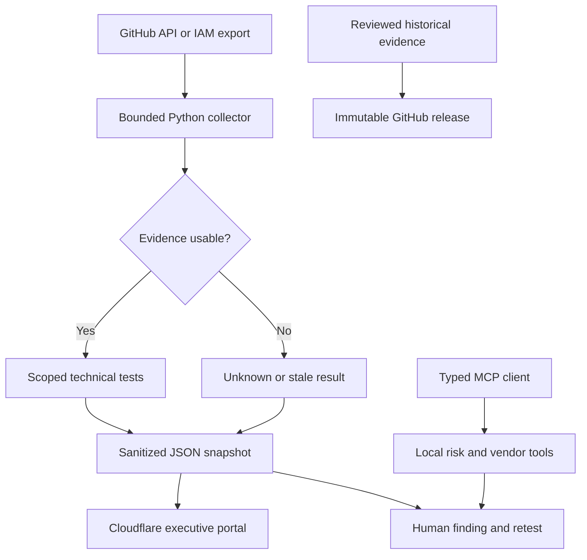

# Complete source appendix

The repository files are authoritative. Binary brand and font assets are included in the source ZIP.


## .github/workflows/ccm.yml

````yaml
name: Continuous control monitoring
on:
  schedule:
    - cron: '17 */6 * * *'
  workflow_dispatch:
permissions:
  contents: read
concurrency:
  group: ccm-production
  cancel-in-progress: false
jobs:
  collect:
    runs-on: ubuntu-latest
    timeout-minutes: 10
    steps:
      - uses: actions/checkout@11d5960a326750d5838078e36cf38b85af677262
        with:
          persist-credentials: false
      - uses: actions/setup-python@a26af69be951a213d495a4c3e4e4022e16d87065
        with:
          python-version: '3.12'
      - uses: actions/setup-node@49933ea5288caeca8642d1e84afbd3f7d6820020
        with:
          node-version: '22'
      - name: Collect public-safe technical results
        env:
          GRC_GITHUB_TOKEN: ${{ secrets.GRC_GITHUB_TOKEN }}
          GRC_TARGET_REPO: ${{ github.repository }}
        run: python -m engine.ingest --mode live --repo "$GRC_TARGET_REPO"
      - uses: actions/upload-artifact@ea165f8d65b6e75b540449e92b4886f43607fa02
        with:
          name: ccm-${{ github.run_id }}
          path: site/data/ccm.json
          retention-days: 30
          if-no-files-found: error
      - run: npm run build
      - run: npm run check
      - name: Update existing Cloudflare Pages project
        if: vars.DEPLOY_PROVIDER == 'cloudflare'
        env:
          CLOUDFLARE_API_TOKEN: ${{ secrets.CLOUDFLARE_API_TOKEN }}
          CLOUDFLARE_ACCOUNT_ID: ${{ secrets.CLOUDFLARE_ACCOUNT_ID }}
          CF_PAGES_PROJECT: ${{ vars.CF_PAGES_PROJECT }}
        run: npx --yes wrangler@4.131.1 pages deploy dist --project-name "$CF_PAGES_PROJECT" --branch main

````

## .github/workflows/pages.yml

````yaml
name: GitHub Pages
on:
  workflow_dispatch:
  push:
    branches: [main]
permissions:
  contents: read
  pages: write
  id-token: write
concurrency:
  group: github-pages
  cancel-in-progress: false
jobs:
  deploy:
    if: vars.DEPLOY_PROVIDER == 'github-pages'
    runs-on: ubuntu-latest
    environment:
      name: github-pages
      url: ${{ steps.deployment.outputs.page_url }}
    steps:
      - uses: actions/checkout@11d5960a326750d5838078e36cf38b85af677262
        with:
          persist-credentials: false
      - uses: actions/setup-node@49933ea5288caeca8642d1e84afbd3f7d6820020
        with:
          node-version: '22'
      - run: npm run build
      - run: npm run check
      - uses: actions/upload-pages-artifact@56afc609e74202658d3ffba0e8f6dda462b719fa
        with:
          path: dist
      - id: deployment
        uses: actions/deploy-pages@d6db90164ac5ed86f2b6aed7e0febac5b3c0c03e

````

## .github/workflows/verify.yml

````yaml
name: Verify engineering
on:
  push:
    branches: [main]
  pull_request:
  workflow_dispatch:
permissions:
  contents: read
jobs:
  verify:
    runs-on: ubuntu-latest
    timeout-minutes: 10
    steps:
      - uses: actions/checkout@11d5960a326750d5838078e36cf38b85af677262
        with:
          persist-credentials: false
      - uses: actions/setup-python@a26af69be951a213d495a4c3e4e4022e16d87065
        with:
          python-version: '3.12'
      - uses: actions/setup-node@49933ea5288caeca8642d1e84afbd3f7d6820020
        with:
          node-version: '22'
      - run: pip install -r requirements.txt
      - run: python -m unittest discover -s tests -v
      - run: python scripts/validate_oscal.py
      - run: python scripts/install_opa.py
      - run: .tools/opa test policies -v
      - run: python -m engine.mcp_client
      - run: npm run build
      - run: npm run check

````

## .gitignore

````gitignore
.venv/
__pycache__/
*.pyc
.env
node_modules/
dist/
.tools/
private-evidence/
archive/*.zip
.vercel/
.DS_Store

````

## .nvmrc

````nvmrc
22

````

## Dockerfile

````Dockerfile
FROM python:3.12-slim
WORKDIR /app
COPY requirements.txt .
RUN pip install --no-cache-dir -r requirements.txt && useradd --uid 10001 --create-home grc
COPY --chown=10001:10001 engine engine
COPY --chown=10001:10001 site/data site/data
COPY --chown=10001:10001 fixtures fixtures
USER 10001
ENV PYTHONDONTWRITEBYTECODE=1 PYTHONUNBUFFERED=1
CMD ["python", "-m", "engine.mcp_server"]

````

## README.md

````md
# GRC & AI Governance Engine

An independent portfolio by **Md. Abdullah Al Owasi**. Inspect the path from a requirement to a technical test, evidence record and accountable decision.

The public portal contains a modeled 15-risk register, ten project domains, a filterable risk heatmap, CCM snapshots and a local vendor-intake sandbox. The Python engine adds bounded GitHub evidence collection, IAM account-summary checks, local prompt screening and a stdio MCP server. OPA evaluates selected AI governance evidence assertions. OSCAL describes original operational controls.

## Run the portal

Node.js 22+ and Python 3.12 are required for these commands. The frontend has no package dependencies.

```bash
npm run build
npm run check
python3 -m http.server 4173 --directory dist --bind 127.0.0.1
```

Open http://127.0.0.1:4173. Do not open `index.html` using `file://`; browsers restrict JSON fetches there.

## Run and verify the engine

```bash
python3 -m venv .venv
. .venv/bin/activate
python -m pip install -r requirements.txt
python -m unittest discover -s tests -v
python scripts/validate_oscal.py
python scripts/install_opa.py
.tools/opa test policies -v
.tools/opa eval --data policies --input fixtures/ai-system.json data.aao.ai.result
python -m engine.ingest --mode demo
python -m engine.mcp_client
```

On Windows, activate with `.venv\Scripts\Activate.ps1`. Use Docker for OPA: `docker compose run --rm opa test /policies -v`.

## Local suite

```bash
docker compose up -d portal opa
docker compose build mcp
docker compose run --rm --no-deps -T mcp
```

The portal binds to http://127.0.0.1:8080; OPA binds to http://127.0.0.1:8181. MCP uses stdio and exposes no network endpoint. Configure your MCP client's working directory to this repository when using `mcp.json`.

## What the results mean

| Label | Meaning |
|---|---|
| Modeled | Historical scenario data imported from the supplied portfolio workbook |
| Demo | Executed code against fixed fixtures; not a live cloud connection |
| Live | An API collection was attempted; inspect each check's result and observation time |
| Pass | The narrowly stated technical test passed |
| Fail | The narrowly stated technical condition was not met |
| Unknown | Missing, malformed or unavailable evidence prevents a conclusion |
| Stale | Evidence is outside its freshness window |

The repository does not claim SOC 2 assurance, ISO certification, legal compliance, observed client savings, enterprise-wide shadow-AI detection or a production service-level agreement. OPA checks declarations; it does not authenticate synthetic-content provenance. Historical vendor decisions are unverified model records.

Read [the six-part execution guide](docs/EXECUTION-GUIDE.md), [the design prompt](docs/MASTER-DESIGN-PROMPT.md), [LinkedIn copy](docs/LINKEDIN.md), and [validation status](docs/VALIDATION.md). Every source file is included; no pseudocode replacement is required to run the supplied demonstration.

## Public deployment

Use Cloudflare Pages with `npm run build` and output `dist`. GitHub Pages and Vercel configurations are included. The scheduled CCM workflow uploads sanitized reports; continuous Cloudflare publication requires the scoped deployment credentials described in the guide. No paid APIs or hosted database are required.

## Evidence archive

Historical files are excluded from `dist`. `archive/baseline-manifest.json` identifies duplicates and preserves hashes. Do not upload unreviewed personal or confidential source files to a public release. Enable GitHub immutable releases before publishing a reviewed evidence bundle; a tag alone is insufficient.

````

## archive/RELEASE-NOTES.md

````md
# Historical portfolio baseline

This release preserves the reviewed public-safe baseline of independent GRC and AI governance work. Contents are historical models and supporting narratives, not an audit opinion, certification or current vendor assessment.

Each file is recorded in the archive's MANIFEST.json with a SHA-256 digest. The sidecar authenticates the archive's byte identity when compared against a separately trusted copy. GitHub release immutability must be enabled and verified separately.

The original source archive is retained privately. Any redacted public derivative is a separate artifact with its own hash; it must not be represented as identical to the original.

````

## archive/baseline-manifest.json

````json
{
  "created": "2026-09-13",
  "publication_status": "not_published",
  "files": [
    {
      "file": "proof/GRC Proof-of-Work/Presentation /Md_Abdullah_Al_Owasi_Presentation.pptx",
      "sha256": "99f156938b2a18a3bab9cb900a25a5aba8e4b429e6230bca78983d54b3c154c5",
      "bytes": 182586,
      "duplicate_of": null
    },
    {
      "file": "proof/GRC Proof-of-Work/Governance evidence workbook/Governance_Evidence_Workbook.xlsm",
      "sha256": "2349b1ffe9628a18034dc00c5e64652fdaaa6435b3b7a2d7b74cd0d23791aff5",
      "bytes": 166570,
      "duplicate_of": null
    },
    {
      "file": "proof/GRC Proof-of-Work/Portfolio Projects/GRC_AI_Governance_Production_Portfolio_Binder.pdf",
      "sha256": "eeac77a944d5d99bcb00c2df80aa8146339a145ea96979223961eb6300e7313a",
      "bytes": 547527,
      "duplicate_of": null
    },
    {
      "file": "proof/GRC Proof-of-Work/Portfolio Projects/GRC_AI_Governance_Production_Portfolio_Binder.docx",
      "sha256": "3ab51f8e2d7a8ce79a0c794ce0623be37096f1c10174d94e0873c868d04804a8",
      "bytes": 47757,
      "duplicate_of": null
    },
    {
      "file": "proof/GRC Proof-of-Work/Portfolio Projects/GRC_AI_Governance_10_Project_Evidence_Workbook.xlsx",
      "sha256": "ae039b2c398587912421c5f1d84cfcaf2b78a4040bba0f6bf0f01a1c53c28af1",
      "bytes": 47400,
      "duplicate_of": null
    },
    {
      "file": "proof/GRC Proof-of-Work/Governance evidence matrix/Governance_Evidence_Matrix.xlsx",
      "sha256": "409edce7aef27fa720fd4eced267bf4399efa62d7bde65200e32f3a5d59fe51f",
      "bytes": 328666,
      "duplicate_of": null
    },
    {
      "file": "proof/GRC Proof-of-Work/Resume/MD_Abdullah_Al_Owasi_Resume-v3.pdf",
      "sha256": "c254fa7c8378b54607b508dcaffcdbe1935aaefed334e5c07cbc905c09225251",
      "bytes": 268737,
      "duplicate_of": null
    },
    {
      "file": "proof/GRC Proof-of-Work/Portfolio/Md_Abdullah_Al_Owasi_Portfolio.docx",
      "sha256": "8cb686046cf966391368aa1d286964fb6e038695d1d28f681997467d6a0d1f3c",
      "bytes": 633623,
      "duplicate_of": null
    },
    {
      "file": "proof/GRC Proof-of-Work/Executive Portfolio/Md_Abdullah_Al_Owasi_Executive_Portfolio.docx",
      "sha256": "12b9d151335b75fbe346ff0538babbb253265092637f0f903a7b735a480a906a",
      "bytes": 577294,
      "duplicate_of": null
    },
    {
      "file": "proof/GRC Proof-of-Work/Portfolio Projects/Project 8_ Enterprise Security Questionnaire & Procurement Triage Automation/P08_Procurement_QA.xlsx",
      "sha256": "07b1acf6ca371641a4a4b8c6d2d68f71c73b51af2d63c74c0fc4ec9e9aeeee9c",
      "bytes": 13743,
      "duplicate_of": null
    },
    {
      "file": "proof/GRC Proof-of-Work/Portfolio Projects/Project 8_ Enterprise Security Questionnaire & Procurement Triage Automation/08_Procurement_Security_Triage.pdf",
      "sha256": "ad6f84384c7bf0340618190a6343b2dbf3d528d8ae46926ed4b078c4d0003833",
      "bytes": 132634,
      "duplicate_of": null
    },
    {
      "file": "proof/GRC Proof-of-Work/Portfolio Projects/Project 10_ Continuous Control Monitoring, Audit Operations & Remediation System/P10_Audit_Ops.pdf",
      "sha256": "ab8a25178efa584e9c82e6825a8c4ae3a4355b130f45ea7f51a21c84cc3d08a7",
      "bytes": 119611,
      "duplicate_of": null
    },
    {
      "file": "proof/GRC Proof-of-Work/Portfolio Projects/Project 10_ Continuous Control Monitoring, Audit Operations & Remediation System/10_Continuous_Audit_Operations.md",
      "sha256": "d59f636f87e2d76511b73f62d20a3507512f12d11b617389a9126b4a77948689",
      "bytes": 2988,
      "duplicate_of": null
    },
    {
      "file": "proof/GRC Proof-of-Work/Portfolio Projects/Project 10_ Continuous Control Monitoring, Audit Operations & Remediation System/10_Continuous_Audit_Operations.pdf",
      "sha256": "4e1deab44c84c794d6a9058acc3215d4d86b1048623ed64318aa15a41d2303ee",
      "bytes": 115844,
      "duplicate_of": null
    },
    {
      "file": "proof/GRC Proof-of-Work/Portfolio Projects/Project 10_ Continuous Control Monitoring, Audit Operations & Remediation System/P10_Audit_Ops.xlsx",
      "sha256": "ec729adba75fa0f564c5b9924f3da2145ea050ab2f5e8d51c9d9984b9e5a1c5a",
      "bytes": 11538,
      "duplicate_of": null
    },
    {
      "file": "proof/GRC Proof-of-Work/Portfolio Projects/Project 7_ Enterprise Shadow AI, Prompt DLP & AI Data-Egress Governance/07_Shadow_AI_Prompt_DLP.pdf",
      "sha256": "9cf7de1e0ee588c987f42f34ce2e458bc9b8e79e4dedebfdeff171e6bd159b3a",
      "bytes": 141816,
      "duplicate_of": null
    },
    {
      "file": "proof/GRC Proof-of-Work/Portfolio Projects/Project 7_ Enterprise Shadow AI, Prompt DLP & AI Data-Egress Governance/P07_Shadow_AI.xlsx",
      "sha256": "b7e0f3cccc515e2a81d9a7a8b496acc283a41672d46a7e4852522285242cf023",
      "bytes": 11693,
      "duplicate_of": null
    },
    {
      "file": "proof/GRC Proof-of-Work/Portfolio Projects/Project 6_ EU AI Act Article 50 Transparency & Synthetic Content Governance System/06_AI_Transparency_Article50.pdf",
      "sha256": "7dca4b735dd08c6accf7a853c37aeec2dccb2d098bb7012d7e44c4b691237539",
      "bytes": 101457,
      "duplicate_of": null
    },
    {
      "file": "proof/GRC Proof-of-Work/Portfolio Projects/Project 6_ EU AI Act Article 50 Transparency & Synthetic Content Governance System/P06_AI_Transparency.xlsx",
      "sha256": "57f1dc1a1100f3bf49d66cd95113054758c7b2fab58313e94f12da6cd1da18ae",
      "bytes": 12088,
      "duplicate_of": null
    },
    {
      "file": "proof/GRC Proof-of-Work/Portfolio Projects/Project 4_ SOC 2 + ISO-IEC 27001 Control-to-Evidence & Audit Readiness System/P04_Control_Evidence.xlsx",
      "sha256": "d0754387b952e36a398f68ec7a5782513d54a531f0ca67e8741f924975be7fc0",
      "bytes": 12255,
      "duplicate_of": null
    },
    {
      "file": "proof/GRC Proof-of-Work/Portfolio Projects/Project 4_ SOC 2 + ISO-IEC 27001 Control-to-Evidence & Audit Readiness System/04_SOC2_ISO27001_Control_Evidence.pdf",
      "sha256": "094fd7db14b4e6945512c53f467fdbbab15ab49c9f08f55e423c6771adce5607",
      "bytes": 130516,
      "duplicate_of": null
    },
    {
      "file": "proof/GRC Proof-of-Work/Portfolio Projects/Project 3_ Enterprise Third-Party Risk & AI Subprocessor Decision Engine _ TPRM \u00b7 Vendor Risk \u00b7 GDPR Article 28/P03_Vendor_Questions.xlsx",
      "sha256": "dd7e9819fd504d512411f22f19f5c0ab5479184ca31bbe9dfc39bceaf73e5378",
      "bytes": 11413,
      "duplicate_of": null
    },
    {
      "file": "proof/GRC Proof-of-Work/Portfolio Projects/Project 3_ Enterprise Third-Party Risk & AI Subprocessor Decision Engine _ TPRM \u00b7 Vendor Risk \u00b7 GDPR Article 28/03_TPRM_AI_Subprocessor_Engine.pdf",
      "sha256": "78f507dd2c16620d3c9620027767f3b24505acf06ae8c4d31cd9e2c609453310",
      "bytes": 110705,
      "duplicate_of": null
    },
    {
      "file": "proof/GRC Proof-of-Work/Portfolio Projects/Project 3_ Enterprise Third-Party Risk & AI Subprocessor Decision Engine _ TPRM \u00b7 Vendor Risk \u00b7 GDPR Article 28/P03_TPRM.xlsx",
      "sha256": "4d9d922912fd1531f02f328a7fb86bc474ae71b2a30ae7b7701b92e92212d5cb",
      "bytes": 12345,
      "duplicate_of": null
    },
    {
      "file": "proof/GRC Proof-of-Work/Portfolio Projects/Project 5_ Executive Technology Risk, KRI & Board Decision System/05_Executive_Technology_Risk.pdf",
      "sha256": "f9e7191f9c13f9ce705e2eebbd5160d9f44960adbffc61468f61616c41a3f260",
      "bytes": 103011,
      "duplicate_of": null
    },
    {
      "file": "proof/GRC Proof-of-Work/Portfolio Projects/Project 5_ Executive Technology Risk, KRI & Board Decision System/P05_Executive_Risk.xlsx",
      "sha256": "3eaafcfa3885e02d1f08d618b9029d5fa6ac8df32b2d6f289fa235c6878ab966",
      "bytes": 16164,
      "duplicate_of": null
    },
    {
      "file": "proof/GRC Proof-of-Work/Portfolio Projects/Project 1_ Enterprise Trust & Customer Assurance Architecture _ SOC 2 \u00b7 ISO 27001 \u00b7 GDPR \u00b7 AI Governance/P01_Trust_Readiness.xlsx",
      "sha256": "91ed5ffda8be5fb7e62d16495d4a2acc966deed97667898d7a1df2d7407f6f38",
      "bytes": 11670,
      "duplicate_of": null
    },
    {
      "file": "proof/GRC Proof-of-Work/Portfolio Projects/Project 1_ Enterprise Trust & Customer Assurance Architecture _ SOC 2 \u00b7 ISO 27001 \u00b7 GDPR \u00b7 AI Governance/01_Enterprise_Trust_Customer_Assurance.pdf",
      "sha256": "4f289103d60e5c462a54436ae711e7e800c202476c3b4c34654c2468eb51109d",
      "bytes": 221496,
      "duplicate_of": null
    },
    {
      "file": "proof/GRC Proof-of-Work/Portfolio Projects/Project 9_ GDPR Article 28 DPA & Subprocessor Governance Engine/09_GDPR_Article28_DPA_Engine.pdf",
      "sha256": "3d01ae3fe374b80fbe6fb9292e301cdb0f46c691fe15ea88038db37870ad4cd0",
      "bytes": 108107,
      "duplicate_of": null
    },
    {
      "file": "proof/GRC Proof-of-Work/Portfolio Projects/Project 9_ GDPR Article 28 DPA & Subprocessor Governance Engine/P09_Article28.xlsx",
      "sha256": "97060256de04f40cf2f44186d8794cf153f9fb453108c4133e48dfe96f188d6b",
      "bytes": 11475,
      "duplicate_of": null
    },
    {
      "file": "proof/GRC Proof-of-Work/Portfolio Projects/Project 2_ AI Governance Operating System _ NIST AI RMF \u00b7 ISO-IEC 42001 \u00b7 Generative AI Governance/02_AI_Governance_Operating_System.pdf",
      "sha256": "92ba5361c83275a9622050140bccc72786b0ddd46efac98fca26b1ee6df7658c",
      "bytes": 93759,
      "duplicate_of": null
    },
    {
      "file": "proof/GRC Proof-of-Work/Portfolio Projects/Project 2_ AI Governance Operating System _ NIST AI RMF \u00b7 ISO-IEC 42001 \u00b7 Generative AI Governance/P02_AI_Governance.xlsx",
      "sha256": "b7c9f1ce925a47b182a6c4cca57d24ce170f6c941db05e3fe19e18eeab1127a2",
      "bytes": 13299,
      "duplicate_of": null
    },
    {
      "file": "projects/Portfolio Projects/GRC_AI_Governance_Production_Portfolio_Binder.pdf",
      "sha256": "eeac77a944d5d99bcb00c2df80aa8146339a145ea96979223961eb6300e7313a",
      "bytes": 547527,
      "duplicate_of": "proof/GRC Proof-of-Work/Portfolio Projects/GRC_AI_Governance_Production_Portfolio_Binder.pdf"
    },
    {
      "file": "projects/Portfolio Projects/GRC_AI_Governance_Production_Portfolio_Binder.docx",
      "sha256": "3ab51f8e2d7a8ce79a0c794ce0623be37096f1c10174d94e0873c868d04804a8",
      "bytes": 47757,
      "duplicate_of": "proof/GRC Proof-of-Work/Portfolio Projects/GRC_AI_Governance_Production_Portfolio_Binder.docx"
    },
    {
      "file": "projects/Portfolio Projects/GRC_AI_Governance_10_Project_Evidence_Workbook.xlsx",
      "sha256": "ae039b2c398587912421c5f1d84cfcaf2b78a4040bba0f6bf0f01a1c53c28af1",
      "bytes": 47400,
      "duplicate_of": "proof/GRC Proof-of-Work/Portfolio Projects/GRC_AI_Governance_10_Project_Evidence_Workbook.xlsx"
    },
    {
      "file": "projects/Portfolio Projects/Project 8_ Enterprise Security Questionnaire & Procurement Triage Automation/P08_Procurement_QA.xlsx",
      "sha256": "07b1acf6ca371641a4a4b8c6d2d68f71c73b51af2d63c74c0fc4ec9e9aeeee9c",
      "bytes": 13743,
      "duplicate_of": "proof/GRC Proof-of-Work/Portfolio Projects/Project 8_ Enterprise Security Questionnaire & Procurement Triage Automation/P08_Procurement_QA.xlsx"
    },
    {
      "file": "projects/Portfolio Projects/Project 8_ Enterprise Security Questionnaire & Procurement Triage Automation/08_Procurement_Security_Triage.pdf",
      "sha256": "ad6f84384c7bf0340618190a6343b2dbf3d528d8ae46926ed4b078c4d0003833",
      "bytes": 132634,
      "duplicate_of": "proof/GRC Proof-of-Work/Portfolio Projects/Project 8_ Enterprise Security Questionnaire & Procurement Triage Automation/08_Procurement_Security_Triage.pdf"
    },
    {
      "file": "projects/Portfolio Projects/Project 10_ Continuous Control Monitoring, Audit Operations & Remediation System/P10_Audit_Ops.pdf",
      "sha256": "ab8a25178efa584e9c82e6825a8c4ae3a4355b130f45ea7f51a21c84cc3d08a7",
      "bytes": 119611,
      "duplicate_of": "proof/GRC Proof-of-Work/Portfolio Projects/Project 10_ Continuous Control Monitoring, Audit Operations & Remediation System/P10_Audit_Ops.pdf"
    },
    {
      "file": "projects/Portfolio Projects/Project 10_ Continuous Control Monitoring, Audit Operations & Remediation System/10_Continuous_Audit_Operations.md",
      "sha256": "d59f636f87e2d76511b73f62d20a3507512f12d11b617389a9126b4a77948689",
      "bytes": 2988,
      "duplicate_of": "proof/GRC Proof-of-Work/Portfolio Projects/Project 10_ Continuous Control Monitoring, Audit Operations & Remediation System/10_Continuous_Audit_Operations.md"
    },
    {
      "file": "projects/Portfolio Projects/Project 10_ Continuous Control Monitoring, Audit Operations & Remediation System/10_Continuous_Audit_Operations.pdf",
      "sha256": "4e1deab44c84c794d6a9058acc3215d4d86b1048623ed64318aa15a41d2303ee",
      "bytes": 115844,
      "duplicate_of": "proof/GRC Proof-of-Work/Portfolio Projects/Project 10_ Continuous Control Monitoring, Audit Operations & Remediation System/10_Continuous_Audit_Operations.pdf"
    },
    {
      "file": "projects/Portfolio Projects/Project 10_ Continuous Control Monitoring, Audit Operations & Remediation System/P10_Audit_Ops.xlsx",
      "sha256": "ec729adba75fa0f564c5b9924f3da2145ea050ab2f5e8d51c9d9984b9e5a1c5a",
      "bytes": 11538,
      "duplicate_of": "proof/GRC Proof-of-Work/Portfolio Projects/Project 10_ Continuous Control Monitoring, Audit Operations & Remediation System/P10_Audit_Ops.xlsx"
    },
    {
      "file": "projects/Portfolio Projects/Project 7_ Enterprise Shadow AI, Prompt DLP & AI Data-Egress Governance/07_Shadow_AI_Prompt_DLP.pdf",
      "sha256": "9cf7de1e0ee588c987f42f34ce2e458bc9b8e79e4dedebfdeff171e6bd159b3a",
      "bytes": 141816,
      "duplicate_of": "proof/GRC Proof-of-Work/Portfolio Projects/Project 7_ Enterprise Shadow AI, Prompt DLP & AI Data-Egress Governance/07_Shadow_AI_Prompt_DLP.pdf"
    },
    {
      "file": "projects/Portfolio Projects/Project 7_ Enterprise Shadow AI, Prompt DLP & AI Data-Egress Governance/P07_Shadow_AI.xlsx",
      "sha256": "b7e0f3cccc515e2a81d9a7a8b496acc283a41672d46a7e4852522285242cf023",
      "bytes": 11693,
      "duplicate_of": "proof/GRC Proof-of-Work/Portfolio Projects/Project 7_ Enterprise Shadow AI, Prompt DLP & AI Data-Egress Governance/P07_Shadow_AI.xlsx"
    },
    {
      "file": "projects/Portfolio Projects/Project 6_ EU AI Act Article 50 Transparency & Synthetic Content Governance System/06_AI_Transparency_Article50.pdf",
      "sha256": "7dca4b735dd08c6accf7a853c37aeec2dccb2d098bb7012d7e44c4b691237539",
      "bytes": 101457,
      "duplicate_of": "proof/GRC Proof-of-Work/Portfolio Projects/Project 6_ EU AI Act Article 50 Transparency & Synthetic Content Governance System/06_AI_Transparency_Article50.pdf"
    },
    {
      "file": "projects/Portfolio Projects/Project 6_ EU AI Act Article 50 Transparency & Synthetic Content Governance System/P06_AI_Transparency.xlsx",
      "sha256": "57f1dc1a1100f3bf49d66cd95113054758c7b2fab58313e94f12da6cd1da18ae",
      "bytes": 12088,
      "duplicate_of": "proof/GRC Proof-of-Work/Portfolio Projects/Project 6_ EU AI Act Article 50 Transparency & Synthetic Content Governance System/P06_AI_Transparency.xlsx"
    },
    {
      "file": "projects/Portfolio Projects/Project 4_ SOC 2 + ISO-IEC 27001 Control-to-Evidence & Audit Readiness System/P04_Control_Evidence.xlsx",
      "sha256": "d0754387b952e36a398f68ec7a5782513d54a531f0ca67e8741f924975be7fc0",
      "bytes": 12255,
      "duplicate_of": "proof/GRC Proof-of-Work/Portfolio Projects/Project 4_ SOC 2 + ISO-IEC 27001 Control-to-Evidence & Audit Readiness System/P04_Control_Evidence.xlsx"
    },
    {
      "file": "projects/Portfolio Projects/Project 4_ SOC 2 + ISO-IEC 27001 Control-to-Evidence & Audit Readiness System/04_SOC2_ISO27001_Control_Evidence.pdf",
      "sha256": "094fd7db14b4e6945512c53f467fdbbab15ab49c9f08f55e423c6771adce5607",
      "bytes": 130516,
      "duplicate_of": "proof/GRC Proof-of-Work/Portfolio Projects/Project 4_ SOC 2 + ISO-IEC 27001 Control-to-Evidence & Audit Readiness System/04_SOC2_ISO27001_Control_Evidence.pdf"
    },
    {
      "file": "projects/Portfolio Projects/Project 3_ Enterprise Third-Party Risk & AI Subprocessor Decision Engine _ TPRM \u00b7 Vendor Risk \u00b7 GDPR Article 28/P03_Vendor_Questions.xlsx",
      "sha256": "dd7e9819fd504d512411f22f19f5c0ab5479184ca31bbe9dfc39bceaf73e5378",
      "bytes": 11413,
      "duplicate_of": "proof/GRC Proof-of-Work/Portfolio Projects/Project 3_ Enterprise Third-Party Risk & AI Subprocessor Decision Engine _ TPRM \u00b7 Vendor Risk \u00b7 GDPR Article 28/P03_Vendor_Questions.xlsx"
    },
    {
      "file": "projects/Portfolio Projects/Project 3_ Enterprise Third-Party Risk & AI Subprocessor Decision Engine _ TPRM \u00b7 Vendor Risk \u00b7 GDPR Article 28/03_TPRM_AI_Subprocessor_Engine.pdf",
      "sha256": "78f507dd2c16620d3c9620027767f3b24505acf06ae8c4d31cd9e2c609453310",
      "bytes": 110705,
      "duplicate_of": "proof/GRC Proof-of-Work/Portfolio Projects/Project 3_ Enterprise Third-Party Risk & AI Subprocessor Decision Engine _ TPRM \u00b7 Vendor Risk \u00b7 GDPR Article 28/03_TPRM_AI_Subprocessor_Engine.pdf"
    },
    {
      "file": "projects/Portfolio Projects/Project 3_ Enterprise Third-Party Risk & AI Subprocessor Decision Engine _ TPRM \u00b7 Vendor Risk \u00b7 GDPR Article 28/P03_TPRM.xlsx",
      "sha256": "4d9d922912fd1531f02f328a7fb86bc474ae71b2a30ae7b7701b92e92212d5cb",
      "bytes": 12345,
      "duplicate_of": "proof/GRC Proof-of-Work/Portfolio Projects/Project 3_ Enterprise Third-Party Risk & AI Subprocessor Decision Engine _ TPRM \u00b7 Vendor Risk \u00b7 GDPR Article 28/P03_TPRM.xlsx"
    },
    {
      "file": "projects/Portfolio Projects/Project 5_ Executive Technology Risk, KRI & Board Decision System/05_Executive_Technology_Risk.pdf",
      "sha256": "f9e7191f9c13f9ce705e2eebbd5160d9f44960adbffc61468f61616c41a3f260",
      "bytes": 103011,
      "duplicate_of": "proof/GRC Proof-of-Work/Portfolio Projects/Project 5_ Executive Technology Risk, KRI & Board Decision System/05_Executive_Technology_Risk.pdf"
    },
    {
      "file": "projects/Portfolio Projects/Project 5_ Executive Technology Risk, KRI & Board Decision System/P05_Executive_Risk.xlsx",
      "sha256": "3eaafcfa3885e02d1f08d618b9029d5fa6ac8df32b2d6f289fa235c6878ab966",
      "bytes": 16164,
      "duplicate_of": "proof/GRC Proof-of-Work/Portfolio Projects/Project 5_ Executive Technology Risk, KRI & Board Decision System/P05_Executive_Risk.xlsx"
    },
    {
      "file": "projects/Portfolio Projects/Project 1_ Enterprise Trust & Customer Assurance Architecture _ SOC 2 \u00b7 ISO 27001 \u00b7 GDPR \u00b7 AI Governance/P01_Trust_Readiness.xlsx",
      "sha256": "91ed5ffda8be5fb7e62d16495d4a2acc966deed97667898d7a1df2d7407f6f38",
      "bytes": 11670,
      "duplicate_of": "proof/GRC Proof-of-Work/Portfolio Projects/Project 1_ Enterprise Trust & Customer Assurance Architecture _ SOC 2 \u00b7 ISO 27001 \u00b7 GDPR \u00b7 AI Governance/P01_Trust_Readiness.xlsx"
    },
    {
      "file": "projects/Portfolio Projects/Project 1_ Enterprise Trust & Customer Assurance Architecture _ SOC 2 \u00b7 ISO 27001 \u00b7 GDPR \u00b7 AI Governance/01_Enterprise_Trust_Customer_Assurance.pdf",
      "sha256": "4f289103d60e5c462a54436ae711e7e800c202476c3b4c34654c2468eb51109d",
      "bytes": 221496,
      "duplicate_of": "proof/GRC Proof-of-Work/Portfolio Projects/Project 1_ Enterprise Trust & Customer Assurance Architecture _ SOC 2 \u00b7 ISO 27001 \u00b7 GDPR \u00b7 AI Governance/01_Enterprise_Trust_Customer_Assurance.pdf"
    },
    {
      "file": "projects/Portfolio Projects/Project 9_ GDPR Article 28 DPA & Subprocessor Governance Engine/09_GDPR_Article28_DPA_Engine.pdf",
      "sha256": "3d01ae3fe374b80fbe6fb9292e301cdb0f46c691fe15ea88038db37870ad4cd0",
      "bytes": 108107,
      "duplicate_of": "proof/GRC Proof-of-Work/Portfolio Projects/Project 9_ GDPR Article 28 DPA & Subprocessor Governance Engine/09_GDPR_Article28_DPA_Engine.pdf"
    },
    {
      "file": "projects/Portfolio Projects/Project 9_ GDPR Article 28 DPA & Subprocessor Governance Engine/P09_Article28.xlsx",
      "sha256": "97060256de04f40cf2f44186d8794cf153f9fb453108c4133e48dfe96f188d6b",
      "bytes": 11475,
      "duplicate_of": "proof/GRC Proof-of-Work/Portfolio Projects/Project 9_ GDPR Article 28 DPA & Subprocessor Governance Engine/P09_Article28.xlsx"
    },
    {
      "file": "projects/Portfolio Projects/Project 2_ AI Governance Operating System _ NIST AI RMF \u00b7 ISO-IEC 42001 \u00b7 Generative AI Governance/02_AI_Governance_Operating_System.pdf",
      "sha256": "92ba5361c83275a9622050140bccc72786b0ddd46efac98fca26b1ee6df7658c",
      "bytes": 93759,
      "duplicate_of": "proof/GRC Proof-of-Work/Portfolio Projects/Project 2_ AI Governance Operating System _ NIST AI RMF \u00b7 ISO-IEC 42001 \u00b7 Generative AI Governance/02_AI_Governance_Operating_System.pdf"
    },
    {
      "file": "projects/Portfolio Projects/Project 2_ AI Governance Operating System _ NIST AI RMF \u00b7 ISO-IEC 42001 \u00b7 Generative AI Governance/P02_AI_Governance.xlsx",
      "sha256": "b7c9f1ce925a47b182a6c4cca57d24ce170f6c941db05e3fe19e18eeab1127a2",
      "bytes": 13299,
      "duplicate_of": "proof/GRC Proof-of-Work/Portfolio Projects/Project 2_ AI Governance Operating System _ NIST AI RMF \u00b7 ISO-IEC 42001 \u00b7 Generative AI Governance/P02_AI_Governance.xlsx"
    }
  ]
}
````

## data/baseline/ai-governance.json

````json
{
  "mode": "historical_model",
  "source": "GRC_AI_Governance_10_Project_Evidence_Workbook.xlsx",
  "sheet": "P02_AI_Governance",
  "verified_operational_evidence": false,
  "records": [
    {
      "AI ID": "AI-01",
      "Use Case": "Employee knowledge assistant",
      "Purpose": "Search/draft internal knowledge",
      "Data Inputs": "Internal docs, policies, email",
      "Human Oversight": "User review before external use",
      "NIST Function": "GOVERN/MAP",
      "Primary Risk": "Sensitive data leakage or hallucinated policy guidance",
      "Likelihood": 3,
      "Impact": 4,
      "Inherent Risk": 12,
      "Controls": "SSO/RBAC; DLP; approved connectors; no-training enterprise terms; citations",
      "Residual Risk": "Medium",
      "Owner": "IT/AI Governance"
    },
    {
      "AI ID": "AI-02",
      "Use Case": "Customer support copilot",
      "Purpose": "Draft support replies",
      "Data Inputs": "Tickets, account metadata",
      "Human Oversight": "Agent approval",
      "NIST Function": "MAP/MEASURE",
      "Primary Risk": "Incorrect/privacy-invasive response",
      "Likelihood": 3,
      "Impact": 4,
      "Inherent Risk": 12,
      "Controls": "PII redaction; grounding; QA sampling; human approval",
      "Residual Risk": "Medium",
      "Owner": "Support/Product"
    },
    {
      "AI ID": "AI-03",
      "Use Case": "Customer chatbot",
      "Purpose": "Answer product questions",
      "Data Inputs": "Customer prompts, public docs",
      "Human Oversight": "Escalation for material issues",
      "NIST Function": "MAP/MEASURE",
      "Primary Risk": "Misrepresentation or missed Article 50 disclosure",
      "Likelihood": 3,
      "Impact": 4,
      "Inherent Risk": 12,
      "Controls": "AI disclosure; grounding; refusal rules; monitoring",
      "Residual Risk": "Medium",
      "Owner": "Product/Legal"
    },
    {
      "AI ID": "AI-04",
      "Use Case": "Sales email generator",
      "Purpose": "Draft outbound email",
      "Data Inputs": "CRM fields, public data",
      "Human Oversight": "Seller approval",
      "NIST Function": "GOVERN/MAP",
      "Primary Risk": "Fabricated claim or sensitive inference",
      "Likelihood": 3,
      "Impact": 3,
      "Inherent Risk": 9,
      "Controls": "Approved fields; claim policy; human approval",
      "Residual Risk": "Low",
      "Owner": "Sales Ops"
    },
    {
      "AI ID": "AI-05",
      "Use Case": "Security questionnaire assistant",
      "Purpose": "Draft assurance answers",
      "Data Inputs": "Approved security knowledge base",
      "Human Oversight": "GRC approval",
      "NIST Function": "GOVERN/MEASURE",
      "Primary Risk": "Unsupported compliance claim",
      "Likelihood": 3,
      "Impact": 5,
      "Inherent Risk": 15,
      "Controls": "Source-locked answers; citations; mandatory GRC review",
      "Residual Risk": "Medium",
      "Owner": "GRC"
    },
    {
      "AI ID": "AI-06",
      "Use Case": "Contract review assistant",
      "Purpose": "Summarize/flag clauses",
      "Data Inputs": "Contracts, DPAs",
      "Human Oversight": "Legal review",
      "NIST Function": "MAP/MEASURE",
      "Primary Risk": "Incorrect legal interpretation/confidentiality leak",
      "Likelihood": 3,
      "Impact": 5,
      "Inherent Risk": 15,
      "Controls": "Access restriction; no autonomous legal decisions; legal sign-off",
      "Residual Risk": "Medium",
      "Owner": "Legal"
    },
    {
      "AI ID": "AI-07",
      "Use Case": "Vendor risk summarizer",
      "Purpose": "Summarize vendor evidence",
      "Data Inputs": "SOC/ISO/privacy docs",
      "Human Oversight": "TPRM analyst review",
      "NIST Function": "MAP/MEASURE",
      "Primary Risk": "Missed control issue or false conclusion",
      "Likelihood": 3,
      "Impact": 4,
      "Inherent Risk": 12,
      "Controls": "Source citations; analyst validation; risk rules",
      "Residual Risk": "Medium",
      "Owner": "TPRM"
    },
    {
      "AI ID": "AI-08",
      "Use Case": "Code assistant",
      "Purpose": "Generate/refactor code",
      "Data Inputs": "Source code, prompts",
      "Human Oversight": "Developer review + CI tests",
      "NIST Function": "MAP/MEASURE",
      "Primary Risk": "Secret leakage/vulnerable code/license risk",
      "Likelihood": 3,
      "Impact": 5,
      "Inherent Risk": 15,
      "Controls": "Enterprise tenant; secret scan; SAST; review; repo policy",
      "Residual Risk": "Medium",
      "Owner": "Engineering/Security"
    },
    {
      "AI ID": "AI-09",
      "Use Case": "Meeting summarizer",
      "Purpose": "Transcribe/summarize meetings",
      "Data Inputs": "Audio, names, business discussion",
      "Human Oversight": "Organizer review",
      "NIST Function": "GOVERN/MAP",
      "Primary Risk": "Notice/consent and retention risk",
      "Likelihood": 3,
      "Impact": 4,
      "Inherent Risk": 12,
      "Controls": "Recording notice; restricted-meeting rule; retention/access controls",
      "Residual Risk": "Medium",
      "Owner": "Ops/Privacy"
    },
    {
      "AI ID": "AI-10",
      "Use Case": "Marketing image generator",
      "Purpose": "Create campaign imagery",
      "Data Inputs": "Prompts, brand assets",
      "Human Oversight": "Marketing review",
      "NIST Function": "MAP/MEASURE",
      "Primary Risk": "IP/provenance or deepfake/marking risk",
      "Likelihood": 3,
      "Impact": 4,
      "Inherent Risk": 12,
      "Controls": "Brand rules; provenance; marking/disclosure where applicable",
      "Residual Risk": "Medium",
      "Owner": "Marketing/Legal"
    },
    {
      "AI ID": "AI-11",
      "Use Case": "HR content assistant",
      "Purpose": "Draft job/candidate content",
      "Data Inputs": "Role requirements",
      "Human Oversight": "HR review",
      "NIST Function": "GOVERN/MEASURE",
      "Primary Risk": "Bias/discriminatory wording",
      "Likelihood": 2,
      "Impact": 4,
      "Inherent Risk": 8,
      "Controls": "Templates; bias review; human authority",
      "Residual Risk": "Low",
      "Owner": "HR/Legal"
    },
    {
      "AI ID": "AI-12",
      "Use Case": "Finance variance explainer",
      "Purpose": "Narrate budget variance",
      "Data Inputs": "Financial metrics",
      "Human Oversight": "Finance approval",
      "NIST Function": "MAP/MEASURE",
      "Primary Risk": "Fabricated financial explanation",
      "Likelihood": 2,
      "Impact": 5,
      "Inherent Risk": 10,
      "Controls": "Read-only data; deterministic calculations outside LLM; approval",
      "Residual Risk": "Medium",
      "Owner": "Finance"
    },
    {
      "AI ID": "AI-13",
      "Use Case": "Fraud alert prioritizer",
      "Purpose": "Prioritize suspicious events",
      "Data Inputs": "Transaction/event data",
      "Human Oversight": "Analyst decision",
      "NIST Function": "MEASURE/MANAGE",
      "Primary Risk": "False positives/negatives causing harm",
      "Likelihood": 3,
      "Impact": 5,
      "Inherent Risk": 15,
      "Controls": "Validation; drift monitoring; override; threshold governance",
      "Residual Risk": "Medium",
      "Owner": "Risk/Fraud"
    },
    {
      "AI ID": "AI-14",
      "Use Case": "Policy classifier",
      "Purpose": "Classify documents for sensitivity/retention",
      "Data Inputs": "Documents, metadata",
      "Human Oversight": "Exception review",
      "NIST Function": "MEASURE/MANAGE",
      "Primary Risk": "Misclassification causing exposure/deletion error",
      "Likelihood": 3,
      "Impact": 4,
      "Inherent Risk": 12,
      "Controls": "Confidence threshold; exception review; sampling",
      "Residual Risk": "Medium",
      "Owner": "InfoSec/Records"
    },
    {
      "AI ID": "AI-15",
      "Use Case": "Executive risk summarizer",
      "Purpose": "Draft board risk narrative",
      "Data Inputs": "Risk register, audit data, KRIs",
      "Human Oversight": "CISO/GRC approval",
      "NIST Function": "GOVERN/MEASURE",
      "Primary Risk": "Overstated/understated risk posture",
      "Likelihood": 2,
      "Impact": 5,
      "Inherent Risk": 10,
      "Controls": "Source-locked metrics; no invented numbers; executive review",
      "Residual Risk": "Low",
      "Owner": "GRC/CISO"
    }
  ]
}
````

## data/baseline/assurance.json

````json
{
  "mode": "historical_model",
  "source": "GRC_AI_Governance_10_Project_Evidence_Workbook.xlsx",
  "sheet": "P01_Trust_Readiness",
  "verified_operational_evidence": false,
  "records": [
    {
      "Area": "Security governance",
      "Buyer Question": "Who owns the security program and how is it reviewed?",
      "Finding Type": "Internal verification required",
      "Required Evidence": "Approved security policy; role charter; governance minutes",
      "Framework": "SOC 2 CC1-CC3; ISO 27001 clauses 5-7",
      "Priority": "High",
      "Owner": "CISO/GRC",
      "Status": "Open"
    },
    {
      "Area": "Access control",
      "Buyer Question": "How are privileged/customer admin roles controlled?",
      "Finding Type": "Internal verification required",
      "Required Evidence": "RBAC matrix; MFA config; quarterly access review",
      "Framework": "SOC 2 CC6; ISO 27001 access control",
      "Priority": "High",
      "Owner": "IT/Security",
      "Status": "Open"
    },
    {
      "Area": "Encryption",
      "Buyer Question": "Is customer data encrypted in transit and at rest?",
      "Finding Type": "Internal verification required",
      "Required Evidence": "TLS/storage/KMS evidence; exception register",
      "Framework": "SOC 2 CC6; ISO 27001 cryptography",
      "Priority": "High",
      "Owner": "Security/Platform",
      "Status": "Open"
    },
    {
      "Area": "Logging",
      "Buyer Question": "Are security-relevant events centrally logged and retained?",
      "Finding Type": "Internal verification required",
      "Required Evidence": "Log-source inventory; SIEM retention; alert rules",
      "Framework": "SOC 2 CC7; ISO 27001 logging",
      "Priority": "High",
      "Owner": "Security",
      "Status": "Open"
    },
    {
      "Area": "Incident response",
      "Buyer Question": "How are incidents classified, escalated and notified?",
      "Finding Type": "Internal verification required",
      "Required Evidence": "IR plan; severity matrix; exercise report",
      "Framework": "SOC 2 CC7; ISO 27001 incident mgmt",
      "Priority": "High",
      "Owner": "Security/Legal",
      "Status": "Open"
    },
    {
      "Area": "Business continuity",
      "Buyer Question": "Can critical service recover within approved objectives?",
      "Finding Type": "Internal verification required",
      "Required Evidence": "BCP/DR; RTO/RPO; restore/failover test",
      "Framework": "SOC 2 Availability; ISO 27001 ICT readiness",
      "Priority": "Medium",
      "Owner": "Engineering/Ops",
      "Status": "Open"
    },
    {
      "Area": "Privacy roles",
      "Buyer Question": "When is the company controller vs processor?",
      "Finding Type": "Internal verification required",
      "Required Evidence": "DPA; processing role matrix; privacy notice",
      "Framework": "GDPR Art. 28",
      "Priority": "High",
      "Owner": "Privacy/Legal",
      "Status": "Open"
    },
    {
      "Area": "Subprocessors",
      "Buyer Question": "Which downstream processors receive customer data?",
      "Finding Type": "Internal verification required",
      "Required Evidence": "Named subprocessor register; DPA/SCC; change notice",
      "Framework": "GDPR Art. 28(2)-(4)",
      "Priority": "High",
      "Owner": "Privacy/GRC",
      "Status": "Open"
    },
    {
      "Area": "Retention",
      "Buyer Question": "How long are customer content, logs and backups retained?",
      "Finding Type": "Internal verification required",
      "Required Evidence": "Object-level retention schedule; deletion SLA",
      "Framework": "GDPR storage limitation; SOC 2 confidentiality",
      "Priority": "High",
      "Owner": "Privacy/Engineering",
      "Status": "Open"
    },
    {
      "Area": "AI training",
      "Buyer Question": "Is customer data used for generalized model training?",
      "Finding Type": "Internal verification required",
      "Required Evidence": "AI data-use statement; provider terms; opt-in controls",
      "Framework": "NIST AI RMF; GDPR purpose limitation",
      "Priority": "High",
      "Owner": "AI/Legal",
      "Status": "Open"
    },
    {
      "Area": "AI providers",
      "Buyer Question": "Which model providers process customer prompts/content?",
      "Finding Type": "Internal verification required",
      "Required Evidence": "Provider register; retention/training terms; region",
      "Framework": "NIST AI RMF; GDPR Art. 28",
      "Priority": "High",
      "Owner": "AI/TPRM",
      "Status": "Open"
    },
    {
      "Area": "AI oversight",
      "Buyer Question": "Where is human review required before material action?",
      "Finding Type": "Internal verification required",
      "Required Evidence": "Use-case register; approval gates; audit trail",
      "Framework": "NIST AI RMF GOVERN/MAP",
      "Priority": "Medium",
      "Owner": "Product/Risk",
      "Status": "Open"
    },
    {
      "Area": "Assurance",
      "Buyer Question": "What exact SOC 2/ISO evidence is available?",
      "Finding Type": "Internal verification required",
      "Required Evidence": "SOC report scope/period; ISO certificate scope/validity",
      "Framework": "AICPA TSC; ISO 27001",
      "Priority": "High",
      "Owner": "GRC",
      "Status": "Open"
    },
    {
      "Area": "EU AI transparency",
      "Buyer Question": "Which Article 50 duties apply to EU-facing AI features?",
      "Finding Type": "Internal verification required",
      "Required Evidence": "Applicability register; disclosure/marking evidence",
      "Framework": "EU AI Act Art. 50",
      "Priority": "Medium",
      "Owner": "Legal/AI Governance",
      "Status": "Open"
    },
    {
      "Area": "Customer assurance",
      "Buyer Question": "Can sales answer recurring trust questions with current evidence?",
      "Finding Type": "Internal verification required",
      "Required Evidence": "Approved answer library; evidence links; review dates",
      "Framework": "SOC 2 / ISO governance",
      "Priority": "Medium",
      "Owner": "GRC/Sales Eng",
      "Status": "Open"
    }
  ]
}
````

## data/baseline/ccm.json

````json
{
  "mode": "historical_model",
  "source": "GRC_AI_Governance_10_Project_Evidence_Workbook.xlsx",
  "sheet": "P10_Audit_Ops",
  "verified_operational_evidence": false,
  "records": [
    {
      "Req ID": "AR-001",
      "Framework": "SOC 2",
      "Request/Test": "Provide current logical-access policy and annual approval.",
      "Control": "CTRL-04",
      "Due": "2026-08-20",
      "Owner": "IT",
      "Reviewer": "GRC",
      "Status": "Ready",
      "Exception": null,
      "Remediation Due": null,
      "Conclusion": "Satisfactory"
    },
    {
      "Req ID": "AR-002",
      "Framework": "SOC 2",
      "Request/Test": "Sample 10 terminated users; verify access disabled within SLA.",
      "Control": "CTRL-04",
      "Due": "2026-08-21",
      "Owner": "IT",
      "Reviewer": "GRC",
      "Status": "In Review",
      "Exception": null,
      "Remediation Due": null,
      "Conclusion": "Pending sample"
    },
    {
      "Req ID": "AR-003",
      "Framework": "SOC 2",
      "Request/Test": "Provide Q2 privileged-access review and remediation evidence.",
      "Control": "CTRL-05",
      "Due": "2026-08-20",
      "Owner": "Security",
      "Reviewer": "GRC",
      "Status": "Ready",
      "Exception": null,
      "Remediation Due": null,
      "Conclusion": "Satisfactory"
    },
    {
      "Req ID": "AR-004",
      "Framework": "SOC 2",
      "Request/Test": "Inspect SIEM coverage for all production systems.",
      "Control": "CTRL-07",
      "Due": "2026-08-22",
      "Owner": "Security",
      "Reviewer": "GRC",
      "Status": "Exception",
      "Exception": "One production service lacks centralized application logs",
      "Remediation Due": "2026-09-05",
      "Conclusion": "Remediation required"
    },
    {
      "Req ID": "AR-005",
      "Framework": "SOC 2",
      "Request/Test": "Sample critical/high vulnerabilities for SLA adherence.",
      "Control": "CTRL-08",
      "Due": "2026-08-22",
      "Owner": "Security/Eng",
      "Reviewer": "GRC",
      "Status": "In Review",
      "Exception": null,
      "Remediation Due": null,
      "Conclusion": "Pending"
    },
    {
      "Req ID": "AR-006",
      "Framework": "SOC 2",
      "Request/Test": "Inspect one major production release for review/testing/approval.",
      "Control": "CTRL-09",
      "Due": "2026-08-23",
      "Owner": "Engineering",
      "Reviewer": "Security",
      "Status": "Ready",
      "Exception": null,
      "Remediation Due": null,
      "Conclusion": "Satisfactory"
    },
    {
      "Req ID": "AR-007",
      "Framework": "ISO 27001",
      "Request/Test": "Provide current risk register and treatment-plan evidence.",
      "Control": "CTRL-02",
      "Due": "2026-08-20",
      "Owner": "GRC",
      "Reviewer": "CISO",
      "Status": "Ready",
      "Exception": null,
      "Remediation Due": null,
      "Conclusion": "Satisfactory"
    },
    {
      "Req ID": "AR-008",
      "Framework": "ISO 27001",
      "Request/Test": "Provide supplier-risk procedure and Tier 1 assessment sample.",
      "Control": "CTRL-12",
      "Due": "2026-08-24",
      "Owner": "GRC",
      "Reviewer": "Security",
      "Status": "Ready",
      "Exception": null,
      "Remediation Due": null,
      "Conclusion": "Satisfactory"
    },
    {
      "Req ID": "AR-009",
      "Framework": "GDPR Art. 28",
      "Request/Test": "Provide signed DPA and subprocessor authorization/change evidence.",
      "Control": "CTRL-13",
      "Due": "2026-08-24",
      "Owner": "Privacy/Legal",
      "Reviewer": "GRC",
      "Status": "Ready",
      "Exception": null,
      "Remediation Due": null,
      "Conclusion": "Satisfactory"
    },
    {
      "Req ID": "AR-010",
      "Framework": "AI Governance",
      "Request/Test": "Provide AI inventory/risk review for customer chatbot.",
      "Control": "CTRL-14",
      "Due": "2026-08-25",
      "Owner": "AI Governance",
      "Reviewer": "Risk Committee",
      "Status": "In Review",
      "Exception": null,
      "Remediation Due": null,
      "Conclusion": "Pending"
    },
    {
      "Req ID": "AR-011",
      "Framework": "AI Governance",
      "Request/Test": "Provide Article 50 applicability decision for EU chatbot.",
      "Control": "CTRL-14",
      "Due": "2026-08-25",
      "Owner": "Legal",
      "Reviewer": "AI Governance",
      "Status": "Exception",
      "Exception": "Decision record not linked to release evidence",
      "Remediation Due": "2026-08-28",
      "Conclusion": "Remediation required"
    },
    {
      "Req ID": "AR-012",
      "Framework": "Customer Assurance",
      "Request/Test": "Sample 5 questionnaire answers; verify current evidence links.",
      "Control": "CTRL-15",
      "Due": "2026-08-26",
      "Owner": "GRC",
      "Reviewer": "Security/Legal",
      "Status": "Ready",
      "Exception": null,
      "Remediation Due": null,
      "Conclusion": "Satisfactory"
    },
    {
      "Req ID": "AR-013",
      "Framework": "Availability",
      "Request/Test": "Provide latest restore/failover test against RTO/RPO.",
      "Control": "CTRL-11",
      "Due": "2026-08-27",
      "Owner": "Engineering",
      "Reviewer": "Operations",
      "Status": "Ready",
      "Exception": null,
      "Remediation Due": null,
      "Conclusion": "Satisfactory"
    },
    {
      "Req ID": "AR-014",
      "Framework": "Incident",
      "Request/Test": "Provide most recent tabletop exercise and action closure evidence.",
      "Control": "CTRL-10",
      "Due": "2026-08-27",
      "Owner": "Security",
      "Reviewer": "CISO",
      "Status": "In Review",
      "Exception": null,
      "Remediation Due": null,
      "Conclusion": "Pending"
    },
    {
      "Req ID": "AR-015",
      "Framework": "Encryption",
      "Request/Test": "Inspect KMS/storage/TLS evidence and approved exceptions.",
      "Control": "CTRL-06",
      "Due": "2026-08-28",
      "Owner": "Platform/Security",
      "Reviewer": "GRC",
      "Status": "Ready",
      "Exception": null,
      "Remediation Due": null,
      "Conclusion": "Satisfactory"
    }
  ]
}
````

## data/baseline/controls.json

````json
{
  "mode": "historical_model",
  "source": "GRC_AI_Governance_10_Project_Evidence_Workbook.xlsx",
  "sheet": "P04_Control_Evidence",
  "verified_operational_evidence": false,
  "records": [
    {
      "Control ID": "CTRL-01",
      "Domain": "Governance",
      "SOC 2 Mapping": "CC1-CC3",
      "ISO 27001 Mapping": "Clauses 5-7",
      "Control Statement": "Management establishes security roles, objectives, oversight and review.",
      "Evidence": "Approved policy; org chart; governance minutes",
      "Frequency": "Quarterly",
      "Owner": "CISO/GRC",
      "Audit Test": "Inspect approval, ownership and latest review.",
      "Status": "Ready"
    },
    {
      "Control ID": "CTRL-02",
      "Domain": "Risk",
      "SOC 2 Mapping": "CC3",
      "ISO 27001 Mapping": "Clause 6.1",
      "Control Statement": "Security/technology risks are identified, assessed, treated and formally accepted where necessary.",
      "Evidence": "Risk register; treatments; acceptances",
      "Frequency": "Quarterly",
      "Owner": "GRC",
      "Audit Test": "Sample high risks for score, owner, treatment and approval.",
      "Status": "Ready"
    },
    {
      "Control ID": "CTRL-03",
      "Domain": "Assets",
      "SOC 2 Mapping": "CC2/CC6",
      "ISO 27001 Mapping": "Annex A asset controls",
      "Control Statement": "Assets are inventoried, classified and assigned owners.",
      "Evidence": "CMDB/SaaS inventory",
      "Frequency": "Monthly",
      "Owner": "IT",
      "Audit Test": "Sample assets for completeness/ownership/classification.",
      "Status": "Ready"
    },
    {
      "Control ID": "CTRL-04",
      "Domain": "Access",
      "SOC 2 Mapping": "CC6",
      "ISO 27001 Mapping": "Annex A access controls",
      "Control Statement": "Access is least-privilege, approved, MFA-protected and periodically reviewed.",
      "Evidence": "SSO/MFA; access review; admin roster",
      "Frequency": "Quarterly",
      "Owner": "IT/Security",
      "Audit Test": "Sample joiner/mover/leaver and review evidence.",
      "Status": "Ready"
    },
    {
      "Control ID": "CTRL-05",
      "Domain": "Privileged Access",
      "SOC 2 Mapping": "CC6",
      "ISO 27001 Mapping": "Annex A privileged access",
      "Control Statement": "Privileged accounts are restricted, attributable, monitored and reviewed.",
      "Evidence": "PAM/admin roster; logs",
      "Frequency": "Monthly",
      "Owner": "Security",
      "Audit Test": "Sample privileged changes and approvals.",
      "Status": "Ready"
    },
    {
      "Control ID": "CTRL-06",
      "Domain": "Encryption",
      "SOC 2 Mapping": "CC6",
      "ISO 27001 Mapping": "Annex A cryptography",
      "Control Statement": "Sensitive data is encrypted in transit and at rest using approved mechanisms.",
      "Evidence": "TLS/storage/KMS evidence",
      "Frequency": "Annual + continuous config",
      "Owner": "Security/Platform",
      "Audit Test": "Inspect configs and exceptions.",
      "Status": "Ready"
    },
    {
      "Control ID": "CTRL-07",
      "Domain": "Logging",
      "SOC 2 Mapping": "CC7",
      "ISO 27001 Mapping": "Annex A logging",
      "Control Statement": "Security-relevant events are centrally logged, protected and monitored.",
      "Evidence": "SIEM coverage; retention; alerts",
      "Frequency": "Continuous",
      "Owner": "Security",
      "Audit Test": "Sample sources and alerts.",
      "Status": "Ready"
    },
    {
      "Control ID": "CTRL-08",
      "Domain": "Vulnerability",
      "SOC 2 Mapping": "CC7",
      "ISO 27001 Mapping": "Annex A vulnerability mgmt",
      "Control Statement": "Vulnerabilities are identified, risk-rated and remediated within SLA.",
      "Evidence": "Scanner results; tickets; SLA dashboard",
      "Frequency": "Monthly",
      "Owner": "Security/Eng",
      "Audit Test": "Sample critical/high findings.",
      "Status": "Ready"
    },
    {
      "Control ID": "CTRL-09",
      "Domain": "Secure SDLC",
      "SOC 2 Mapping": "CC8",
      "ISO 27001 Mapping": "Annex A secure development",
      "Control Statement": "Changes are reviewed, security-tested and approved before production.",
      "Evidence": "PR approvals; CI scans; deployments",
      "Frequency": "Per change",
      "Owner": "Engineering",
      "Audit Test": "Sample releases for review/test/approval.",
      "Status": "Ready"
    },
    {
      "Control ID": "CTRL-10",
      "Domain": "Incident Response",
      "SOC 2 Mapping": "CC7",
      "ISO 27001 Mapping": "Annex A incident mgmt",
      "Control Statement": "Incidents are triaged, contained, investigated and communicated under approved procedures.",
      "Evidence": "IR plan; incidents; exercise",
      "Frequency": "Annual + per event",
      "Owner": "Security",
      "Audit Test": "Inspect chronology, decisions and lessons.",
      "Status": "Ready"
    },
    {
      "Control ID": "CTRL-11",
      "Domain": "Continuity",
      "SOC 2 Mapping": "Availability",
      "ISO 27001 Mapping": "Annex A ICT readiness",
      "Control Statement": "Critical services have recovery objectives and tested recovery procedures.",
      "Evidence": "RTO/RPO; restore/failover test",
      "Frequency": "Semiannual",
      "Owner": "Engineering/Ops",
      "Audit Test": "Inspect latest test vs objectives.",
      "Status": "Ready"
    },
    {
      "Control ID": "CTRL-12",
      "Domain": "Vendor Risk",
      "SOC 2 Mapping": "CC9",
      "ISO 27001 Mapping": "Annex A supplier controls",
      "Control Statement": "Third parties are risk-tiered before onboarding and reassessed by criticality.",
      "Evidence": "Vendor inventory; assessments; issues",
      "Frequency": "Annual/risk-based",
      "Owner": "GRC/Procurement",
      "Audit Test": "Sample Tier 1 vendors.",
      "Status": "Ready"
    },
    {
      "Control ID": "CTRL-13",
      "Domain": "Privacy",
      "SOC 2 Mapping": "Privacy criteria",
      "ISO 27001 Mapping": "Annex A privacy / context",
      "Control Statement": "Processor obligations, subprocessors, rights and retention are contractually managed.",
      "Evidence": "DPA; subprocessors; DSR workflow",
      "Frequency": "Annual/ongoing",
      "Owner": "Privacy/Legal",
      "Audit Test": "Inspect Article 28 clauses and change process.",
      "Status": "Ready"
    },
    {
      "Control ID": "CTRL-14",
      "Domain": "AI Governance",
      "SOC 2 Mapping": "CC2/CC3",
      "ISO 27001 Mapping": "ISO 42001 integration",
      "Control Statement": "AI systems are inventoried, risk-assessed, owned and monitored across lifecycle.",
      "Evidence": "AI inventory; risk register; evaluations",
      "Frequency": "Quarterly/release",
      "Owner": "AI Governance",
      "Audit Test": "Sample AI systems for owner/risk/tests/approval.",
      "Status": "Ready"
    },
    {
      "Control ID": "CTRL-15",
      "Domain": "Customer Assurance",
      "SOC 2 Mapping": "CC2/CC9",
      "ISO 27001 Mapping": "Documented information",
      "Control Statement": "Security questionnaires/trust claims use approved, evidence-backed responses.",
      "Evidence": "Answer library; evidence links",
      "Frequency": "Quarterly",
      "Owner": "GRC/Sales Eng",
      "Audit Test": "Sample answers for evidence/currentness.",
      "Status": "Ready"
    }
  ]
}
````

## data/baseline/executive-risk.json

````json
{
  "mode": "historical_model",
  "source": "GRC_AI_Governance_10_Project_Evidence_Workbook.xlsx",
  "sheet": "P05_Executive_Risk",
  "verified_operational_evidence": false,
  "records": [
    {
      "Risk ID": "R-001",
      "Risk Statement": "Critical SaaS vendor outage causes prolonged customer-facing disruption.",
      "Category": "Availability",
      "Likelihood": 3,
      "Impact": 5,
      "Inherent": 15,
      "Key Controls": "DR; backups; vendor BCP; multi-region design",
      "Residual": 8,
      "Appetite": "<=8",
      "Treatment": "Mitigate",
      "Owner": "CTO",
      "KRI": "Critical service downtime minutes/month",
      "Threshold": ">120",
      "Status": "Monitor"
    },
    {
      "Risk ID": "R-002",
      "Risk Statement": "Privileged account compromise enables unauthorized sensitive-system access.",
      "Category": "Security",
      "Likelihood": 3,
      "Impact": 5,
      "Inherent": 15,
      "Key Controls": "MFA; PAM; least privilege; reviews; logging",
      "Residual": 7,
      "Appetite": "<=6",
      "Treatment": "Mitigate",
      "Owner": "CISO",
      "KRI": "Privileged accounts without phishing-resistant MFA",
      "Threshold": ">0",
      "Status": "Open"
    },
    {
      "Risk ID": "R-003",
      "Risk Statement": "Sensitive customer data is disclosed through an unapproved generative-AI tool.",
      "Category": "AI/Data Loss",
      "Likelihood": 4,
      "Impact": 5,
      "Inherent": 20,
      "Key Controls": "Approved AI list; DLP; CASB; prompt policy; training",
      "Residual": 12,
      "Appetite": "<=6",
      "Treatment": "Mitigate",
      "Owner": "CISO",
      "KRI": "Shadow-AI events with confidential data",
      "Threshold": "Any confirmed",
      "Status": "Open"
    },
    {
      "Risk ID": "R-004",
      "Risk Statement": "Tier 1 subprocessor breach affects customer personal data.",
      "Category": "Third Party",
      "Likelihood": 3,
      "Impact": 5,
      "Inherent": 15,
      "Key Controls": "TPRM; DPA; monitoring; incident clauses",
      "Residual": 10,
      "Appetite": "<=8",
      "Treatment": "Mitigate/Transfer",
      "Owner": "GRC",
      "KRI": "Tier 1 vendors overdue for review",
      "Threshold": ">30 days",
      "Status": "Monitor"
    },
    {
      "Risk ID": "R-005",
      "Risk Statement": "EU-facing AI feature misses applicable Article 50 transparency controls.",
      "Category": "Regulatory/AI",
      "Likelihood": 3,
      "Impact": 4,
      "Inherent": 12,
      "Key Controls": "AI inventory; Article 50 assessment; release gate",
      "Residual": 8,
      "Appetite": "<=6",
      "Treatment": "Mitigate",
      "Owner": "Legal/AI Gov",
      "KRI": "EU AI features without assessment",
      "Threshold": ">0",
      "Status": "Open"
    },
    {
      "Risk ID": "R-006",
      "Risk Statement": "Questionnaire answers overstate certification/control status.",
      "Category": "Customer Assurance",
      "Likelihood": 3,
      "Impact": 4,
      "Inherent": 12,
      "Key Controls": "Approved answer library; evidence links; GRC review",
      "Residual": 6,
      "Appetite": "<=6",
      "Treatment": "Mitigate",
      "Owner": "GRC",
      "KRI": "Answers lacking current evidence",
      "Threshold": "Any high-priority",
      "Status": "Monitor"
    },
    {
      "Risk ID": "R-007",
      "Risk Statement": "Critical vulnerability remains open beyond SLA and is exploited.",
      "Category": "Vulnerability",
      "Likelihood": 3,
      "Impact": 5,
      "Inherent": 15,
      "Key Controls": "Scanning; SLA; escalation; pen tests",
      "Residual": 10,
      "Appetite": "<=6",
      "Treatment": "Mitigate",
      "Owner": "CISO/Eng",
      "KRI": "Critical vulnerabilities overdue",
      "Threshold": ">0",
      "Status": "Open"
    },
    {
      "Risk ID": "R-008",
      "Risk Statement": "Customer data cannot be deleted within contract/privacy commitments.",
      "Category": "Privacy",
      "Likelihood": 3,
      "Impact": 4,
      "Inherent": 12,
      "Key Controls": "Retention schedule; deletion workflow; subprocessor clauses",
      "Residual": 8,
      "Appetite": "<=6",
      "Treatment": "Mitigate",
      "Owner": "Privacy/Eng",
      "KRI": "Deletion requests over SLA",
      "Threshold": "Any",
      "Status": "Monitor"
    },
    {
      "Risk ID": "R-009",
      "Risk Statement": "AI output causes material harm because users treat it as authoritative.",
      "Category": "AI Reliability",
      "Likelihood": 3,
      "Impact": 5,
      "Inherent": 15,
      "Key Controls": "Human review; citations; evaluations; escalation",
      "Residual": 10,
      "Appetite": "<=8",
      "Treatment": "Mitigate",
      "Owner": "Product/AI Gov",
      "KRI": "High-severity AI quality incidents",
      "Threshold": ">1/quarter",
      "Status": "Monitor"
    },
    {
      "Risk ID": "R-010",
      "Risk Statement": "Logging gaps prevent timely security investigation.",
      "Category": "Detection",
      "Likelihood": 3,
      "Impact": 4,
      "Inherent": 12,
      "Key Controls": "Log inventory; SIEM coverage; retention",
      "Residual": 8,
      "Appetite": "<=6",
      "Treatment": "Mitigate",
      "Owner": "Security",
      "KRI": "Critical systems without required logs",
      "Threshold": ">0",
      "Status": "Open"
    },
    {
      "Risk ID": "R-011",
      "Risk Statement": "Audit finds evidence gaps because recurring collection is manual/late.",
      "Category": "Compliance Ops",
      "Likelihood": 4,
      "Impact": 3,
      "Inherent": 12,
      "Key Controls": "Evidence calendar; owners; reminders; QA",
      "Residual": 8,
      "Appetite": "<=6",
      "Treatment": "Mitigate",
      "Owner": "GRC",
      "KRI": "Evidence items overdue",
      "Threshold": ">5%",
      "Status": "Open"
    },
    {
      "Risk ID": "R-012",
      "Risk Statement": "Source code/secrets are exposed through developer AI assistants or public repos.",
      "Category": "Engineering/AI",
      "Likelihood": 3,
      "Impact": 5,
      "Inherent": 15,
      "Key Controls": "Secret scanning; approved AI; repo policy; DLP",
      "Residual": 10,
      "Appetite": "<=6",
      "Treatment": "Mitigate",
      "Owner": "Eng/Security",
      "KRI": "Secret exposure incidents",
      "Threshold": "Any",
      "Status": "Open"
    },
    {
      "Risk ID": "R-013",
      "Risk Statement": "Vendor contract lacks required processor/subprocessor obligations.",
      "Category": "Privacy/Contract",
      "Likelihood": 2,
      "Impact": 5,
      "Inherent": 10,
      "Key Controls": "DPA checklist; legal review; flow-down clauses",
      "Residual": 6,
      "Appetite": "<=5",
      "Treatment": "Avoid/Mitigate",
      "Owner": "Legal/Privacy",
      "KRI": "Tier 1 processors without signed DPA",
      "Threshold": "Any",
      "Status": "Monitor"
    },
    {
      "Risk ID": "R-014",
      "Risk Statement": "Security claims become stale after architecture/provider changes.",
      "Category": "Governance",
      "Likelihood": 4,
      "Impact": 3,
      "Inherent": 12,
      "Key Controls": "Change trigger; quarterly answer review",
      "Residual": 7,
      "Appetite": "<=6",
      "Treatment": "Mitigate",
      "Owner": "GRC/Product",
      "KRI": "Trust statements not reviewed after material change",
      "Threshold": "Any",
      "Status": "Monitor"
    },
    {
      "Risk ID": "R-015",
      "Risk Statement": "AI provider/model change alters risk without governance review.",
      "Category": "AI Change",
      "Likelihood": 4,
      "Impact": 4,
      "Inherent": 16,
      "Key Controls": "AI change gate; provider register; regression evaluation",
      "Residual": 9,
      "Appetite": "<=6",
      "Treatment": "Mitigate",
      "Owner": "AI Governance",
      "KRI": "Production AI changes without approved review",
      "Threshold": "Any",
      "Status": "Open"
    }
  ]
}
````

## data/baseline/privacy.json

````json
{
  "mode": "historical_model",
  "source": "GRC_AI_Governance_10_Project_Evidence_Workbook.xlsx",
  "sheet": "P09_Article28",
  "verified_operational_evidence": false,
  "records": [
    {
      "Clause ID": "DPA-01",
      "Requirement": "Processing details",
      "Production-Ready Clause Summary": "The processing schedule states subject matter, duration, nature/purpose, personal-data types, data-subject categories and controller rights/obligations.",
      "Operational Evidence": "Signed processing schedule; data-flow inventory",
      "Owner": "Privacy/Legal",
      "Status": "Ready"
    },
    {
      "Clause ID": "DPA-02",
      "Requirement": "Documented instructions",
      "Production-Ready Clause Summary": "The processor processes personal data only on documented controller instructions, including transfers, unless legally required otherwise; where permitted, the controller is informed.",
      "Operational Evidence": "DPA clause; instruction channel",
      "Owner": "Privacy/Legal",
      "Status": "Ready"
    },
    {
      "Clause ID": "DPA-03",
      "Requirement": "Confidentiality",
      "Production-Ready Clause Summary": "All personnel authorized to process personal data are bound by appropriate confidentiality obligations.",
      "Operational Evidence": "Employment/contract confidentiality; training",
      "Owner": "HR/Legal",
      "Status": "Ready"
    },
    {
      "Clause ID": "DPA-04",
      "Requirement": "Security measures",
      "Production-Ready Clause Summary": "The processor implements appropriate technical/organizational measures proportionate to risk and maintains a security schedule describing controls.",
      "Operational Evidence": "Security schedule; SOC/ISO; control matrix",
      "Owner": "Security/GRC",
      "Status": "Ready"
    },
    {
      "Clause ID": "DPA-05",
      "Requirement": "Subprocessor authorization",
      "Production-Ready Clause Summary": "Subprocessors are appointed only under specific/general written authorization; general authorization includes notice of intended changes and an objection mechanism.",
      "Operational Evidence": "DPA clause; notice log; register",
      "Owner": "Privacy/GRC",
      "Status": "Ready"
    },
    {
      "Clause ID": "DPA-06",
      "Requirement": "Flow-down obligations",
      "Production-Ready Clause Summary": "Each subprocessor receives written terms providing an equivalent level of protection for applicable Article 28 obligations; the primary processor remains accountable.",
      "Operational Evidence": "Subprocessor DPA/SCC; contract review",
      "Owner": "Legal/Procurement",
      "Status": "Ready"
    },
    {
      "Clause ID": "DPA-07",
      "Requirement": "Data-subject rights",
      "Production-Ready Clause Summary": "The processor provides appropriate technical/organizational assistance for controller responses to applicable rights requests.",
      "Operational Evidence": "DSR SOP; tickets",
      "Owner": "Privacy/Support",
      "Status": "Ready"
    },
    {
      "Clause ID": "DPA-08",
      "Requirement": "Security/breach assistance",
      "Production-Ready Clause Summary": "The processor assists the controller with security obligations, breach assessment/notification and information reasonably required for incident response.",
      "Operational Evidence": "IR/DPA clause; notification workflow",
      "Owner": "Security/Legal",
      "Status": "Ready"
    },
    {
      "Clause ID": "DPA-09",
      "Requirement": "DPIA/regulator assistance",
      "Production-Ready Clause Summary": "The processor provides reasonable information/assistance for DPIAs and supervisory-authority consultation based on processing and available information.",
      "Operational Evidence": "Privacy risk assessment; DPA clause",
      "Owner": "Privacy",
      "Status": "Ready"
    },
    {
      "Clause ID": "DPA-10",
      "Requirement": "Return/deletion",
      "Production-Ready Clause Summary": "At controller choice and subject to law, the processor returns or deletes personal data at service end and deletes remaining copies under the offboarding schedule.",
      "Operational Evidence": "Deletion certificate; backup purge",
      "Owner": "Engineering/Privacy",
      "Status": "Ready"
    },
    {
      "Clause ID": "DPA-11",
      "Requirement": "Audit/information rights",
      "Production-Ready Clause Summary": "The processor makes information reasonably necessary to demonstrate Article 28 obligations available and supports proportionate audits/inspections with safeguards.",
      "Operational Evidence": "Trust center/SOC; audit clause; request log",
      "Owner": "GRC/Legal",
      "Status": "Ready"
    },
    {
      "Clause ID": "DPA-12",
      "Requirement": "International transfers",
      "Production-Ready Clause Summary": "Transfers outside approved jurisdictions use documented lawful transfer mechanisms and supplementary measures where required.",
      "Operational Evidence": "SCC/transfer impact; region map",
      "Owner": "Privacy/Legal",
      "Status": "Ready"
    }
  ]
}
````

## data/baseline/procurement.json

````json
{
  "mode": "historical_model",
  "source": "GRC_AI_Governance_10_Project_Evidence_Workbook.xlsx",
  "sheet": "P08_Procurement_QA",
  "verified_operational_evidence": false,
  "records": [
    {
      "Q#": 1,
      "Buyer Question": "Do you maintain a formal information security program?",
      "Standardized Response": "The reference control model defines accountable security governance, approved policies, management review, enterprise risk management, control ownership and recurring evidence review. Production claims must be supported by current approved records.",
      "Evidence": "Security Governance Policy; governance minutes; org chart",
      "Owner": "GRC/CISO",
      "Framework": "SOC 2 CC1-CC3; ISO 27001 clauses 5-7"
    },
    {
      "Q#": 2,
      "Buyer Question": "Are you SOC 2 Type II certified/compliant?",
      "Standardized Response": "Use exact assurance language only. State the current report type, period and scope if an examination exists; otherwise describe designed/aligned controls without implying an issued SOC 2 report.",
      "Evidence": "Current SOC 2 report or audit roadmap",
      "Owner": "GRC",
      "Framework": "AICPA TSC"
    },
    {
      "Q#": 3,
      "Buyer Question": "Are you ISO 27001 certified?",
      "Standardized Response": "If certified, provide certificate scope, certification body and validity. If not, state alignment/implementation status without using 'certified'.",
      "Evidence": "ISO certificate or ISMS roadmap",
      "Owner": "GRC",
      "Framework": "ISO/IEC 27001:2022"
    },
    {
      "Q#": 4,
      "Buyer Question": "How is customer data encrypted?",
      "Standardized Response": "Customer data is encrypted in transit using approved TLS and at rest using platform/cloud encryption; key ownership, exceptions and customer-managed-key options are documented per system.",
      "Evidence": "Architecture; KMS config; cryptography standard",
      "Owner": "Security/Platform",
      "Framework": "SOC 2 CC6; ISO 27001"
    },
    {
      "Q#": 5,
      "Buyer Question": "How do you control privileged access?",
      "Standardized Response": "Privileged access is individually attributable, least-privilege, MFA-protected, approved, logged and periodically reviewed.",
      "Evidence": "PAM/admin roster; access review; MFA",
      "Owner": "Security/IT",
      "Framework": "SOC 2 CC6"
    },
    {
      "Q#": 6,
      "Buyer Question": "Do you support SSO and MFA?",
      "Standardized Response": "Enterprise authentication uses SSO where supported and MFA is mandatory for privileged and remote administrative access; product capability is stated per plan.",
      "Evidence": "IdP config; product docs",
      "Owner": "IT/Product",
      "Framework": "SOC 2 CC6"
    },
    {
      "Q#": 7,
      "Buyer Question": "How are vulnerabilities managed?",
      "Standardized Response": "Vulnerabilities are identified through automated scanning/testing, risk-rated, assigned remediation SLAs, tracked to closure and escalated when overdue; exceptions require approval.",
      "Evidence": "Vulnerability policy; scanner dashboard; tickets",
      "Owner": "Security/Eng",
      "Framework": "SOC 2 CC7"
    },
    {
      "Q#": 8,
      "Buyer Question": "Do you perform penetration tests?",
      "Standardized Response": "Independent penetration testing is performed on a risk-based cadence and after major changes where warranted; only current approved summaries are shared externally.",
      "Evidence": "Pen-test executive summary",
      "Owner": "Security",
      "Framework": "SOC 2 CC7; ISO 27001"
    },
    {
      "Q#": 9,
      "Buyer Question": "How do you respond to incidents?",
      "Standardized Response": "An approved incident process defines severity, roles, triage, containment, investigation, evidence handling, communications and lessons learned; notification follows contract/law.",
      "Evidence": "IR plan; exercise report",
      "Owner": "Security/Legal",
      "Framework": "SOC 2 CC7; ISO 27001"
    },
    {
      "Q#": 10,
      "Buyer Question": "What are your disaster-recovery controls?",
      "Standardized Response": "Critical systems have recovery objectives, encrypted backups and tested restore/failover procedures with periodic recovery evidence.",
      "Evidence": "BCP/DR; restore test; RTO/RPO",
      "Owner": "Eng/Ops",
      "Framework": "SOC 2 Availability"
    },
    {
      "Q#": 11,
      "Buyer Question": "Which subprocessors process customer data?",
      "Standardized Response": "A maintained register identifies provider, service, location and purpose; new subprocessors follow the authorization/change process in the DPA.",
      "Evidence": "Subprocessor list; DPA",
      "Owner": "Privacy/GRC",
      "Framework": "GDPR Art. 28"
    },
    {
      "Q#": 12,
      "Buyer Question": "How do you notify customers of subprocessor changes?",
      "Standardized Response": "Under general authorization, customers receive advance notice of intended additions/replacements and an opportunity to object under the applicable DPA process.",
      "Evidence": "DPA clause; notice procedure",
      "Owner": "Privacy/Legal",
      "Framework": "GDPR Art. 28(2)"
    },
    {
      "Q#": 13,
      "Buyer Question": "Do you use customer data to train AI models?",
      "Standardized Response": "The approved AI data-use statement distinguishes inference, evaluation, tenant-specific personalization, product improvement and generalized training; the answer states the actual default/opt-in configuration.",
      "Evidence": "AI data-use policy; provider terms",
      "Owner": "AI Gov/Legal",
      "Framework": "NIST AI RMF; GDPR purpose limitation"
    },
    {
      "Q#": 14,
      "Buyer Question": "Which AI providers receive customer data?",
      "Standardized Response": "The AI provider register identifies each model/provider, purpose, data categories, region, retention, training behavior and approved use cases.",
      "Evidence": "AI provider register; TPRM evidence",
      "Owner": "AI Gov/TPRM",
      "Framework": "NIST AI RMF; GDPR Art. 28"
    },
    {
      "Q#": 15,
      "Buyer Question": "How long do you retain customer data?",
      "Standardized Response": "Retention is defined by data object and purpose; the schedule covers customer content, prompts/outputs, logs, backups, billing records and legal-hold exceptions.",
      "Evidence": "Retention schedule",
      "Owner": "Privacy/Eng",
      "Framework": "GDPR storage limitation"
    },
    {
      "Q#": 16,
      "Buyer Question": "Can customers delete/export data?",
      "Standardized Response": "The offboarding process supports committed export/return and deletion, including documented backup purge timing and legal-retention exceptions.",
      "Evidence": "Deletion/offboarding SOP",
      "Owner": "Privacy/Support",
      "Framework": "GDPR Art. 28(3)(g)"
    },
    {
      "Q#": 17,
      "Buyer Question": "How do you support data-subject rights?",
      "Standardized Response": "Where acting as processor, the organization supports the controller through documented technical/organizational measures and routes requests under the DPA/privacy process.",
      "Evidence": "DPA; DSR procedure",
      "Owner": "Privacy",
      "Framework": "GDPR Art. 28(3)(e)"
    },
    {
      "Q#": 18,
      "Buyer Question": "Where is customer data hosted?",
      "Standardized Response": "Hosting/processing regions are documented per product/deployment; residency statements distinguish primary content from telemetry, support data and subprocessors.",
      "Evidence": "Region matrix; architecture",
      "Owner": "Platform/Privacy",
      "Framework": "GDPR transfers"
    },
    {
      "Q#": 19,
      "Buyer Question": "How do you monitor third-party risk?",
      "Standardized Response": "Vendors are tiered by data access, criticality and regulatory impact before onboarding and reassessed on a risk-based cadence; findings are tracked to treatment.",
      "Evidence": "TPRM policy; vendor register",
      "Owner": "GRC/Procurement",
      "Framework": "SOC 2 CC9"
    },
    {
      "Q#": 20,
      "Buyer Question": "How do you manage secure software changes?",
      "Standardized Response": "Code changes require review, automated security testing and controlled deployment; secrets/dependency/vulnerability scanning operates in CI/CD.",
      "Evidence": "Secure SDLC; CI evidence",
      "Owner": "Engineering",
      "Framework": "SOC 2 CC8"
    },
    {
      "Q#": 21,
      "Buyer Question": "Do you log customer/admin activity?",
      "Standardized Response": "Security-relevant events are centrally logged with defined retention/access controls; customer-facing audit-log capability is stated separately from internal security logging.",
      "Evidence": "Logging standard; SIEM coverage",
      "Owner": "Security/Product",
      "Framework": "SOC 2 CC7"
    },
    {
      "Q#": 22,
      "Buyer Question": "How do you govern AI risk?",
      "Standardized Response": "AI systems are inventoried, assigned accountable owners, assessed for use/context/stakeholder risk, evaluated before/after release and monitored with escalation/retirement criteria.",
      "Evidence": "AI policy; inventory; risk register",
      "Owner": "AI Governance",
      "Framework": "NIST AI RMF; ISO 42001"
    },
    {
      "Q#": 23,
      "Buyer Question": "How do you address EU AI Act Article 50?",
      "Standardized Response": "Each EU-facing interactive/generative use case is assessed for provider/deployer role and specific duties; applicable disclosure, labelling/marking and evidence are implemented.",
      "Evidence": "Article 50 register; UI/provenance evidence",
      "Owner": "Legal/AI Gov",
      "Framework": "EU AI Act Art. 50"
    },
    {
      "Q#": 24,
      "Buyer Question": "How do you handle security exceptions?",
      "Standardized Response": "Exceptions require business justification, risk assessment, compensating controls, expiry date and designated risk-owner approval; expired exceptions are escalated.",
      "Evidence": "Exception register",
      "Owner": "GRC/CISO",
      "Framework": "SOC 2 CC3/CC4"
    },
    {
      "Q#": 25,
      "Buyer Question": "How do you keep questionnaire answers accurate?",
      "Standardized Response": "A controlled assurance library gives every answer an owner, evidence source and review/expiry date; material architecture, vendor or assurance changes trigger out-of-cycle review.",
      "Evidence": "Answer library; change log",
      "Owner": "GRC/Sales Eng",
      "Framework": "SOC 2/ISO documented information"
    }
  ]
}
````

## data/baseline/shadow-ai.json

````json
{
  "mode": "historical_model",
  "source": "GRC_AI_Governance_10_Project_Evidence_Workbook.xlsx",
  "sheet": "P07_Shadow_AI",
  "verified_operational_evidence": false,
  "records": [
    {
      "Control ID": "SAI-01",
      "Requirement": "Only approved enterprise AI services may receive Confidential or Restricted data.",
      "Data Class": "Confidential/Restricted",
      "Allowed Channel": "Approved enterprise tenant",
      "Blocked Condition": "Consumer/personal/unknown AI provider",
      "Technical Enforcement": "CASB/SWG block; SSO-only allowlist",
      "Evidence": "Blocked upload events; SaaS discovery",
      "Owner": "Security",
      "Severity": "Critical"
    },
    {
      "Control ID": "SAI-02",
      "Requirement": "Restricted data is prohibited in prompts unless an approved use case explicitly permits it.",
      "Data Class": "Restricted",
      "Allowed Channel": "Approved workflow only",
      "Blocked Condition": "Secrets, regulated identifiers, special-category data without approval",
      "Technical Enforcement": "DLP classifiers; endpoint/browser controls",
      "Evidence": "DLP incident log",
      "Owner": "Security/Privacy",
      "Severity": "Critical"
    },
    {
      "Control ID": "SAI-03",
      "Requirement": "Credentials, API keys and secrets are always prohibited in prompts.",
      "Data Class": "Restricted",
      "Allowed Channel": "None",
      "Blocked Condition": "Detected token/key/secret",
      "Technical Enforcement": "Secret detection; DLP",
      "Evidence": "Secret-block events",
      "Owner": "Security/Eng",
      "Severity": "Critical"
    },
    {
      "Control ID": "SAI-04",
      "Requirement": "Source code may only be sent to approved coding assistants for approved repositories.",
      "Data Class": "Confidential",
      "Allowed Channel": "Enterprise coding assistant",
      "Blocked Condition": "Consumer AI/unapproved repo",
      "Technical Enforcement": "Repo policy; enterprise tenant; CASB",
      "Evidence": "Usage report",
      "Owner": "Eng/Security",
      "Severity": "High"
    },
    {
      "Control ID": "SAI-05",
      "Requirement": "Personal data requires approved processor/DPA and retention path.",
      "Data Class": "Confidential/Restricted",
      "Allowed Channel": "Approved processor",
      "Blocked Condition": "Vendor lacks DPA/retention evidence",
      "Technical Enforcement": "Vendor allowlist; DLP; procurement gate",
      "Evidence": "TPRM record",
      "Owner": "Privacy/GRC",
      "Severity": "High"
    },
    {
      "Control ID": "SAI-06",
      "Requirement": "Prompts/outputs used in material decisions must retain source and reviewer evidence.",
      "Data Class": "Internal/Confidential",
      "Allowed Channel": "Approved workflow",
      "Blocked Condition": "Unlogged material decision",
      "Technical Enforcement": "Workflow logging; approval field",
      "Evidence": "Decision log",
      "Owner": "Risk/Product",
      "Severity": "High"
    },
    {
      "Control ID": "SAI-07",
      "Requirement": "AI output is never authoritative legal/financial/security/HR advice without qualified review.",
      "Data Class": "All",
      "Allowed Channel": "Approved + reviewer",
      "Blocked Condition": "Autonomous material action",
      "Technical Enforcement": "Approval gate",
      "Evidence": "Sample review evidence",
      "Owner": "Legal/Finance/HR/GRC",
      "Severity": "High"
    },
    {
      "Control ID": "SAI-08",
      "Requirement": "Browser extensions/desktop AI agents require security review.",
      "Data Class": "All",
      "Allowed Channel": "Managed/approved extension",
      "Blocked Condition": "Unapproved extension/agent",
      "Technical Enforcement": "MDM/browser allowlist",
      "Evidence": "Installed extension inventory",
      "Owner": "IT/Security",
      "Severity": "High"
    },
    {
      "Control ID": "SAI-09",
      "Requirement": "Meeting AI is prohibited in privileged/board/incident meetings unless specifically approved.",
      "Data Class": "Restricted",
      "Allowed Channel": "Approved tool + notice",
      "Blocked Condition": "Protected meeting without approval",
      "Technical Enforcement": "Calendar/bot allowlist",
      "Evidence": "Bot join logs",
      "Owner": "Legal/Security",
      "Severity": "High"
    },
    {
      "Control ID": "SAI-10",
      "Requirement": "Sensitive prompt content is locally redacted before external submission where feasible.",
      "Data Class": "Confidential/Restricted",
      "Allowed Channel": "Approved gateway/redaction",
      "Blocked Condition": "Direct submission of detected identifiers",
      "Technical Enforcement": "Prompt gateway; local redaction/tokenization",
      "Evidence": "Redaction stats",
      "Owner": "Security/Platform",
      "Severity": "High"
    },
    {
      "Control ID": "SAI-11",
      "Requirement": "Shadow-AI discoveries trigger triage, user notice and repeat-offender escalation.",
      "Data Class": "All",
      "Allowed Channel": "N/A",
      "Blocked Condition": "Unapproved AI detected",
      "Technical Enforcement": "CASB discovery; ticket automation",
      "Evidence": "Discovery/ticket metrics",
      "Owner": "Security/GRC",
      "Severity": "Medium"
    },
    {
      "Control ID": "SAI-12",
      "Requirement": "Approved AI services are reviewed quarterly for contract/model/retention/region/subprocessor changes.",
      "Data Class": "All",
      "Allowed Channel": "Approved services",
      "Blocked Condition": "Material provider change without review",
      "Technical Enforcement": "TPRM/AI change register",
      "Evidence": "Quarterly review evidence",
      "Owner": "AI Gov/TPRM",
      "Severity": "Medium"
    }
  ]
}
````

## data/baseline/transparency.json

````json
{
  "mode": "historical_model",
  "source": "GRC_AI_Governance_10_Project_Evidence_Workbook.xlsx",
  "sheet": "P06_AI_Transparency",
  "verified_operational_evidence": false,
  "records": [
    {
      "Use Case": "Customer support chatbot",
      "Role": "Provider of interactive AI",
      "Direct Interaction": "Yes",
      "Synthetic Content": "Text",
      "Public-Interest Text": "No",
      "Emotion/Biometric": "No",
      "Article 50 Trigger": "Inform users when directly interacting with AI unless obvious",
      "Control": "Persistent disclosure in UI and conversation start",
      "Marking": "Provenance metadata retained",
      "NIST Anchor": "GOVERN/MAP",
      "Risk": "Medium",
      "Owner": "Product/Legal",
      "Status": "Implement"
    },
    {
      "Use Case": "AI voice support agent",
      "Role": "Provider of interactive AI",
      "Direct Interaction": "Yes",
      "Synthetic Content": "Audio",
      "Public-Interest Text": "No",
      "Emotion/Biometric": "No",
      "Article 50 Trigger": "Direct AI interaction disclosure",
      "Control": "Spoken disclosure at start + UI/account notice",
      "Marking": "Preserve synthetic-audio metadata where applicable",
      "NIST Anchor": "GOVERN/MAP",
      "Risk": "High",
      "Owner": "Product/Legal",
      "Status": "Implement"
    },
    {
      "Use Case": "AI marketing images",
      "Role": "Provider/deployer",
      "Direct Interaction": "No",
      "Synthetic Content": "Image",
      "Public-Interest Text": "No",
      "Emotion/Biometric": "No",
      "Article 50 Trigger": "Synthetic-content marking may apply",
      "Control": "Asset provenance and contextual disclosure",
      "Marking": "Machine-readable marking where supported",
      "NIST Anchor": "MEASURE/MANAGE",
      "Risk": "Medium",
      "Owner": "Marketing/Legal",
      "Status": "Implement"
    },
    {
      "Use Case": "AI marketing video",
      "Role": "Provider/deployer",
      "Direct Interaction": "No",
      "Synthetic Content": "Video",
      "Public-Interest Text": "No",
      "Emotion/Biometric": "No",
      "Article 50 Trigger": "Synthetic/manipulated content; deepfake labelling if applicable",
      "Control": "Deepfake assessment + disclosure",
      "Marking": "Machine-readable marking + metadata",
      "NIST Anchor": "MAP/MEASURE",
      "Risk": "High",
      "Owner": "Marketing/Legal",
      "Status": "Implement"
    },
    {
      "Use Case": "Executive voice clone",
      "Role": "Provider/deployer",
      "Direct Interaction": "No",
      "Synthetic Content": "Audio",
      "Public-Interest Text": "No",
      "Emotion/Biometric": "No",
      "Article 50 Trigger": "Potential deepfake/synthetic audio transparency",
      "Control": "Explicit disclosure; consent; restricted deceptive use",
      "Marking": "Machine-readable marking where supported",
      "NIST Anchor": "GOVERN/MANAGE",
      "Risk": "High",
      "Owner": "Legal/Comms",
      "Status": "Restricted"
    },
    {
      "Use Case": "AI public-policy blog",
      "Role": "Deployer",
      "Direct Interaction": "No",
      "Synthetic Content": "Text",
      "Public-Interest Text": "Yes",
      "Emotion/Biometric": "No",
      "Article 50 Trigger": "Public-interest text may require disclosure absent human review/editorial control",
      "Control": "Human editorial review or required disclosure",
      "Marking": "Authorship/provenance record",
      "NIST Anchor": "GOVERN/MAP",
      "Risk": "High",
      "Owner": "Comms/Legal",
      "Status": "Human review"
    },
    {
      "Use Case": "Meeting summarizer",
      "Role": "Deployer/internal",
      "Direct Interaction": "No",
      "Synthetic Content": "Text",
      "Public-Interest Text": "No",
      "Emotion/Biometric": "No",
      "Article 50 Trigger": "Article 50 lower relevance; privacy/notice still matters",
      "Control": "Recording/transcription notice; access control",
      "Marking": "Internal provenance",
      "NIST Anchor": "GOVERN",
      "Risk": "Low",
      "Owner": "Ops/Privacy",
      "Status": "Controlled"
    },
    {
      "Use Case": "Recruiting chatbot",
      "Role": "Provider/deployer",
      "Direct Interaction": "Yes",
      "Synthetic Content": "Text",
      "Public-Interest Text": "No",
      "Emotion/Biometric": "No",
      "Article 50 Trigger": "Direct interaction disclosure",
      "Control": "AI disclosure + human escalation",
      "Marking": "Interaction logs",
      "NIST Anchor": "GOVERN/MAP",
      "Risk": "High",
      "Owner": "HR/Legal",
      "Status": "Implement"
    },
    {
      "Use Case": "Emotion recognition",
      "Role": "Deployer",
      "Direct Interaction": "No",
      "Synthetic Content": "N/A",
      "Public-Interest Text": "No",
      "Emotion/Biometric": "Yes",
      "Article 50 Trigger": "Specific deployer transparency duties",
      "Control": "Explicit notice + legal-use assessment",
      "Marking": "N/A",
      "NIST Anchor": "GOVERN/MAP",
      "Risk": "Very High",
      "Owner": "Legal/Privacy",
      "Status": "Do not deploy without approval"
    },
    {
      "Use Case": "Biometric categorization",
      "Role": "Provider/deployer",
      "Direct Interaction": "No",
      "Synthetic Content": "N/A",
      "Public-Interest Text": "No",
      "Emotion/Biometric": "Yes",
      "Article 50 Trigger": "Specific transparency duties and other legal constraints",
      "Control": "Explicit notice + legality assessment",
      "Marking": "N/A",
      "NIST Anchor": "GOVERN/MAP",
      "Risk": "Very High",
      "Owner": "Legal/Privacy",
      "Status": "Restricted"
    },
    {
      "Use Case": "AI knowledge-base article",
      "Role": "Provider/deployer",
      "Direct Interaction": "No",
      "Synthetic Content": "Text",
      "Public-Interest Text": "No",
      "Emotion/Biometric": "No",
      "Article 50 Trigger": "General provenance considerations",
      "Control": "Human review + internal provenance",
      "Marking": "Metadata where supported",
      "NIST Anchor": "MEASURE",
      "Risk": "Low",
      "Owner": "Support/Product",
      "Status": "Controlled"
    },
    {
      "Use Case": "AI product mockup",
      "Role": "Provider/deployer",
      "Direct Interaction": "No",
      "Synthetic Content": "Image",
      "Public-Interest Text": "No",
      "Emotion/Biometric": "No",
      "Article 50 Trigger": "Synthetic image marking depends on distribution/context",
      "Control": "Preserve generation metadata; no misleading product claims",
      "Marking": "Machine-readable marking where supported",
      "NIST Anchor": "MAP/MEASURE",
      "Risk": "Medium",
      "Owner": "Product/Marketing",
      "Status": "Controlled"
    },
    {
      "Use Case": "AI investor update",
      "Role": "Deployer",
      "Direct Interaction": "No",
      "Synthetic Content": "Text",
      "Public-Interest Text": "Potentially",
      "Emotion/Biometric": "No",
      "Article 50 Trigger": "Assess if public-interest text and editorial-control conditions apply",
      "Control": "Executive source review",
      "Marking": "Internal provenance",
      "NIST Anchor": "GOVERN/MEASURE",
      "Risk": "Medium",
      "Owner": "Finance/Legal",
      "Status": "Human review"
    },
    {
      "Use Case": "Synthetic spokesperson video",
      "Role": "Deployer",
      "Direct Interaction": "No",
      "Synthetic Content": "Video",
      "Public-Interest Text": "No",
      "Emotion/Biometric": "No",
      "Article 50 Trigger": "Deepfake-like content can trigger labelling",
      "Control": "Prominent synthetic/AI disclosure",
      "Marking": "Machine-readable marking",
      "NIST Anchor": "MAP/MANAGE",
      "Risk": "High",
      "Owner": "Marketing/Legal",
      "Status": "Implement"
    },
    {
      "Use Case": "AI translation/dubbing",
      "Role": "Provider/deployer",
      "Direct Interaction": "No",
      "Synthetic Content": "Audio/Text",
      "Public-Interest Text": "No",
      "Emotion/Biometric": "No",
      "Article 50 Trigger": "Synthetic/manipulated content marking depends on context",
      "Control": "Translation disclosure when material; provenance",
      "Marking": "Machine-readable metadata where supported",
      "NIST Anchor": "MAP/MEASURE",
      "Risk": "Medium",
      "Owner": "Localization/Legal",
      "Status": "Controlled"
    }
  ]
}
````

## data/baseline/vendor-risk.json

````json
{
  "mode": "historical_model",
  "source": "GRC_AI_Governance_10_Project_Evidence_Workbook.xlsx",
  "sheet": "P03_TPRM",
  "verified_operational_evidence": false,
  "records": [
    {
      "Vendor": "OpenAI",
      "Service": "Enterprise/API generative AI",
      "Data Processed": "Prompts, outputs, uploaded business content",
      "Jurisdiction / Residency Risk": "US provider; cross-border considerations",
      "Public Security Evidence": "Business/API data is not used for training by default; API retention controls include 30-day default and ZDR eligibility for qualifying use cases",
      "Tier": "Tier 1",
      "Primary Risk": "Retention/training configuration and cross-border processing",
      "Required Evidence": "DPA; subprocessor list; retention mode; region; security report",
      "Residual Risk": "Medium",
      "Decision": "Approve with controls",
      "Source": "https://openai.com/enterprise-privacy/"
    },
    {
      "Vendor": "Anthropic",
      "Service": "Enterprise/API generative AI",
      "Data Processed": "Prompts, outputs, business content",
      "Jurisdiction / Residency Risk": "US provider; cross-border considerations",
      "Public Security Evidence": "Enterprise trust/security evidence available through Anthropic trust resources",
      "Tier": "Tier 1",
      "Primary Risk": "Retention/training and sensitive prompt exposure",
      "Required Evidence": "DPA; current retention/training terms; SOC/ISO; subprocessors",
      "Residual Risk": "Medium",
      "Decision": "Conditional approval",
      "Source": "https://trust.anthropic.com/"
    },
    {
      "Vendor": "Amazon Bedrock",
      "Service": "Managed foundation-model platform",
      "Data Processed": "Prompts, outputs, fine-tuning data",
      "Jurisdiction / Residency Risk": "AWS region selected by customer",
      "Public Security Evidence": "AWS states encryption in transit/at rest and that inputs/outputs are not shared with model providers or used to train base FMs",
      "Tier": "Tier 1",
      "Primary Risk": "IAM/KMS misconfiguration and model/region selection",
      "Required Evidence": "DPA; region design; IAM/KMS; CloudTrail; selected model terms",
      "Residual Risk": "Low-Medium",
      "Decision": "Approve with architecture controls",
      "Source": "https://aws.amazon.com/bedrock/security-privacy-responsible-ai/"
    },
    {
      "Vendor": "Google Gemini Enterprise",
      "Service": "Enterprise AI/agents",
      "Data Processed": "Connected business data, prompts, outputs",
      "Jurisdiction / Residency Risk": "Google region/configuration dependent",
      "Public Security Evidence": "Google documents encryption, CMEK, VPC-SC, Access Transparency and data-residency controls in supported editions",
      "Tier": "Tier 1",
      "Primary Risk": "Connector scope, preview features and region settings",
      "Required Evidence": "DPA; region; CMEK/VPC-SC config; connector scope; assurance",
      "Residual Risk": "Medium",
      "Decision": "Approve with configuration controls",
      "Source": "https://docs.cloud.google.com/gemini/enterprise/docs/compliance-security-controls"
    },
    {
      "Vendor": "Slack",
      "Service": "Enterprise collaboration",
      "Data Processed": "Messages, files, user data, integrations",
      "Jurisdiction / Residency Risk": "Default US unless data residency selected; global subprocessors",
      "Public Security Evidence": "Slack states encryption at rest/in transit, EKM, audit logs, DLP, ISO certifications and SOC 2 Type II",
      "Tier": "Tier 1",
      "Primary Risk": "Sensitive collaboration data and third-party app exposure",
      "Required Evidence": "SOC2/ISO; DPA; subprocessors; retention; EKM/DLP settings",
      "Residual Risk": "Medium",
      "Decision": "Approve with governance controls",
      "Source": "https://slack.com/trust/security"
    },
    {
      "Vendor": "GitHub Enterprise Cloud",
      "Service": "Source code, CI/CD, collaboration",
      "Data Processed": "Repositories, issues, logs, user data, secrets",
      "Jurisdiction / Residency Risk": "Data residency available in specified regions; some data categories may remain outside",
      "Public Security Evidence": "GitHub documents regional storage categories and exceptions for Enterprise Cloud data residency",
      "Tier": "Tier 1",
      "Primary Risk": "Source-code/secrets exposure and Copilot/data-residency configuration",
      "Required Evidence": "DPA; region; SSO/SCIM; logs; secret scanning; Copilot policy",
      "Residual Risk": "Medium",
      "Decision": "Approve with engineering controls",
      "Source": "https://docs.github.com/en/enterprise-cloud@latest/admin/data-residency/about-storage-of-your-data-with-data-residency"
    },
    {
      "Vendor": "Stripe",
      "Service": "Payments/billing",
      "Data Processed": "Payment/account/transaction data",
      "Jurisdiction / Residency Risk": "Global payments; local regulatory scope",
      "Public Security Evidence": "Stripe maintains formal security/privacy controls; PCI scope must be minimized and documented",
      "Tier": "Tier 1",
      "Primary Risk": "Payment-data scope and downstream processing",
      "Required Evidence": "PCI scope; DPA; subprocessors; security report; retention/legal requirements",
      "Residual Risk": "Low-Medium",
      "Decision": "Approve",
      "Source": "https://stripe.com/docs/security"
    },
    {
      "Vendor": "Cloudflare",
      "Service": "CDN/WAF/edge",
      "Data Processed": "Traffic, IPs, logs, encrypted app traffic",
      "Jurisdiction / Residency Risk": "Global edge; localization depends on configuration",
      "Public Security Evidence": "Cloudflare states encryption by default and offers controls over keys/logs and regional processing",
      "Tier": "Tier 1",
      "Primary Risk": "Edge inspection/log location and key ownership",
      "Required Evidence": "DPA; localization design; logs; key management; reports",
      "Residual Risk": "Medium",
      "Decision": "Approve with regional controls",
      "Source": "https://www.cloudflare.com/trust-hub/"
    },
    {
      "Vendor": "Sentry",
      "Service": "Application error monitoring",
      "Data Processed": "Errors, stack traces, user/device context",
      "Jurisdiction / Residency Risk": "Cloud service; payload depends on SDK config",
      "Public Security Evidence": "Security posture depends on event scrubbing and account configuration",
      "Tier": "Tier 2",
      "Primary Risk": "PII/secrets accidentally captured in telemetry",
      "Required Evidence": "DPA; subprocessors; retention; server-side scrubbing; RBAC",
      "Residual Risk": "Medium",
      "Decision": "Approve after scrubbing controls",
      "Source": "https://sentry.io/security/"
    },
    {
      "Vendor": "Datadog",
      "Service": "Observability/security monitoring",
      "Data Processed": "Logs, metrics, traces, infrastructure metadata",
      "Jurisdiction / Residency Risk": "Site/region depends on product/config",
      "Public Security Evidence": "Enterprise security/compliance resources available",
      "Tier": "Tier 2",
      "Primary Risk": "Sensitive log content and excessive retention",
      "Required Evidence": "DPA; region; log scrubbing; RBAC; retention; SOC/ISO",
      "Residual Risk": "Medium",
      "Decision": "Approve with logging standard",
      "Source": "https://www.datadoghq.com/security/"
    }
  ]
}
````

## docker-compose.yml

````yaml
name: aao-governance
services:
  portal:
    image: nginxinc/nginx-unprivileged:1.28-alpine
    ports: ["127.0.0.1:8080:8080"]
    volumes: ["./site:/usr/share/nginx/html:ro"]
    read_only: true
    tmpfs: ["/tmp"]
    security_opt: ["no-new-privileges:true"]
    cap_drop: ["ALL"]
    restart: unless-stopped
  opa:
    image: openpolicyagent/opa:1.20.2-static
    command: ["run", "--server", "--addr=0.0.0.0:8181", "/policies"]
    ports: ["127.0.0.1:8181:8181"]
    volumes: ["./policies:/policies:ro"]
    read_only: true
    security_opt: ["no-new-privileges:true"]
    cap_drop: ["ALL"]
    restart: unless-stopped
  mcp:
    build: .
    profiles: ["mcp"]
    stdin_open: true
    read_only: true
    tmpfs: ["/tmp"]
    security_opt: ["no-new-privileges:true"]
    cap_drop: ["ALL"]
    network_mode: none

````

## docs/EXECUTION-GUIDE.md

````md
# AAO portfolio modernization and execution guide

Prepared 13 September 2026. The supplied ZIP and project artifacts are the audit baseline. This guide distinguishes implemented code, historical models, optional integrations and unverified operational claims.

## 1. Strategic modernization and clutter elimination

### Audit findings

The two evidence archives contain 58 file entries representing 32 unique byte-identical files. The combined workbook repeats the individual project sheets. The production binder repeats material in project PDFs. Preserve one historical copy of each unique file, plus the manifest of original locations; keep those artifacts off the landing page.

The master workbook contains fifteen risk scenarios, fifteen AI use cases, ten vendor records, fifteen control domains, fifteen transparency scenarios, twelve Shadow AI requirements, twenty-five procurement answers, twelve processor-governance records and fifteen audit requests. These are portfolio models. The new dashboard computes its risk counts from imported records. It does not turn a “Ready” cell into verified operating effectiveness.

The résumé includes client-impact and employment assertions not corroborated by the binder, which explicitly limits the work to operating artifacts and public-source analysis. Remove those assertions from new public copy until independently supported. Do not delete genuine employment evidence if it exists elsewhere.

| Domain | Retire from the primary experience | Replacement and actual implementation | Remaining operating responsibility |
|---|---|---|---|
| 1. Enterprise trust | Binder-first navigation and unqualified public assurance claims | `data/baseline/assurance.json`; concise assurance page; evidence/owner/expiry review protocol | Revalidate each public claim and review disclosure permissions |
| 2. AI governance OS | Static inventory presented as active oversight | `data/baseline/ai-governance.json`, OPA evidence rules, OSCAL controls and component definition | Assign actual owners, evaluations, incident routes and change approvals |
| 3. TPRM | Blanket “approve with controls” from public websites | Strict typed MCP vendor intake; deterministic hold/review recommendation in `engine/decisions.py` | Inspect signed contracts, actual configuration and confidential evidence |
| 4. Control-to-evidence | Manually colored readiness cells | Timestamped IAM root safeguards and dependency-alert tests; explicit mapping and result scope | Broader control population, sample design and human review |
| 5. Executive risk | Static heatmap and claimed percentage risk savings | Interactive native browser heatmap, category filtering, residual/appetite view and CSV | Supply real KRI observations before showing trends or measured outcomes |
| 6. Article 50 | Generic disclosure checklists represented as compliance | Rego separates paragraphs 1–5 and rejects incomplete inputs; legal-review state for scope/exceptions | Legal applicability, transition provisions, independent marking tests |
| 7. Shadow AI/DLP | Written policy represented as deployed traffic enforcement | Local credential/email pattern screening with counts-only MCP output | Endpoint/SWG/CASB telemetry integration is not implemented |
| 8. Questionnaires | Unreviewed copied answers and repeated spreadsheets | Normalized question/evidence/owner records; fixed drafting and approval boundaries | Evidence freshness, answer approval, external disclosure |
| 9. GDPR Article 28 | Generic clauses treated as an executed DPA | Structured requirement register and intake blockers for missing DPA/subprocessor authorization | Review Art. 28(3), authorization under 28(2), downstream duties under 28(4), transfer safeguards and signatures |
| 10. CCM/audit ops | Manual update cycle and unexplained “satisfactory” cells | Six-hour Actions collector; public-safe snapshot; timestamps, unknown/stale/fail states; modeled follow-up clock | Real collection permissions, treatment owners, retests and closure evidence |

Do not discard signed policies, accountable approvals, contract history or audit workpapers merely because they are documents. Machine-readable controls complement them. A workflow can automate technical evidence without automating judgment.

### Hiring-manager rationale

Lead with the runnable system and show one failure path. A hiring team can inspect code, fixtures, tests and limitations in minutes. Ten similar PDFs create more reading without stronger proof. Avoid listing “enterprise-grade” as a self-awarded certification; show narrow permissions, deterministic policy, validation and honest state handling.

## 2. Zero-cost adaptive architecture and deployment map

### Selected architecture

**Cloudflare Pages + GitHub Actions + native browser reporting + local Python/OPA/MCP.** No hosted database is needed. Git-reviewed JSON is the small portfolio's system of record. Browser filters are dynamic; evidence updates are scheduled snapshots. Continuous does not mean millisecond streaming.



| Layer | Selection | Free-tier boundary and reason |
|---|---|---|
| Primary hosting | Existing Cloudflare Pages project | Free plan: 500 builds/month, 20,000 files/site, 25 MiB/asset. This site is well below those asset limits. Four scheduled deployments/day is about 124/month plus code pushes. No domain purchase required. [Cloudflare limits](https://developers.cloudflare.com/pages/platform/limits/) |
| Alternative static host | GitHub Pages | Suitable for a public personal portfolio. Uses repository-relative files and native routes. Do not use it as a commercial SaaS hosting service. [Pages limits](https://docs.github.com/en/pages/getting-started-with-github-pages/github-pages-limits) |
| Alternative static host | Vercel Hobby | Personal, non-commercial use only; quotas can pause features. Do not use Hobby for a client service business unless current terms permit it. [Hobby plan](https://vercel.com/docs/plans/hobby) |
| Reporting | Native HTML/CSS/JavaScript | Zero BI licenses, login walls, cross-origin embeds or vendor query quotas. The 25-cell heatmap does not need a chart framework. |
| Optional BI | Tableau Public | Public, non-confidential data only. It is free to create and share visualizations, but is not a private evidence repository. [Tableau Public](https://www.tableau.com/products/public) |
| BI not selected | Power BI Publish to web | Publishing from My Workspace requires a Power BI license; other workspaces require Pro/PPU. Tenant settings may block publication. Public embedding exposes the report. It is not a universal, account-independent $0 deployment route. [Microsoft requirements](https://learn.microsoft.com/en-us/power-bi/collaborate-share/service-publish-to-web) |
| Optional operations BI | Grafana Cloud Free | Quota/retention-limited service; no reason to create another account for fifteen portfolio rows. Verify current quotas and external-sharing eligibility before adoption. [Grafana pricing](https://grafana.com/pricing/) |
| CI | Standard GitHub-hosted Linux runners in a public repository | Use standard runners, not larger runners or paid add-ons. Keep artifacts for 30 days. Private repository allowances differ. [Actions billing](https://docs.github.com/en/billing/managing-billing-for-your-products/managing-billing-for-github-actions/about-billing-for-github-actions) |
| GRC operations | Local engine; optional CISO Assistant Community | Runs on existing hardware. No free cloud trial, rented VM, paid registry or always-on hosted database is required. Hardware and electricity are existing-user costs, not a promise of zero resources. |

Native CSS Grid, fluid type and responsive reflow are the right fit for this small, evidence-focused site. There is no framework that guarantees identical rendering and speed on every device. The verification matrix is an acceptance gate, not a universal guarantee.

### Optional CISO Assistant deployment

The source recommends stable tags and warns against treating `main` as production. The release discovered during research is `v4.0.2`. Use the upstream setup instead of inventing container environment variables. Its quick-start configuration remains a local evaluation setup and requires additional hardening for network exposure. [Official repository](https://github.com/intuitem/ciso-assistant-community)

```bash
git clone --branch v4.0.2 --depth 1 https://github.com/intuitem/ciso-assistant-community.git
cd ciso-assistant-community
git rev-parse HEAD
./docker-compose.sh
```

Windows: run `./docker-compose.ps1` with Docker Desktop/WSL2. Record the resolved commit and image digests. Follow the upstream login setup, then open `https://localhost:8443/`. Keep it local; do not publish a compliance database to a free public endpoint. On subsequent starts use `docker compose up -d`. Back up data before updates. Follow upstream certificate instructions rather than disabling browser certificate checks.

Probo remains an optional alternative, not part of the delivered runtime. Its requested self-hosting/MCP claims could not be established from an accessible official source in this session. No Probo server, paid LLM integration or fabricated configuration is included. The supplied local MCP engine meets this portfolio's bounded risk-query and intake-evaluation needs without that dependency.

### Immutable historical evidence

GitHub immutable releases lock attached assets and the associated tag after publication, and produce a release attestation. Release titles and notes remain editable. Entire releases can still be deleted; this is not a regulatory retention lock against account owners. Keep a separate backup. [GitHub immutable releases](https://docs.github.com/en/code-security/concepts/supply-chain-security/immutable-releases)

Protocol:

1. Keep the uploaded originals untouched. Use `archive/baseline-manifest.json` to identify duplicate bytes.
2. Select only public-safe historical portfolio artifacts into `private-evidence/reviewed-public-baseline/`. Do not include the résumé, private contracts, credentials, raw cloud logs or personal contacts by default.
3. Record reviewer, purpose, classification, retention period and source collection date in an accompanying Markdown record. Hashes establish byte identity, not truth or who approved a document.
4. Run `scripts/archive.py` to produce a ZIP and SHA-256 sidecar outside the source directory.
5. Enable immutable releases in repository settings **before** publishing. Create a draft release, attach all files, verify the draft contents, then publish once. Never use `--clobber`.
6. Verify the published release's `immutable` property and attestation. If immutability is unavailable or false, label the archive tamper-evident, not immutable.

## 3. Automation, Policy-as-Code and executable artifacts

Every referenced file is included in this repository. `SOURCE-CODE.md` contains the complete text sources as code blocks for review; the runnable files remain authoritative.

### IAM evidence ingestion

`engine/ingest.py:assess_iam` consumes an AWS `get-account-summary` payload with an observation timestamp. It tests **root MFA and root access-key absence only**, mapped as supporting evidence for SOC 2 CC6.1 and ISO 27001 A.5.15/A.8.5. It does not assess all IAM users, effective permissions, access reviews or all logical-access controls. Do not map dependency alerts to CC6.1 merely to make a framework label appear.

With AWS CLI already configured for an existing authorized account and an identity allowed to call `iam:GetAccountSummary`:

```bash
mkdir -p private-evidence
aws iam get-account-summary --output json > private-evidence/iam-summary.json
python - <<'PY'
import json
from pathlib import Path
from datetime import datetime, timezone
p = Path('private-evidence')
record = {
    'mode': 'live',
    'observed_at': datetime.now(timezone.utc).isoformat(),
    'payload': json.loads((p / 'iam-summary.json').read_text())
}
(p / 'iam-envelope.json').write_text(json.dumps(record, indent=2))
PY
python -m engine.ingest --mode live --repo aaowasi/aaowasi369v18 --iam private-evidence/iam-envelope.json
```

No AWS account or billable logging resource is created by this package. The first command uses an existing account; otherwise run the included fixture. Do not stamp an old export with a fresh observation time. For scheduled AWS collection, use GitHub OIDC with repository/branch-specific trust and a read-only `iam:GetAccountSummary` role; creating that cloud trust is an account-specific integration, not silently performed here.

### GitHub collection and errors

`collect_alerts` calls the configured repository's Dependabot endpoint, requests 100 records/page, and stops with unknown if 2,000 records do not establish a complete population. It has 15-second request timeouts, bounded retries and response limits. A 401/403/404 does not mean “zero vulnerabilities”. Findings map to SOC 2 CC7.1 and ISO 27001 A.8.8. The no-open-high/critical test is an example threshold, not a measured remediation SLA.

Create a fine-grained token scoped to the repository with read access to Dependabot alerts and store it as an Actions secret named `GRC_GITHUB_TOKEN`. Avoid personal admin tokens and never paste one into the frontend. The collector retains only aggregate findings, source scope, times and a canonical JSON digest in the public report. Raw records are held in process memory; this collector intentionally does not archive sensitive raw API responses.

### OPA and OSCAL

The tested OPA binary is 1.20.2. `scripts/install_opa.py` verifies its pinned SHA-256 before execution. Tests cover missing data, string-versus-boolean errors, marking gaps, subject notice, exceptions and out-of-scope review. The OSCAL files validate against bundled NIST 1.1.3 schemas. The validator uses Unicode-aware regular expressions because NIST schemas contain `\p{L}` patterns unsupported by Python's standard `re` engine. It does not remove those schema constraints.

```bash
python scripts/install_opa.py
.tools/opa test policies -v
.tools/opa eval --format pretty --data policies --input fixtures/ai-system.json data.aao.ai.result
python scripts/validate_oscal.py
```

The OSCAL catalog is an **original local operational catalog**, not an official NIST AI RMF OSCAL catalog. Its IDs resolve locally from the component definition. Framework mappings are interpretive and limited. ISO/IEC 42001 management-system obligations include human governance beyond these tests; the code does not implement certification.

Article 50 has applied since 2 August 2026 according to current Commission materials. The 2026 guidelines and voluntary code distinguish marking and disclosure obligations. Before making a real legal conclusion, record the system role, launch date, jurisdiction, exceptions and applicable transition provisions. Technical boolean assertions do not prove compliance. [Commission guidelines](https://digital-strategy.ec.europa.eu/en/library/guidelines-transparency-obligations-providers-and-deployers-ai-systems), [transparency code](https://digital-strategy.ec.europa.eu/en/policies/code-practice-ai-generated-content)

C2PA or other provenance evidence can support a marking strategy but is neither universally required by Article 50 nor sufficient by itself. Retain origin disclosures and test marker persistence through realistic transformations. The requested provenance-removal skill is not applied to evidence whose provenance is the subject of this governance system.

### MCP server/client

`engine/mcp_server.py` provides four tools: `query_risks`, `query_control_results`, `evaluate_vendor_security` and `screen_prompt`. The fixed local file paths prevent arbitrary path reads. Inputs have length/range bounds. Vendor intake rejects extra fields and string booleans. All recommendations require human review. The service accepts no arbitrary URL, shell command, credential or procurement approval tool.

```bash
python -m engine.mcp_client
python -m engine.mcp_server
```

The first command initializes an actual MCP session, lists tools and calls the risk query. The second starts stdio transport for a compatible client. Only protocol messages go to stdout; diagnostic logging uses stderr. The MCP client is a transport client, not an LLM model, so no paid inference is required. Read the generated `schemas/mcp-tools.json` for actual tool input schemas.

Threat boundaries: retrieved vendor text is data, not instructions; no dynamic tool installation; no secrets returned to callers; no implicit network egress; no auto-approval. A future remote MCP endpoint needs authenticated authorization, TLS, per-tool scopes, origin handling and request limits. Do not expose this stdio demonstration through an unauthenticated HTTP bridge. [MCP server guidance](https://modelcontextprotocol.io/docs/develop/build-server)

## 4. Public GitHub repository specification

Preferred new repository name: `grc-ai-governance-engine`. The existing website repository is `aaowasi/aaowasi369v18`. Keep the existing repository until the replacement is deployed and verified; archive obsolete version repositories after redirects and dependencies are checked, not by mass deletion.

```text
grc-ai-governance-engine/
  .github/workflows/        # verification, six-hour CCM, optional GitHub Pages
  site/                    # only this directory is copied into dist/
    index.html
    assets/                # original AAO image, CSS, JS, licensed fonts
    data/                  # public model, CSV, sanitized technical snapshot
    work/                  # ten domain pages plus index
    samples/               # preserved legacy sample downloads
  engine/                  # collectors, decisions, MCP server and client
  fixtures/                # explicitly labeled demonstration inputs
  data/baseline/           # imported historical models; not operating evidence
  policies/                # Rego policy and tests
  oscal/                   # local catalog and component definition
  schemas/                 # official NIST schemas and generated MCP schemas
  tests/                   # behavior and failure-mode tests
  scripts/                 # build, link check, schema check, OPA, archive
  archive/                 # provenance manifest; raw bundles excluded
  docs/                    # guide, master prompt, profile copy and verification
  Dockerfile
  docker-compose.yml
  mcp.json
  requirements.txt
  package.json
  vercel.json
  README.md
```

### Separation of public and private records

Never place raw cloud evidence in `site/` or a public Git repository. Git commit history is difficult to retract. The public baseline files are supplied portfolio models and explicitly marked unverified. Real client records belong in a separately controlled private evidence store. A SHA-256 in a public manifest can support integrity checks without publishing the original.

### Repository controls

Require PR review and passing verification for future changes to collectors and policy. Protect `main`; restrict workflow permission changes; use pinned action commit SHAs; enable secret scanning where available for the public repository. Allow updates through reviewed dependency PRs. Pin container image digests for a long-lived operational deployment after testing the image on the target architecture. The Compose file pins release tags, not immutable image digests; report that distinction.

## 5. Executive Loom scripts and interview talking points

Record each script at approximately 120 words/minute with short pauses. A two-minute recording is a target, not a claim that a recording has already been produced. If API credentials are not configured, say “fixture demonstration” and show the local/Actions results accurately.

### Script A: automation and CCM

**0:00–0:25, show the dashboard.** “This is my independent control-monitoring portfolio. I designed it around a simple question: what does the evidence actually support? The dashboard separates the historical risk model from technical collection results. It also shows when the evidence was observed. A new page load does not make an old observation fresh.”

**0:25–0:55, show the workflow and collector.** “The GitHub Actions workflow runs every six hours. The Python collector uses a narrowly scoped token, bounded requests and explicit pagination. It publishes a normalized report. Raw alert details and credentials do not go to the website. If access fails, the result is unknown. It does not become a green check.”

**0:55–1:25, show IAM fixture and tests.** “Here is the root identity test. It checks root MFA and root access keys from a timestamped IAM summary. Those checks support part of logical-access assurance; they do not prove the whole control. The dependency test has a separate vulnerability mapping. I included tests for stale evidence, invalid types and incomplete access.”

**1:25–2:00, show a finding and explain closure.** “A failure becomes a finding that needs an owner, treatment and retest. I preserve the earlier observation rather than editing it into a pass. The production integration still needs real source permissions and accountable control owners. My contribution is the executable evidence path and its failure behavior. I would measure collection coverage, evidence age and time to retest before claiming any audit-readiness savings.”

Talking points: scope is smaller than a framework; retries do not hide missing evidence; automation reduces collection work but does not issue audit opinions; API errors are operational findings, not control passes.

### Script B: executive reporting

**0:00–0:25, show the observatory.** “This board view uses fifteen modeled risks from my original workbook. I replaced the static heatmap with a native interactive view so a reviewer can move from a high-level distribution to the actual scenario without opening another application.”

**0:25–0:55, select a cell and category.** “The axes show inherent likelihood and impact. Selecting a cell filters the decision register. Each record exposes the risk statement, modeled residual score, appetite and owner role. This makes the reasoning inspectable, including where a residual score is still an assumption. I do not treat ordinal score reductions as money saved.”

**0:55–1:25, expand a risk and show audit clock.** “The KRI record includes a definition and escalation threshold. It does not contain a fabricated current reading or trend. The follow-up clock uses the original modeled due dates and explicitly says that closure evidence has not been supplied. In an operational deployment, I would add verified observations, review dates and closure events.”

**1:25–2:00, demonstrate filtering and download.** “The same dataset is downloadable as CSV for Tableau Public if a reviewer wants that format. I selected native reporting for the primary portfolio because it is responsive, requires no BI account and keeps the evidence on the same origin. The executive question is not whether the dashboard looks green. It is which decision is due, who owns it and what evidence would change it.”

For a Tableau recording, first publish the supplied public CSV workbook. Do not narrate Tableau or Power BI functionality over this native dashboard as though an integration exists.

Talking points: distinguish inherent and residual distributions; show denominators; no invented time series; overdue models are not verified organizational SLA breaches; filter drilldown should lead to ownership and evidence.

### Script C: agentic AI governance and MCP

**0:00–0:25, show tool schemas.** “This local MCP server gives an agent four bounded tools: risk queries, control-result queries, vendor-intake evaluation and local prompt screening. It exposes no arbitrary shell command, URL fetch or vendor-approval action.”

**0:25–0:55, run the vendor evaluation.** “Here the input says the vendor processes personal data but lacks a signed processor agreement. The deterministic result is hold. If I supply the missing assertions, the best result is ready for human review. The agent cannot accept commercial or legal risk on the owner's behalf.”

**0:55–1:25, show Rego test output.** “The policy separates selected Article 50 provider and deployer duties and checks governance evidence. Missing fields cannot pass. Exceptions and applicability questions go to legal review. A boolean saying a marker exists is not proof that the marker survives transformation, and passing this policy is not a compliance certification.”

**1:25–2:00, show prompt-screen output.** “The prompt tool returns pattern counts and a block recommendation without storing the prompt. This is a local screening demonstration, not a company-wide shadow-AI sensor or egress gateway. A real deployment would connect approved endpoint or gateway logs, validate false positives and maintain access boundaries. I want the automation to make evidence gaps visible while keeping authority with the accountable reviewer.”

Talking points: MCP transports tools, not reasoning quality; structured schemas do not neutralize prompt injection by themselves; enforcement requires placement in a traffic path; Article 50 marking and visible disclosure are distinct.

## 6. Developer execution protocol and predictive debugging

### Exact execution sequence

**1. Prepare the repository.** Extract the full source ZIP. Work inside its `grc-ai-governance-engine` directory. Install Node.js 22 and Python 3.12 from official sources. Use an existing free GitHub account. The deployment-only ZIP is for drag-and-drop hosting; it does not contain the engine.

```bash
python3 -m venv .venv
. .venv/bin/activate
python -m pip install -r requirements.txt
python -m unittest discover -s tests -v
python scripts/validate_oscal.py
python scripts/install_opa.py
.tools/opa test policies -v
python -m engine.mcp_client
npm run build
npm run check
python3 -m http.server 4173 --directory dist --bind 127.0.0.1
```

The OPA installer is Linux x86_64-specific. On Windows/macOS, use the Compose OPA test command. Do not install an incompatible Linux binary on an ARM Mac. The frontend build needs no `npm install`.

**2. Create the preferred public repository.** With GitHub CLI installed and signed in, these commands create the requested new repository. If it already exists, clone it and copy the new files into a review branch instead of rerunning creation.

```bash
git init -b main
git add .
git commit -m "Build evidence-first GRC and AI governance portfolio"
gh auth status
gh repo create aaowasi/grc-ai-governance-engine --public --source . --remote origin --push
```

Inspect the staged file list before the first commit. `.gitignore` excludes raw evidence, local environments, credentials and build outputs. No phone number or unreviewed résumé is required in the new public repository.

**3. Deploy Cloudflare.** Preserve the existing `aaowasi369v18` project if possible. For Git integration, choose the repository, framework preset None, build command `npm run build`, output directory `dist`, root directory the repository root. Use Node 22. The old `06551a3a` URL is a specific deployment, not a mutable production address; a new deployment gets a new URL. The stable project address is the portfolio's ongoing entry point.

For direct upload to the existing project, with an authorized Cloudflare account:

```bash
npx --yes wrangler@4.131.1 login
npx --yes wrangler@4.131.1 pages project list
npm run build
npx --yes wrangler@4.131.1 pages deploy dist --project-name aaowasi369v18 --branch main
```

Select the Free plan and existing `pages.dev` hostname. Do not enable paid Workers, R2 billing or a purchased domain. Git-integrated and Direct Upload project creation have different setup paths; inspect the existing project's configuration before replacing it. Review the returned deployment URL and actual HTTP result.

**4. Activate scheduled publication.** In GitHub Settings → Secrets and variables → Actions, set `GRC_GITHUB_TOKEN` with repository-scoped Dependabot read access. For Cloudflare publication, set `CLOUDFLARE_API_TOKEN` with Pages Edit scoped to the relevant account and `CLOUDFLARE_ACCOUNT_ID`; set variables `DEPLOY_PROVIDER=cloudflare` and `CF_PAGES_PROJECT=aaowasi369v18`. Run Continuous control monitoring manually once. Check the normalized artifact and deployment logs. The IAM result stays unknown until a real source is configured; that is intentional.

The workflow runs four times/day at minute 17 to avoid the top of the hour. Scheduling can be delayed, and public inactive repository schedules can be disabled. Check freshness on the dashboard rather than promising a scheduler SLA.

**5. Optional GitHub Pages.** Settings → Pages → Source: GitHub Actions. Set `DEPLOY_PROVIDER=github-pages`; run the GitHub Pages workflow. Relative links support `/grc-ai-governance-engine/`. This included workflow publishes committed snapshots on push/manual invocation. It does not automatically consume the CCM artifact; for continuously updated public evidence use the selected Cloudflare path or explicitly extend the Pages workflow to collect before upload.

**6. Optional Vercel.** Import the Git repository; Framework Preset Other; build command `npm run build`; output directory `dist`; no environment variables required for the frontend. Keep the account on Hobby and use it only within its personal non-commercial terms. The included configuration publishes committed data snapshots. Continuous API snapshots use the primary Cloudflare workflow; Vercel's code deployment alone does not ingest a GitHub artifact.

**7. Optional Tableau Public workbook.** Open Tableau Public Desktop, connect to `site/data/risks.csv`, set `likelihood`, `impact`, `inherent` and `residual` as numbers. Put impact on Columns and likelihood on Rows, descending likelihood. Use square marks; count `id` for labels; put inherent score on color and statement/owner/KRI in tooltips. Add category as a filter and add a detail sheet as a filter action. Create desktop/tablet/phone dashboard layouts. Publish only this explicitly modeled public dataset to Tableau Public; inspect it signed out. Use Share → Embed Code and the exact returned view URL. Do not guess a workbook URL.

The native portal is complete without an iframe. If adding an embed, isolate it on a separate page, preserve a direct “Open dashboard” link and a CSV fallback, use `width:100%` and responsive height, and add only the exact Tableau script/frame origins to that page's CSP. Do not weaken the portal-wide policy to `*` or upload private evidence to solve permissions. Automatic external workbook refresh is not included or assumed.

**8. Publish reviewed historical evidence.** These commands require the pre-reviewed directory described in Section 2. They never select raw files automatically.

```bash
python scripts/archive.py private-evidence/reviewed-public-baseline archive/baseline-2026-09-13.zip
git tag -a baseline-2026-09-13 -m "Reviewed historical portfolio baseline"
git push origin baseline-2026-09-13
gh release create baseline-2026-09-13 --draft --verify-tag --title "Historical portfolio baseline · 2026-09-13" --notes-file archive/RELEASE-NOTES.md
gh release upload baseline-2026-09-13 archive/baseline-2026-09-13.zip archive/baseline-2026-09-13.zip.sha256
gh release view baseline-2026-09-13
gh release edit baseline-2026-09-13 --draft=false
gh api repos/aaowasi/grc-ai-governance-engine/releases/tags/baseline-2026-09-13 --jq .immutable
gh release verify baseline-2026-09-13
```

Enable immutable releases before the final publish command. A SHA mismatch or false `immutable` value is a failed integrity gate. Never amend a published baseline; create a new uniquely named release.

**9. Update the profile.** Use `docs/LINKEDIN.md`. Check that the repository and website links actually resolve before adding them to Featured. Do not claim the desired new repository already exists merely because the folder is named that way.

### Universal device verification matrix

| Test group | CSS viewport | Required verification |
|---|---|---|
| Compact phone | 320×568, 360×800 | Header fits; hero wraps; email wraps; no global horizontal scroll; form labels readable |
| iOS/Android phone | 390×844, 430×932 | Touch targets; heatmap selection; browser back/forward; orientation change; long risk details |
| Tablet | 768×1024, 1024×768 | Dashboard reflows; dropdowns remain within bounds; no nested scroll trap |
| Laptop | 1366×768, 1440×900 | Hero action visible; two-column reporting balanced; keyboard focus order |
| Desktop | 1920×1080 | Reading widths bounded; no excessive line length or stretched assets |
| Ultra-wide | 2560×1440 | Centered maximum container; no giant gaps inside data controls |
| Accessibility | 200% zoom; reduced motion; keyboard only | All content and controls reachable; focus visible; no forced animation; disclosure remains visible |
| Failure states | Block JSON; empty filters; no JS; old evidence | Explicit error, no false pass, downloadable fallback, stale state |
| Browser engines | Chromium, Firefox, WebKit | Test actual available engines; list untested engines and physical devices honestly |

For each viewport compare `document.documentElement.scrollWidth` to its client width and inspect a screenshot. Check text at 200% zoom; test controls with Tab, Enter, Space and arrow keys. Test history by navigating Home → Work → a project → Back → Forward, plus a direct deep link in a new tab. On browsers without Navigation API introspection, forward remains a native no-op if no future entry exists.

### Predictive failure analysis

| Symptom | Cause | Prevention / exact response |
|---|---|---|
| Dashboard empty when opening ZIP files | `file://` blocks JSON fetch | Serve `dist` using the included Python command; use the CSV fallback |
| Build cannot find `site/` | Wrong repository root | Set build root to the directory containing `package.json` and `site/` |
| Runtime module missing | Wrong Python or inactive environment | Activate `.venv`, then `python -m pip install -r requirements.txt`; inspect `python --version` |
| OSCAL regex error | Standard Python `re` cannot parse Unicode properties | Use the included `regex`-based validator, not a modified schema |
| Rego syntax error | Mixing pre-v1 syntax with `rego.v1` | Use OPA 1.20.2; execute policy tests before deployment |
| GitHub 403/404 | Missing permission, disabled feature, wrong repository | Inspect token scope and repository settings; preserve unknown state; do not retry indefinitely |
| API population truncated | Collector limit reached | Increase the bound only after estimating memory/API quota; never interpret partial results as complete |
| Data stays old | Build did not publish the new snapshot | Inspect CCM artifact timestamp and deploy step; code-only deployments use committed data |
| CORS error | JSON moved to a different origin | Keep `/data/` with the site; do not add wildcard credentialed CORS |
| CSP blocks refresh | Old `connect-src 'none'` retained | Use included `'self'` policy in both HTML and headers; stricter duplicate policies combine |
| Mobile overflow | Fixed-width child or long token | Use `minmax(0,1fr)`, bounded media and `overflow-wrap`; inspect the culprit, do not hide global overflow |
| Tableau access wall | Unpublished/private workbook or wrong URL | Publish only public model data; copy official embed URL; verify signed out; retain native report |
| Workflow does not run | Not on default branch, schedule inactive, repository variable unset | Merge reviewed workflow; manually dispatch; check DEPLOY_PROVIDER and repository Actions settings |
| Cloudflare deploy fails | Wrong project/account or insufficient token | Verify `pages project list`, account ID and Pages Edit scope; old deployment remains available |
| Docker permission/architecture error | Unsupported image architecture or volume ownership | Use supported image/platform; consult upstream CISO build workflow; do not run everything privileged |
| MCP protocol parse error | Non-protocol stdout or wrong working directory | Use module invocation from repository root; keep logging on stderr; test with `mcp_client.py` |
| “Fresh” false impression | Collection time substituted for observation time | Keep both timestamps; preserve original observation date; evaluate TTL separately |
| Release can be changed | Immutable releases not enabled before publishing | Enable feature before next release; never label the existing ordinary tag immutable |
| Rollback breaks evidence consistency | Mixing data and code from different builds | Deploy one complete `dist` version; keep source commit in report; restore the previous complete deployment |

### Maintenance and zero-downtime updates

Edit modeled risk data through a reviewed PR; preserve IDs and explicitly explain score changes. Do not lower residual scores without evidence of control effectiveness. Add real KRI observations as dated records before drawing trends. Keep demo, historical and live populations separate.

Run tests and build the complete public directory before deployment. Cloudflare serves the previous deployment until the new version is available; use its deployment rollback facility if validation fails. This reduces deployment interruption but is not a guarantee against provider outages. JSON is fetched same-origin with `no-store`; the response headers require revalidation. There is no service worker retaining a stale application shell.

Review collector failures and evidence freshness weekly. Review access scopes, policy exceptions and overdue remediation monthly. Check dependency/security updates monthly; test replacements before changing pins. Review legal sources and AI-system applicability on material changes. Verify archive hashes and restore a sample quarterly. Never overwrite a historical release to “fix” old evidence.

### Research and design-source limits

Official sources were used for the platform and standards decisions. The supplied video links were opened; two yielded titles but no transcript, while the remainder were throttled. They were not treated as watched or as factual support. Godly, 21st.dev and MotionSites were accessible as visual references; no paid template or component was purchased. The existing GitHub source was inspected directly because the supplied Cloudflare deployment URL could not be fetched reliably.

````

## docs/LINKEDIN.md

````md
# LinkedIn update

Target profile: https://www.linkedin.com/in/aaowasi/

## Headline

GRC & Technology Risk | AI Governance | Control Assurance, TPRM & Evidence Automation | Python · OPA/Rego · OSCAL · MCP

## About

I build independent governance systems that make risk decisions easier to inspect.

My work connects requirements, controls, evidence and accountable decisions across security assurance, third-party risk and AI governance. The portfolio covers ten project domains, including a fifteen-risk executive register, fifteen AI use cases and a fifteen-domain control model.

The engineering layer includes Python evidence collectors, selected OPA/Rego policy checks, OSCAL component definitions and a local MCP server for bounded risk queries and vendor triage. The public dashboard separates modeled data from technical collection results and makes missing or stale evidence visible.

These are independent proof-of-work projects. Scenario scores are modeled, and public-source vendor reviews are not client audits or compliance certifications. The repository documents what runs, what is simulated and where human review remains necessary.

Based in Petaling Jaya, Malaysia. Interested in remote GRC, technology risk, security compliance and AI governance opportunities.

Portfolio: https://aaowasi369v18.pages.dev/
GitHub: https://github.com/aaowasi
Contact: abdullahalowasi369@gmail.com

## Featured item

Title: Governance, made inspectable | AAO portfolio

Description: Explore the modeled executive risk register, evidence freshness checks and ten independent governance projects. Inspect the source, test scope and decision boundaries.

## Project entry

Title: GRC & AI Governance Engine

Description: Independent portfolio combining a responsive executive portal with Python collectors, selected OPA/Rego governance checks, OSCAL control descriptions and local MCP tools. Includes historical modeled risk data, explicit evidence provenance, missing/stale states and deterministic vendor triage. See the repository for validation status and live-integration prerequisites.

## Claims to reconcile before editing Experience

The uploaded résumé names “Ciso-assistant.eu” as contract employment and contains measured delivery savings. The supplied binder expressly disclaims unsupported employment, client relationships and audit outcomes. The supplied material does not reconcile that conflict. Keep verified employment if you have the supporting engagement record; otherwise place this work under Projects or Independent Portfolio Development. Do not silently convert software usage into employment with the software vendor.

Do not publish “60% faster readiness”, “6–8 weeks saved”, “40% faster vendor reviews”, “3 days to 4 hours”, “achieved Article 50 compliance” or “prevented leakage” as observed results without a documented baseline and actual delivery evidence. State modeled quantities as modeled, or omit them.

## Exact editing sequence

1. Open your profile and choose the introduction edit control. Replace the headline with the text above.
2. Edit About and paste the About text. Keep any independently verified employment facts you wish to retain.
3. Add the portfolio link to Featured with the provided title and description.
4. Add the engine as a Project. Link its actual published repository only after creation.
5. Check the profile in public view and on mobile. Confirm the Featured link opens the new portfolio.

Status at preparation: LinkedIn showed a sign-in wall in the available browser. This file is approved-purpose draft copy, not evidence that the remote profile has been edited.

````

## docs/MASTER-DESIGN-PROMPT.md

````md
# AAO portfolio: implementation prompt

Act as a principal frontend architect, security design engineer and conversion copywriter. Improve the supplied AAO portfolio repository and return a complete deployable implementation, not a mockup. Make autonomous decisions within the evidence and constraints below. Preserve user-owned files and Git history.

## Purpose and audience

The owner is Md. Abdullah Al Owasi, based in Petaling Jaya, Malaysia, pursuing GRC, technology risk, security assurance and AI governance opportunities. The audience is a CISO, Head of GRC or Security Engineering Director deciding whether to interview him. The core promise is **“Governance, made inspectable.”** The primary conversion is **“Discuss a role”**, linking to `mailto:abdullahalowasi369@gmail.com`. The primary exploration action is **“Explore the evidence”**, linking to the executive dashboard.

This is an independent proof-of-work portfolio. Use only claims supported by the supplied artifacts. Historical modeled risk reductions, vendor assessments and project counts must never become invented client outcomes, employment history, certifications, measured business savings or a current compliance opinion. Preserve all required AI-origin and evidence disclosures.

## Brand and visual direction

Use the supplied AAO image as the master identity. Preserve the two A forms, circular O, sweeping line, divider and tracked name. Do not regenerate the logo, fabricate vector fidelity or apply new gradients to the mark. Treat the existing background as a presentation asset. Use descriptive alt text and intrinsic dimensions. Keep the original asset and its provenance intact.

The aesthetic is editorial minimalism: architectural spacing, an asymmetrical but orderly grid, dark neutral surfaces, generous reading margins and decisive typography. It must feel credible to a security leader. No decorative security badges, stock hacker imagery, fake terminal feeds, neon, glass-card grids, marquees, scroll hijacking, artificial scarcity or invented testimonials.

Use these tokens unless an accessible improvement is supported by testing:

```css
:root {
  --bg: #101113;
  --surface: #181a1d;
  --ink: #eeede9;
  --muted: #b0b2b6;
  --accent: #c0c7cf;
  --line: #35383d;
  --serif: Georgia, 'Times New Roman', serif;
  --sans: 'Source Sans', 'Helvetica Neue', Arial, sans-serif;
  --gutter: clamp(1.25rem, 5.2vw, 7rem);
  --section: clamp(4.5rem, 9vw, 9rem);
  --ease: cubic-bezier(.16, 1, .3, 1);
}
```

Use the locally supplied Source Sans fonts and their license. Georgia is a system fallback decision, not a licensed webfont. Heading typography can use a self-hosted open-license serif if its actual files and license are included. Maintain a maximum reading width of roughly 65 characters. Keep the hero to two deliberate lines at ordinary widths; allow natural reflow with large text. Use `clamp()` rather than device-specific font sizes. Use sans-serif and tabular numerals for executive data. Do not use the serif for dense tables.

## Page structure

1. **Navigation:** AAO identity; Work, Approach, Contact. Preserve existing routes and anchor IDs. Include labeled Back, Forward and Home controls. Where browser history introspection is unsupported, maintain native browser behavior and do not invent history entries.
2. **Hero:** “Governance, / made inspectable.” Supporting sentence: “Controls you can test. Evidence you can trace. Decisions you can explain.” One primary exploration action. Keep it visible within an ordinary laptop viewport.
3. **Brand stage:** Full-width treatment of the supplied AAO identity, with space around the mark and no overlaid badges.
4. **Executive observatory:** Clearly labeled modeled data. Show counts computed from the dataset, an accessible 5×5 inherent-risk heatmap, filterable risk details, residual score and appetite, KRI definitions and thresholds, and evidence observation time. Show loading, empty, stale and error states. No fabricated trend line, measured KRI value or “live” label when the source is a fixture. Provide CSV download and a no-JavaScript fallback.
5. **Work:** Three editorial groups: assurance; AI governance; continuous monitoring. Keep all ten original domains reachable through useful detail pages with implementation paths and decision boundaries. Each page needs previous project, all domains and next project navigation.
6. **Decision sandbox:** A functional local vendor-intake form. Display what evidence is missing and why the recommendation is hold or ready for human review. Never auto-approve procurement or legal decisions. State whether execution is local and deterministic.
7. **Approach:** Concise, factual introduction to the owner. Explain scope, evidence, uncertainty and accountable decisions. Link to GitHub and LinkedIn.
8. **Contact and footer:** One clear role-discussion action, readable email address, professional links and a concise independent-work disclosure.

## Engineering architecture

Start from the existing dependency-free static frontend. Adopt a framework only if a concrete requirement justifies its build, runtime and maintenance costs. Browser interactivity does not require server rendering. Use semantic HTML, modular CSS, small JavaScript modules and same-origin JSON. Generate the deployable `dist/` directory from an explicit public allowlist. Keep raw evidence, credentials, contracts, environment files and private records outside it.

Choose Cloudflare Pages as the primary deployment for the existing project. Support GitHub Pages subpaths using relative asset links and actual HTML routes. Include Vercel static deployment configuration, subject to Hobby's personal, non-commercial terms. No database, paid LLM API, paid BI embed, account trial or payment-card-dependent service is required. Explain free-tier quotas as limits, not guarantees of unlimited future service.

The scheduled engine must separate collection time from observation time, fail closed on incomplete populations, use bounded retries and pagination, and distinguish unknown, stale and failed controls. Publish only normalized, approved data. Describe scheduled CCM as scheduled; do not market it as streaming telemetry. Retain signed human policies where necessary and add machine-readable tests beside them.

## Interaction rules

Use native scrolling. A first-exposure editorial reveal may use a 20px translate and 650ms easing; frequent controls should respond immediately. Hover movement is at most 2px with a 220ms transition, only on fine pointers. Animate transforms and opacity. Do not animate table sorting, keyboard navigation or repeated filtering. Respect `prefers-reduced-motion`. Keep content visible when JavaScript fails. No autoplay media, custom cursor or blocking loading animation.

Data flow: load and validate JSON → compute displayed counts → render semantic controls → filter without altering source data → preserve explicit source mode → refresh the technical snapshot → keep previous content with a visible refresh error if the new request fails. Render untrusted text with `textContent`; never interpolate it into HTML.

## Acceptance criteria

- Test widths 320, 360, 390, 430, 768, 1024, 1366, 1440, 1920 and 2560 CSS pixels, portrait and relevant landscape modes.
- No page-level horizontal overflow; no clipped headings, controls or focus outlines. Long email addresses and project names wrap.
- Test current Chromium, Firefox and WebKit where available; report exactly which engines were run. Emulation is not evidence of testing physical devices.
- Verify keyboard navigation, visible focus, 200% zoom, reduced motion, no JavaScript, failed JSON, empty results and repeated filter changes.
- Preserve the existing assurance, vendor-risk and AI-governance URLs and sample downloads.
- Keep credentials and source evidence out of browser bundles. Enforce same-origin fetches and restrictive CSP.
- Run Python tests, OPA tests, official OSCAL schema validation and an MCP initialize/list-tools/call-tool round trip.
- Target LCP under 2.5s, INP under 200ms and CLS under 0.1. Report measured results only; do not guarantee identical performance on every device or network.
- Return the complete repository ZIP, a deployment-only ZIP, architecture, exact commands, test results and any remaining account or deployment prerequisites. Never say a site or profile was updated unless the remote result was verified.

Use the supplied inspiration sites as visual references, not templates to copy. Do not claim to have watched a video if only its title or metadata was accessible. Prioritize the owner’s actual work and accessible interaction over a trend.

````

## docs/VALIDATION.md

````md
# Validation record

This record reports executed checks separately from deployment prerequisites. It does not certify the system for a client environment.

| Check | Result |
|---|---|
| Python behavior tests | Passed: missing/malformed evidence, stale/future observations, root-key finding, pagination, proper mappings, human vendor review and prompt minimization |
| OPA 1.20.2 | Seven policy tests passed |
| OSCAL 1.1.3 catalog | Validated against the bundled official NIST schema |
| OSCAL 1.1.3 component definition | Validated against the bundled official NIST schema; local control IDs resolve |
| MCP | Actual stdio initialize, list-tools and risk-query round trip passed |
| Static build | Public-only `dist/` generated |
| HTML link checks | Thirteen pages passed local-link and viewport checks |
| Copy hygiene | Low formulaic-text density; no claim of human authorship is made by this check |
| Raw evidence | Excluded from the public build; original AAO image copied without modification |

## Pending environment checks

- Physical iOS/Android, Firefox and WebKit device checks have not been executed.
- Docker Compose services and the optional CISO Assistant installation have not been run here.
- No authorized live AWS source or Dependabot read token was supplied to the collector. Packaged technical results use explicit demonstration fixtures.
- Cloudflare review deployment succeeded. Chromium browser checks passed at a 1363 × 936 viewport: dashboard loading, six-result heatmap filter, reset, vendor hold and human-review states, and enabled history navigation. No horizontal document overflow was observed. Other device sizes remain acceptance checks, not claimed results.
- GitHub immutable release publication requires a reviewed public evidence selection and verification of repository immutability settings.
- The new preferred GitHub repository name is a deployment instruction until actually created. Existing-repository changes are reported separately.
- LinkedIn was signed out. Profile text is prepared in `LINKEDIN.md`; no remote profile edit is claimed.
- Figma reported a Starter plan with a View seat. No editable Figma artifact is claimed.

The MCP dependency emitted a Pydantic settings forward-reference warning during initialization; protocol operations succeeded. Treat dependency upgrades as reviewed changes and rerun the round-trip test. The public frontend does not load any Python/MCP dependency.

## Remote CI and preview

GitHub Actions verification passed for commit `3bc0843c401962324ab5ec9aca3ca9200841c372`, including nine Python tests, OPA tests, OSCAL validation, MCP round trip and frontend build/link checks. Cloudflare deployed the review branch successfully to https://2fcfdbed.aaowasi369v18.pages.dev.

The retained local OPA executable was incomplete after session resumption and failed its known digest. It was not accepted as a valid test binary. The fresh remote CI runner passed the policy tests.

````

## engine/__init__.py

````python
"""Evidence-first portfolio engine. No certification conclusions."""

````

## engine/decisions.py

````python
"""Deterministic triage. Inputs never authorize a vendor or legal conclusion."""
import re
from datetime import datetime, timezone

def evaluate_vendor(vendor):
    required = ('name', 'critical_service', 'personal_data', 'dpa_signed', 'subprocessors_authorized',
                'training_opt_out', 'security_evidence_date')
    missing = [x for x in required if x not in vendor]
    if missing:
        return {'decision': 'needs_information', 'reasons': ['Missing fields: ' + ', '.join(missing)], 'human_approval_required': True}
    if not isinstance(vendor['name'], str) or not 1 <= len(vendor['name']) <= 120:
        raise ValueError('Vendor name must contain 1–120 characters')
    for key in required[1:-1]:
        if type(vendor[key]) is not bool:
            raise ValueError(key + ' must be a boolean')
    reasons = []
    if vendor['personal_data'] and not vendor['dpa_signed']:
        reasons.append('A signed processor agreement is missing')
    if vendor['personal_data'] and not vendor['subprocessors_authorized']:
        reasons.append('Subprocessor authorization is unresolved')
    if not vendor['training_opt_out']:
        reasons.append('Training use is unresolved for the intended data')
    try:
        age = (datetime.now(timezone.utc).date() - datetime.fromisoformat(vendor['security_evidence_date']).date()).days
        if not 0 <= age <= 365:
            reasons.append('Security evidence is stale or future-dated')
    except (TypeError, ValueError):
        reasons.append('Security evidence date is missing or invalid')
    return {'decision': 'hold' if reasons else 'ready_for_human_review',
            'tier': 1 if vendor['critical_service'] else 2 if vendor['personal_data'] else 3,
            'reasons': reasons, 'human_approval_required': True,
            'scope': 'Intake assertions only; independent evidence verification is required'}

PATTERNS = {'email': re.compile(r'\b[A-Z0-9._%+-]+@[A-Z0-9.-]+\.[A-Z]{2,}\b', re.I),
            'aws_access_key': re.compile(r'\b(?:AKIA|ASIA)[A-Z0-9]{16}\b'),
            'private_key': re.compile(r'-----BEGIN (?:RSA |EC |OPENSSH )?PRIVATE KEY-----')}

def inspect_prompt(text, approved_channel):
    if len(text) > 20000:
        raise ValueError('Prompt exceeds 20,000 characters')
    matches = {name: len(pattern.findall(text)) for name, pattern in PATTERNS.items()}
    return {'decision': 'block' if not approved_channel or any(matches.values()) else 'no_pattern_detected',
            'detections': matches, 'raw_content_logged': False,
            'limitation': 'Local pattern screening only. No endpoint visibility, network enforcement, or complete PII detection.'}

````

## engine/ingest.py

````python
"""Bounded collectors, evidence provenance, and public-safe CCM output."""
from __future__ import annotations
import argparse
import hashlib
import json
import os
from pathlib import Path
import re
import tempfile
import time
from datetime import datetime, timezone
from urllib.error import HTTPError, URLError
from urllib.request import Request, urlopen

ROOT = Path(__file__).resolve().parents[1]
MAX_BYTES = 4_000_000

def utcnow():
    return datetime.now(timezone.utc).isoformat().replace('+00:00', 'Z')

def parse_time(value):
    result = datetime.fromisoformat(value.replace('Z', '+00:00'))
    if result.tzinfo is None:
        raise ValueError('Evidence timestamps must include a timezone')
    return result

def atomic_json(path, data):
    path = Path(path)
    path.parent.mkdir(parents=True, exist_ok=True)
    with tempfile.NamedTemporaryFile('w', dir=path.parent, delete=False, encoding='utf-8') as f:
        json.dump(data, f, indent=2, ensure_ascii=False)
        f.write('\n')
        tmp = f.name
    os.replace(tmp, path)

def read_json(path):
    raw = Path(path).read_bytes()
    if len(raw) > MAX_BYTES:
        raise ValueError('Evidence exceeds size limit')
    return json.loads(raw)

def canonical_hash(data):
    return hashlib.sha256(json.dumps(data, sort_keys=True, separators=(',', ':')).encode()).hexdigest()

def get_github(path, token, opener=urlopen):
    if not path.startswith('/repos/') or '..' in path:
        raise ValueError('Only repository endpoints are supported')
    req = Request('https://api.github.com' + path, headers={
        'Accept': 'application/vnd.github+json', 'Authorization': 'Bearer ' + token,
        'X-GitHub-Api-Version': '2022-11-28', 'User-Agent': 'aao-grc-engine'})
    for attempt in range(3):
        try:
            with opener(req, timeout=15) as response:
                data = response.read(MAX_BYTES + 1)
                if len(data) > MAX_BYTES:
                    raise ValueError('API response exceeds size limit')
                return json.loads(data)
        except HTTPError as error:
            if error.code not in (429, 500, 502, 503, 504) or attempt == 2:
                raise
            delay = error.headers.get('Retry-After', '2')
            time.sleep(min(int(delay) if delay.isdigit() else 2 ** attempt, 10))
        except (URLError, TimeoutError):
            if attempt == 2:
                raise
            time.sleep(2 ** attempt)

def collect_alerts(repo, token):
    if not re.fullmatch(r'[A-Za-z0-9_.-]+/[A-Za-z0-9_.-]+', repo):
        raise ValueError('Invalid owner/repository')
    alerts = []
    for page in range(1, 21):
        batch = get_github(f'/repos/{repo}/dependabot/alerts?state=open&per_page=100&page={page}', token)
        if not isinstance(batch, list):
            raise ValueError('Expected an alerts list')
        alerts.extend(batch)
        if len(batch) < 100:
            return alerts
    raise ValueError('Population exceeds 2000 alerts; collection is incomplete')

def assess_iam(evidence, now=None):
    """AccountSummary only tests root MFA and root keys, not all IAM users."""
    now = now or datetime.now(timezone.utc)
    result = {'id': 'IAM-ROOT', 'title': 'Root identity safeguards',
              'mappings': ['SOC2:CC6.1', 'ISO27001:2022:A.5.15', 'ISO27001:2022:A.8.5'],
              'status': 'unknown', 'checked_at': utcnow(), 'observed_at': None,
              'findings': [], 'scope': 'AWS account summary: root MFA and access keys only'}
    try:
        observed = parse_time(evidence['observed_at'])
        result['observed_at'] = evidence['observed_at']
        result['evidence_sha256'] = canonical_hash(evidence)
        age = (now - observed).total_seconds()
        summary = evidence['payload']['SummaryMap']
        values = [summary['AccountMFAEnabled'], summary['AccountAccessKeysPresent']]
        if any(type(x) is not int or x not in (0, 1) for x in values):
            raise ValueError('Unexpected IAM values')
        if age < -300:
            raise ValueError('Future observation timestamp')
        if age > 86400:
            result.update(status='stale', findings=['Evidence is older than the 24-hour test window'])
        else:
            if values[0] != 1:
                result['findings'].append('Root MFA is not enabled')
            if values[1] != 0:
                result['findings'].append('Root access keys exist')
            result['status'] = 'fail' if result['findings'] else 'pass'
    except (KeyError, TypeError, ValueError):
        result['findings'] = ['Missing, malformed, or untrustworthy IAM evidence']
    return result

def assess_alerts(alerts):
    if not isinstance(alerts, list) or any(
        not isinstance(a, dict) or not isinstance(a.get('security_advisory'), dict) or
        a['security_advisory'].get('severity') not in ('low', 'medium', 'high', 'critical')
        for a in alerts
    ):
        raise ValueError('Malformed alert population; no assurance conclusion')
    serious = sum(a.get('security_advisory', {}).get('severity') in ('critical', 'high') for a in alerts)
    return {'id': 'VULN-OPEN', 'title': 'High and critical dependency alerts',
            'mappings': ['SOC2:CC7.1', 'ISO27001:2022:A.8.8'],
            'status': 'fail' if serious else 'pass', 'checked_at': utcnow(),
            'observed_at': utcnow(), 'evidence_sha256': canonical_hash(alerts),
            'scope': 'Open Dependabot alerts in the configured repository',
            'findings': [f'{serious} high or critical alerts require triage'] if serious else []}

def run(mode, repo=None, iam_path=None, output=None):
    checks = []
    if iam_path:
        checks.append(assess_iam(read_json(iam_path)))
    elif mode == 'demo':
        checks.append(assess_iam(read_json(ROOT / 'fixtures/iam.json')))
    else:
        checks.append(assess_iam({}))
    if mode == 'demo':
        alerts = read_json(ROOT / 'fixtures/alerts.json')
        item = assess_alerts(alerts)
        item['observed_at'] = '2026-09-13T00:00:00Z'
        checks.append(item)
    else:
        token = os.environ.get('GRC_GITHUB_TOKEN', '')
        try:
            if not token or not repo:
                raise ValueError('Collector not configured')
            checks.append(assess_alerts(collect_alerts(repo, token)))
        except (HTTPError, URLError, TimeoutError, ValueError, KeyError, TypeError):
            checks.append({'id': 'VULN-OPEN', 'title': 'High and critical dependency alerts',
                           'mappings': ['SOC2:CC7.1', 'ISO27001:2022:A.8.8'],
                           'status': 'unknown', 'checked_at': utcnow(), 'observed_at': None,
                           'findings': ['Collection failed or permission unavailable; no assurance conclusion'],
                           'scope': 'Configured repository; collection incomplete'})
    report = {'schema_version': 1, 'mode': mode, 'generated_at': utcnow(),
              'source_commit': os.environ.get('GITHUB_SHA', 'local'),
              'checks': checks, 'disclosure': 'Technical test results, not an audit opinion or compliance certification.'}
    atomic_json(output or ROOT / 'site/data/ccm.json', report)
    return report

if __name__ == '__main__':
    p = argparse.ArgumentParser()
    p.add_argument('--mode', choices=['demo', 'live'], default='demo')
    p.add_argument('--repo')
    p.add_argument('--iam', type=Path)
    p.add_argument('--output', type=Path)
    args = p.parse_args()
    result = run(args.mode, args.repo, args.iam, args.output)
    print(json.dumps({'mode': result['mode'], 'statuses': [c['status'] for c in result['checks']]}))

````

## engine/mcp_client.py

````python
"""Executable MCP protocol smoke test; launches only the fixed local server."""
import asyncio
import sys
from pathlib import Path
from mcp import ClientSession, StdioServerParameters
from mcp.client.stdio import stdio_client

async def main():
    params = StdioServerParameters(command=sys.executable, args=['-m', 'engine.mcp_server'],
                                   cwd=str(Path(__file__).resolve().parents[1]))
    async with stdio_client(params) as (reader, writer):
        async with ClientSession(reader, writer) as session:
            await session.initialize()
            tools = await session.list_tools()
            print('Tools:', ', '.join(t.name for t in tools.tools))
            result = await session.call_tool('query_risks', {'limit': 1})
            if result.isError:
                raise RuntimeError('MCP query failed')
            print('MCP risk query passed')

if __name__ == '__main__':
    asyncio.run(main())

````

## engine/mcp_server.py

````python
"""Local stdio MCP boundary: fixed files, typed inputs, no arbitrary URL or shell."""
import json
from pathlib import Path
from mcp.server.fastmcp import FastMCP
from pydantic import BaseModel, ConfigDict, Field
from engine.decisions import evaluate_vendor, inspect_prompt

ROOT = Path(__file__).resolve().parents[1]
mcp = FastMCP('AAO governance engine')

class VendorInput(BaseModel):
    model_config = ConfigDict(extra='forbid', strict=True)
    name: str = Field(min_length=1, max_length=120)
    critical_service: bool
    personal_data: bool
    dpa_signed: bool
    subprocessors_authorized: bool
    training_opt_out: bool
    security_evidence_date: str = Field(max_length=32)

@mcp.tool()
def query_risks(category: str = '', limit: int = 20) -> dict:
    """Read the portfolio risk register. All rows are modeled, not client telemetry."""
    if not 1 <= limit <= 100 or len(category) > 80:
        raise ValueError('Invalid query bounds')
    data = json.loads((ROOT / 'site/data/portfolio.json').read_text())
    rows = [r for r in data['risks'] if not category or r['category'] == category]
    return {'mode': 'modeled', 'risks': rows[:limit], 'total': len(rows)}

@mcp.tool()
def evaluate_vendor_security(vendor: VendorInput) -> dict:
    """Evaluate structured intake; return a recommendation, never procurement approval."""
    return evaluate_vendor(vendor.model_dump())

@mcp.tool()
def screen_prompt(text: str, approved_channel: bool = False) -> dict:
    """Inspect supplied text locally; return counts only and never persist raw prompts."""
    return inspect_prompt(text, approved_channel)

@mcp.tool()
def query_control_results() -> dict:
    """Read the most recent sanitized CCM snapshot with mode and observation timestamps."""
    return json.loads((ROOT / 'site/data/ccm.json').read_text())

if __name__ == '__main__':
    mcp.run(transport='stdio')

````

## fixtures/ai-system.json

````json
{
  "in_scope": true,
  "provider": true,
  "deployer": true,
  "direct_interaction": true,
  "synthetic_output": true,
  "deepfake": false,
  "public_interest_text": false,
  "emotion_or_biometric": false,
  "interaction_disclosed": true,
  "machine_readable_marking": false,
  "marking_effectiveness_tested": false,
  "content_disclosed": true,
  "subjects_informed": true,
  "accessible_at_first_exposure": true,
  "owner": "Portfolio AI governance owner",
  "risk_assessment_ref": "AI-01",
  "evaluation_ref": "",
  "exception_claimed": false,
  "applicability_reviewed": true
}

````

## fixtures/alerts.json

````json
[
  {"number": 1, "state": "open", "security_advisory": {"severity": "high"}},
  {"number": 2, "state": "open", "security_advisory": {"severity": "low"}}
]

````

## fixtures/iam.json

````json
{
  "mode": "demo",
  "observed_at": "2026-09-13T00:00:00Z",
  "payload": {"SummaryMap": {"AccountMFAEnabled": 1, "AccountAccessKeysPresent": 1}}
}

````

## mcp.json

````json
{
  "mcpServers": {
    "aao-governance": {
      "command": "docker",
      "args": ["compose", "run", "--rm", "--no-deps", "-T", "mcp"]
    }
  }
}

````

## oscal/catalog.json

````json
{
  "catalog": {
    "uuid": "a7eddfe5-54ea-5995-a2f3-664b5f30ba0c",
    "metadata": {
      "title": "AAO operational AI governance controls",
      "last-modified": "2026-09-13T00:00:00Z",
      "version": "1.0.0",
      "oscal-version": "1.1.3",
      "remarks": "Original local control catalog. Mappings are interpretive; this is not an official NIST or EU catalog and not a certification."
    },
    "controls": [
      {
        "id": "aao-govern-01",
        "title": "AI ownership",
        "props": [
          {
            "name": "framework-reference",
            "value": "NIST AI RMF GOVERN"
          }
        ],
        "parts": [
          {
            "name": "statement",
            "prose": "Assign an accountable AI system owner."
          }
        ]
      },
      {
        "id": "aao-map-01",
        "title": "AI context",
        "props": [
          {
            "name": "framework-reference",
            "value": "NIST AI RMF MAP"
          }
        ],
        "parts": [
          {
            "name": "statement",
            "prose": "Document use case, stakeholders and risk assessment."
          }
        ]
      },
      {
        "id": "aao-measure-01",
        "title": "AI evaluation",
        "props": [
          {
            "name": "framework-reference",
            "value": "NIST AI RMF MEASURE"
          }
        ],
        "parts": [
          {
            "name": "statement",
            "prose": "Retain evaluation results and test limitations."
          }
        ]
      },
      {
        "id": "aao-manage-01",
        "title": "AI treatment",
        "props": [
          {
            "name": "framework-reference",
            "value": "NIST AI RMF MANAGE"
          }
        ],
        "parts": [
          {
            "name": "statement",
            "prose": "Record decisions, monitoring and retest triggers."
          }
        ]
      },
      {
        "id": "aao-art50-1",
        "title": "Interaction notice",
        "props": [
          {
            "name": "framework-reference",
            "value": "EU AI Act Article 50(1)"
          }
        ],
        "parts": [
          {
            "name": "statement",
            "prose": "Record and test direct-interaction disclosure where applicable."
          }
        ]
      },
      {
        "id": "aao-art50-2",
        "title": "Synthetic marking",
        "props": [
          {
            "name": "framework-reference",
            "value": "EU AI Act Article 50(2)"
          }
        ],
        "parts": [
          {
            "name": "statement",
            "prose": "Test machine-readable marking and its effectiveness."
          }
        ]
      },
      {
        "id": "aao-art50-3",
        "title": "Affected-person notice",
        "props": [
          {
            "name": "framework-reference",
            "value": "EU AI Act Article 50(3)"
          }
        ],
        "parts": [
          {
            "name": "statement",
            "prose": "Document notice for emotion recognition or biometric categorization."
          }
        ]
      },
      {
        "id": "aao-art50-4",
        "title": "Content disclosure",
        "props": [
          {
            "name": "framework-reference",
            "value": "EU AI Act Article 50(4)"
          }
        ],
        "parts": [
          {
            "name": "statement",
            "prose": "Document applicable deepfake and public-interest text disclosure."
          }
        ]
      },
      {
        "id": "aao-art50-5",
        "title": "Notice accessibility",
        "props": [
          {
            "name": "framework-reference",
            "value": "EU AI Act Article 50(5)"
          }
        ],
        "parts": [
          {
            "name": "statement",
            "prose": "Test timing, accessibility and clarity at first interaction or exposure."
          }
        ]
      }
    ]
  }
}
````

## oscal/component-definition.json

````json
{
  "component-definition": {
    "uuid": "6767242e-cf33-5e44-9628-96643aff153b",
    "metadata": {
      "title": "AAO operational AI governance controls",
      "last-modified": "2026-09-13T00:00:00Z",
      "version": "1.0.0",
      "oscal-version": "1.1.3",
      "remarks": "Original local control catalog. Mappings are interpretive; this is not an official NIST or EU catalog and not a certification."
    },
    "components": [
      {
        "uuid": "ff1b3860-e044-536a-81f1-a493bce1abe9",
        "type": "software",
        "title": "AI evidence decision engine",
        "description": "OPA rules evaluate operational evidence assertions. Human review determines legal applicability and evidence validity.",
        "control-implementations": [
          {
            "uuid": "df37ee33-c0c2-5f53-a054-2e335131adb5",
            "source": "catalog.json",
            "description": "Selected operational checks plus human treatment review. Not full framework coverage.",
            "implemented-requirements": [
              {
                "uuid": "dd5a171c-fea1-5d66-9d28-512bebfbe22b",
                "control-id": "aao-govern-01",
                "description": "Assign an accountable AI system owner. Evidence source: policies/ai.rego; exceptions and MANAGE treatment require accountable human review."
              },
              {
                "uuid": "71f92fd8-afc1-5316-b4b2-aeb08ef67733",
                "control-id": "aao-map-01",
                "description": "Document use case, stakeholders and risk assessment. Evidence source: policies/ai.rego; exceptions and MANAGE treatment require accountable human review."
              },
              {
                "uuid": "23b125ef-eb97-5666-9749-e8fd48b65976",
                "control-id": "aao-measure-01",
                "description": "Retain evaluation results and test limitations. Evidence source: policies/ai.rego; exceptions and MANAGE treatment require accountable human review."
              },
              {
                "uuid": "d8fc8296-fda9-5a01-b770-cacf62758cb3",
                "control-id": "aao-manage-01",
                "description": "Record decisions, monitoring and retest triggers. Evidence source: policies/ai.rego; exceptions and MANAGE treatment require accountable human review."
              },
              {
                "uuid": "4bb6b335-9155-5b90-b6eb-8689c584694e",
                "control-id": "aao-art50-1",
                "description": "Record and test direct-interaction disclosure where applicable. Evidence source: policies/ai.rego; exceptions and MANAGE treatment require accountable human review."
              },
              {
                "uuid": "a5dab12f-6fe1-556c-beb6-c9d23c10ae62",
                "control-id": "aao-art50-2",
                "description": "Test machine-readable marking and its effectiveness. Evidence source: policies/ai.rego; exceptions and MANAGE treatment require accountable human review."
              },
              {
                "uuid": "9e2bc482-3245-5094-b998-e7232d0ce8e8",
                "control-id": "aao-art50-3",
                "description": "Document notice for emotion recognition or biometric categorization. Evidence source: policies/ai.rego; exceptions and MANAGE treatment require accountable human review."
              },
              {
                "uuid": "6c720d99-1cf7-5951-8fb8-266a982f5d6e",
                "control-id": "aao-art50-4",
                "description": "Document applicable deepfake and public-interest text disclosure. Evidence source: policies/ai.rego; exceptions and MANAGE treatment require accountable human review."
              },
              {
                "uuid": "76165cc7-79b8-5f71-b813-ea0d886a8865",
                "control-id": "aao-art50-5",
                "description": "Test timing, accessibility and clarity at first interaction or exposure. Evidence source: policies/ai.rego; exceptions and MANAGE treatment require accountable human review."
              }
            ]
          }
        ]
      }
    ]
  }
}
````

## package.json

````json
{
  "name": "grc-ai-governance-engine",
  "version": "20.0.0",
  "private": true,
  "type": "module",
  "scripts": {"build": "node scripts/build.mjs", "start": "python3 -m http.server 4173 --directory dist --bind 127.0.0.1", "check": "node scripts/check.mjs"},
  "engines": {"node": ">=22"}
}

````

## policies/ai.rego

````rego
package aao.ai

import rego.v1

# Conservative operational evidence checks. A passing result is not legal compliance.
required_flags := {"in_scope", "provider", "deployer", "direct_interaction", "synthetic_output",
    "deepfake", "public_interest_text", "emotion_or_biometric", "interaction_disclosed",
    "machine_readable_marking", "marking_effectiveness_tested", "content_disclosed", "subjects_informed",
    "accessible_at_first_exposure", "exception_claimed", "applicability_reviewed"}

missing contains field if {
    some field in required_flags
    not is_boolean(object.get(input, field, null))
}

missing contains field if {
    some field in {"owner", "risk_assessment_ref", "evaluation_ref"}
    value := object.get(input, field, null)
    not is_string(value)
}

findings contains "GOVERN: accountable owner is missing" if {
    object.get(input, "owner", "") == ""
}

findings contains "MAP: use-case risk assessment is missing" if {
    object.get(input, "risk_assessment_ref", "") == ""
}

findings contains "MEASURE: evaluation evidence is missing" if {
    object.get(input, "evaluation_ref", "") == ""
}

findings contains "50(1): interaction disclosure evidence is missing" if {
    input.in_scope
    input.provider
    input.direct_interaction
    not input.interaction_disclosed
}

findings contains "50(2): machine-readable marking evidence is missing" if {
    input.in_scope
    input.provider
    input.synthetic_output
    not input.machine_readable_marking
}

findings contains "50(2): marking effectiveness has not been tested" if {
    input.in_scope
    input.provider
    input.synthetic_output
    not input.marking_effectiveness_tested
}

findings contains "50(3): affected-person notice evidence is missing" if {
    input.in_scope
    input.deployer
    input.emotion_or_biometric
    not input.subjects_informed
}

disclosure_trigger if { input.deepfake }
disclosure_trigger if { input.public_interest_text }

findings contains "50(4): content disclosure evidence is missing" if {
    input.in_scope
    input.deployer
    disclosure_trigger
    not input.content_disclosed
}

findings contains "50(5): accessible notice at first exposure is unverified" if {
    input.in_scope
    not input.accessible_at_first_exposure
}

needs_review if { not input.applicability_reviewed }
needs_review if { input.exception_claimed }
needs_review if { not input.in_scope }

decision := "needs_information" if { count(missing) > 0 }
else := "legal_review" if { needs_review }
else := "remediate" if { count(findings) > 0 }
else := "evidence_checks_passed"

result := {"decision": decision, "missing": sort(missing), "findings": sort(findings),
           "human_legal_review_required": true,
           "limitation": "Evidence assertions only; not provenance verification, full standard coverage, or a legal opinion"}

````

## policies/ai_test.rego

````rego
package aao.ai_test
import rego.v1
import data.aao.ai

good := {"in_scope": true, "provider": true, "deployer": true, "direct_interaction": true,
    "synthetic_output": true, "deepfake": true, "public_interest_text": false, "emotion_or_biometric": false,
    "interaction_disclosed": true, "machine_readable_marking": true, "marking_effectiveness_tested": true,
    "content_disclosed": true, "subjects_informed": true, "accessible_at_first_exposure": true,
    "exception_claimed": false, "applicability_reviewed": true, "owner": "Owner",
    "risk_assessment_ref": "AI-01", "evaluation_ref": "EV-01"}

test_good_evidence if { result := ai.result with input as good; result.decision == "evidence_checks_passed" }
test_missing_never_passes if { result := ai.result with input as {}; result.decision == "needs_information" }
test_string_boolean_rejected if {
    bad := object.union(good, {"provider": "false"})
    result := ai.result with input as bad; result.decision == "needs_information"
}
test_no_marking if {
    bad := object.union(good, {"machine_readable_marking": false})
    result := ai.result with input as bad; result.decision == "remediate"
}
test_exception_requires_review if {
    exceptional := object.union(good, {"exception_claimed": true})
    result := ai.result with input as exceptional; result.decision == "legal_review"
}
test_out_of_scope_requires_review if {
    exceptional := object.union(good, {"in_scope": false})
    result := ai.result with input as exceptional; result.decision == "legal_review"
}
test_subject_notice if {
    bad := object.union(good, {"emotion_or_biometric": true, "subjects_informed": false})
    result := ai.result with input as bad; result.decision == "remediate"
}

````

## requirements.txt

````txt
mcp==1.26.0
jsonschema==4.26.0
regex==2024.11.6

````

## schemas/mcp-tools.json

````json
{
  "tools": [
    {
      "name": "query_risks",
      "title": null,
      "description": "Read the portfolio risk register. All rows are modeled, not client telemetry.",
      "inputSchema": {
        "properties": {
          "category": {
            "default": "",
            "title": "Category",
            "type": "string"
          },
          "limit": {
            "default": 20,
            "title": "Limit",
            "type": "integer"
          }
        },
        "title": "query_risksArguments",
        "type": "object"
      },
      "outputSchema": null,
      "icons": null,
      "annotations": null,
      "meta": null,
      "execution": null
    },
    {
      "name": "evaluate_vendor_security",
      "title": null,
      "description": "Evaluate structured intake; return a recommendation, never procurement approval.",
      "inputSchema": {
        "$defs": {
          "VendorInput": {
            "additionalProperties": false,
            "properties": {
              "name": {
                "maxLength": 120,
                "minLength": 1,
                "title": "Name",
                "type": "string"
              },
              "critical_service": {
                "title": "Critical Service",
                "type": "boolean"
              },
              "personal_data": {
                "title": "Personal Data",
                "type": "boolean"
              },
              "dpa_signed": {
                "title": "Dpa Signed",
                "type": "boolean"
              },
              "subprocessors_authorized": {
                "title": "Subprocessors Authorized",
                "type": "boolean"
              },
              "training_opt_out": {
                "title": "Training Opt Out",
                "type": "boolean"
              },
              "security_evidence_date": {
                "maxLength": 32,
                "title": "Security Evidence Date",
                "type": "string"
              }
            },
            "required": [
              "name",
              "critical_service",
              "personal_data",
              "dpa_signed",
              "subprocessors_authorized",
              "training_opt_out",
              "security_evidence_date"
            ],
            "title": "VendorInput",
            "type": "object"
          }
        },
        "properties": {
          "vendor": {
            "$ref": "#/$defs/VendorInput"
          }
        },
        "required": [
          "vendor"
        ],
        "title": "evaluate_vendor_securityArguments",
        "type": "object"
      },
      "outputSchema": null,
      "icons": null,
      "annotations": null,
      "meta": null,
      "execution": null
    },
    {
      "name": "screen_prompt",
      "title": null,
      "description": "Inspect supplied text locally; return counts only and never persist raw prompts.",
      "inputSchema": {
        "properties": {
          "text": {
            "title": "Text",
            "type": "string"
          },
          "approved_channel": {
            "default": false,
            "title": "Approved Channel",
            "type": "boolean"
          }
        },
        "required": [
          "text"
        ],
        "title": "screen_promptArguments",
        "type": "object"
      },
      "outputSchema": null,
      "icons": null,
      "annotations": null,
      "meta": null,
      "execution": null
    },
    {
      "name": "query_control_results",
      "title": null,
      "description": "Read the most recent sanitized CCM snapshot with mode and observation timestamps.",
      "inputSchema": {
        "properties": {},
        "title": "query_control_resultsArguments",
        "type": "object"
      },
      "outputSchema": null,
      "icons": null,
      "annotations": null,
      "meta": null,
      "execution": null
    }
  ]
}
````

## schemas/oscal_catalog_schema.json

````json

 { "$schema" : "http://json-schema.org/draft-07/schema#",
  "$id" : "http://csrc.nist.gov/ns/oscal/1.1.3/oscal-catalog-schema.json",
  "$comment" : "OSCAL Control Catalog Model: JSON Schema",
  "type" : "object",
  "definitions" : 
  { "json-schema-directive" : 
   { "title" : "Schema Directive",
    "description" : "A JSON Schema directive to bind a specific schema to its document instance.",
    "$id" : "#/definitions/json-schema-directive",
    "$ref" : "#/definitions/URIReferenceDatatype" },
   "oscal-catalog-oscal-catalog:catalog" : 
   { "title" : "Catalog",
    "description" : "A structured, organized collection of control information.",
    "$id" : "#/definitions/oscal-catalog-oscal-catalog:catalog",
    "type" : "object",
    "properties" : 
    { "uuid" : 
     { "title" : "Catalog Universally Unique Identifier",
      "description" : "Provides a globally unique means to identify a given catalog instance.",
      "$ref" : "#/definitions/UUIDDatatype" },
     "metadata" : 
     { "$ref" : "#/definitions/oscal-catalog-oscal-metadata:metadata" },
     "params" : 
     { "type" : "array",
      "minItems" : 1,
      "items" : 
      { "$ref" : "#/definitions/oscal-catalog-oscal-control-common:parameter" } },
     "controls" : 
     { "type" : "array",
      "minItems" : 1,
      "items" : 
      { "$ref" : "#/definitions/oscal-catalog-oscal-catalog:control" } },
     "groups" : 
     { "type" : "array",
      "minItems" : 1,
      "items" : 
      { "$ref" : "#/definitions/oscal-catalog-oscal-catalog:group" } },
     "back-matter" : 
     { "$ref" : "#/definitions/oscal-catalog-oscal-metadata:back-matter" } },
    "required" : 
    [ "uuid",
     "metadata" ],
    "additionalProperties" : false },
   "oscal-catalog-oscal-catalog:group" : 
   { "title" : "Control Group",
    "description" : "A group of controls, or of groups of controls.",
    "$id" : "#/definitions/oscal-catalog-oscal-catalog:group",
    "type" : "object",
    "properties" : 
    { "id" : 
     { "title" : "Group Identifier",
      "description" : "Identifies the group for the purpose of cross-linking within the defining instance or from other instances that reference the catalog.",
      "$ref" : "#/definitions/TokenDatatype" },
     "class" : 
     { "title" : "Group Class",
      "description" : "A textual label that provides a sub-type or characterization of the group.",
      "$ref" : "#/definitions/TokenDatatype" },
     "title" : 
     { "title" : "Group Title",
      "description" : "A name given to the group, which may be used by a tool for display and navigation.",
      "type" : "string" },
     "params" : 
     { "type" : "array",
      "minItems" : 1,
      "items" : 
      { "$ref" : "#/definitions/oscal-catalog-oscal-control-common:parameter" } },
     "props" : 
     { "type" : "array",
      "minItems" : 1,
      "items" : 
      { "$ref" : "#/definitions/oscal-catalog-oscal-metadata:property" } },
     "links" : 
     { "type" : "array",
      "minItems" : 1,
      "items" : 
      { "$ref" : "#/definitions/oscal-catalog-oscal-metadata:link" } },
     "parts" : 
     { "type" : "array",
      "minItems" : 1,
      "items" : 
      { "$ref" : "#/definitions/oscal-catalog-oscal-control-common:part" } },
     "groups" : 
     { "type" : "array",
      "minItems" : 1,
      "items" : 
      { "$ref" : "#/definitions/oscal-catalog-oscal-catalog:group" } },
     "controls" : 
     { "type" : "array",
      "minItems" : 1,
      "items" : 
      { "$ref" : "#/definitions/oscal-catalog-oscal-catalog:control" } } },
    "required" : 
    [ "title" ],
    "additionalProperties" : false },
   "oscal-catalog-oscal-catalog:control" : 
   { "title" : "Control",
    "description" : "A structured object representing a requirement or guideline, which when implemented will reduce an aspect of risk related to an information system and its information.",
    "$id" : "#/definitions/oscal-catalog-oscal-catalog:control",
    "type" : "object",
    "properties" : 
    { "id" : 
     { "title" : "Control Identifier",
      "description" : "Identifies a control such that it can be referenced in the defining catalog and other OSCAL instances (e.g., profiles).",
      "$ref" : "#/definitions/TokenDatatype" },
     "class" : 
     { "title" : "Control Class",
      "description" : "A textual label that provides a sub-type or characterization of the control.",
      "$ref" : "#/definitions/TokenDatatype" },
     "title" : 
     { "title" : "Control Title",
      "description" : "A name given to the control, which may be used by a tool for display and navigation.",
      "type" : "string" },
     "params" : 
     { "type" : "array",
      "minItems" : 1,
      "items" : 
      { "$ref" : "#/definitions/oscal-catalog-oscal-control-common:parameter" } },
     "props" : 
     { "type" : "array",
      "minItems" : 1,
      "items" : 
      { "$ref" : "#/definitions/oscal-catalog-oscal-metadata:property" } },
     "links" : 
     { "type" : "array",
      "minItems" : 1,
      "items" : 
      { "$ref" : "#/definitions/oscal-catalog-oscal-metadata:link" } },
     "parts" : 
     { "type" : "array",
      "minItems" : 1,
      "items" : 
      { "$ref" : "#/definitions/oscal-catalog-oscal-control-common:part" } },
     "controls" : 
     { "type" : "array",
      "minItems" : 1,
      "items" : 
      { "$ref" : "#/definitions/oscal-catalog-oscal-catalog:control" } } },
    "required" : 
    [ "id",
     "title" ],
    "additionalProperties" : false },
   "oscal-catalog-oscal-control-common:part" : 
   { "title" : "Part",
    "description" : "An annotated, markup-based textual element of a control's or catalog group's definition, or a child of another part.",
    "$id" : "#/definitions/oscal-catalog-oscal-control-common:part",
    "type" : "object",
    "properties" : 
    { "id" : 
     { "title" : "Part Identifier",
      "description" : "A unique identifier for the part.",
      "$ref" : "#/definitions/TokenDatatype" },
     "name" : 
     { "title" : "Part Name",
      "description" : "A textual label that uniquely identifies the part's semantic type, which exists in a value space qualified by the ns.",
      "$ref" : "#/definitions/TokenDatatype" },
     "ns" : 
     { "title" : "Part Namespace",
      "description" : "An optional namespace qualifying the part's name. This allows different organizations to associate distinct semantics with the same name.",
      "$ref" : "#/definitions/URIDatatype" },
     "class" : 
     { "title" : "Part Class",
      "description" : "An optional textual providing a sub-type or characterization of the part's name, or a category to which the part belongs.",
      "$ref" : "#/definitions/TokenDatatype" },
     "title" : 
     { "title" : "Part Title",
      "description" : "An optional name given to the part, which may be used by a tool for display and navigation.",
      "type" : "string" },
     "props" : 
     { "type" : "array",
      "minItems" : 1,
      "items" : 
      { "$ref" : "#/definitions/oscal-catalog-oscal-metadata:property" } },
     "prose" : 
     { "title" : "Part Text",
      "description" : "Permits multiple paragraphs, lists, tables etc.",
      "type" : "string" },
     "parts" : 
     { "type" : "array",
      "minItems" : 1,
      "items" : 
      { "$ref" : "#/definitions/oscal-catalog-oscal-control-common:part" } },
     "links" : 
     { "type" : "array",
      "minItems" : 1,
      "items" : 
      { "$ref" : "#/definitions/oscal-catalog-oscal-metadata:link" } } },
    "required" : 
    [ "name" ],
    "additionalProperties" : false },
   "oscal-catalog-oscal-control-common:parameter" : 
   { "title" : "Parameter",
    "description" : "Parameters provide a mechanism for the dynamic assignment of value(s) in a control.",
    "$id" : "#/definitions/oscal-catalog-oscal-control-common:parameter",
    "type" : "object",
    "properties" : 
    { "id" : 
     { "title" : "Parameter Identifier",
      "description" : "A unique identifier for the parameter.",
      "$ref" : "#/definitions/TokenDatatype" },
     "class" : 
     { "title" : "Parameter Class",
      "description" : "A textual label that provides a characterization of the type, purpose, use or scope of the parameter.",
      "$ref" : "#/definitions/TokenDatatype" },
     "depends-on" : 
     { "title" : "Depends on",
      "description" : "(deprecated) Another parameter invoking this one. This construct has been deprecated and should not be used.",
      "$ref" : "#/definitions/TokenDatatype" },
     "props" : 
     { "type" : "array",
      "minItems" : 1,
      "items" : 
      { "$ref" : "#/definitions/oscal-catalog-oscal-metadata:property" } },
     "links" : 
     { "type" : "array",
      "minItems" : 1,
      "items" : 
      { "$ref" : "#/definitions/oscal-catalog-oscal-metadata:link" } },
     "label" : 
     { "title" : "Parameter Label",
      "description" : "A short, placeholder name for the parameter, which can be used as a substitute for a value if no value is assigned.",
      "type" : "string" },
     "usage" : 
     { "title" : "Parameter Usage Description",
      "description" : "Describes the purpose and use of a parameter.",
      "type" : "string" },
     "constraints" : 
     { "type" : "array",
      "minItems" : 1,
      "items" : 
      { "$ref" : "#/definitions/oscal-catalog-oscal-control-common:parameter-constraint" } },
     "guidelines" : 
     { "type" : "array",
      "minItems" : 1,
      "items" : 
      { "$ref" : "#/definitions/oscal-catalog-oscal-control-common:parameter-guideline" } },
     "values" : 
     { "type" : "array",
      "minItems" : 1,
      "items" : 
      { "$ref" : "#/definitions/oscal-catalog-oscal-control-common:parameter-value" } },
     "select" : 
     { "$ref" : "#/definitions/oscal-catalog-oscal-control-common:parameter-selection" },
     "remarks" : 
     { "$ref" : "#/definitions/oscal-catalog-oscal-metadata:remarks" } },
    "required" : 
    [ "id" ],
    "additionalProperties" : false },
   "oscal-catalog-oscal-control-common:parameter-constraint" : 
   { "title" : "Constraint",
    "description" : "A formal or informal expression of a constraint or test.",
    "$id" : "#/definitions/oscal-catalog-oscal-control-common:parameter-constraint",
    "type" : "object",
    "properties" : 
    { "description" : 
     { "title" : "Constraint Description",
      "description" : "A textual summary of the constraint to be applied.",
      "type" : "string" },
     "tests" : 
     { "type" : "array",
      "minItems" : 1,
      "items" : 
      { "title" : "Constraint Test",
       "description" : "A test expression which is expected to be evaluated by a tool.",
       "type" : "object",
       "properties" : 
       { "expression" : 
        { "title" : "Constraint test",
         "description" : "A formal (executable) expression of a constraint.",
         "$ref" : "#/definitions/StringDatatype" },
        "remarks" : 
        { "$ref" : "#/definitions/oscal-catalog-oscal-metadata:remarks" } },
       "required" : 
       [ "expression" ],
       "additionalProperties" : false } } },
    "additionalProperties" : false },
   "oscal-catalog-oscal-control-common:parameter-guideline" : 
   { "title" : "Guideline",
    "description" : "A prose statement that provides a recommendation for the use of a parameter.",
    "$id" : "#/definitions/oscal-catalog-oscal-control-common:parameter-guideline",
    "type" : "object",
    "properties" : 
    { "prose" : 
     { "title" : "Guideline Text",
      "description" : "Prose permits multiple paragraphs, lists, tables etc.",
      "type" : "string" } },
    "required" : 
    [ "prose" ],
    "additionalProperties" : false },
   "oscal-catalog-oscal-control-common:parameter-value" : 
   { "title" : "Parameter Value",
    "description" : "A parameter value or set of values.",
    "$id" : "#/definitions/oscal-catalog-oscal-control-common:parameter-value",
    "$ref" : "#/definitions/StringDatatype" },
   "oscal-catalog-oscal-control-common:parameter-selection" : 
   { "title" : "Selection",
    "description" : "Presenting a choice among alternatives.",
    "$id" : "#/definitions/oscal-catalog-oscal-control-common:parameter-selection",
    "type" : "object",
    "properties" : 
    { "how-many" : 
     { "title" : "Parameter Cardinality",
      "description" : "Describes the number of selections that must occur. Without this setting, only one value should be assumed to be permitted.",
      "allOf" : 
      [ 
       { "$ref" : "#/definitions/TokenDatatype" },
       
       { "enum" : 
        [ "one",
         "one-or-more" ] } ] },
     "choice" : 
     { "type" : "array",
      "minItems" : 1,
      "items" : 
      { "title" : "Choice",
       "description" : "A value selection among several such options.",
       "type" : "string" } } },
    "additionalProperties" : false },
   "oscal-catalog-oscal-control-common:include-all" : 
   { "title" : "Include All",
    "description" : "Include all controls from the imported catalog or profile resources.",
    "$id" : "#/definitions/oscal-catalog-oscal-control-common:include-all",
    "type" : "object",
    "additionalProperties" : false },
   "oscal-catalog-oscal-metadata:metadata" : 
   { "title" : "Document Metadata",
    "description" : "Provides information about the containing document, and defines concepts that are shared across the document.",
    "$id" : "#/definitions/oscal-catalog-oscal-metadata:metadata",
    "type" : "object",
    "properties" : 
    { "title" : 
     { "title" : "Document Title",
      "description" : "A name given to the document, which may be used by a tool for display and navigation.",
      "type" : "string" },
     "published" : 
     { "$ref" : "#/definitions/oscal-catalog-oscal-metadata:published" },
     "last-modified" : 
     { "$ref" : "#/definitions/oscal-catalog-oscal-metadata:last-modified" },
     "version" : 
     { "$ref" : "#/definitions/oscal-catalog-oscal-metadata:version" },
     "oscal-version" : 
     { "$ref" : "#/definitions/oscal-catalog-oscal-metadata:oscal-version" },
     "revisions" : 
     { "type" : "array",
      "minItems" : 1,
      "items" : 
      { "title" : "Revision History Entry",
       "description" : "An entry in a sequential list of revisions to the containing document, expected to be in reverse chronological order (i.e. latest first).",
       "type" : "object",
       "properties" : 
       { "title" : 
        { "title" : "Document Title",
         "description" : "A name given to the document revision, which may be used by a tool for display and navigation.",
         "type" : "string" },
        "published" : 
        { "$ref" : "#/definitions/oscal-catalog-oscal-metadata:published" },
        "last-modified" : 
        { "$ref" : "#/definitions/oscal-catalog-oscal-metadata:last-modified" },
        "version" : 
        { "$ref" : "#/definitions/oscal-catalog-oscal-metadata:version" },
        "oscal-version" : 
        { "$ref" : "#/definitions/oscal-catalog-oscal-metadata:oscal-version" },
        "props" : 
        { "type" : "array",
         "minItems" : 1,
         "items" : 
         { "$ref" : "#/definitions/oscal-catalog-oscal-metadata:property" } },
        "links" : 
        { "type" : "array",
         "minItems" : 1,
         "items" : 
         { "$ref" : "#/definitions/oscal-catalog-oscal-metadata:link" } },
        "remarks" : 
        { "$ref" : "#/definitions/oscal-catalog-oscal-metadata:remarks" } },
       "required" : 
       [ "version" ],
       "additionalProperties" : false } },
     "document-ids" : 
     { "type" : "array",
      "minItems" : 1,
      "items" : 
      { "$ref" : "#/definitions/oscal-catalog-oscal-metadata:document-id" } },
     "props" : 
     { "type" : "array",
      "minItems" : 1,
      "items" : 
      { "$ref" : "#/definitions/oscal-catalog-oscal-metadata:property" } },
     "links" : 
     { "type" : "array",
      "minItems" : 1,
      "items" : 
      { "$ref" : "#/definitions/oscal-catalog-oscal-metadata:link" } },
     "roles" : 
     { "type" : "array",
      "minItems" : 1,
      "items" : 
      { "title" : "Role",
       "description" : "Defines a function, which might be assigned to a party in a specific situation.",
       "type" : "object",
       "properties" : 
       { "id" : 
        { "title" : "Role Identifier",
         "description" : "A unique identifier for the role.",
         "$ref" : "#/definitions/TokenDatatype" },
        "title" : 
        { "title" : "Role Title",
         "description" : "A name given to the role, which may be used by a tool for display and navigation.",
         "type" : "string" },
        "short-name" : 
        { "title" : "Role Short Name",
         "description" : "A short common name, abbreviation, or acronym for the role.",
         "$ref" : "#/definitions/StringDatatype" },
        "description" : 
        { "title" : "Role Description",
         "description" : "A summary of the role's purpose and associated responsibilities.",
         "type" : "string" },
        "props" : 
        { "type" : "array",
         "minItems" : 1,
         "items" : 
         { "$ref" : "#/definitions/oscal-catalog-oscal-metadata:property" } },
        "links" : 
        { "type" : "array",
         "minItems" : 1,
         "items" : 
         { "$ref" : "#/definitions/oscal-catalog-oscal-metadata:link" } },
        "remarks" : 
        { "$ref" : "#/definitions/oscal-catalog-oscal-metadata:remarks" } },
       "required" : 
       [ "id",
        "title" ],
       "additionalProperties" : false } },
     "locations" : 
     { "type" : "array",
      "minItems" : 1,
      "items" : 
      { "title" : "Location",
       "description" : "A physical point of presence, which may be associated with people, organizations, or other concepts within the current or linked OSCAL document.",
       "type" : "object",
       "properties" : 
       { "uuid" : 
        { "title" : "Location Universally Unique Identifier",
         "description" : "A unique ID for the location, for reference.",
         "$ref" : "#/definitions/UUIDDatatype" },
        "title" : 
        { "title" : "Location Title",
         "description" : "A name given to the location, which may be used by a tool for display and navigation.",
         "type" : "string" },
        "address" : 
        { "$ref" : "#/definitions/oscal-catalog-oscal-metadata:address" },
        "email-addresses" : 
        { "type" : "array",
         "minItems" : 1,
         "items" : 
         { "$ref" : "#/definitions/oscal-catalog-oscal-metadata:email-address" } },
        "telephone-numbers" : 
        { "type" : "array",
         "minItems" : 1,
         "items" : 
         { "$ref" : "#/definitions/oscal-catalog-oscal-metadata:telephone-number" } },
        "urls" : 
        { "type" : "array",
         "minItems" : 1,
         "items" : 
         { "title" : "Location URL",
          "description" : "The uniform resource locator (URL) for a web site or other resource associated with the location.",
          "$ref" : "#/definitions/URIDatatype" } },
        "props" : 
        { "type" : "array",
         "minItems" : 1,
         "items" : 
         { "$ref" : "#/definitions/oscal-catalog-oscal-metadata:property" } },
        "links" : 
        { "type" : "array",
         "minItems" : 1,
         "items" : 
         { "$ref" : "#/definitions/oscal-catalog-oscal-metadata:link" } },
        "remarks" : 
        { "$ref" : "#/definitions/oscal-catalog-oscal-metadata:remarks" } },
       "required" : 
       [ "uuid" ],
       "additionalProperties" : false } },
     "parties" : 
     { "type" : "array",
      "minItems" : 1,
      "items" : 
      { "title" : "Party",
       "description" : "An organization or person, which may be associated with roles or other concepts within the current or linked OSCAL document.",
       "type" : "object",
       "properties" : 
       { "uuid" : 
        { "title" : "Party Universally Unique Identifier",
         "description" : "A unique identifier for the party.",
         "$ref" : "#/definitions/UUIDDatatype" },
        "type" : 
        { "title" : "Party Type",
         "description" : "A category describing the kind of party the object describes.",
         "allOf" : 
         [ 
          { "$ref" : "#/definitions/StringDatatype" },
          
          { "enum" : 
           [ "person",
            "organization" ] } ] },
        "name" : 
        { "title" : "Party Name",
         "description" : "The full name of the party. This is typically the legal name associated with the party.",
         "$ref" : "#/definitions/StringDatatype" },
        "short-name" : 
        { "title" : "Party Short Name",
         "description" : "A short common name, abbreviation, or acronym for the party.",
         "$ref" : "#/definitions/StringDatatype" },
        "external-ids" : 
        { "type" : "array",
         "minItems" : 1,
         "items" : 
         { "title" : "Party External Identifier",
          "description" : "An identifier for a person or organization using a designated scheme. e.g. an Open Researcher and Contributor ID (ORCID).",
          "type" : "object",
          "properties" : 
          { "scheme" : 
           { "title" : "External Identifier Schema",
            "description" : "Indicates the type of external identifier.",
            "anyOf" : 
            [ 
             { "$ref" : "#/definitions/URIDatatype" },
             
             { "enum" : 
              [ "http://orcid.org/" ] } ] },
           "id" : 
           { "$ref" : "#/definitions/StringDatatype" } },
          "required" : 
          [ "id",
           "scheme" ],
          "additionalProperties" : false } },
        "props" : 
        { "type" : "array",
         "minItems" : 1,
         "items" : 
         { "$ref" : "#/definitions/oscal-catalog-oscal-metadata:property" } },
        "links" : 
        { "type" : "array",
         "minItems" : 1,
         "items" : 
         { "$ref" : "#/definitions/oscal-catalog-oscal-metadata:link" } },
        "email-addresses" : 
        { "type" : "array",
         "minItems" : 1,
         "items" : 
         { "$ref" : "#/definitions/oscal-catalog-oscal-metadata:email-address" } },
        "telephone-numbers" : 
        { "type" : "array",
         "minItems" : 1,
         "items" : 
         { "$ref" : "#/definitions/oscal-catalog-oscal-metadata:telephone-number" } },
        "addresses" : 
        { "type" : "array",
         "minItems" : 1,
         "items" : 
         { "$ref" : "#/definitions/oscal-catalog-oscal-metadata:address" } },
        "location-uuids" : 
        { "type" : "array",
         "minItems" : 1,
         "items" : 
         { "$ref" : "#/definitions/oscal-catalog-oscal-metadata:location-uuid" } },
        "member-of-organizations" : 
        { "type" : "array",
         "minItems" : 1,
         "items" : 
         { "title" : "Organizational Affiliation",
          "description" : "A reference to another party by UUID, typically an organization, that this subject is associated with.",
          "$ref" : "#/definitions/UUIDDatatype" } },
        "remarks" : 
        { "$ref" : "#/definitions/oscal-catalog-oscal-metadata:remarks" } },
       "required" : 
       [ "uuid",
        "type" ],
       "additionalProperties" : false } },
     "responsible-parties" : 
     { "type" : "array",
      "minItems" : 1,
      "items" : 
      { "$ref" : "#/definitions/oscal-catalog-oscal-metadata:responsible-party" } },
     "actions" : 
     { "type" : "array",
      "minItems" : 1,
      "items" : 
      { "$ref" : "#/definitions/oscal-catalog-oscal-metadata:action" } },
     "remarks" : 
     { "$ref" : "#/definitions/oscal-catalog-oscal-metadata:remarks" } },
    "required" : 
    [ "title",
     "last-modified",
     "version",
     "oscal-version" ],
    "additionalProperties" : false },
   "oscal-catalog-oscal-metadata:location-uuid" : 
   { "title" : "Location Universally Unique Identifier Reference",
    "description" : "Reference to a location by UUID.",
    "$id" : "#/definitions/oscal-catalog-oscal-metadata:location-uuid",
    "$ref" : "#/definitions/UUIDDatatype" },
   "oscal-catalog-oscal-metadata:party-uuid" : 
   { "title" : "Party Universally Unique Identifier Reference",
    "description" : "Reference to a party by UUID.",
    "$id" : "#/definitions/oscal-catalog-oscal-metadata:party-uuid",
    "$ref" : "#/definitions/UUIDDatatype" },
   "oscal-catalog-oscal-metadata:role-id" : 
   { "title" : "Role Identifier Reference",
    "description" : "Reference to a role by UUID.",
    "$id" : "#/definitions/oscal-catalog-oscal-metadata:role-id",
    "$ref" : "#/definitions/TokenDatatype" },
   "oscal-catalog-oscal-metadata:back-matter" : 
   { "title" : "Back matter",
    "description" : "A collection of resources that may be referenced from within the OSCAL document instance.",
    "$id" : "#/definitions/oscal-catalog-oscal-metadata:back-matter",
    "type" : "object",
    "properties" : 
    { "resources" : 
     { "type" : "array",
      "minItems" : 1,
      "items" : 
      { "title" : "Resource",
       "description" : "A resource associated with content in the containing document instance. A resource may be directly included in the document using base64 encoding or may point to one or more equivalent internet resources.",
       "type" : "object",
       "properties" : 
       { "uuid" : 
        { "title" : "Resource Universally Unique Identifier",
         "description" : "A unique identifier for a resource.",
         "$ref" : "#/definitions/UUIDDatatype" },
        "title" : 
        { "title" : "Resource Title",
         "description" : "An optional name given to the resource, which may be used by a tool for display and navigation.",
         "type" : "string" },
        "description" : 
        { "title" : "Resource Description",
         "description" : "An optional short summary of the resource used to indicate the purpose of the resource.",
         "type" : "string" },
        "props" : 
        { "type" : "array",
         "minItems" : 1,
         "items" : 
         { "$ref" : "#/definitions/oscal-catalog-oscal-metadata:property" } },
        "document-ids" : 
        { "type" : "array",
         "minItems" : 1,
         "items" : 
         { "$ref" : "#/definitions/oscal-catalog-oscal-metadata:document-id" } },
        "citation" : 
        { "title" : "Citation",
         "description" : "An optional citation consisting of end note text using structured markup.",
         "type" : "object",
         "properties" : 
         { "text" : 
          { "title" : "Citation Text",
           "description" : "A line of citation text.",
           "type" : "string" },
          "props" : 
          { "type" : "array",
           "minItems" : 1,
           "items" : 
           { "$ref" : "#/definitions/oscal-catalog-oscal-metadata:property" } },
          "links" : 
          { "type" : "array",
           "minItems" : 1,
           "items" : 
           { "$ref" : "#/definitions/oscal-catalog-oscal-metadata:link" } } },
         "required" : 
         [ "text" ],
         "additionalProperties" : false },
        "rlinks" : 
        { "type" : "array",
         "minItems" : 1,
         "items" : 
         { "title" : "Resource link",
          "description" : "A URL-based pointer to an external resource with an optional hash for verification and change detection.",
          "type" : "object",
          "properties" : 
          { "href" : 
           { "title" : "Hypertext Reference",
            "description" : "A resolvable URL pointing to the referenced resource.",
            "$ref" : "#/definitions/URIReferenceDatatype" },
           "media-type" : 
           { "title" : "Media Type",
            "description" : "A label that indicates the nature of a resource, as a data serialization or format.",
            "$ref" : "#/definitions/StringDatatype" },
           "hashes" : 
           { "type" : "array",
            "minItems" : 1,
            "items" : 
            { "$ref" : "#/definitions/oscal-catalog-oscal-metadata:hash" } } },
          "required" : 
          [ "href" ],
          "additionalProperties" : false } },
        "base64" : 
        { "title" : "Base64",
         "description" : "A resource encoded using the Base64 alphabet defined by RFC 2045.",
         "type" : "object",
         "properties" : 
         { "filename" : 
          { "title" : "File Name",
           "description" : "Name of the file before it was encoded as Base64 to be embedded in a resource. This is the name that will be assigned to the file when the file is decoded.",
           "$ref" : "#/definitions/TokenDatatype" },
          "media-type" : 
          { "title" : "Media Type",
           "description" : "A label that indicates the nature of a resource, as a data serialization or format.",
           "$ref" : "#/definitions/StringDatatype" },
          "value" : 
          { "$ref" : "#/definitions/Base64Datatype" } },
         "required" : 
         [ "value" ],
         "additionalProperties" : false },
        "remarks" : 
        { "$ref" : "#/definitions/oscal-catalog-oscal-metadata:remarks" } },
       "required" : 
       [ "uuid" ],
       "additionalProperties" : false } } },
    "additionalProperties" : false },
   "oscal-catalog-oscal-metadata:property" : 
   { "title" : "Property",
    "description" : "An attribute, characteristic, or quality of the containing object expressed as a namespace qualified name/value pair.",
    "$id" : "#/definitions/oscal-catalog-oscal-metadata:property",
    "type" : "object",
    "properties" : 
    { "name" : 
     { "title" : "Property Name",
      "description" : "A textual label, within a namespace, that identifies a specific attribute, characteristic, or quality of the property's containing object.",
      "$ref" : "#/definitions/TokenDatatype" },
     "uuid" : 
     { "title" : "Property Universally Unique Identifier",
      "description" : "A unique identifier for a property.",
      "$ref" : "#/definitions/UUIDDatatype" },
     "ns" : 
     { "title" : "Property Namespace",
      "description" : "A namespace qualifying the property's name. This allows different organizations to associate distinct semantics with the same name.",
      "$ref" : "#/definitions/URIDatatype" },
     "value" : 
     { "title" : "Property Value",
      "description" : "Indicates the value of the attribute, characteristic, or quality.",
      "$ref" : "#/definitions/StringDatatype" },
     "class" : 
     { "title" : "Property Class",
      "description" : "A textual label that provides a sub-type or characterization of the property's name.",
      "$ref" : "#/definitions/TokenDatatype" },
     "group" : 
     { "title" : "Property Group",
      "description" : "An identifier for relating distinct sets of properties.",
      "$ref" : "#/definitions/TokenDatatype" },
     "remarks" : 
     { "$ref" : "#/definitions/oscal-catalog-oscal-metadata:remarks" } },
    "required" : 
    [ "name",
     "value" ],
    "additionalProperties" : false },
   "oscal-catalog-oscal-metadata:link" : 
   { "title" : "Link",
    "description" : "A reference to a local or remote resource, that has a specific relation to the containing object.",
    "$id" : "#/definitions/oscal-catalog-oscal-metadata:link",
    "type" : "object",
    "properties" : 
    { "href" : 
     { "title" : "Hypertext Reference",
      "description" : "A resolvable URL reference to a resource.",
      "$ref" : "#/definitions/URIReferenceDatatype" },
     "rel" : 
     { "title" : "Link Relation Type",
      "description" : "Describes the type of relationship provided by the link's hypertext reference. This can be an indicator of the link's purpose.",
      "anyOf" : 
      [ 
       { "$ref" : "#/definitions/TokenDatatype" },
       
       { "enum" : 
        [ "reference" ] } ] },
     "media-type" : 
     { "title" : "Media Type",
      "description" : "A label that indicates the nature of a resource, as a data serialization or format.",
      "$ref" : "#/definitions/StringDatatype" },
     "resource-fragment" : 
     { "title" : "Resource Fragment",
      "description" : "In case where the href points to a back-matter/resource, this value will indicate the URI fragment to append to any rlink associated with the resource. This value MUST be URI encoded.",
      "$ref" : "#/definitions/StringDatatype" },
     "text" : 
     { "title" : "Link Text",
      "description" : "A textual label to associate with the link, which may be used for presentation in a tool.",
      "type" : "string" } },
    "required" : 
    [ "href" ],
    "additionalProperties" : false },
   "oscal-catalog-oscal-metadata:responsible-party" : 
   { "title" : "Responsible Party",
    "description" : "A reference to a set of persons and/or organizations that have responsibility for performing the referenced role in the context of the containing object.",
    "$id" : "#/definitions/oscal-catalog-oscal-metadata:responsible-party",
    "type" : "object",
    "properties" : 
    { "role-id" : 
     { "title" : "Responsible Role",
      "description" : "A reference to a role performed by a party.",
      "$ref" : "#/definitions/TokenDatatype" },
     "party-uuids" : 
     { "type" : "array",
      "minItems" : 1,
      "items" : 
      { "$ref" : "#/definitions/oscal-catalog-oscal-metadata:party-uuid" } },
     "props" : 
     { "type" : "array",
      "minItems" : 1,
      "items" : 
      { "$ref" : "#/definitions/oscal-catalog-oscal-metadata:property" } },
     "links" : 
     { "type" : "array",
      "minItems" : 1,
      "items" : 
      { "$ref" : "#/definitions/oscal-catalog-oscal-metadata:link" } },
     "remarks" : 
     { "$ref" : "#/definitions/oscal-catalog-oscal-metadata:remarks" } },
    "required" : 
    [ "role-id",
     "party-uuids" ],
    "additionalProperties" : false },
   "oscal-catalog-oscal-metadata:action" : 
   { "title" : "Action",
    "description" : "An action applied by a role within a given party to the content.",
    "$id" : "#/definitions/oscal-catalog-oscal-metadata:action",
    "type" : "object",
    "properties" : 
    { "uuid" : 
     { "title" : "Action Universally Unique Identifier",
      "description" : "A unique identifier that can be used to reference this defined action elsewhere in an OSCAL document. A UUID should be consistently used for a given location across revisions of the document.",
      "$ref" : "#/definitions/UUIDDatatype" },
     "date" : 
     { "title" : "Action Occurrence Date",
      "description" : "The date and time when the action occurred.",
      "$ref" : "#/definitions/DateTimeWithTimezoneDatatype" },
     "type" : 
     { "title" : "Action Type",
      "description" : "The type of action documented by the assembly, such as an approval.",
      "$ref" : "#/definitions/TokenDatatype" },
     "system" : 
     { "title" : "Action Type System",
      "description" : "Specifies the action type system used.",
      "$ref" : "#/definitions/URIDatatype" },
     "props" : 
     { "type" : "array",
      "minItems" : 1,
      "items" : 
      { "$ref" : "#/definitions/oscal-catalog-oscal-metadata:property" } },
     "links" : 
     { "type" : "array",
      "minItems" : 1,
      "items" : 
      { "$ref" : "#/definitions/oscal-catalog-oscal-metadata:link" } },
     "responsible-parties" : 
     { "type" : "array",
      "minItems" : 1,
      "items" : 
      { "$ref" : "#/definitions/oscal-catalog-oscal-metadata:responsible-party" } },
     "remarks" : 
     { "$ref" : "#/definitions/oscal-catalog-oscal-metadata:remarks" } },
    "required" : 
    [ "uuid",
     "type",
     "system" ],
    "additionalProperties" : false },
   "oscal-catalog-oscal-metadata:responsible-role" : 
   { "title" : "Responsible Role",
    "description" : "A reference to a role with responsibility for performing a function relative to the containing object, optionally associated with a set of persons and/or organizations that perform that role.",
    "$id" : "#/definitions/oscal-catalog-oscal-metadata:responsible-role",
    "type" : "object",
    "properties" : 
    { "role-id" : 
     { "title" : "Responsible Role ID",
      "description" : "A human-oriented identifier reference to a role performed.",
      "$ref" : "#/definitions/TokenDatatype" },
     "props" : 
     { "type" : "array",
      "minItems" : 1,
      "items" : 
      { "$ref" : "#/definitions/oscal-catalog-oscal-metadata:property" } },
     "links" : 
     { "type" : "array",
      "minItems" : 1,
      "items" : 
      { "$ref" : "#/definitions/oscal-catalog-oscal-metadata:link" } },
     "party-uuids" : 
     { "type" : "array",
      "minItems" : 1,
      "items" : 
      { "$ref" : "#/definitions/oscal-catalog-oscal-metadata:party-uuid" } },
     "remarks" : 
     { "$ref" : "#/definitions/oscal-catalog-oscal-metadata:remarks" } },
    "required" : 
    [ "role-id" ],
    "additionalProperties" : false },
   "oscal-catalog-oscal-metadata:hash" : 
   { "title" : "Hash",
    "description" : "A representation of a cryptographic digest generated over a resource using a specified hash algorithm.",
    "$id" : "#/definitions/oscal-catalog-oscal-metadata:hash",
    "type" : "object",
    "properties" : 
    { "algorithm" : 
     { "title" : "Hash algorithm",
      "description" : "The digest method by which a hash is derived.",
      "anyOf" : 
      [ 
       { "$ref" : "#/definitions/StringDatatype" },
       
       { "enum" : 
        [ "SHA-224",
         "SHA-256",
         "SHA-384",
         "SHA-512",
         "SHA3-224",
         "SHA3-256",
         "SHA3-384",
         "SHA3-512" ] } ] },
     "value" : 
     { "$ref" : "#/definitions/StringDatatype" } },
    "required" : 
    [ "value",
     "algorithm" ],
    "additionalProperties" : false },
   "oscal-catalog-oscal-metadata:remarks" : 
   { "title" : "Remarks",
    "description" : "Additional commentary about the containing object.",
    "$id" : "#/definitions/oscal-catalog-oscal-metadata:remarks",
    "type" : "string" },
   "oscal-catalog-oscal-metadata:published" : 
   { "title" : "Publication Timestamp",
    "description" : "The date and time the document was last made available.",
    "$id" : "#/definitions/oscal-catalog-oscal-metadata:published",
    "$ref" : "#/definitions/DateTimeWithTimezoneDatatype" },
   "oscal-catalog-oscal-metadata:last-modified" : 
   { "title" : "Last Modified Timestamp",
    "description" : "The date and time the document was last stored for later retrieval.",
    "$id" : "#/definitions/oscal-catalog-oscal-metadata:last-modified",
    "$ref" : "#/definitions/DateTimeWithTimezoneDatatype" },
   "oscal-catalog-oscal-metadata:version" : 
   { "title" : "Document Version",
    "description" : "Used to distinguish a specific revision of an OSCAL document from other previous and future versions.",
    "$id" : "#/definitions/oscal-catalog-oscal-metadata:version",
    "$ref" : "#/definitions/StringDatatype" },
   "oscal-catalog-oscal-metadata:oscal-version" : 
   { "title" : "OSCAL Version",
    "description" : "The OSCAL model version the document was authored against and will conform to as valid.",
    "$id" : "#/definitions/oscal-catalog-oscal-metadata:oscal-version",
    "$ref" : "#/definitions/StringDatatype" },
   "oscal-catalog-oscal-metadata:email-address" : 
   { "title" : "Email Address",
    "description" : "An email address as defined by RFC 5322 Section 3.4.1.",
    "$id" : "#/definitions/oscal-catalog-oscal-metadata:email-address",
    "$ref" : "#/definitions/EmailAddressDatatype" },
   "oscal-catalog-oscal-metadata:telephone-number" : 
   { "title" : "Telephone Number",
    "description" : "A telephone service number as defined by ITU-T E.164.",
    "$id" : "#/definitions/oscal-catalog-oscal-metadata:telephone-number",
    "type" : "object",
    "properties" : 
    { "type" : 
     { "title" : "type flag",
      "description" : "Indicates the type of phone number.",
      "anyOf" : 
      [ 
       { "$ref" : "#/definitions/StringDatatype" },
       
       { "enum" : 
        [ "home",
         "office",
         "mobile" ] } ] },
     "number" : 
     { "$ref" : "#/definitions/StringDatatype" } },
    "required" : 
    [ "number" ],
    "additionalProperties" : false },
   "oscal-catalog-oscal-metadata:address" : 
   { "title" : "Address",
    "description" : "A postal address for the location.",
    "$id" : "#/definitions/oscal-catalog-oscal-metadata:address",
    "type" : "object",
    "properties" : 
    { "type" : 
     { "title" : "Address Type",
      "description" : "Indicates the type of address.",
      "anyOf" : 
      [ 
       { "$ref" : "#/definitions/TokenDatatype" },
       
       { "enum" : 
        [ "home",
         "work" ] } ] },
     "addr-lines" : 
     { "type" : "array",
      "minItems" : 1,
      "items" : 
      { "$ref" : "#/definitions/oscal-catalog-oscal-metadata:addr-line" } },
     "city" : 
     { "title" : "City",
      "description" : "City, town or geographical region for the mailing address.",
      "$ref" : "#/definitions/StringDatatype" },
     "state" : 
     { "title" : "State",
      "description" : "State, province or analogous geographical region for a mailing address.",
      "$ref" : "#/definitions/StringDatatype" },
     "postal-code" : 
     { "title" : "Postal Code",
      "description" : "Postal or ZIP code for mailing address.",
      "$ref" : "#/definitions/StringDatatype" },
     "country" : 
     { "title" : "Country Code",
      "description" : "The ISO 3166-1 alpha-2 country code for the mailing address.",
      "$ref" : "#/definitions/StringDatatype" } },
    "additionalProperties" : false },
   "oscal-catalog-oscal-metadata:addr-line" : 
   { "title" : "Address line",
    "description" : "A single line of an address.",
    "$id" : "#/definitions/oscal-catalog-oscal-metadata:addr-line",
    "$ref" : "#/definitions/StringDatatype" },
   "oscal-catalog-oscal-metadata:document-id" : 
   { "title" : "Document Identifier",
    "description" : "A document identifier qualified by an identifier scheme.",
    "$id" : "#/definitions/oscal-catalog-oscal-metadata:document-id",
    "type" : "object",
    "properties" : 
    { "scheme" : 
     { "title" : "Document Identification Scheme",
      "description" : "Qualifies the kind of document identifier using a URI. If the scheme is not provided the value of the element will be interpreted as a string of characters.",
      "anyOf" : 
      [ 
       { "$ref" : "#/definitions/URIDatatype" },
       
       { "enum" : 
        [ "http://www.doi.org/" ] } ] },
     "identifier" : 
     { "$ref" : "#/definitions/StringDatatype" } },
    "required" : 
    [ "identifier" ],
    "additionalProperties" : false },
   "Base64Datatype" : 
   { "description" : "Binary data encoded using the Base 64 encoding algorithm as defined by RFC4648.",
    "type" : "string",
    "pattern" : "^[0-9A-Za-z+/]+={0,2}$",
    "contentEncoding" : "base64" },
   "DateTimeWithTimezoneDatatype" : 
   { "description" : "A string representing a point in time with a required timezone.",
    "type" : "string",
    "format" : "date-time",
    "pattern" : "^(((2000|2400|2800|(19|2[0-9](0[48]|[2468][048]|[13579][26])))-02-29)|(((19|2[0-9])[0-9]{2})-02-(0[1-9]|1[0-9]|2[0-8]))|(((19|2[0-9])[0-9]{2})-(0[13578]|10|12)-(0[1-9]|[12][0-9]|3[01]))|(((19|2[0-9])[0-9]{2})-(0[469]|11)-(0[1-9]|[12][0-9]|30)))T(2[0-3]|[01][0-9]):([0-5][0-9]):([0-5][0-9])(\\.[0-9]+)?(Z|(-((0[0-9]|1[0-2]):00|0[39]:30)|\\+((0[0-9]|1[0-4]):00|(0[34569]|10):30|(0[58]|12):45)))$" },
   "EmailAddressDatatype" : 
   { "description" : "An email address string formatted according to RFC 6531.",
    "allOf" : 
    [ 
     { "$ref" : "#/definitions/StringDatatype" },
     
     { "type" : "string",
      "format" : "email",
      "pattern" : "^.+@.+$" } ] },
   "StringDatatype" : 
   { "description" : "A non-empty string with leading and trailing whitespace disallowed. Whitespace is: U+9, U+10, U+32 or [ \n\t]+",
    "type" : "string",
    "pattern" : "^\\S(.*\\S)?$" },
   "TokenDatatype" : 
   { "description" : "A non-colonized name as defined by XML Schema Part 2: Datatypes Second Edition. https://www.w3.org/TR/xmlschema11-2/#NCName.",
    "type" : "string",
    "pattern" : "^(\\p{L}|_)(\\p{L}|\\p{N}|[.\\-_])*$" },
   "URIDatatype" : 
   { "description" : "A universal resource identifier (URI) formatted according to RFC3986.",
    "type" : "string",
    "format" : "uri",
    "pattern" : "^[a-zA-Z][a-zA-Z0-9+\\-.]+:.+$" },
   "URIReferenceDatatype" : 
   { "description" : "A URI Reference, either a URI or a relative-reference, formatted according to section 4.1 of RFC3986.",
    "type" : "string",
    "format" : "uri-reference" },
   "UUIDDatatype" : 
   { "description" : "A type 4 ('random' or 'pseudorandom') or type 5 UUID per RFC 4122.",
    "type" : "string",
    "pattern" : "^[0-9A-Fa-f]{8}-[0-9A-Fa-f]{4}-[45][0-9A-Fa-f]{3}-[89ABab][0-9A-Fa-f]{3}-[0-9A-Fa-f]{12}$" } },
  "properties" : 
  { "$schema" : 
   { "$ref" : "#/definitions/json-schema-directive" },
   "catalog" : 
   { "$ref" : "#/definitions/oscal-catalog-oscal-catalog:catalog" } },
  "required" : 
  [ "catalog" ],
  "additionalProperties" : false }
````

## schemas/oscal_component_schema.json

````json

 { "$schema" : "http://json-schema.org/draft-07/schema#",
  "$id" : "http://csrc.nist.gov/ns/oscal/1.1.3/oscal-component-definition-schema.json",
  "$comment" : "OSCAL Component Definition Model: JSON Schema",
  "type" : "object",
  "definitions" : 
  { "json-schema-directive" : 
   { "title" : "Schema Directive",
    "description" : "A JSON Schema directive to bind a specific schema to its document instance.",
    "$id" : "#/definitions/json-schema-directive",
    "$ref" : "#/definitions/URIReferenceDatatype" },
   "oscal-component-definition-oscal-component-definition:component-definition" : 
   { "title" : "Component Definition",
    "description" : "A collection of component descriptions, which may optionally be grouped by capability.",
    "$id" : "#/definitions/oscal-component-definition-oscal-component-definition:component-definition",
    "type" : "object",
    "properties" : 
    { "uuid" : 
     { "title" : "Component Definition Universally Unique Identifier",
      "description" : "Provides a globally unique means to identify a given component definition instance.",
      "$ref" : "#/definitions/UUIDDatatype" },
     "metadata" : 
     { "$ref" : "#/definitions/oscal-component-definition-oscal-metadata:metadata" },
     "import-component-definitions" : 
     { "type" : "array",
      "minItems" : 1,
      "items" : 
      { "$ref" : "#/definitions/oscal-component-definition-oscal-component-definition:import-component-definition" } },
     "components" : 
     { "type" : "array",
      "minItems" : 1,
      "items" : 
      { "$ref" : "#/definitions/oscal-component-definition-oscal-component-definition:defined-component" } },
     "capabilities" : 
     { "type" : "array",
      "minItems" : 1,
      "items" : 
      { "$ref" : "#/definitions/oscal-component-definition-oscal-component-definition:capability" } },
     "back-matter" : 
     { "$ref" : "#/definitions/oscal-component-definition-oscal-metadata:back-matter" } },
    "required" : 
    [ "uuid",
     "metadata" ],
    "additionalProperties" : false },
   "oscal-component-definition-oscal-component-definition:import-component-definition" : 
   { "title" : "Import Component Definition",
    "description" : "Loads a component definition from another resource.",
    "$id" : "#/definitions/oscal-component-definition-oscal-component-definition:import-component-definition",
    "type" : "object",
    "properties" : 
    { "href" : 
     { "title" : "Hyperlink Reference",
      "description" : "A link to a resource that defines a set of components and/or capabilities to import into this collection.",
      "$ref" : "#/definitions/URIReferenceDatatype" } },
    "required" : 
    [ "href" ],
    "additionalProperties" : false },
   "oscal-component-definition-oscal-component-definition:defined-component" : 
   { "title" : "Component",
    "description" : "A defined component that can be part of an implemented system.",
    "$id" : "#/definitions/oscal-component-definition-oscal-component-definition:defined-component",
    "type" : "object",
    "properties" : 
    { "uuid" : 
     { "title" : "Component Identifier",
      "description" : "Provides a globally unique means to identify a given component.",
      "$ref" : "#/definitions/UUIDDatatype" },
     "type" : 
     { "title" : "Component Type",
      "description" : "A category describing the purpose of the component.",
      "anyOf" : 
      [ 
       { "$ref" : "#/definitions/StringDatatype" },
       
       { "enum" : 
        [ "interconnection",
         "software",
         "hardware",
         "service",
         "policy",
         "physical",
         "process-procedure",
         "plan",
         "guidance",
         "standard",
         "validation" ] } ] },
     "title" : 
     { "title" : "Component Title",
      "description" : "A human readable name for the component.",
      "type" : "string" },
     "description" : 
     { "title" : "Component Description",
      "description" : "A description of the component, including information about its function.",
      "type" : "string" },
     "purpose" : 
     { "title" : "Purpose",
      "description" : "A summary of the technological or business purpose of the component.",
      "type" : "string" },
     "props" : 
     { "type" : "array",
      "minItems" : 1,
      "items" : 
      { "$ref" : "#/definitions/oscal-component-definition-oscal-metadata:property" } },
     "links" : 
     { "type" : "array",
      "minItems" : 1,
      "items" : 
      { "$ref" : "#/definitions/oscal-component-definition-oscal-metadata:link" } },
     "responsible-roles" : 
     { "type" : "array",
      "minItems" : 1,
      "items" : 
      { "$ref" : "#/definitions/oscal-component-definition-oscal-metadata:responsible-role" } },
     "protocols" : 
     { "type" : "array",
      "minItems" : 1,
      "items" : 
      { "$ref" : "#/definitions/oscal-component-definition-oscal-implementation-common:protocol" } },
     "control-implementations" : 
     { "type" : "array",
      "minItems" : 1,
      "items" : 
      { "$ref" : "#/definitions/oscal-component-definition-oscal-component-definition:control-implementation" } },
     "remarks" : 
     { "$ref" : "#/definitions/oscal-component-definition-oscal-metadata:remarks" } },
    "required" : 
    [ "uuid",
     "type",
     "title",
     "description" ],
    "additionalProperties" : false },
   "oscal-component-definition-oscal-component-definition:capability" : 
   { "title" : "Capability",
    "description" : "A grouping of other components and/or capabilities.",
    "$id" : "#/definitions/oscal-component-definition-oscal-component-definition:capability",
    "type" : "object",
    "properties" : 
    { "uuid" : 
     { "title" : "Capability Identifier",
      "description" : "Provides a globally unique means to identify a given capability.",
      "$ref" : "#/definitions/UUIDDatatype" },
     "name" : 
     { "title" : "Capability Name",
      "description" : "The capability's human-readable name.",
      "$ref" : "#/definitions/StringDatatype" },
     "description" : 
     { "title" : "Capability Description",
      "description" : "A summary of the capability.",
      "type" : "string" },
     "props" : 
     { "type" : "array",
      "minItems" : 1,
      "items" : 
      { "$ref" : "#/definitions/oscal-component-definition-oscal-metadata:property" } },
     "links" : 
     { "type" : "array",
      "minItems" : 1,
      "items" : 
      { "$ref" : "#/definitions/oscal-component-definition-oscal-metadata:link" } },
     "incorporates-components" : 
     { "type" : "array",
      "minItems" : 1,
      "items" : 
      { "$ref" : "#/definitions/oscal-component-definition-oscal-component-definition:incorporates-component" } },
     "control-implementations" : 
     { "type" : "array",
      "minItems" : 1,
      "items" : 
      { "$ref" : "#/definitions/oscal-component-definition-oscal-component-definition:control-implementation" } },
     "remarks" : 
     { "$ref" : "#/definitions/oscal-component-definition-oscal-metadata:remarks" } },
    "required" : 
    [ "uuid",
     "name",
     "description" ],
    "additionalProperties" : false },
   "oscal-component-definition-oscal-component-definition:incorporates-component" : 
   { "title" : "Incorporates Component",
    "description" : "The collection of components comprising this capability.",
    "$id" : "#/definitions/oscal-component-definition-oscal-component-definition:incorporates-component",
    "type" : "object",
    "properties" : 
    { "component-uuid" : 
     { "title" : "Component Reference",
      "description" : "A machine-oriented identifier reference to a component.",
      "$ref" : "#/definitions/UUIDDatatype" },
     "description" : 
     { "title" : "Component Description",
      "description" : "A description of the component, including information about its function.",
      "type" : "string" } },
    "required" : 
    [ "component-uuid",
     "description" ],
    "additionalProperties" : false },
   "oscal-component-definition-oscal-component-definition:control-implementation" : 
   { "title" : "Control Implementation Set",
    "description" : "Defines how the component or capability supports a set of controls.",
    "$id" : "#/definitions/oscal-component-definition-oscal-component-definition:control-implementation",
    "type" : "object",
    "properties" : 
    { "uuid" : 
     { "title" : "Control Implementation Set Identifier",
      "description" : "Provides a means to identify a set of control implementations that are supported by a given component or capability.",
      "$ref" : "#/definitions/UUIDDatatype" },
     "source" : 
     { "title" : "Source Resource Reference",
      "description" : "A reference to an OSCAL catalog or profile providing the referenced control or subcontrol definition.",
      "$ref" : "#/definitions/URIReferenceDatatype" },
     "description" : 
     { "title" : "Control Implementation Description",
      "description" : "A description of how the specified set of controls are implemented for the containing component or capability.",
      "type" : "string" },
     "props" : 
     { "type" : "array",
      "minItems" : 1,
      "items" : 
      { "$ref" : "#/definitions/oscal-component-definition-oscal-metadata:property" } },
     "links" : 
     { "type" : "array",
      "minItems" : 1,
      "items" : 
      { "$ref" : "#/definitions/oscal-component-definition-oscal-metadata:link" } },
     "set-parameters" : 
     { "type" : "array",
      "minItems" : 1,
      "items" : 
      { "$ref" : "#/definitions/oscal-component-definition-oscal-implementation-common:set-parameter" } },
     "implemented-requirements" : 
     { "type" : "array",
      "minItems" : 1,
      "items" : 
      { "$ref" : "#/definitions/oscal-component-definition-oscal-component-definition:implemented-requirement" } } },
    "required" : 
    [ "uuid",
     "source",
     "description",
     "implemented-requirements" ],
    "additionalProperties" : false },
   "oscal-component-definition-oscal-component-definition:implemented-requirement" : 
   { "title" : "Control Implementation",
    "description" : "Describes how the containing component or capability implements an individual control.",
    "$id" : "#/definitions/oscal-component-definition-oscal-component-definition:implemented-requirement",
    "type" : "object",
    "properties" : 
    { "uuid" : 
     { "title" : "Control Implementation Identifier",
      "description" : "Provides a globally unique means to identify a given control implementation by a component.",
      "$ref" : "#/definitions/UUIDDatatype" },
     "control-id" : 
     { "title" : "Control Identifier Reference",
      "description" : "A reference to a control with a corresponding id value. When referencing an externally defined control, the Control Identifier Reference must be used in the context of the external / imported OSCAL instance (e.g., uri-reference).",
      "$ref" : "#/definitions/TokenDatatype" },
     "description" : 
     { "title" : "Control Implementation Description",
      "description" : "A suggestion from the supplier (e.g., component vendor or author) for how the specified control may be implemented if the containing component or capability is instantiated in a system security plan.",
      "type" : "string" },
     "props" : 
     { "type" : "array",
      "minItems" : 1,
      "items" : 
      { "$ref" : "#/definitions/oscal-component-definition-oscal-metadata:property" } },
     "links" : 
     { "type" : "array",
      "minItems" : 1,
      "items" : 
      { "$ref" : "#/definitions/oscal-component-definition-oscal-metadata:link" } },
     "set-parameters" : 
     { "type" : "array",
      "minItems" : 1,
      "items" : 
      { "$ref" : "#/definitions/oscal-component-definition-oscal-implementation-common:set-parameter" } },
     "responsible-roles" : 
     { "type" : "array",
      "minItems" : 1,
      "items" : 
      { "$ref" : "#/definitions/oscal-component-definition-oscal-metadata:responsible-role" } },
     "statements" : 
     { "type" : "array",
      "minItems" : 1,
      "items" : 
      { "$ref" : "#/definitions/oscal-component-definition-oscal-component-definition:statement" } },
     "remarks" : 
     { "$ref" : "#/definitions/oscal-component-definition-oscal-metadata:remarks" } },
    "required" : 
    [ "uuid",
     "control-id",
     "description" ],
    "additionalProperties" : false },
   "oscal-component-definition-oscal-component-definition:statement" : 
   { "title" : "Control Statement Implementation",
    "description" : "Identifies which statements within a control are addressed.",
    "$id" : "#/definitions/oscal-component-definition-oscal-component-definition:statement",
    "type" : "object",
    "properties" : 
    { "statement-id" : 
     { "title" : "Control Statement Reference",
      "description" : "A human-oriented identifier reference to a control statement.",
      "$ref" : "#/definitions/TokenDatatype" },
     "uuid" : 
     { "title" : "Control Statement Reference Universally Unique Identifier",
      "description" : "A machine-oriented, globally unique identifier with cross-instance scope that can be used to reference this control statement elsewhere in this or other OSCAL instances. The UUID of the control statement in the source OSCAL instance is sufficient to reference the data item locally or globally (e.g., in an imported OSCAL instance).",
      "$ref" : "#/definitions/UUIDDatatype" },
     "description" : 
     { "title" : "Statement Implementation Description",
      "description" : "A summary of how the containing control statement is implemented by the component or capability.",
      "type" : "string" },
     "props" : 
     { "type" : "array",
      "minItems" : 1,
      "items" : 
      { "$ref" : "#/definitions/oscal-component-definition-oscal-metadata:property" } },
     "links" : 
     { "type" : "array",
      "minItems" : 1,
      "items" : 
      { "$ref" : "#/definitions/oscal-component-definition-oscal-metadata:link" } },
     "responsible-roles" : 
     { "type" : "array",
      "minItems" : 1,
      "items" : 
      { "$ref" : "#/definitions/oscal-component-definition-oscal-metadata:responsible-role" } },
     "remarks" : 
     { "$ref" : "#/definitions/oscal-component-definition-oscal-metadata:remarks" } },
    "required" : 
    [ "statement-id",
     "uuid",
     "description" ],
    "additionalProperties" : false },
   "oscal-component-definition-oscal-implementation-common:system-component" : 
   { "title" : "Component",
    "description" : "A defined component that can be part of an implemented system.",
    "$id" : "#/definitions/oscal-component-definition-oscal-implementation-common:system-component",
    "type" : "object",
    "properties" : 
    { "uuid" : 
     { "title" : "Component Identifier",
      "description" : "A machine-oriented, globally unique identifier with cross-instance scope that can be used to reference this component elsewhere in this or other OSCAL instances. The locally defined UUID of the component can be used to reference the data item locally or globally (e.g., in an imported OSCAL instance). This UUID should be assigned per-subject, which means it should be consistently used to identify the same subject across revisions of the document.",
      "$ref" : "#/definitions/UUIDDatatype" },
     "type" : 
     { "title" : "Component Type",
      "description" : "A category describing the purpose of the component.",
      "anyOf" : 
      [ 
       { "$ref" : "#/definitions/StringDatatype" },
       
       { "enum" : 
        [ "this-system",
         "system",
         "interconnection",
         "software",
         "hardware",
         "service",
         "policy",
         "physical",
         "process-procedure",
         "plan",
         "guidance",
         "standard",
         "validation",
         "network" ] } ] },
     "title" : 
     { "title" : "Component Title",
      "description" : "A human readable name for the system component.",
      "type" : "string" },
     "description" : 
     { "title" : "Component Description",
      "description" : "A description of the component, including information about its function.",
      "type" : "string" },
     "purpose" : 
     { "title" : "Purpose",
      "description" : "A summary of the technological or business purpose of the component.",
      "type" : "string" },
     "props" : 
     { "type" : "array",
      "minItems" : 1,
      "items" : 
      { "$ref" : "#/definitions/oscal-component-definition-oscal-metadata:property" } },
     "links" : 
     { "type" : "array",
      "minItems" : 1,
      "items" : 
      { "$ref" : "#/definitions/oscal-component-definition-oscal-metadata:link" } },
     "status" : 
     { "title" : "Status",
      "description" : "Describes the operational status of the system component.",
      "type" : "object",
      "properties" : 
      { "state" : 
       { "title" : "State",
        "description" : "The operational status.",
        "allOf" : 
        [ 
         { "$ref" : "#/definitions/TokenDatatype" },
         
         { "enum" : 
          [ "under-development",
           "operational",
           "disposition",
           "other" ] } ] },
       "remarks" : 
       { "$ref" : "#/definitions/oscal-component-definition-oscal-metadata:remarks" } },
      "required" : 
      [ "state" ],
      "additionalProperties" : false },
     "responsible-roles" : 
     { "type" : "array",
      "minItems" : 1,
      "items" : 
      { "$ref" : "#/definitions/oscal-component-definition-oscal-metadata:responsible-role" } },
     "protocols" : 
     { "type" : "array",
      "minItems" : 1,
      "items" : 
      { "$ref" : "#/definitions/oscal-component-definition-oscal-implementation-common:protocol" } },
     "remarks" : 
     { "$ref" : "#/definitions/oscal-component-definition-oscal-metadata:remarks" } },
    "required" : 
    [ "uuid",
     "type",
     "title",
     "description",
     "status" ],
    "additionalProperties" : false },
   "oscal-component-definition-oscal-implementation-common:protocol" : 
   { "title" : "Service Protocol Information",
    "description" : "Information about the protocol used to provide a service.",
    "$id" : "#/definitions/oscal-component-definition-oscal-implementation-common:protocol",
    "type" : "object",
    "properties" : 
    { "uuid" : 
     { "title" : "Service Protocol Information Universally Unique Identifier",
      "description" : "A machine-oriented, globally unique identifier with cross-instance scope that can be used to reference this service protocol information elsewhere in this or other OSCAL instances. The locally defined UUID of the service protocol can be used to reference the data item locally or globally (e.g., in an imported OSCAL instance). This UUID should be assigned per-subject, which means it should be consistently used to identify the same subject across revisions of the document.",
      "$ref" : "#/definitions/UUIDDatatype" },
     "name" : 
     { "title" : "Protocol Name",
      "description" : "The common name of the protocol, which should be the appropriate \"service name\" from the IANA Service Name and Transport Protocol Port Number Registry.",
      "$ref" : "#/definitions/StringDatatype" },
     "title" : 
     { "title" : "Protocol Title",
      "description" : "A human readable name for the protocol (e.g., Transport Layer Security).",
      "type" : "string" },
     "port-ranges" : 
     { "type" : "array",
      "minItems" : 1,
      "items" : 
      { "$ref" : "#/definitions/oscal-component-definition-oscal-implementation-common:port-range" } } },
    "additionalProperties" : false },
   "oscal-component-definition-oscal-implementation-common:port-range" : 
   { "title" : "Port Range",
    "description" : "Where applicable this is the transport layer protocol port range an IPv4-based or IPv6-based service uses.",
    "$id" : "#/definitions/oscal-component-definition-oscal-implementation-common:port-range",
    "type" : "object",
    "properties" : 
    { "start" : 
     { "title" : "Start",
      "description" : "Indicates the starting port number in a port range for a transport layer protocol",
      "$ref" : "#/definitions/NonNegativeIntegerDatatype" },
     "end" : 
     { "title" : "End",
      "description" : "Indicates the ending port number in a port range for a transport layer protocol",
      "$ref" : "#/definitions/NonNegativeIntegerDatatype" },
     "transport" : 
     { "title" : "Transport",
      "description" : "Indicates the transport type.",
      "allOf" : 
      [ 
       { "$ref" : "#/definitions/TokenDatatype" },
       
       { "enum" : 
        [ "TCP",
         "UDP" ] } ] } },
    "additionalProperties" : false },
   "oscal-component-definition-oscal-implementation-common:implementation-status" : 
   { "title" : "Implementation Status",
    "description" : "Indicates the degree to which the a given control is implemented.",
    "$id" : "#/definitions/oscal-component-definition-oscal-implementation-common:implementation-status",
    "type" : "object",
    "properties" : 
    { "state" : 
     { "title" : "Implementation State",
      "description" : "Identifies the implementation status of the control or control objective.",
      "anyOf" : 
      [ 
       { "$ref" : "#/definitions/TokenDatatype" },
       
       { "enum" : 
        [ "implemented",
         "partial",
         "planned",
         "alternative",
         "not-applicable" ] } ] },
     "remarks" : 
     { "$ref" : "#/definitions/oscal-component-definition-oscal-metadata:remarks" } },
    "required" : 
    [ "state" ],
    "additionalProperties" : false },
   "oscal-component-definition-oscal-implementation-common:system-user" : 
   { "title" : "System User",
    "description" : "A type of user that interacts with the system based on an associated role.",
    "$id" : "#/definitions/oscal-component-definition-oscal-implementation-common:system-user",
    "type" : "object",
    "properties" : 
    { "uuid" : 
     { "title" : "User Universally Unique Identifier",
      "description" : "A machine-oriented, globally unique identifier with cross-instance scope that can be used to reference this user class elsewhere in this or other OSCAL instances. The locally defined UUID of the system user can be used to reference the data item locally or globally (e.g., in an imported OSCAL instance). This UUID should be assigned per-subject, which means it should be consistently used to identify the same subject across revisions of the document.",
      "$ref" : "#/definitions/UUIDDatatype" },
     "title" : 
     { "title" : "User Title",
      "description" : "A name given to the user, which may be used by a tool for display and navigation.",
      "type" : "string" },
     "short-name" : 
     { "title" : "User Short Name",
      "description" : "A short common name, abbreviation, or acronym for the user.",
      "$ref" : "#/definitions/StringDatatype" },
     "description" : 
     { "title" : "User Description",
      "description" : "A summary of the user's purpose within the system.",
      "type" : "string" },
     "props" : 
     { "type" : "array",
      "minItems" : 1,
      "items" : 
      { "$ref" : "#/definitions/oscal-component-definition-oscal-metadata:property" } },
     "links" : 
     { "type" : "array",
      "minItems" : 1,
      "items" : 
      { "$ref" : "#/definitions/oscal-component-definition-oscal-metadata:link" } },
     "role-ids" : 
     { "type" : "array",
      "minItems" : 1,
      "items" : 
      { "$ref" : "#/definitions/oscal-component-definition-oscal-metadata:role-id" } },
     "authorized-privileges" : 
     { "type" : "array",
      "minItems" : 1,
      "items" : 
      { "$ref" : "#/definitions/oscal-component-definition-oscal-implementation-common:authorized-privilege" } },
     "remarks" : 
     { "$ref" : "#/definitions/oscal-component-definition-oscal-metadata:remarks" } },
    "required" : 
    [ "uuid" ],
    "additionalProperties" : false },
   "oscal-component-definition-oscal-implementation-common:authorized-privilege" : 
   { "title" : "Privilege",
    "description" : "Identifies a specific system privilege held by the user, along with an associated description and/or rationale for the privilege.",
    "$id" : "#/definitions/oscal-component-definition-oscal-implementation-common:authorized-privilege",
    "type" : "object",
    "properties" : 
    { "title" : 
     { "title" : "Privilege Title",
      "description" : "A human readable name for the privilege.",
      "type" : "string" },
     "description" : 
     { "title" : "Privilege Description",
      "description" : "A summary of the privilege's purpose within the system.",
      "type" : "string" },
     "functions-performed" : 
     { "type" : "array",
      "minItems" : 1,
      "items" : 
      { "$ref" : "#/definitions/oscal-component-definition-oscal-implementation-common:function-performed" } } },
    "required" : 
    [ "title",
     "functions-performed" ],
    "additionalProperties" : false },
   "oscal-component-definition-oscal-implementation-common:function-performed" : 
   { "title" : "Functions Performed",
    "description" : "Describes a function performed for a given authorized privilege by this user class.",
    "$id" : "#/definitions/oscal-component-definition-oscal-implementation-common:function-performed",
    "$ref" : "#/definitions/StringDatatype" },
   "oscal-component-definition-oscal-implementation-common:inventory-item" : 
   { "title" : "Inventory Item",
    "description" : "A single managed inventory item within the system.",
    "$id" : "#/definitions/oscal-component-definition-oscal-implementation-common:inventory-item",
    "type" : "object",
    "properties" : 
    { "uuid" : 
     { "title" : "Inventory Item Universally Unique Identifier",
      "description" : "A machine-oriented, globally unique identifier with cross-instance scope that can be used to reference this inventory item elsewhere in this or other OSCAL instances. The locally defined UUID of the inventory item can be used to reference the data item locally or globally (e.g., in an imported OSCAL instance). This UUID should be assigned per-subject, which means it should be consistently used to identify the same subject across revisions of the document.",
      "$ref" : "#/definitions/UUIDDatatype" },
     "description" : 
     { "title" : "Inventory Item Description",
      "description" : "A summary of the inventory item stating its purpose within the system.",
      "type" : "string" },
     "props" : 
     { "type" : "array",
      "minItems" : 1,
      "items" : 
      { "$ref" : "#/definitions/oscal-component-definition-oscal-metadata:property" } },
     "links" : 
     { "type" : "array",
      "minItems" : 1,
      "items" : 
      { "$ref" : "#/definitions/oscal-component-definition-oscal-metadata:link" } },
     "responsible-parties" : 
     { "type" : "array",
      "minItems" : 1,
      "items" : 
      { "$ref" : "#/definitions/oscal-component-definition-oscal-metadata:responsible-party" } },
     "implemented-components" : 
     { "type" : "array",
      "minItems" : 1,
      "items" : 
      { "title" : "Implemented Component",
       "description" : "The set of components that are implemented in a given system inventory item.",
       "type" : "object",
       "properties" : 
       { "component-uuid" : 
        { "title" : "Component Universally Unique Identifier Reference",
         "description" : "A machine-oriented identifier reference to a component that is implemented as part of an inventory item.",
         "$ref" : "#/definitions/UUIDDatatype" },
        "props" : 
        { "type" : "array",
         "minItems" : 1,
         "items" : 
         { "$ref" : "#/definitions/oscal-component-definition-oscal-metadata:property" } },
        "links" : 
        { "type" : "array",
         "minItems" : 1,
         "items" : 
         { "$ref" : "#/definitions/oscal-component-definition-oscal-metadata:link" } },
        "responsible-parties" : 
        { "type" : "array",
         "minItems" : 1,
         "items" : 
         { "$ref" : "#/definitions/oscal-component-definition-oscal-metadata:responsible-party" } },
        "remarks" : 
        { "$ref" : "#/definitions/oscal-component-definition-oscal-metadata:remarks" } },
       "required" : 
       [ "component-uuid" ],
       "additionalProperties" : false } },
     "remarks" : 
     { "$ref" : "#/definitions/oscal-component-definition-oscal-metadata:remarks" } },
    "required" : 
    [ "uuid",
     "description" ],
    "additionalProperties" : false },
   "oscal-component-definition-oscal-implementation-common:set-parameter" : 
   { "title" : "Set Parameter Value",
    "description" : "Identifies the parameter that will be set by the enclosed value.",
    "$id" : "#/definitions/oscal-component-definition-oscal-implementation-common:set-parameter",
    "type" : "object",
    "properties" : 
    { "param-id" : 
     { "title" : "Parameter ID",
      "description" : "A human-oriented reference to a parameter within a control, who's catalog has been imported into the current implementation context.",
      "$ref" : "#/definitions/TokenDatatype" },
     "values" : 
     { "type" : "array",
      "minItems" : 1,
      "items" : 
      { "title" : "Parameter Value",
       "description" : "A parameter value or set of values.",
       "$ref" : "#/definitions/StringDatatype" } },
     "remarks" : 
     { "$ref" : "#/definitions/oscal-component-definition-oscal-metadata:remarks" } },
    "required" : 
    [ "param-id",
     "values" ],
    "additionalProperties" : false },
   "oscal-component-definition-oscal-implementation-common:system-id" : 
   { "title" : "System Identification",
    "description" : "A human-oriented, globally unique identifier with cross-instance scope that can be used to reference this system identification property elsewhere in this or other OSCAL instances. When referencing an externally defined system identification, the system identification must be used in the context of the external / imported OSCAL instance (e.g., uri-reference). This string should be assigned per-subject, which means it should be consistently used to identify the same system across revisions of the document.",
    "$id" : "#/definitions/oscal-component-definition-oscal-implementation-common:system-id",
    "type" : "object",
    "properties" : 
    { "identifier-type" : 
     { "title" : "Identification System Type",
      "description" : "Identifies the identification system from which the provided identifier was assigned.",
      "anyOf" : 
      [ 
       { "$ref" : "#/definitions/URIDatatype" },
       
       { "enum" : 
        [ "https://fedramp.gov",
         "http://fedramp.gov/ns/oscal",
         "https://ietf.org/rfc/rfc4122",
         "http://ietf.org/rfc/rfc4122" ] } ] },
     "id" : 
     { "$ref" : "#/definitions/StringDatatype" } },
    "required" : 
    [ "id" ],
    "additionalProperties" : false },
   "oscal-component-definition-oscal-metadata:metadata" : 
   { "title" : "Document Metadata",
    "description" : "Provides information about the containing document, and defines concepts that are shared across the document.",
    "$id" : "#/definitions/oscal-component-definition-oscal-metadata:metadata",
    "type" : "object",
    "properties" : 
    { "title" : 
     { "title" : "Document Title",
      "description" : "A name given to the document, which may be used by a tool for display and navigation.",
      "type" : "string" },
     "published" : 
     { "$ref" : "#/definitions/oscal-component-definition-oscal-metadata:published" },
     "last-modified" : 
     { "$ref" : "#/definitions/oscal-component-definition-oscal-metadata:last-modified" },
     "version" : 
     { "$ref" : "#/definitions/oscal-component-definition-oscal-metadata:version" },
     "oscal-version" : 
     { "$ref" : "#/definitions/oscal-component-definition-oscal-metadata:oscal-version" },
     "revisions" : 
     { "type" : "array",
      "minItems" : 1,
      "items" : 
      { "title" : "Revision History Entry",
       "description" : "An entry in a sequential list of revisions to the containing document, expected to be in reverse chronological order (i.e. latest first).",
       "type" : "object",
       "properties" : 
       { "title" : 
        { "title" : "Document Title",
         "description" : "A name given to the document revision, which may be used by a tool for display and navigation.",
         "type" : "string" },
        "published" : 
        { "$ref" : "#/definitions/oscal-component-definition-oscal-metadata:published" },
        "last-modified" : 
        { "$ref" : "#/definitions/oscal-component-definition-oscal-metadata:last-modified" },
        "version" : 
        { "$ref" : "#/definitions/oscal-component-definition-oscal-metadata:version" },
        "oscal-version" : 
        { "$ref" : "#/definitions/oscal-component-definition-oscal-metadata:oscal-version" },
        "props" : 
        { "type" : "array",
         "minItems" : 1,
         "items" : 
         { "$ref" : "#/definitions/oscal-component-definition-oscal-metadata:property" } },
        "links" : 
        { "type" : "array",
         "minItems" : 1,
         "items" : 
         { "$ref" : "#/definitions/oscal-component-definition-oscal-metadata:link" } },
        "remarks" : 
        { "$ref" : "#/definitions/oscal-component-definition-oscal-metadata:remarks" } },
       "required" : 
       [ "version" ],
       "additionalProperties" : false } },
     "document-ids" : 
     { "type" : "array",
      "minItems" : 1,
      "items" : 
      { "$ref" : "#/definitions/oscal-component-definition-oscal-metadata:document-id" } },
     "props" : 
     { "type" : "array",
      "minItems" : 1,
      "items" : 
      { "$ref" : "#/definitions/oscal-component-definition-oscal-metadata:property" } },
     "links" : 
     { "type" : "array",
      "minItems" : 1,
      "items" : 
      { "$ref" : "#/definitions/oscal-component-definition-oscal-metadata:link" } },
     "roles" : 
     { "type" : "array",
      "minItems" : 1,
      "items" : 
      { "title" : "Role",
       "description" : "Defines a function, which might be assigned to a party in a specific situation.",
       "type" : "object",
       "properties" : 
       { "id" : 
        { "title" : "Role Identifier",
         "description" : "A unique identifier for the role.",
         "$ref" : "#/definitions/TokenDatatype" },
        "title" : 
        { "title" : "Role Title",
         "description" : "A name given to the role, which may be used by a tool for display and navigation.",
         "type" : "string" },
        "short-name" : 
        { "title" : "Role Short Name",
         "description" : "A short common name, abbreviation, or acronym for the role.",
         "$ref" : "#/definitions/StringDatatype" },
        "description" : 
        { "title" : "Role Description",
         "description" : "A summary of the role's purpose and associated responsibilities.",
         "type" : "string" },
        "props" : 
        { "type" : "array",
         "minItems" : 1,
         "items" : 
         { "$ref" : "#/definitions/oscal-component-definition-oscal-metadata:property" } },
        "links" : 
        { "type" : "array",
         "minItems" : 1,
         "items" : 
         { "$ref" : "#/definitions/oscal-component-definition-oscal-metadata:link" } },
        "remarks" : 
        { "$ref" : "#/definitions/oscal-component-definition-oscal-metadata:remarks" } },
       "required" : 
       [ "id",
        "title" ],
       "additionalProperties" : false } },
     "locations" : 
     { "type" : "array",
      "minItems" : 1,
      "items" : 
      { "title" : "Location",
       "description" : "A physical point of presence, which may be associated with people, organizations, or other concepts within the current or linked OSCAL document.",
       "type" : "object",
       "properties" : 
       { "uuid" : 
        { "title" : "Location Universally Unique Identifier",
         "description" : "A unique ID for the location, for reference.",
         "$ref" : "#/definitions/UUIDDatatype" },
        "title" : 
        { "title" : "Location Title",
         "description" : "A name given to the location, which may be used by a tool for display and navigation.",
         "type" : "string" },
        "address" : 
        { "$ref" : "#/definitions/oscal-component-definition-oscal-metadata:address" },
        "email-addresses" : 
        { "type" : "array",
         "minItems" : 1,
         "items" : 
         { "$ref" : "#/definitions/oscal-component-definition-oscal-metadata:email-address" } },
        "telephone-numbers" : 
        { "type" : "array",
         "minItems" : 1,
         "items" : 
         { "$ref" : "#/definitions/oscal-component-definition-oscal-metadata:telephone-number" } },
        "urls" : 
        { "type" : "array",
         "minItems" : 1,
         "items" : 
         { "title" : "Location URL",
          "description" : "The uniform resource locator (URL) for a web site or other resource associated with the location.",
          "$ref" : "#/definitions/URIDatatype" } },
        "props" : 
        { "type" : "array",
         "minItems" : 1,
         "items" : 
         { "$ref" : "#/definitions/oscal-component-definition-oscal-metadata:property" } },
        "links" : 
        { "type" : "array",
         "minItems" : 1,
         "items" : 
         { "$ref" : "#/definitions/oscal-component-definition-oscal-metadata:link" } },
        "remarks" : 
        { "$ref" : "#/definitions/oscal-component-definition-oscal-metadata:remarks" } },
       "required" : 
       [ "uuid" ],
       "additionalProperties" : false } },
     "parties" : 
     { "type" : "array",
      "minItems" : 1,
      "items" : 
      { "title" : "Party",
       "description" : "An organization or person, which may be associated with roles or other concepts within the current or linked OSCAL document.",
       "type" : "object",
       "properties" : 
       { "uuid" : 
        { "title" : "Party Universally Unique Identifier",
         "description" : "A unique identifier for the party.",
         "$ref" : "#/definitions/UUIDDatatype" },
        "type" : 
        { "title" : "Party Type",
         "description" : "A category describing the kind of party the object describes.",
         "allOf" : 
         [ 
          { "$ref" : "#/definitions/StringDatatype" },
          
          { "enum" : 
           [ "person",
            "organization" ] } ] },
        "name" : 
        { "title" : "Party Name",
         "description" : "The full name of the party. This is typically the legal name associated with the party.",
         "$ref" : "#/definitions/StringDatatype" },
        "short-name" : 
        { "title" : "Party Short Name",
         "description" : "A short common name, abbreviation, or acronym for the party.",
         "$ref" : "#/definitions/StringDatatype" },
        "external-ids" : 
        { "type" : "array",
         "minItems" : 1,
         "items" : 
         { "title" : "Party External Identifier",
          "description" : "An identifier for a person or organization using a designated scheme. e.g. an Open Researcher and Contributor ID (ORCID).",
          "type" : "object",
          "properties" : 
          { "scheme" : 
           { "title" : "External Identifier Schema",
            "description" : "Indicates the type of external identifier.",
            "anyOf" : 
            [ 
             { "$ref" : "#/definitions/URIDatatype" },
             
             { "enum" : 
              [ "http://orcid.org/" ] } ] },
           "id" : 
           { "$ref" : "#/definitions/StringDatatype" } },
          "required" : 
          [ "id",
           "scheme" ],
          "additionalProperties" : false } },
        "props" : 
        { "type" : "array",
         "minItems" : 1,
         "items" : 
         { "$ref" : "#/definitions/oscal-component-definition-oscal-metadata:property" } },
        "links" : 
        { "type" : "array",
         "minItems" : 1,
         "items" : 
         { "$ref" : "#/definitions/oscal-component-definition-oscal-metadata:link" } },
        "email-addresses" : 
        { "type" : "array",
         "minItems" : 1,
         "items" : 
         { "$ref" : "#/definitions/oscal-component-definition-oscal-metadata:email-address" } },
        "telephone-numbers" : 
        { "type" : "array",
         "minItems" : 1,
         "items" : 
         { "$ref" : "#/definitions/oscal-component-definition-oscal-metadata:telephone-number" } },
        "addresses" : 
        { "type" : "array",
         "minItems" : 1,
         "items" : 
         { "$ref" : "#/definitions/oscal-component-definition-oscal-metadata:address" } },
        "location-uuids" : 
        { "type" : "array",
         "minItems" : 1,
         "items" : 
         { "$ref" : "#/definitions/oscal-component-definition-oscal-metadata:location-uuid" } },
        "member-of-organizations" : 
        { "type" : "array",
         "minItems" : 1,
         "items" : 
         { "title" : "Organizational Affiliation",
          "description" : "A reference to another party by UUID, typically an organization, that this subject is associated with.",
          "$ref" : "#/definitions/UUIDDatatype" } },
        "remarks" : 
        { "$ref" : "#/definitions/oscal-component-definition-oscal-metadata:remarks" } },
       "required" : 
       [ "uuid",
        "type" ],
       "additionalProperties" : false } },
     "responsible-parties" : 
     { "type" : "array",
      "minItems" : 1,
      "items" : 
      { "$ref" : "#/definitions/oscal-component-definition-oscal-metadata:responsible-party" } },
     "actions" : 
     { "type" : "array",
      "minItems" : 1,
      "items" : 
      { "$ref" : "#/definitions/oscal-component-definition-oscal-metadata:action" } },
     "remarks" : 
     { "$ref" : "#/definitions/oscal-component-definition-oscal-metadata:remarks" } },
    "required" : 
    [ "title",
     "last-modified",
     "version",
     "oscal-version" ],
    "additionalProperties" : false },
   "oscal-component-definition-oscal-metadata:location-uuid" : 
   { "title" : "Location Universally Unique Identifier Reference",
    "description" : "Reference to a location by UUID.",
    "$id" : "#/definitions/oscal-component-definition-oscal-metadata:location-uuid",
    "$ref" : "#/definitions/UUIDDatatype" },
   "oscal-component-definition-oscal-metadata:party-uuid" : 
   { "title" : "Party Universally Unique Identifier Reference",
    "description" : "Reference to a party by UUID.",
    "$id" : "#/definitions/oscal-component-definition-oscal-metadata:party-uuid",
    "$ref" : "#/definitions/UUIDDatatype" },
   "oscal-component-definition-oscal-metadata:role-id" : 
   { "title" : "Role Identifier Reference",
    "description" : "Reference to a role by UUID.",
    "$id" : "#/definitions/oscal-component-definition-oscal-metadata:role-id",
    "$ref" : "#/definitions/TokenDatatype" },
   "oscal-component-definition-oscal-metadata:back-matter" : 
   { "title" : "Back matter",
    "description" : "A collection of resources that may be referenced from within the OSCAL document instance.",
    "$id" : "#/definitions/oscal-component-definition-oscal-metadata:back-matter",
    "type" : "object",
    "properties" : 
    { "resources" : 
     { "type" : "array",
      "minItems" : 1,
      "items" : 
      { "title" : "Resource",
       "description" : "A resource associated with content in the containing document instance. A resource may be directly included in the document using base64 encoding or may point to one or more equivalent internet resources.",
       "type" : "object",
       "properties" : 
       { "uuid" : 
        { "title" : "Resource Universally Unique Identifier",
         "description" : "A unique identifier for a resource.",
         "$ref" : "#/definitions/UUIDDatatype" },
        "title" : 
        { "title" : "Resource Title",
         "description" : "An optional name given to the resource, which may be used by a tool for display and navigation.",
         "type" : "string" },
        "description" : 
        { "title" : "Resource Description",
         "description" : "An optional short summary of the resource used to indicate the purpose of the resource.",
         "type" : "string" },
        "props" : 
        { "type" : "array",
         "minItems" : 1,
         "items" : 
         { "$ref" : "#/definitions/oscal-component-definition-oscal-metadata:property" } },
        "document-ids" : 
        { "type" : "array",
         "minItems" : 1,
         "items" : 
         { "$ref" : "#/definitions/oscal-component-definition-oscal-metadata:document-id" } },
        "citation" : 
        { "title" : "Citation",
         "description" : "An optional citation consisting of end note text using structured markup.",
         "type" : "object",
         "properties" : 
         { "text" : 
          { "title" : "Citation Text",
           "description" : "A line of citation text.",
           "type" : "string" },
          "props" : 
          { "type" : "array",
           "minItems" : 1,
           "items" : 
           { "$ref" : "#/definitions/oscal-component-definition-oscal-metadata:property" } },
          "links" : 
          { "type" : "array",
           "minItems" : 1,
           "items" : 
           { "$ref" : "#/definitions/oscal-component-definition-oscal-metadata:link" } } },
         "required" : 
         [ "text" ],
         "additionalProperties" : false },
        "rlinks" : 
        { "type" : "array",
         "minItems" : 1,
         "items" : 
         { "title" : "Resource link",
          "description" : "A URL-based pointer to an external resource with an optional hash for verification and change detection.",
          "type" : "object",
          "properties" : 
          { "href" : 
           { "title" : "Hypertext Reference",
            "description" : "A resolvable URL pointing to the referenced resource.",
            "$ref" : "#/definitions/URIReferenceDatatype" },
           "media-type" : 
           { "title" : "Media Type",
            "description" : "A label that indicates the nature of a resource, as a data serialization or format.",
            "$ref" : "#/definitions/StringDatatype" },
           "hashes" : 
           { "type" : "array",
            "minItems" : 1,
            "items" : 
            { "$ref" : "#/definitions/oscal-component-definition-oscal-metadata:hash" } } },
          "required" : 
          [ "href" ],
          "additionalProperties" : false } },
        "base64" : 
        { "title" : "Base64",
         "description" : "A resource encoded using the Base64 alphabet defined by RFC 2045.",
         "type" : "object",
         "properties" : 
         { "filename" : 
          { "title" : "File Name",
           "description" : "Name of the file before it was encoded as Base64 to be embedded in a resource. This is the name that will be assigned to the file when the file is decoded.",
           "$ref" : "#/definitions/TokenDatatype" },
          "media-type" : 
          { "title" : "Media Type",
           "description" : "A label that indicates the nature of a resource, as a data serialization or format.",
           "$ref" : "#/definitions/StringDatatype" },
          "value" : 
          { "$ref" : "#/definitions/Base64Datatype" } },
         "required" : 
         [ "value" ],
         "additionalProperties" : false },
        "remarks" : 
        { "$ref" : "#/definitions/oscal-component-definition-oscal-metadata:remarks" } },
       "required" : 
       [ "uuid" ],
       "additionalProperties" : false } } },
    "additionalProperties" : false },
   "oscal-component-definition-oscal-metadata:property" : 
   { "title" : "Property",
    "description" : "An attribute, characteristic, or quality of the containing object expressed as a namespace qualified name/value pair.",
    "$id" : "#/definitions/oscal-component-definition-oscal-metadata:property",
    "type" : "object",
    "properties" : 
    { "name" : 
     { "title" : "Property Name",
      "description" : "A textual label, within a namespace, that identifies a specific attribute, characteristic, or quality of the property's containing object.",
      "$ref" : "#/definitions/TokenDatatype" },
     "uuid" : 
     { "title" : "Property Universally Unique Identifier",
      "description" : "A unique identifier for a property.",
      "$ref" : "#/definitions/UUIDDatatype" },
     "ns" : 
     { "title" : "Property Namespace",
      "description" : "A namespace qualifying the property's name. This allows different organizations to associate distinct semantics with the same name.",
      "$ref" : "#/definitions/URIDatatype" },
     "value" : 
     { "title" : "Property Value",
      "description" : "Indicates the value of the attribute, characteristic, or quality.",
      "$ref" : "#/definitions/StringDatatype" },
     "class" : 
     { "title" : "Property Class",
      "description" : "A textual label that provides a sub-type or characterization of the property's name.",
      "$ref" : "#/definitions/TokenDatatype" },
     "group" : 
     { "title" : "Property Group",
      "description" : "An identifier for relating distinct sets of properties.",
      "$ref" : "#/definitions/TokenDatatype" },
     "remarks" : 
     { "$ref" : "#/definitions/oscal-component-definition-oscal-metadata:remarks" } },
    "required" : 
    [ "name",
     "value" ],
    "additionalProperties" : false },
   "oscal-component-definition-oscal-metadata:link" : 
   { "title" : "Link",
    "description" : "A reference to a local or remote resource, that has a specific relation to the containing object.",
    "$id" : "#/definitions/oscal-component-definition-oscal-metadata:link",
    "type" : "object",
    "properties" : 
    { "href" : 
     { "title" : "Hypertext Reference",
      "description" : "A resolvable URL reference to a resource.",
      "$ref" : "#/definitions/URIReferenceDatatype" },
     "rel" : 
     { "title" : "Link Relation Type",
      "description" : "Describes the type of relationship provided by the link's hypertext reference. This can be an indicator of the link's purpose.",
      "anyOf" : 
      [ 
       { "$ref" : "#/definitions/TokenDatatype" },
       
       { "enum" : 
        [ "reference" ] } ] },
     "media-type" : 
     { "title" : "Media Type",
      "description" : "A label that indicates the nature of a resource, as a data serialization or format.",
      "$ref" : "#/definitions/StringDatatype" },
     "resource-fragment" : 
     { "title" : "Resource Fragment",
      "description" : "In case where the href points to a back-matter/resource, this value will indicate the URI fragment to append to any rlink associated with the resource. This value MUST be URI encoded.",
      "$ref" : "#/definitions/StringDatatype" },
     "text" : 
     { "title" : "Link Text",
      "description" : "A textual label to associate with the link, which may be used for presentation in a tool.",
      "type" : "string" } },
    "required" : 
    [ "href" ],
    "additionalProperties" : false },
   "oscal-component-definition-oscal-metadata:responsible-party" : 
   { "title" : "Responsible Party",
    "description" : "A reference to a set of persons and/or organizations that have responsibility for performing the referenced role in the context of the containing object.",
    "$id" : "#/definitions/oscal-component-definition-oscal-metadata:responsible-party",
    "type" : "object",
    "properties" : 
    { "role-id" : 
     { "title" : "Responsible Role",
      "description" : "A reference to a role performed by a party.",
      "$ref" : "#/definitions/TokenDatatype" },
     "party-uuids" : 
     { "type" : "array",
      "minItems" : 1,
      "items" : 
      { "$ref" : "#/definitions/oscal-component-definition-oscal-metadata:party-uuid" } },
     "props" : 
     { "type" : "array",
      "minItems" : 1,
      "items" : 
      { "$ref" : "#/definitions/oscal-component-definition-oscal-metadata:property" } },
     "links" : 
     { "type" : "array",
      "minItems" : 1,
      "items" : 
      { "$ref" : "#/definitions/oscal-component-definition-oscal-metadata:link" } },
     "remarks" : 
     { "$ref" : "#/definitions/oscal-component-definition-oscal-metadata:remarks" } },
    "required" : 
    [ "role-id",
     "party-uuids" ],
    "additionalProperties" : false },
   "oscal-component-definition-oscal-metadata:action" : 
   { "title" : "Action",
    "description" : "An action applied by a role within a given party to the content.",
    "$id" : "#/definitions/oscal-component-definition-oscal-metadata:action",
    "type" : "object",
    "properties" : 
    { "uuid" : 
     { "title" : "Action Universally Unique Identifier",
      "description" : "A unique identifier that can be used to reference this defined action elsewhere in an OSCAL document. A UUID should be consistently used for a given location across revisions of the document.",
      "$ref" : "#/definitions/UUIDDatatype" },
     "date" : 
     { "title" : "Action Occurrence Date",
      "description" : "The date and time when the action occurred.",
      "$ref" : "#/definitions/DateTimeWithTimezoneDatatype" },
     "type" : 
     { "title" : "Action Type",
      "description" : "The type of action documented by the assembly, such as an approval.",
      "$ref" : "#/definitions/TokenDatatype" },
     "system" : 
     { "title" : "Action Type System",
      "description" : "Specifies the action type system used.",
      "$ref" : "#/definitions/URIDatatype" },
     "props" : 
     { "type" : "array",
      "minItems" : 1,
      "items" : 
      { "$ref" : "#/definitions/oscal-component-definition-oscal-metadata:property" } },
     "links" : 
     { "type" : "array",
      "minItems" : 1,
      "items" : 
      { "$ref" : "#/definitions/oscal-component-definition-oscal-metadata:link" } },
     "responsible-parties" : 
     { "type" : "array",
      "minItems" : 1,
      "items" : 
      { "$ref" : "#/definitions/oscal-component-definition-oscal-metadata:responsible-party" } },
     "remarks" : 
     { "$ref" : "#/definitions/oscal-component-definition-oscal-metadata:remarks" } },
    "required" : 
    [ "uuid",
     "type",
     "system" ],
    "additionalProperties" : false },
   "oscal-component-definition-oscal-metadata:responsible-role" : 
   { "title" : "Responsible Role",
    "description" : "A reference to a role with responsibility for performing a function relative to the containing object, optionally associated with a set of persons and/or organizations that perform that role.",
    "$id" : "#/definitions/oscal-component-definition-oscal-metadata:responsible-role",
    "type" : "object",
    "properties" : 
    { "role-id" : 
     { "title" : "Responsible Role ID",
      "description" : "A human-oriented identifier reference to a role performed.",
      "$ref" : "#/definitions/TokenDatatype" },
     "props" : 
     { "type" : "array",
      "minItems" : 1,
      "items" : 
      { "$ref" : "#/definitions/oscal-component-definition-oscal-metadata:property" } },
     "links" : 
     { "type" : "array",
      "minItems" : 1,
      "items" : 
      { "$ref" : "#/definitions/oscal-component-definition-oscal-metadata:link" } },
     "party-uuids" : 
     { "type" : "array",
      "minItems" : 1,
      "items" : 
      { "$ref" : "#/definitions/oscal-component-definition-oscal-metadata:party-uuid" } },
     "remarks" : 
     { "$ref" : "#/definitions/oscal-component-definition-oscal-metadata:remarks" } },
    "required" : 
    [ "role-id" ],
    "additionalProperties" : false },
   "oscal-component-definition-oscal-metadata:hash" : 
   { "title" : "Hash",
    "description" : "A representation of a cryptographic digest generated over a resource using a specified hash algorithm.",
    "$id" : "#/definitions/oscal-component-definition-oscal-metadata:hash",
    "type" : "object",
    "properties" : 
    { "algorithm" : 
     { "title" : "Hash algorithm",
      "description" : "The digest method by which a hash is derived.",
      "anyOf" : 
      [ 
       { "$ref" : "#/definitions/StringDatatype" },
       
       { "enum" : 
        [ "SHA-224",
         "SHA-256",
         "SHA-384",
         "SHA-512",
         "SHA3-224",
         "SHA3-256",
         "SHA3-384",
         "SHA3-512" ] } ] },
     "value" : 
     { "$ref" : "#/definitions/StringDatatype" } },
    "required" : 
    [ "value",
     "algorithm" ],
    "additionalProperties" : false },
   "oscal-component-definition-oscal-metadata:remarks" : 
   { "title" : "Remarks",
    "description" : "Additional commentary about the containing object.",
    "$id" : "#/definitions/oscal-component-definition-oscal-metadata:remarks",
    "type" : "string" },
   "oscal-component-definition-oscal-metadata:published" : 
   { "title" : "Publication Timestamp",
    "description" : "The date and time the document was last made available.",
    "$id" : "#/definitions/oscal-component-definition-oscal-metadata:published",
    "$ref" : "#/definitions/DateTimeWithTimezoneDatatype" },
   "oscal-component-definition-oscal-metadata:last-modified" : 
   { "title" : "Last Modified Timestamp",
    "description" : "The date and time the document was last stored for later retrieval.",
    "$id" : "#/definitions/oscal-component-definition-oscal-metadata:last-modified",
    "$ref" : "#/definitions/DateTimeWithTimezoneDatatype" },
   "oscal-component-definition-oscal-metadata:version" : 
   { "title" : "Document Version",
    "description" : "Used to distinguish a specific revision of an OSCAL document from other previous and future versions.",
    "$id" : "#/definitions/oscal-component-definition-oscal-metadata:version",
    "$ref" : "#/definitions/StringDatatype" },
   "oscal-component-definition-oscal-metadata:oscal-version" : 
   { "title" : "OSCAL Version",
    "description" : "The OSCAL model version the document was authored against and will conform to as valid.",
    "$id" : "#/definitions/oscal-component-definition-oscal-metadata:oscal-version",
    "$ref" : "#/definitions/StringDatatype" },
   "oscal-component-definition-oscal-metadata:email-address" : 
   { "title" : "Email Address",
    "description" : "An email address as defined by RFC 5322 Section 3.4.1.",
    "$id" : "#/definitions/oscal-component-definition-oscal-metadata:email-address",
    "$ref" : "#/definitions/EmailAddressDatatype" },
   "oscal-component-definition-oscal-metadata:telephone-number" : 
   { "title" : "Telephone Number",
    "description" : "A telephone service number as defined by ITU-T E.164.",
    "$id" : "#/definitions/oscal-component-definition-oscal-metadata:telephone-number",
    "type" : "object",
    "properties" : 
    { "type" : 
     { "title" : "type flag",
      "description" : "Indicates the type of phone number.",
      "anyOf" : 
      [ 
       { "$ref" : "#/definitions/StringDatatype" },
       
       { "enum" : 
        [ "home",
         "office",
         "mobile" ] } ] },
     "number" : 
     { "$ref" : "#/definitions/StringDatatype" } },
    "required" : 
    [ "number" ],
    "additionalProperties" : false },
   "oscal-component-definition-oscal-metadata:address" : 
   { "title" : "Address",
    "description" : "A postal address for the location.",
    "$id" : "#/definitions/oscal-component-definition-oscal-metadata:address",
    "type" : "object",
    "properties" : 
    { "type" : 
     { "title" : "Address Type",
      "description" : "Indicates the type of address.",
      "anyOf" : 
      [ 
       { "$ref" : "#/definitions/TokenDatatype" },
       
       { "enum" : 
        [ "home",
         "work" ] } ] },
     "addr-lines" : 
     { "type" : "array",
      "minItems" : 1,
      "items" : 
      { "$ref" : "#/definitions/oscal-component-definition-oscal-metadata:addr-line" } },
     "city" : 
     { "title" : "City",
      "description" : "City, town or geographical region for the mailing address.",
      "$ref" : "#/definitions/StringDatatype" },
     "state" : 
     { "title" : "State",
      "description" : "State, province or analogous geographical region for a mailing address.",
      "$ref" : "#/definitions/StringDatatype" },
     "postal-code" : 
     { "title" : "Postal Code",
      "description" : "Postal or ZIP code for mailing address.",
      "$ref" : "#/definitions/StringDatatype" },
     "country" : 
     { "title" : "Country Code",
      "description" : "The ISO 3166-1 alpha-2 country code for the mailing address.",
      "$ref" : "#/definitions/StringDatatype" } },
    "additionalProperties" : false },
   "oscal-component-definition-oscal-metadata:addr-line" : 
   { "title" : "Address line",
    "description" : "A single line of an address.",
    "$id" : "#/definitions/oscal-component-definition-oscal-metadata:addr-line",
    "$ref" : "#/definitions/StringDatatype" },
   "oscal-component-definition-oscal-metadata:document-id" : 
   { "title" : "Document Identifier",
    "description" : "A document identifier qualified by an identifier scheme.",
    "$id" : "#/definitions/oscal-component-definition-oscal-metadata:document-id",
    "type" : "object",
    "properties" : 
    { "scheme" : 
     { "title" : "Document Identification Scheme",
      "description" : "Qualifies the kind of document identifier using a URI. If the scheme is not provided the value of the element will be interpreted as a string of characters.",
      "anyOf" : 
      [ 
       { "$ref" : "#/definitions/URIDatatype" },
       
       { "enum" : 
        [ "http://www.doi.org/" ] } ] },
     "identifier" : 
     { "$ref" : "#/definitions/StringDatatype" } },
    "required" : 
    [ "identifier" ],
    "additionalProperties" : false },
   "oscal-component-definition-oscal-control-common:part" : 
   { "title" : "Part",
    "description" : "An annotated, markup-based textual element of a control's or catalog group's definition, or a child of another part.",
    "$id" : "#/definitions/oscal-component-definition-oscal-control-common:part",
    "type" : "object",
    "properties" : 
    { "id" : 
     { "title" : "Part Identifier",
      "description" : "A unique identifier for the part.",
      "$ref" : "#/definitions/TokenDatatype" },
     "name" : 
     { "title" : "Part Name",
      "description" : "A textual label that uniquely identifies the part's semantic type, which exists in a value space qualified by the ns.",
      "$ref" : "#/definitions/TokenDatatype" },
     "ns" : 
     { "title" : "Part Namespace",
      "description" : "An optional namespace qualifying the part's name. This allows different organizations to associate distinct semantics with the same name.",
      "$ref" : "#/definitions/URIDatatype" },
     "class" : 
     { "title" : "Part Class",
      "description" : "An optional textual providing a sub-type or characterization of the part's name, or a category to which the part belongs.",
      "$ref" : "#/definitions/TokenDatatype" },
     "title" : 
     { "title" : "Part Title",
      "description" : "An optional name given to the part, which may be used by a tool for display and navigation.",
      "type" : "string" },
     "props" : 
     { "type" : "array",
      "minItems" : 1,
      "items" : 
      { "$ref" : "#/definitions/oscal-component-definition-oscal-metadata:property" } },
     "prose" : 
     { "title" : "Part Text",
      "description" : "Permits multiple paragraphs, lists, tables etc.",
      "type" : "string" },
     "parts" : 
     { "type" : "array",
      "minItems" : 1,
      "items" : 
      { "$ref" : "#/definitions/oscal-component-definition-oscal-control-common:part" } },
     "links" : 
     { "type" : "array",
      "minItems" : 1,
      "items" : 
      { "$ref" : "#/definitions/oscal-component-definition-oscal-metadata:link" } } },
    "required" : 
    [ "name" ],
    "additionalProperties" : false },
   "oscal-component-definition-oscal-control-common:parameter" : 
   { "title" : "Parameter",
    "description" : "Parameters provide a mechanism for the dynamic assignment of value(s) in a control.",
    "$id" : "#/definitions/oscal-component-definition-oscal-control-common:parameter",
    "type" : "object",
    "properties" : 
    { "id" : 
     { "title" : "Parameter Identifier",
      "description" : "A unique identifier for the parameter.",
      "$ref" : "#/definitions/TokenDatatype" },
     "class" : 
     { "title" : "Parameter Class",
      "description" : "A textual label that provides a characterization of the type, purpose, use or scope of the parameter.",
      "$ref" : "#/definitions/TokenDatatype" },
     "depends-on" : 
     { "title" : "Depends on",
      "description" : "(deprecated) Another parameter invoking this one. This construct has been deprecated and should not be used.",
      "$ref" : "#/definitions/TokenDatatype" },
     "props" : 
     { "type" : "array",
      "minItems" : 1,
      "items" : 
      { "$ref" : "#/definitions/oscal-component-definition-oscal-metadata:property" } },
     "links" : 
     { "type" : "array",
      "minItems" : 1,
      "items" : 
      { "$ref" : "#/definitions/oscal-component-definition-oscal-metadata:link" } },
     "label" : 
     { "title" : "Parameter Label",
      "description" : "A short, placeholder name for the parameter, which can be used as a substitute for a value if no value is assigned.",
      "type" : "string" },
     "usage" : 
     { "title" : "Parameter Usage Description",
      "description" : "Describes the purpose and use of a parameter.",
      "type" : "string" },
     "constraints" : 
     { "type" : "array",
      "minItems" : 1,
      "items" : 
      { "$ref" : "#/definitions/oscal-component-definition-oscal-control-common:parameter-constraint" } },
     "guidelines" : 
     { "type" : "array",
      "minItems" : 1,
      "items" : 
      { "$ref" : "#/definitions/oscal-component-definition-oscal-control-common:parameter-guideline" } },
     "values" : 
     { "type" : "array",
      "minItems" : 1,
      "items" : 
      { "$ref" : "#/definitions/oscal-component-definition-oscal-control-common:parameter-value" } },
     "select" : 
     { "$ref" : "#/definitions/oscal-component-definition-oscal-control-common:parameter-selection" },
     "remarks" : 
     { "$ref" : "#/definitions/oscal-component-definition-oscal-metadata:remarks" } },
    "required" : 
    [ "id" ],
    "additionalProperties" : false },
   "oscal-component-definition-oscal-control-common:parameter-constraint" : 
   { "title" : "Constraint",
    "description" : "A formal or informal expression of a constraint or test.",
    "$id" : "#/definitions/oscal-component-definition-oscal-control-common:parameter-constraint",
    "type" : "object",
    "properties" : 
    { "description" : 
     { "title" : "Constraint Description",
      "description" : "A textual summary of the constraint to be applied.",
      "type" : "string" },
     "tests" : 
     { "type" : "array",
      "minItems" : 1,
      "items" : 
      { "title" : "Constraint Test",
       "description" : "A test expression which is expected to be evaluated by a tool.",
       "type" : "object",
       "properties" : 
       { "expression" : 
        { "title" : "Constraint test",
         "description" : "A formal (executable) expression of a constraint.",
         "$ref" : "#/definitions/StringDatatype" },
        "remarks" : 
        { "$ref" : "#/definitions/oscal-component-definition-oscal-metadata:remarks" } },
       "required" : 
       [ "expression" ],
       "additionalProperties" : false } } },
    "additionalProperties" : false },
   "oscal-component-definition-oscal-control-common:parameter-guideline" : 
   { "title" : "Guideline",
    "description" : "A prose statement that provides a recommendation for the use of a parameter.",
    "$id" : "#/definitions/oscal-component-definition-oscal-control-common:parameter-guideline",
    "type" : "object",
    "properties" : 
    { "prose" : 
     { "title" : "Guideline Text",
      "description" : "Prose permits multiple paragraphs, lists, tables etc.",
      "type" : "string" } },
    "required" : 
    [ "prose" ],
    "additionalProperties" : false },
   "oscal-component-definition-oscal-control-common:parameter-value" : 
   { "title" : "Parameter Value",
    "description" : "A parameter value or set of values.",
    "$id" : "#/definitions/oscal-component-definition-oscal-control-common:parameter-value",
    "$ref" : "#/definitions/StringDatatype" },
   "oscal-component-definition-oscal-control-common:parameter-selection" : 
   { "title" : "Selection",
    "description" : "Presenting a choice among alternatives.",
    "$id" : "#/definitions/oscal-component-definition-oscal-control-common:parameter-selection",
    "type" : "object",
    "properties" : 
    { "how-many" : 
     { "title" : "Parameter Cardinality",
      "description" : "Describes the number of selections that must occur. Without this setting, only one value should be assumed to be permitted.",
      "allOf" : 
      [ 
       { "$ref" : "#/definitions/TokenDatatype" },
       
       { "enum" : 
        [ "one",
         "one-or-more" ] } ] },
     "choice" : 
     { "type" : "array",
      "minItems" : 1,
      "items" : 
      { "title" : "Choice",
       "description" : "A value selection among several such options.",
       "type" : "string" } } },
    "additionalProperties" : false },
   "oscal-component-definition-oscal-control-common:include-all" : 
   { "title" : "Include All",
    "description" : "Include all controls from the imported catalog or profile resources.",
    "$id" : "#/definitions/oscal-component-definition-oscal-control-common:include-all",
    "type" : "object",
    "additionalProperties" : false },
   "Base64Datatype" : 
   { "description" : "Binary data encoded using the Base 64 encoding algorithm as defined by RFC4648.",
    "type" : "string",
    "pattern" : "^[0-9A-Za-z+/]+={0,2}$",
    "contentEncoding" : "base64" },
   "DateTimeWithTimezoneDatatype" : 
   { "description" : "A string representing a point in time with a required timezone.",
    "type" : "string",
    "format" : "date-time",
    "pattern" : "^(((2000|2400|2800|(19|2[0-9](0[48]|[2468][048]|[13579][26])))-02-29)|(((19|2[0-9])[0-9]{2})-02-(0[1-9]|1[0-9]|2[0-8]))|(((19|2[0-9])[0-9]{2})-(0[13578]|10|12)-(0[1-9]|[12][0-9]|3[01]))|(((19|2[0-9])[0-9]{2})-(0[469]|11)-(0[1-9]|[12][0-9]|30)))T(2[0-3]|[01][0-9]):([0-5][0-9]):([0-5][0-9])(\\.[0-9]+)?(Z|(-((0[0-9]|1[0-2]):00|0[39]:30)|\\+((0[0-9]|1[0-4]):00|(0[34569]|10):30|(0[58]|12):45)))$" },
   "EmailAddressDatatype" : 
   { "description" : "An email address string formatted according to RFC 6531.",
    "allOf" : 
    [ 
     { "$ref" : "#/definitions/StringDatatype" },
     
     { "type" : "string",
      "format" : "email",
      "pattern" : "^.+@.+$" } ] },
   "IntegerDatatype" : 
   { "description" : "A whole number value.",
    "type" : "integer" },
   "NonNegativeIntegerDatatype" : 
   { "description" : "An integer value that is equal to or greater than 0.",
    "allOf" : 
    [ 
     { "$ref" : "#/definitions/IntegerDatatype" },
     
     { "type" : "number",
      "minimum" : 0 } ] },
   "StringDatatype" : 
   { "description" : "A non-empty string with leading and trailing whitespace disallowed. Whitespace is: U+9, U+10, U+32 or [ \n\t]+",
    "type" : "string",
    "pattern" : "^\\S(.*\\S)?$" },
   "TokenDatatype" : 
   { "description" : "A non-colonized name as defined by XML Schema Part 2: Datatypes Second Edition. https://www.w3.org/TR/xmlschema11-2/#NCName.",
    "type" : "string",
    "pattern" : "^(\\p{L}|_)(\\p{L}|\\p{N}|[.\\-_])*$" },
   "URIDatatype" : 
   { "description" : "A universal resource identifier (URI) formatted according to RFC3986.",
    "type" : "string",
    "format" : "uri",
    "pattern" : "^[a-zA-Z][a-zA-Z0-9+\\-.]+:.+$" },
   "URIReferenceDatatype" : 
   { "description" : "A URI Reference, either a URI or a relative-reference, formatted according to section 4.1 of RFC3986.",
    "type" : "string",
    "format" : "uri-reference" },
   "UUIDDatatype" : 
   { "description" : "A type 4 ('random' or 'pseudorandom') or type 5 UUID per RFC 4122.",
    "type" : "string",
    "pattern" : "^[0-9A-Fa-f]{8}-[0-9A-Fa-f]{4}-[45][0-9A-Fa-f]{3}-[89ABab][0-9A-Fa-f]{3}-[0-9A-Fa-f]{12}$" } },
  "properties" : 
  { "$schema" : 
   { "$ref" : "#/definitions/json-schema-directive" },
   "component-definition" : 
   { "$ref" : "#/definitions/oscal-component-definition-oscal-component-definition:component-definition" } },
  "required" : 
  [ "component-definition" ],
  "additionalProperties" : false }
````

## scripts/archive.py

````python
"""Content-addressed archive of a reviewed directory; never publishes automatically."""
import argparse
import hashlib
import json
from pathlib import Path
import zipfile

p = argparse.ArgumentParser()
p.add_argument('source', type=Path)
p.add_argument('output', type=Path)
args = p.parse_args()
root = args.source.resolve()
if not root.is_dir() or args.output.resolve().is_relative_to(root):
    raise SystemExit('Source must be a directory and output must be outside it')
manifest = []
with zipfile.ZipFile(args.output, 'x', compression=zipfile.ZIP_DEFLATED) as archive:
    for source in sorted(root.rglob('*')):
        if source.is_symlink():
            raise SystemExit('Symlinks are not accepted')
        if source.is_file():
            data = source.read_bytes()
            name = source.relative_to(root).as_posix()
            manifest.append({'file': name, 'sha256': hashlib.sha256(data).hexdigest(), 'bytes': len(data)})
            archive.writestr(name, data)
    archive.writestr('MANIFEST.json', json.dumps(manifest, indent=2))
digest = hashlib.sha256(args.output.read_bytes()).hexdigest()
args.output.with_suffix(args.output.suffix + '.sha256').write_text(digest + '  ' + args.output.name + '\n')
print(f'Archived {len(manifest)} files. No upload performed.')

````

## scripts/build.mjs

````javascript
import {cp, mkdir, rm, readFile, writeFile} from 'node:fs/promises';
import path from 'node:path';
const root = path.resolve(import.meta.dirname, '..');
const dist = path.join(root, 'dist');
await rm(dist, {recursive:true, force:true});
await mkdir(dist, {recursive:true});
await cp(path.join(root,'site'), dist, {recursive:true});
await writeFile(path.join(dist,'.nojekyll'),'');
console.log('Built public-only site in dist/. Private engine and baseline files are excluded.');

````

## scripts/check.mjs

````javascript
import {readdir,readFile,access} from 'node:fs/promises';
import path from 'node:path';
const root=path.resolve(import.meta.dirname,'../dist');
let count=0;
async function scan(dir){
  for(const item of await readdir(dir,{withFileTypes:true})){
    const file=path.join(dir,item.name);
    if(item.isDirectory()){await scan(file);continue;}
    if(!file.endsWith('.html'))continue;
    const html=await readFile(file,'utf8');count++;
    for(const match of html.matchAll(/(?:href|src)="([^"]+)"/g)){
      const url=match[1];if(/^(https?:|mailto:|data:|#)/.test(url))continue;
      const target=path.resolve(dir,url.split('#')[0].split('?')[0]);
      if(!target.startsWith(root+path.sep)&&target!==root)throw Error('Path escapes public directory');
      await access(target);
    }
    if(!html.includes('name="viewport"'))throw Error('Missing viewport: '+file);
  }
}
await scan(root);
console.log(`${count} HTML pages: local links and viewport metadata passed`);

````

## scripts/install_opa.py

````python
"""Install the tested Linux x86_64 OPA binary with a pinned SHA-256."""
import hashlib
from pathlib import Path
import platform
from urllib.request import urlopen

if platform.system() != 'Linux' or platform.machine() not in ('x86_64', 'AMD64'):
    raise SystemExit('Use docker compose run --rm opa test /policies -v on this platform')
target = Path('.tools/opa')
target.parent.mkdir(exist_ok=True)
expected = '69da5179ee403d10fa11bab6cfb4ffb0d23dba5f9b682fa977db772a1da5670f'
if not target.exists() or hashlib.sha256(target.read_bytes()).hexdigest() != expected:
    with urlopen('https://github.com/open-policy-agent/opa/releases/download/v1.20.2/opa_linux_amd64_static', timeout=60) as response:
        data = response.read(100_000_000)
    if hashlib.sha256(data).hexdigest() != expected:
        raise SystemExit('OPA digest mismatch; binary was not written or executed')
    target.write_bytes(data)
target.chmod(0o755)
print('Verified OPA 1.20.2 at .tools/opa')

````

## scripts/validate_oscal.py

````python
"""Validate against bundled official NIST JSON schemas and local control references."""
import json
from pathlib import Path
from jsonschema import validators, FormatChecker
from jsonschema.exceptions import ValidationError
import regex

def unicode_pattern(validator, pattern, instance, schema):
    # NIST uses Unicode property escapes (\p{L}); Python re does not support them.
    if isinstance(instance, str) and not regex.search(pattern, instance):
        yield ValidationError(f'{instance!r} does not match {pattern!r}')

root = Path(__file__).resolve().parents[1]
for document, schema in [('catalog.json', 'oscal_catalog_schema.json'),
                         ('component-definition.json', 'oscal_component_schema.json')]:
    model = json.loads((root / 'schemas' / schema).read_text())
    data = json.loads((root / 'oscal' / document).read_text())
    validator = validators.validator_for(model)
    validator.check_schema(model, format_checker=None)
    validator = validators.extend(validator, {'pattern': unicode_pattern})
    validator(model, format_checker=FormatChecker()).validate(data)
    print(document + ': official schema validation passed')
catalog = json.loads((root / 'oscal/catalog.json').read_text())['catalog']
ids = {c['id'] for c in catalog['controls']}
component = json.loads((root / 'oscal/component-definition.json').read_text())['component-definition']
for comp in component['components']:
    for implementation in comp['control-implementations']:
        assert implementation['source'] == 'catalog.json'
        for req in implementation['implemented-requirements']:
            assert req['control-id'] in ids, req['control-id']
print('All component control references resolve')

````

## site/404.html

````html
<!doctype html><html lang="en"><head><meta charset="utf-8"><meta name="viewport" content="width=device-width,initial-scale=1"><title>Page not found | AAO</title></head><body><main><h1>Page not found.</h1><p>Return to <a href="https://aaowasi369v18.pages.dev/">Abdullah Al Owasi’s portfolio</a>.</p></main></body></html>
````

## site/_headers

````site/_headers
/*
  X-Content-Type-Options: nosniff
  Referrer-Policy: strict-origin-when-cross-origin
  Permissions-Policy: camera=(), microphone=(), geolocation=()
  Content-Security-Policy: default-src 'self'; script-src 'self'; style-src 'self'; img-src 'self' data:; font-src 'self'; connect-src 'self'; object-src 'none'; base-uri 'self'; form-action 'none'; frame-ancestors 'none'
/data/*
  Cache-Control: no-cache, must-revalidate

````

## site/assets/favicon.svg

````svg
<svg xmlns="http://www.w3.org/2000/svg" viewBox="0 0 64 64"><rect width="64" height="64" rx="8" fill="#F6F5F1"/><path d="m12 47 13-30h5l13 30h-6l-3-8H21l-3 8Zm11-13h9l-4.5-11Z" fill="#202724"/><circle cx="49" cy="44" r="4" fill="#245C49"/></svg>
````

## site/assets/fonts/LICENSE.md

````md
Copyright 2010-2024 Adobe (http://www.adobe.com/), with Reserved Font Name 'Source'. All Rights Reserved. Source is a trademark of Adobe in the United States and/or other countries.

This Font Software is licensed under the SIL Open Font License, Version 1.1.

This license is copied below, and is also available with a FAQ at: http://scripts.sil.org/OFL


-----------------------------------------------------------
SIL OPEN FONT LICENSE Version 1.1 - 26 February 2007
-----------------------------------------------------------

PREAMBLE
The goals of the Open Font License (OFL) are to stimulate worldwide
development of collaborative font projects, to support the font creation
efforts of academic and linguistic communities, and to provide a free and
open framework in which fonts may be shared and improved in partnership
with others.

The OFL allows the licensed fonts to be used, studied, modified and
redistributed freely as long as they are not sold by themselves. The
fonts, including any derivative works, can be bundled, embedded, 
redistributed and/or sold with any software provided that any reserved
names are not used by derivative works. The fonts and derivatives,
however, cannot be released under any other type of license. The
requirement for fonts to remain under this license does not apply
to any document created using the fonts or their derivatives.

DEFINITIONS
"Font Software" refers to the set of files released by the Copyright
Holder(s) under this license and clearly marked as such. This may
include source files, build scripts and documentation.

"Reserved Font Name" refers to any names specified as such after the
copyright statement(s).

"Original Version" refers to the collection of Font Software components as
distributed by the Copyright Holder(s).

"Modified Version" refers to any derivative made by adding to, deleting,
or substituting -- in part or in whole -- any of the components of the
Original Version, by changing formats or by porting the Font Software to a
new environment.

"Author" refers to any designer, engineer, programmer, technical
writer or other person who contributed to the Font Software.

PERMISSION & CONDITIONS
Permission is hereby granted, free of charge, to any person obtaining
a copy of the Font Software, to use, study, copy, merge, embed, modify,
redistribute, and sell modified and unmodified copies of the Font
Software, subject to the following conditions:

1) Neither the Font Software nor any of its individual components,
in Original or Modified Versions, may be sold by itself.

2) Original or Modified Versions of the Font Software may be bundled,
redistributed and/or sold with any software, provided that each copy
contains the above copyright notice and this license. These can be
included either as stand-alone text files, human-readable headers or
in the appropriate machine-readable metadata fields within text or
binary files as long as those fields can be easily viewed by the user.

3) No Modified Version of the Font Software may use the Reserved Font
Name(s) unless explicit written permission is granted by the corresponding
Copyright Holder. This restriction only applies to the primary font name as
presented to the users.

4) The name(s) of the Copyright Holder(s) or the Author(s) of the Font
Software shall not be used to promote, endorse or advertise any
Modified Version, except to acknowledge the contribution(s) of the
Copyright Holder(s) and the Author(s) or with their explicit written
permission.

5) The Font Software, modified or unmodified, in part or in whole,
must be distributed entirely under this license, and must not be
distributed under any other license. The requirement for fonts to
remain under this license does not apply to any document created
using the Font Software.

TERMINATION
This license becomes null and void if any of the above conditions are
not met.

DISCLAIMER
THE FONT SOFTWARE IS PROVIDED "AS IS", WITHOUT WARRANTY OF ANY KIND,
EXPRESS OR IMPLIED, INCLUDING BUT NOT LIMITED TO ANY WARRANTIES OF
MERCHANTABILITY, FITNESS FOR A PARTICULAR PURPOSE AND NONINFRINGEMENT
OF COPYRIGHT, PATENT, TRADEMARK, OR OTHER RIGHT. IN NO EVENT SHALL THE
COPYRIGHT HOLDER BE LIABLE FOR ANY CLAIM, DAMAGES OR OTHER LIABILITY,
INCLUDING ANY GENERAL, SPECIAL, INDIRECT, INCIDENTAL, OR CONSEQUENTIAL
DAMAGES, WHETHER IN AN ACTION OF CONTRACT, TORT OR OTHERWISE, ARISING
FROM, OUT OF THE USE OR INABILITY TO USE THE FONT SOFTWARE OR FROM
OTHER DEALINGS IN THE FONT SOFTWARE.

````

## site/assets/site.css

````css
@font-face{font-family:Source Sans;src:url('fonts/source-sans-3-regular.woff2') format('woff2');font-weight:400;font-display:swap}
@font-face{font-family:Source Sans;src:url('fonts/source-sans-3-semibold.woff2') format('woff2');font-weight:600;font-display:swap}
:root{color-scheme:dark;--bg:#101113;--surface:#181a1d;--ink:#eeede9;--muted:#b0b2b6;--accent:#c0c7cf;--line:#35383d;--serif:Georgia,'Times New Roman',serif;--sans:'Source Sans','Helvetica Neue',Arial,sans-serif;--ease:cubic-bezier(.16,1,.3,1);--gutter:clamp(1.25rem,5.2vw,7rem);--section:clamp(4.5rem,9vw,9rem)}
*{box-sizing:border-box}html{scroll-behavior:smooth;scroll-padding-top:2rem}body{margin:0;background:var(--bg);color:var(--ink);font:1.05rem/1.65 var(--sans);-webkit-font-smoothing:antialiased}a{color:inherit;text-decoration:none}button,input,select{font:inherit}button,a,input,select{touch-action:manipulation}button{cursor:pointer;color:inherit;background:none;border:0}button:disabled{cursor:default;opacity:.45}button,a{ -webkit-tap-highlight-color:transparent}a:focus-visible,button:focus-visible,input:focus-visible,select:focus-visible,summary:focus-visible{outline:2px solid var(--accent);outline-offset:5px}a:hover{text-decoration:underline;text-underline-offset:.3em}img{max-width:100%;height:auto;display:block}p{margin:0 0 1.2rem}h1,h2,h3{font-weight:400;margin:0}h1,h2{font-family:var(--serif);letter-spacing:-.055em;line-height:1.06}h1{font-size:clamp(3.4rem,7.8vw,8.7rem)}h2{font-size:clamp(2.5rem,5.2vw,5.8rem)}h3{font-size:1.45rem;line-height:1.3}em{font-weight:400;color:var(--accent)}[hidden]{display:none!important}.wrap{width:min(100% - var(--gutter)*2,1480px);margin-inline:auto}.skip{position:fixed;left:1rem;top:-5rem;z-index:10;background:var(--ink);color:var(--bg);padding:1rem}.skip:focus{top:1rem}.header{min-height:92px;display:flex;align-items:center;justify-content:space-between;border-bottom:1px solid var(--line);gap:2rem}.identity{display:flex;align-items:center;gap:1.1rem}.identity>span:last-child{letter-spacing:.17em;font-size:.7rem}.monogram{font:2rem/1 var(--serif);letter-spacing:-.12em;padding-right:.2em}.header nav{display:flex;gap:2rem;font-size:.92rem}.header nav a{padding:.75rem 0}.history{display:flex;gap:1.3rem;align-items:center;padding-block:.65rem;font-size:.83rem;color:var(--muted);min-height:48px}.history button{padding:.35rem 0;min-height:36px}.history-status{margin-left:auto}.hero{padding-block:clamp(2.5rem,5vw,5rem) 3.5rem}.eyebrow{font-size:.75rem;letter-spacing:.16em;text-transform:uppercase;color:var(--muted);margin-bottom:1.75rem}.hero h1{max-width:1300px}.hero-bottom{display:flex;align-items:center;justify-content:space-between;gap:3rem;margin-top:2.75rem}.hero-bottom p{max-width:29rem;font-size:1.12rem;color:var(--muted);margin:0}.button{display:inline-flex;align-items:center;justify-content:space-between;gap:2.4rem;background:var(--ink);color:var(--bg);padding:1rem 1.5rem;min-height:52px;line-height:1.3;white-space:nowrap;font-size:1rem}.button:hover{text-decoration:none}.brand-stage{position:relative;border-block:1px solid var(--line);background:#121314}.brand-stage img{width:100%;aspect-ratio:3/1;object-fit:cover}.brand-stage p{margin:0;padding:.8rem 1.3rem;font-size:.78rem;letter-spacing:.04em;color:var(--muted)}.section{padding-block:var(--section);border-bottom:1px solid var(--line)}.section-intro{max-width:60rem;margin-bottom:3.5rem}.section-intro h2{margin-bottom:1.65rem}.section-intro>p:last-child{max-width:36rem;color:var(--muted)}.report-toolbar{display:flex;justify-content:space-between;align-items:center;border-block:1px solid var(--line);padding:1rem 0;gap:1rem;font-size:.9rem}.report-toolbar p{margin:0}.report-toolbar>div{display:flex;gap:1.5rem;flex-wrap:wrap}.report-toolbar button{padding:0}.mode-label{color:var(--accent)}#data-status{font-size:.85rem;color:var(--muted);margin:1rem 0}.metrics{display:grid;grid-template-columns:repeat(4,minmax(0,1fr));gap:2rem;padding:1.5rem 0 2.5rem;margin:0}.metrics dt{color:var(--muted);font-size:.9rem}.metrics dd{margin:0;font-size:3.5rem;line-height:1.25;letter-spacing:-.04em;font-variant-numeric:tabular-nums}.report-grid{display:grid;grid-template-columns:minmax(0,4fr) minmax(0,6fr);gap:clamp(2rem,5vw,5rem)}.small{font-size:.88rem;line-height:1.6;color:var(--muted)}.heatmap-panel h3{margin-bottom:1rem}.heatmap-shell{display:grid;grid-template-columns:1.3rem minmax(0,1fr);gap:.65rem;max-width:450px;margin-top:1.5rem}.axis-y{writing-mode:vertical-rl;transform:rotate(180deg);font-size:.8rem;text-align:center;color:var(--muted)}.heatmap{display:grid;grid-template-columns:repeat(5,minmax(0,1fr));gap:4px}.heatmap button{aspect-ratio:1;font-variant-numeric:tabular-nums;min-width:0;background:#26292e;border:1px solid transparent;padding:0}.heatmap .level-2{background:#3b4149}.heatmap .level-3{background:#535e6c}.heatmap .level-4{background:#697888;color:#f7f7f5}.heatmap .level-5{background:#c0c7cf;color:#101113}.heatmap button[aria-pressed=true]{outline:2px solid var(--ink);outline-offset:-4px}.axis-x{display:flex;justify-content:space-between;font-size:.78rem;color:var(--muted);padding-top:.65rem}.axis-x span{word-spacing:1rem}#reset-filter{font-size:.9rem;text-decoration:underline;text-underline-offset:.3em;margin-top:.8rem;padding:.5rem 0}.risk-toolbar{display:flex;align-items:flex-end;justify-content:space-between;gap:1rem}.risk-toolbar label{font-size:.78rem;color:var(--muted)}select{display:block;background:var(--surface);color:var(--ink);border:1px solid var(--line);padding:.5rem;max-width:100%;font-size:.9rem;margin-top:.3rem}#filter-status{margin-top:.7rem}.risk-entry{border-top:1px solid var(--line);padding:1rem 0}.risk-entry summary{cursor:pointer;display:grid;grid-template-columns:4rem minmax(0,1fr) auto;gap:.6rem;align-items:start;list-style:none}.risk-entry summary::-webkit-details-marker{display:none}.risk-entry summary::after{content:'+';color:var(--muted)}.risk-entry[open] summary::after{content:'−'}.risk-id{font-size:.78rem;color:var(--muted);padding-top:.15rem}.risk-entry p{font-size:.94rem;margin:0}.risk-detail{padding:1.2rem 0 .5rem 4.6rem;color:var(--muted)}.risk-detail dl{display:grid;grid-template-columns:repeat(2,minmax(0,1fr));gap:1rem;margin:0 0 1rem}.risk-detail dt{font-size:.75rem;color:var(--muted)}.risk-detail dd{margin:0;color:var(--ink)}#risk-list{max-height:590px;overflow:auto;scrollbar-width:thin;padding-right:.6rem}.ccm{margin-top:3.5rem;padding-top:2rem;border-top:1px solid var(--line)}.ccm-title{display:flex;justify-content:space-between;gap:1rem}.check{display:grid;grid-template-columns:minmax(0,2fr) 6rem minmax(0,3fr);gap:1rem;padding:1.2rem 0;border-top:1px solid var(--line);font-size:.93rem}.check h4{font-weight:400;font-size:1rem;margin:0}.check p{margin:0}.check-state{text-transform:uppercase;font-size:.73rem;letter-spacing:.1em;color:var(--accent)}.project{display:grid;grid-template-columns:2fr 5fr 40px;gap:2rem;padding:2.5rem 0;border-top:1px solid var(--line)}.project-index{font-size:.7rem;letter-spacing:.08em;color:var(--muted);padding-top:.5rem}.project h3{font:clamp(2rem,3.4vw,3.25rem)/1.2 var(--serif);letter-spacing:-.035em;margin-bottom:1rem}.project p{max-width:33rem;color:var(--muted);margin-bottom:.6rem}.project-action{font-size:2rem;align-self:start}.text-link{display:inline-block;margin-top:1.5rem;margin-right:1.5rem;border-bottom:1px solid var(--muted);padding-bottom:.35rem}.lab{display:grid;grid-template-columns:repeat(2,minmax(0,1fr));gap:3rem}.lab>.section-intro{grid-column:1/-1;margin-bottom:0}.lab form fieldset{border:0;margin:0;padding:0}.lab legend{font-size:1.25rem;margin-bottom:1rem}.lab label{display:flex;gap:1rem;align-items:start;margin-bottom:1rem;color:var(--muted);cursor:pointer;min-height:36px}.lab input{accent-color:var(--accent);width:1.15rem;height:1.15rem;flex-shrink:0;margin-top:.3rem}.lab form .button{margin-top:1.5rem}.decision-output{border-top:1px solid var(--line);padding-top:1.5rem}.decision-output h3{font:2.6rem/1.2 var(--serif);margin-bottom:1.5rem}.decision-output ul{padding-left:1.2rem;color:var(--muted)}.decision-output li{margin-bottom:.8rem}.about{display:grid;grid-template-columns:1fr 1fr;gap:5rem}.about-copy{max-width:36rem}.about-copy>p{color:var(--muted)}.about-copy .lead{font-size:1.6rem;line-height:1.5;color:var(--ink)}.contact h2{margin-bottom:3rem}.contact .email{display:block;color:var(--muted);margin-top:1.8rem;overflow-wrap:anywhere}.footer{display:flex;justify-content:space-between;align-items:center;gap:2rem;padding-block:2.5rem;font-size:.8rem;color:var(--muted)}.footer p{margin:0;max-width:22rem}.case-hero{padding-block:4rem}.case-hero h1{font-size:clamp(3rem,6vw,6rem)}.case-content{max-width:780px;margin-bottom:4rem}.case-content h2{font:1.8rem/1.3 var(--sans);margin:2.5rem 0 1rem;letter-spacing:-.025em}.case-content p,.case-content li{color:var(--muted)}.case-nav{display:flex;justify-content:space-between;gap:1.5rem;padding-block:2rem;border-top:1px solid var(--line)}.case-grid{display:grid;grid-template-columns:repeat(2,minmax(0,1fr));gap:0 3rem}.case-grid article{padding:2rem 0;border-top:1px solid var(--line)}.case-grid h3{font:2rem/1.2 var(--serif);margin-bottom:.75rem}.case-grid p{color:var(--muted)}.reveal-in{animation:reveal 650ms var(--ease) both}@keyframes reveal{from{opacity:0;transform:translateY(20px)}to{opacity:1;transform:translateY(0)}}
@media(hover:hover) and (pointer:fine){.button,.project-action{transition:transform 220ms var(--ease)}.button:hover{transform:translateY(-2px)}.project-action:hover{transform:translate(2px,-2px)}}
@media(min-width:1800px){.hero{padding-top:5rem}.hero h1{font-size:9rem}}
@media(max-width:900px){.report-grid{grid-template-columns:1fr}.heatmap-shell{max-width:430px}.metrics{gap:1rem}.metrics dt{min-height:3em}.project{grid-template-columns:1fr 4fr 30px;gap:1rem}.about{gap:2.5rem}.ccm-title{display:block}.identity>span:last-child{max-width:8rem}.header nav{gap:1.3rem}}
@media(max-width:600px){.header{min-height:76px;gap:1rem}.identity>span:last-child{display:none}.header nav{gap:1.1rem;font-size:.88rem}.hero{padding-top:2.2rem}.hero h1{font-size:clamp(2.8rem,10vw,3.8rem)}.hero-bottom{display:block;margin-top:2rem}.hero-bottom p{font-size:1rem;margin-bottom:1.7rem;max-width:23rem}.brand-stage img{aspect-ratio:2.2/1;object-fit:contain}.brand-stage p{font-size:.73rem;padding:.75rem 1rem}.report-toolbar{display:block}.report-toolbar>div{margin-top:.8rem;gap:1rem}.metrics{grid-template-columns:repeat(2,minmax(0,1fr));gap:1.5rem}.metrics dt{min-height:auto}.metrics dd{font-size:3rem}.risk-toolbar{align-items:start;flex-direction:column}.risk-toolbar label{width:100%}.risk-toolbar select{width:100%}.risk-entry summary{grid-template-columns:3.2rem minmax(0,1fr) auto}.risk-detail{padding-left:0}.check{grid-template-columns:1fr auto}.check>div:last-child{grid-column:1/-1}.project{grid-template-columns:minmax(0,1fr) 30px;padding-block:1.8rem}.project-index{grid-column:1/-1}.project h3{font-size:2.1rem}.lab,.about,.case-grid{grid-template-columns:1fr}.lab>.section-intro{grid-column:auto}.about{gap:2.5rem}.footer{display:grid;grid-template-columns:1fr auto;gap:1.3rem}.footer p{grid-column:1/-1;grid-row:2}.history-status{display:none}.case-nav{flex-wrap:wrap}.case-nav a{max-width:100%}}
@media(prefers-reduced-motion:reduce){html{scroll-behavior:auto}.reveal-in{animation:none}.button,.project-action{transition:none!important;transform:none!important}}
@media print{body{background:#f7f7f5;color:#171717}.header,.history,.brand-stage,.lab,.contact,button{display:none!important}.section{padding-block:2rem}#risk-list{max-height:none;overflow:visible}.small,p{color:#333!important}.report-grid{display:block}.wrap{width:100%}}

````

## site/assets/site.js

````javascript
'use strict';
const $ = (selector) => document.querySelector(selector);
const make = (tag, text, className) => {
  const node = document.createElement(tag);
  if (text !== undefined) node.textContent = String(text);
  if (className) node.className = className;
  return node;
};

document.querySelectorAll('[data-history]').forEach(bar => {
  bar.hidden = false;
  const back = bar.querySelector('[data-back]');
  const forward = bar.querySelector('[data-forward]');
  back.addEventListener('click', () => {
    if (history.length > 1) history.back();
    else bar.querySelector('.history-status').textContent = 'No earlier page. Use Home to return to the portfolio.';
  });
  forward.addEventListener('click', () => history.forward());
  const sync = () => {
    if (window.navigation) {
      back.disabled = !window.navigation.canGoBack;
      forward.disabled = !window.navigation.canGoForward;
    }
  };
  sync();
  window.addEventListener('pageshow', sync);
  window.addEventListener('popstate', sync);
  window.addEventListener('hashchange', sync);
  window.navigation?.addEventListener('currententrychange', sync);
});

// Progressive enhancement: content remains visible if JS or observation fails.
if ('IntersectionObserver' in window && !matchMedia('(prefers-reduced-motion: reduce)').matches) {
  const observer = new IntersectionObserver(entries => {
    entries.forEach(entry => {
      if (entry.isIntersecting) {
        entry.target.classList.add('reveal-in');
        observer.unobserve(entry.target);
      }
    });
  }, {threshold: .08});
  document.querySelectorAll('.section-intro, .project, .about-copy').forEach(el => observer.observe(el));
}

let portfolio;
let cell = null;
let busy = false;
let lastReport = null;
function filteredRisks() {
  const category = $('#category').value;
  return portfolio.risks.filter(r => (!category || r.category === category) &&
    (!cell || (r.likelihood === cell[0] && r.impact === cell[1])));
}
function drawRisks() {
  const rows = filteredRisks();
  $('#filter-status').textContent = `${rows.length} of ${portfolio.risks.length} scenarios${cell ? ` · likelihood ${cell[0]}, impact ${cell[1]}` : ''}`;
  const target = $('#risk-list'); target.replaceChildren();
  if (!rows.length) target.append(make('p', 'No scenarios match these filters. Choose another cell or show all risks.', 'small'));
  rows.forEach(r => {
    const detail = make('details', undefined, 'risk-entry');
    const summary = make('summary');
    summary.append(make('span', r.id, 'risk-id'), make('p', r.statement));
    detail.append(summary);
    const body = make('div', undefined, 'risk-detail');
    const dl = make('dl');
    [['Inherent score', r.inherent], ['Modeled residual', r.residual], ['Appetite', r.appetite], ['Owner role', r.owner]].forEach(([key, value]) => {
      const group = make('div'); group.append(make('dt', key), make('dd', value)); dl.append(group);
    });
    body.append(dl, make('p', `KRI: ${r.kri}. Escalation threshold: ${r.threshold}.`), make('p', `Treatment: ${r.treatment}. Baseline status: ${r.status}.`));
    detail.append(body); target.append(detail);
  });
  $('#heatmap').querySelectorAll('button').forEach(button => {
    button.setAttribute('aria-pressed', String(Boolean(cell && Number(button.dataset.likelihood) === cell[0] && Number(button.dataset.impact) === cell[1])));
  });
}
function drawDashboard() {
  $('#risk-count').textContent = portfolio.risks.length;
  // Appetite values are explicit <= integer thresholds from the source workbook.
  $('#above-count').textContent = portfolio.risks.filter(r => {
    const match = /^<=\s*(\d+)$/.exec(r.appetite); return match && r.residual > Number(match[1]);
  }).length;
  $('#control-count').textContent = portfolio.counts.control_domains;
  $('#ai-count').textContent = portfolio.counts.ai_use_cases;
  [...new Set(portfolio.risks.map(r => r.category))].sort().forEach(c => {
    const option = make('option', c); option.value = c; $('#category').append(option);
  });
  for (let likelihood = 5; likelihood >= 1; likelihood--) {
    for (let impact = 1; impact <= 5; impact++) {
      const count = portfolio.risks.filter(r => r.likelihood === likelihood && r.impact === impact).length;
      const level = Math.ceil(likelihood * impact / 5);
      const button = make('button', count || '·', `level-${level}`);
      button.type = 'button'; button.dataset.likelihood = likelihood; button.dataset.impact = impact;
      button.setAttribute('aria-label', `Likelihood ${likelihood}, impact ${impact}: ${count} scenarios`);
      button.setAttribute('aria-pressed', 'false');
      button.addEventListener('click', () => {cell = [likelihood, impact]; drawRisks();});
      $('#heatmap').append(button);
    }
  }
  $('#category').addEventListener('change', drawRisks);
  $('#reset-filter').addEventListener('click', () => {cell = null; $('#category').value = ''; drawRisks();});
  drawRisks(); $('#dashboard').hidden = false;
  const requests = (portfolio.audit_requests || []).filter(r => ['In Review', 'Exception'].includes(r.status));
  requests.forEach(request => {
    const due = request.remediation_due || request.due;
    const days = Math.floor((Date.now() - new Date(due + 'T23:59:59Z').getTime()) / 86400000);
    const row = make('article', undefined, 'check');
    row.append(make('p', `${request.id} · ${request.control}`), make('span', days > 0 ? `${days}d past due` : 'Within date', 'small'), make('p', `${request.owner} · ${request.status} · ${request.exception || request.conclusion || 'Review pending'}`, 'small'));
    $('#audit-clock').append(row);
  });
}
function drawChecks(report) {
  const target = $('#checks'); target.replaceChildren();
  const generated = new Date(report.generated_at);
  const age = Date.now() - generated.getTime();
  const staleRun = !Number.isFinite(age) || age > 86400000 || age < -300000;
  $('#ccm-status').textContent = `${report.mode === 'live' ? 'API collection' : 'Demonstration fixtures'} · Run ${Number.isFinite(generated.getTime()) ? generated.toLocaleString() : 'date unavailable'}${staleRun ? ' · STALE RUN' : ''}`;
  if (!report.checks.length) target.append(make('p', 'No control results are available.', 'small'));
  report.checks.forEach(check => {
    const row = make('article', undefined, 'check');
    const observedAge = Date.now() - new Date(check.observed_at).getTime();
    let status = check.status;
    if (status !== 'unknown' && (!Number.isFinite(observedAge) || observedAge > 86400000 || observedAge < -300000)) status = 'stale';
    const title = make('div'); title.append(make('h4', check.title), make('p', check.mappings.join(' · '), 'small'));
    const evidence = make('div');
    evidence.append(make('p', check.findings.join('. ') || 'No findings in the stated test scope.'), make('p', check.scope, 'small'));
    if (check.observed_at) evidence.append(make('p', `Observed: ${check.observed_at}`, 'small'));
    row.append(title, make('span', status, 'check-state'), evidence); target.append(row);
  });
}
async function fetchJSON(url) {
  const controller = new AbortController();
  const timer = setTimeout(() => controller.abort(), 10000);
  try {
    const response = await fetch(url, {cache: 'no-store', signal: controller.signal});
    if (!response.ok) throw new Error(`HTTP ${response.status}`);
    return await response.json();
  } finally {clearTimeout(timer);}
}
async function refreshChecks() {
  if (busy) return;
  busy = true; $('#refresh-data').disabled = true;
  try {
    const report = await fetchJSON('data/ccm.json');
    if (report.schema_version !== 1 || !['demo', 'live'].includes(report.mode) || !Array.isArray(report.checks)) throw new Error('Invalid report schema');
    drawChecks(report); lastReport = report;
  } catch {
    if (lastReport) drawChecks(lastReport);
    $('#ccm-status').textContent = 'Refresh failed. Any results below are the previous snapshot; freshness has not been confirmed.';
  } finally {busy = false; $('#refresh-data').disabled = false;}
}
async function initialize() {
  if (!$('#dashboard')) return;
  try {
    portfolio = await fetchJSON('data/portfolio.json');
    if (portfolio.schema_version !== 1 || !Array.isArray(portfolio.risks)) throw new Error('Invalid register');
    drawDashboard();
    $('#data-status').textContent = `Historical model dated ${portfolio.baseline_date}. Counts and scores come from the supplied workbook; they are not client outcomes.`;
    $('#refresh-data').hidden = false;
    $('#refresh-data').addEventListener('click', refreshChecks);
    await refreshChecks();
    setInterval(() => {if (!document.hidden) refreshChecks();}, 60000);
  } catch {
    $('#data-status').textContent = 'The register could not be loaded. Reload this page or use Download risk data. If viewing files locally, start the included web server.';
  }
}
initialize();

if ($('#vendor-form')) {
  $('#evaluate-vendor').disabled = false;
  $('#vendor-form').addEventListener('submit', event => {
    event.preventDefault();
    const values = new FormData(event.currentTarget);
    const reasons = [];
    if (values.has('personal') && !values.has('dpa')) reasons.push('Signed processor agreement is missing.');
    if (values.has('personal') && !values.has('subprocessors')) reasons.push('Subprocessor authorization needs review.');
    if (!values.has('training')) reasons.push('Training use is unresolved for the intended data.');
    if (!values.has('evidence')) reasons.push('Current security evidence has not been independently reviewed.');
    const tier = values.has('critical') ? 1 : values.has('personal') ? 2 : 3;
    $('#vendor-decision').textContent = `${reasons.length ? 'Hold for evidence' : 'Ready for human review'} · Tier ${tier}`;
    $('#vendor-reasons').replaceChildren(...(reasons.length ? reasons : ['No intake blockers detected. Verify scope, evidence and contract terms before approval.']).map(r => make('li', r)));
  });
}

````

## site/data/ccm.json

````json
{
  "schema_version": 1,
  "mode": "demo",
  "generated_at": "2026-09-13T13:14:04.385992Z",
  "source_commit": "local",
  "checks": [
    {
      "id": "IAM-ROOT",
      "title": "Root identity safeguards",
      "mappings": [
        "SOC2:CC6.1",
        "ISO27001:2022:A.5.15",
        "ISO27001:2022:A.8.5"
      ],
      "status": "fail",
      "checked_at": "2026-09-13T13:14:04.385890Z",
      "observed_at": "2026-09-13T00:00:00Z",
      "findings": [
        "Root access keys exist"
      ],
      "scope": "AWS account summary: root MFA and access keys only",
      "evidence_sha256": "8596c955110391b2481d639554377e7f4bcdf5058ba2cc600970790be91a06d3"
    },
    {
      "id": "VULN-OPEN",
      "title": "High and critical dependency alerts",
      "mappings": [
        "SOC2:CC7.1",
        "ISO27001:2022:A.8.8"
      ],
      "status": "fail",
      "checked_at": "2026-09-13T13:14:04.385976Z",
      "observed_at": "2026-09-13T00:00:00Z",
      "evidence_sha256": "3b453fcd435945c1a0fc3334aac1102175eabd2dac8db092f339a00aa7f0ea9d",
      "scope": "Open Dependabot alerts in the configured repository",
      "findings": [
        "1 high or critical alerts require triage"
      ]
    }
  ],
  "disclosure": "Technical test results, not an audit opinion or compliance certification."
}

````

## site/data/portfolio.json

````json
{
  "schema_version": 1,
  "mode": "modeled",
  "baseline_date": "2026-08-14",
  "risks": [
    {
      "id": "R-001",
      "statement": "Critical SaaS vendor outage causes prolonged customer-facing disruption.",
      "category": "Availability",
      "likelihood": 3,
      "impact": 5,
      "inherent": 15,
      "residual": 8,
      "appetite": "<=8",
      "owner": "CTO",
      "kri": "Critical service downtime minutes/month",
      "threshold": ">120",
      "treatment": "Mitigate",
      "status": "Monitor",
      "basis": "modeled"
    },
    {
      "id": "R-002",
      "statement": "Privileged account compromise enables unauthorized sensitive-system access.",
      "category": "Security",
      "likelihood": 3,
      "impact": 5,
      "inherent": 15,
      "residual": 7,
      "appetite": "<=6",
      "owner": "CISO",
      "kri": "Privileged accounts without phishing-resistant MFA",
      "threshold": ">0",
      "treatment": "Mitigate",
      "status": "Open",
      "basis": "modeled"
    },
    {
      "id": "R-003",
      "statement": "Sensitive customer data is disclosed through an unapproved generative-AI tool.",
      "category": "AI/Data Loss",
      "likelihood": 4,
      "impact": 5,
      "inherent": 20,
      "residual": 12,
      "appetite": "<=6",
      "owner": "CISO",
      "kri": "Shadow-AI events with confidential data",
      "threshold": "Any confirmed",
      "treatment": "Mitigate",
      "status": "Open",
      "basis": "modeled"
    },
    {
      "id": "R-004",
      "statement": "Tier 1 subprocessor breach affects customer personal data.",
      "category": "Third Party",
      "likelihood": 3,
      "impact": 5,
      "inherent": 15,
      "residual": 10,
      "appetite": "<=8",
      "owner": "GRC",
      "kri": "Tier 1 vendors overdue for review",
      "threshold": ">30 days",
      "treatment": "Mitigate/Transfer",
      "status": "Monitor",
      "basis": "modeled"
    },
    {
      "id": "R-005",
      "statement": "EU-facing AI feature misses applicable Article 50 transparency controls.",
      "category": "Regulatory/AI",
      "likelihood": 3,
      "impact": 4,
      "inherent": 12,
      "residual": 8,
      "appetite": "<=6",
      "owner": "Legal/AI Gov",
      "kri": "EU AI features without assessment",
      "threshold": ">0",
      "treatment": "Mitigate",
      "status": "Open",
      "basis": "modeled"
    },
    {
      "id": "R-006",
      "statement": "Questionnaire answers overstate certification/control status.",
      "category": "Customer Assurance",
      "likelihood": 3,
      "impact": 4,
      "inherent": 12,
      "residual": 6,
      "appetite": "<=6",
      "owner": "GRC",
      "kri": "Answers lacking current evidence",
      "threshold": "Any high-priority",
      "treatment": "Mitigate",
      "status": "Monitor",
      "basis": "modeled"
    },
    {
      "id": "R-007",
      "statement": "Critical vulnerability remains open beyond SLA and is exploited.",
      "category": "Vulnerability",
      "likelihood": 3,
      "impact": 5,
      "inherent": 15,
      "residual": 10,
      "appetite": "<=6",
      "owner": "CISO/Eng",
      "kri": "Critical vulnerabilities overdue",
      "threshold": ">0",
      "treatment": "Mitigate",
      "status": "Open",
      "basis": "modeled"
    },
    {
      "id": "R-008",
      "statement": "Customer data cannot be deleted within contract/privacy commitments.",
      "category": "Privacy",
      "likelihood": 3,
      "impact": 4,
      "inherent": 12,
      "residual": 8,
      "appetite": "<=6",
      "owner": "Privacy/Eng",
      "kri": "Deletion requests over SLA",
      "threshold": "Any",
      "treatment": "Mitigate",
      "status": "Monitor",
      "basis": "modeled"
    },
    {
      "id": "R-009",
      "statement": "AI output causes material harm because users treat it as authoritative.",
      "category": "AI Reliability",
      "likelihood": 3,
      "impact": 5,
      "inherent": 15,
      "residual": 10,
      "appetite": "<=8",
      "owner": "Product/AI Gov",
      "kri": "High-severity AI quality incidents",
      "threshold": ">1/quarter",
      "treatment": "Mitigate",
      "status": "Monitor",
      "basis": "modeled"
    },
    {
      "id": "R-010",
      "statement": "Logging gaps prevent timely security investigation.",
      "category": "Detection",
      "likelihood": 3,
      "impact": 4,
      "inherent": 12,
      "residual": 8,
      "appetite": "<=6",
      "owner": "Security",
      "kri": "Critical systems without required logs",
      "threshold": ">0",
      "treatment": "Mitigate",
      "status": "Open",
      "basis": "modeled"
    },
    {
      "id": "R-011",
      "statement": "Audit finds evidence gaps because recurring collection is manual/late.",
      "category": "Compliance Ops",
      "likelihood": 4,
      "impact": 3,
      "inherent": 12,
      "residual": 8,
      "appetite": "<=6",
      "owner": "GRC",
      "kri": "Evidence items overdue",
      "threshold": ">5%",
      "treatment": "Mitigate",
      "status": "Open",
      "basis": "modeled"
    },
    {
      "id": "R-012",
      "statement": "Source code/secrets are exposed through developer AI assistants or public repos.",
      "category": "Engineering/AI",
      "likelihood": 3,
      "impact": 5,
      "inherent": 15,
      "residual": 10,
      "appetite": "<=6",
      "owner": "Eng/Security",
      "kri": "Secret exposure incidents",
      "threshold": "Any",
      "treatment": "Mitigate",
      "status": "Open",
      "basis": "modeled"
    },
    {
      "id": "R-013",
      "statement": "Vendor contract lacks required processor/subprocessor obligations.",
      "category": "Privacy/Contract",
      "likelihood": 2,
      "impact": 5,
      "inherent": 10,
      "residual": 6,
      "appetite": "<=5",
      "owner": "Legal/Privacy",
      "kri": "Tier 1 processors without signed DPA",
      "threshold": "Any",
      "treatment": "Avoid/Mitigate",
      "status": "Monitor",
      "basis": "modeled"
    },
    {
      "id": "R-014",
      "statement": "Security claims become stale after architecture/provider changes.",
      "category": "Governance",
      "likelihood": 4,
      "impact": 3,
      "inherent": 12,
      "residual": 7,
      "appetite": "<=6",
      "owner": "GRC/Product",
      "kri": "Trust statements not reviewed after material change",
      "threshold": "Any",
      "treatment": "Mitigate",
      "status": "Monitor",
      "basis": "modeled"
    },
    {
      "id": "R-015",
      "statement": "AI provider/model change alters risk without governance review.",
      "category": "AI Change",
      "likelihood": 4,
      "impact": 4,
      "inherent": 16,
      "residual": 9,
      "appetite": "<=6",
      "owner": "AI Governance",
      "kri": "Production AI changes without approved review",
      "threshold": "Any",
      "treatment": "Mitigate",
      "status": "Open",
      "basis": "modeled"
    }
  ],
  "projects": [
    {
      "id": 1,
      "slug": "assurance",
      "title": "Enterprise trust",
      "subtitle": "Evidence-backed assurance claims",
      "description": "Current public claims need an accountable owner and an evidence expiry date.",
      "record_count": 15,
      "baseline_sheet": "P01_Trust_Readiness"
    },
    {
      "id": 2,
      "slug": "ai-governance",
      "title": "AI governance operating system",
      "subtitle": "Inventory, evaluation and oversight",
      "description": "Track AI purpose, data boundaries, owners and change-triggered reviews.",
      "record_count": 15,
      "baseline_sheet": "P02_AI_Governance"
    },
    {
      "id": 3,
      "slug": "vendor-risk",
      "title": "Third-party risk",
      "subtitle": "Deterministic vendor triage",
      "description": "Separate intake assertions, public information and verified evidence.",
      "record_count": 10,
      "baseline_sheet": "P03_TPRM"
    },
    {
      "id": 4,
      "slug": "controls",
      "title": "Control-to-evidence",
      "subtitle": "Testable assurance controls",
      "description": "Connect narrowly scoped technical tests to control objectives.",
      "record_count": 15,
      "baseline_sheet": "P04_Control_Evidence"
    },
    {
      "id": 5,
      "slug": "executive-risk",
      "title": "Executive risk reporting",
      "subtitle": "Risk, appetite and decisions",
      "description": "Inspect modeled exposure and treatment ownership without a slide deck.",
      "record_count": 15,
      "baseline_sheet": "P05_Executive_Risk"
    },
    {
      "id": 6,
      "slug": "transparency",
      "title": "Article 50 transparency",
      "subtitle": "Disclosure and marking evidence",
      "description": "Distinguish provider duties, deployer duties and legal applicability.",
      "record_count": 15,
      "baseline_sheet": "P06_AI_Transparency"
    },
    {
      "id": 7,
      "slug": "shadow-ai",
      "title": "Shadow AI and prompt DLP",
      "subtitle": "Local prompt screening",
      "description": "Test data-egress decisions without retaining the submitted prompt.",
      "record_count": 12,
      "baseline_sheet": "P07_Shadow_AI"
    },
    {
      "id": 8,
      "slug": "procurement",
      "title": "Procurement assurance",
      "subtitle": "Reviewed response knowledge base",
      "description": "Evidence must be current before an answer becomes a customer claim.",
      "record_count": 25,
      "baseline_sheet": "P08_Procurement_QA"
    },
    {
      "id": 9,
      "slug": "privacy",
      "title": "DPA and subprocessors",
      "subtitle": "Processor-governance checks",
      "description": "Treat contract assertions and signed evidence as different records.",
      "record_count": 12,
      "baseline_sheet": "P09_Article28"
    },
    {
      "id": 10,
      "slug": "ccm",
      "title": "Continuous control monitoring",
      "subtitle": "Collection, findings and retesting",
      "description": "Show unknown and stale states instead of assuming that missing evidence passes.",
      "record_count": 15,
      "baseline_sheet": "P10_Audit_Ops"
    }
  ],
  "counts": {
    "risks": 15,
    "ai_use_cases": 15,
    "control_domains": 15,
    "vendors": 10
  },
  "scope": "Independent portfolio models imported from the supplied evidence workbook. Scores are ordinal scenario values, not financial loss estimates.",
  "audit_requests": [
    {
      "id": "AR-001",
      "control": "CTRL-04",
      "due": "2026-08-20",
      "owner": "IT",
      "status": "Ready",
      "conclusion": "Satisfactory",
      "exception": null,
      "remediation_due": null
    },
    {
      "id": "AR-002",
      "control": "CTRL-04",
      "due": "2026-08-21",
      "owner": "IT",
      "status": "In Review",
      "conclusion": "Pending sample",
      "exception": null,
      "remediation_due": null
    },
    {
      "id": "AR-003",
      "control": "CTRL-05",
      "due": "2026-08-20",
      "owner": "Security",
      "status": "Ready",
      "conclusion": "Satisfactory",
      "exception": null,
      "remediation_due": null
    },
    {
      "id": "AR-004",
      "control": "CTRL-07",
      "due": "2026-08-22",
      "owner": "Security",
      "status": "Exception",
      "conclusion": "Remediation required",
      "exception": "One production service lacks centralized application logs",
      "remediation_due": "2026-09-05"
    },
    {
      "id": "AR-005",
      "control": "CTRL-08",
      "due": "2026-08-22",
      "owner": "Security/Eng",
      "status": "In Review",
      "conclusion": "Pending",
      "exception": null,
      "remediation_due": null
    },
    {
      "id": "AR-006",
      "control": "CTRL-09",
      "due": "2026-08-23",
      "owner": "Engineering",
      "status": "Ready",
      "conclusion": "Satisfactory",
      "exception": null,
      "remediation_due": null
    },
    {
      "id": "AR-007",
      "control": "CTRL-02",
      "due": "2026-08-20",
      "owner": "GRC",
      "status": "Ready",
      "conclusion": "Satisfactory",
      "exception": null,
      "remediation_due": null
    },
    {
      "id": "AR-008",
      "control": "CTRL-12",
      "due": "2026-08-24",
      "owner": "GRC",
      "status": "Ready",
      "conclusion": "Satisfactory",
      "exception": null,
      "remediation_due": null
    },
    {
      "id": "AR-009",
      "control": "CTRL-13",
      "due": "2026-08-24",
      "owner": "Privacy/Legal",
      "status": "Ready",
      "conclusion": "Satisfactory",
      "exception": null,
      "remediation_due": null
    },
    {
      "id": "AR-010",
      "control": "CTRL-14",
      "due": "2026-08-25",
      "owner": "AI Governance",
      "status": "In Review",
      "conclusion": "Pending",
      "exception": null,
      "remediation_due": null
    },
    {
      "id": "AR-011",
      "control": "CTRL-14",
      "due": "2026-08-25",
      "owner": "Legal",
      "status": "Exception",
      "conclusion": "Remediation required",
      "exception": "Decision record not linked to release evidence",
      "remediation_due": "2026-08-28"
    },
    {
      "id": "AR-012",
      "control": "CTRL-15",
      "due": "2026-08-26",
      "owner": "GRC",
      "status": "Ready",
      "conclusion": "Satisfactory",
      "exception": null,
      "remediation_due": null
    },
    {
      "id": "AR-013",
      "control": "CTRL-11",
      "due": "2026-08-27",
      "owner": "Engineering",
      "status": "Ready",
      "conclusion": "Satisfactory",
      "exception": null,
      "remediation_due": null
    },
    {
      "id": "AR-014",
      "control": "CTRL-10",
      "due": "2026-08-27",
      "owner": "Security",
      "status": "In Review",
      "conclusion": "Pending",
      "exception": null,
      "remediation_due": null
    },
    {
      "id": "AR-015",
      "control": "CTRL-06",
      "due": "2026-08-28",
      "owner": "Platform/Security",
      "status": "Ready",
      "conclusion": "Satisfactory",
      "exception": null,
      "remediation_due": null
    }
  ]
}
````

## site/data/risks.csv

````csv
id,statement,category,likelihood,impact,inherent,residual,appetite,owner,kri,threshold,treatment,status,basis
R-001,Critical SaaS vendor outage causes prolonged customer-facing disruption.,Availability,3,5,15,8,<=8,CTO,Critical service downtime minutes/month,>120,Mitigate,Monitor,modeled
R-002,Privileged account compromise enables unauthorized sensitive-system access.,Security,3,5,15,7,<=6,CISO,Privileged accounts without phishing-resistant MFA,>0,Mitigate,Open,modeled
R-003,Sensitive customer data is disclosed through an unapproved generative-AI tool.,AI/Data Loss,4,5,20,12,<=6,CISO,Shadow-AI events with confidential data,Any confirmed,Mitigate,Open,modeled
R-004,Tier 1 subprocessor breach affects customer personal data.,Third Party,3,5,15,10,<=8,GRC,Tier 1 vendors overdue for review,>30 days,Mitigate/Transfer,Monitor,modeled
R-005,EU-facing AI feature misses applicable Article 50 transparency controls.,Regulatory/AI,3,4,12,8,<=6,Legal/AI Gov,EU AI features without assessment,>0,Mitigate,Open,modeled
R-006,Questionnaire answers overstate certification/control status.,Customer Assurance,3,4,12,6,<=6,GRC,Answers lacking current evidence,Any high-priority,Mitigate,Monitor,modeled
R-007,Critical vulnerability remains open beyond SLA and is exploited.,Vulnerability,3,5,15,10,<=6,CISO/Eng,Critical vulnerabilities overdue,>0,Mitigate,Open,modeled
R-008,Customer data cannot be deleted within contract/privacy commitments.,Privacy,3,4,12,8,<=6,Privacy/Eng,Deletion requests over SLA,Any,Mitigate,Monitor,modeled
R-009,AI output causes material harm because users treat it as authoritative.,AI Reliability,3,5,15,10,<=8,Product/AI Gov,High-severity AI quality incidents,>1/quarter,Mitigate,Monitor,modeled
R-010,Logging gaps prevent timely security investigation.,Detection,3,4,12,8,<=6,Security,Critical systems without required logs,>0,Mitigate,Open,modeled
R-011,Audit finds evidence gaps because recurring collection is manual/late.,Compliance Ops,4,3,12,8,<=6,GRC,Evidence items overdue,>5%,Mitigate,Open,modeled
R-012,Source code/secrets are exposed through developer AI assistants or public repos.,Engineering/AI,3,5,15,10,<=6,Eng/Security,Secret exposure incidents,Any,Mitigate,Open,modeled
R-013,Vendor contract lacks required processor/subprocessor obligations.,Privacy/Contract,2,5,10,6,<=5,Legal/Privacy,Tier 1 processors without signed DPA,Any,Avoid/Mitigate,Monitor,modeled
R-014,Security claims become stale after architecture/provider changes.,Governance,4,3,12,7,<=6,GRC/Product,Trust statements not reviewed after material change,Any,Mitigate,Monitor,modeled
R-015,AI provider/model change alters risk without governance review.,AI Change,4,4,16,9,<=6,AI Governance,Production AI changes without approved review,Any,Mitigate,Open,modeled

````

## site/index.html

````html
<!doctype html>
<html lang="en">
<head>
  <meta charset="utf-8">
  <meta name="viewport" content="width=device-width,initial-scale=1">
  <meta http-equiv="Content-Security-Policy" content="default-src 'self'; script-src 'self'; style-src 'self'; img-src 'self' data:; font-src 'self'; connect-src 'self'; object-src 'none'; base-uri 'self'; form-action 'none'">
  <meta name="description" content="Abdullah Al Owasi’s evidence-first portfolio in technology risk, continuous control monitoring and AI governance. Explore the models and inspect the engineering.">
  <meta name="theme-color" content="#101113">
  <meta property="og:title" content="Abdullah Al Owasi | Governance, made inspectable.">
  <meta property="og:description" content="Technology risk, control assurance and AI governance. Independent work with inspectable evidence and explicit limitations.">
  <title>Abdullah Al Owasi | Technology Risk &amp; AI Governance</title>
  <link rel="icon" href="assets/favicon.svg" type="image/svg+xml">
  <link rel="preload" href="assets/fonts/source-sans-3-regular.woff2" as="font" type="font/woff2" crossorigin>
  <link rel="stylesheet" href="assets/site.css">
  <script src="assets/site.js" defer></script>
</head>
<body>
<a class="skip" href="#main">Skip to content</a>
<header class="header wrap">
  <a class="identity" href="index.html" aria-label="Abdullah Al Owasi, home"><span class="monogram">AAO</span><span>ABDULLAH AL OWASI</span></a>
  <nav aria-label="Main navigation"><a href="#work">Work</a><a href="#approach">Approach</a><a href="#contact">Contact <span aria-hidden="true">↗</span></a></nav>
</header>
<div class="history wrap" data-history hidden><button type="button" data-back>← Back</button><button type="button" data-forward>Forward →</button><a href="index.html">Home</a><span class="history-status" role="status"></span></div>
<main id="main">
  <section class="hero wrap">
    <p class="eyebrow">Technology risk · GRC · AI governance</p>
    <h1>Governance,<br><em>made inspectable.</em></h1>
    <div class="hero-bottom"><p>Controls you can test. Evidence you can trace. Decisions you can explain.</p><a class="button" href="#work-sample">Explore the evidence <span aria-hidden="true">↗</span></a></div>
  </section>
  <section class="brand-stage wrap" aria-label="Abdullah Al Owasi brand identity"><p>Independent work. Explicit assumptions. Inspectable results.</p></section>
  <section class="section wrap" id="work-sample" aria-labelledby="report-title">
    <div class="section-intro"><p class="eyebrow">Executive observatory</p><h2 id="report-title">Read the risk.<br><em>Question the evidence.</em></h2><p>A working view of the portfolio’s modeled risk register and automated technical checks.</p></div>
    <div class="report-toolbar"><p class="mode-label">Modeled portfolio data</p><div><button type="button" id="refresh-data" hidden>Refresh evidence ↻</button><a href="data/risks.csv" download>Download risk data ↓</a></div></div>
    <p id="data-status" role="status">Loading the portfolio register…</p>
    <div id="dashboard" hidden>
      <dl class="metrics"><div><dt>Risk scenarios</dt><dd id="risk-count">—</dd></div><div><dt>Above modeled appetite</dt><dd id="above-count">—</dd></div><div><dt>Control domains</dt><dd id="control-count">—</dd></div><div><dt>AI use cases</dt><dd id="ai-count">—</dd></div></dl>
      <div class="report-grid">
        <section class="heatmap-panel"><h3>Inherent risk distribution</h3><p class="small">Select a cell to inspect its scenarios. Ordinal scores, not predicted financial loss.</p><div class="heatmap-shell"><span class="axis-y">Likelihood ↑</span><div><div id="heatmap" class="heatmap" aria-label="Risk heatmap"></div><div class="axis-x">Impact → <span>1 &nbsp; 2 &nbsp; 3 &nbsp; 4 &nbsp; 5</span></div></div></div><button id="reset-filter" type="button">Show all risks</button></section>
        <section class="risk-panel"><div class="risk-toolbar"><h3>Decision register</h3><label>Category<select id="category"><option value="">All categories</option></select></label></div><p class="small" id="filter-status" role="status"></p><div id="risk-list"></div></section>
      </div>
      <section class="ccm"><div class="ccm-title"><h3>Control monitoring</h3><p id="ccm-status" class="small" role="status">Checking evidence availability…</p></div><div id="checks"></div><p class="small">A passing technical test supports only its stated scope. Missing access is “unknown”; old evidence is “stale”.</p></section>
      <section class="ccm"><h3>Audit follow-up clock</h3><p class="small">Historical simulation. Days are calculated from the modeled due dates; current closure evidence has not been supplied.</p><div id="audit-clock"></div></section>
    </div>
    <noscript><p>The interactive dashboard requires JavaScript. <a href="data/risks.csv">Download the complete risk register</a> or <a href="work/index.html">read the project pages</a>.</p></noscript>
  </section>
  <section class="section wrap" id="work" aria-labelledby="work-title">
    <div class="section-intro"><h2 id="work-title">Three disciplines.<br><em>One evidence trail.</em></h2><p>Ten original project domains, organized around the decisions a security team needs to make.</p></div>
    <div class="project-list">
      <article class="project"><span class="project-index">01 / ASSURANCE</span><div><h3><a href="work/assurance/index.html">Trust, with a basis.</a></h3><p>Control mapping, customer assurance, procurement responses and processor governance.</p><p class="small">Domains 1, 4, 8, 9</p></div><a class="project-action" href="work/assurance/index.html" aria-label="Explore assurance">↗</a></article>
      <article class="project"><span class="project-index">02 / AI GOVERNANCE</span><div><h3><a href="work/ai-governance/index.html">Oversight, by design.</a></h3><p>AI inventory, vendor triage, transparency evidence and local prompt screening.</p><p class="small">Domains 2, 3, 6, 7</p></div><a class="project-action" href="work/ai-governance/index.html" aria-label="Explore AI governance">↗</a></article>
      <article class="project"><span class="project-index">03 / CONTINUOUS MONITORING</span><div><h3><a href="work/ccm/index.html">Evidence, kept current.</a></h3><p>Scheduled collectors, explicit findings, freshness checks and executive risk reporting.</p><p class="small">Domains 5, 10</p></div><a class="project-action" href="work/ccm/index.html" aria-label="Explore continuous monitoring">↗</a></article>
    </div><a class="text-link" href="work/index.html">Inspect all ten domains ↗</a>
  </section>
  <section class="section wrap lab" aria-labelledby="lab-title">
    <div class="section-intro"><h2 id="lab-title">A decision you<br>can <em>interrogate.</em></h2><p>Change a vendor intake assertion. Inspect how the recommendation changes. This browser demonstration does not call an AI model.</p></div>
    <form id="vendor-form"><fieldset><legend>Vendor triage sandbox</legend><label><input type="checkbox" name="critical" checked> Supports a critical service</label><label><input type="checkbox" name="personal" checked> Processes personal data</label><label><input type="checkbox" name="dpa"> Signed processor agreement available</label><label><input type="checkbox" name="subprocessors"> Subprocessors authorized</label><label><input type="checkbox" name="training" checked> Training use excluded for intended data</label><label><input type="checkbox" name="evidence"> Current security evidence independently reviewed</label></fieldset><button class="button" type="submit" id="evaluate-vendor" disabled>Evaluate assertions ↗</button><noscript><p>Enable JavaScript to use this local sandbox.</p></noscript></form>
    <section class="decision-output" aria-live="polite" aria-atomic="true"><p class="eyebrow">Recommendation</p><h3 id="vendor-decision">Awaiting evaluation</h3><ul id="vendor-reasons"><li>Select the available evidence and evaluate the intake.</li></ul><p class="small">Illustrative triage only. An accountable reviewer must verify the evidence and approve the decision.</p></section>
  </section>
  <section class="section wrap about" id="approach"><div><p class="eyebrow">The person behind the work</p><h2>Abdullah<br><em>Al Owasi.</em></h2></div><div class="about-copy"><p class="lead">I work at the intersection of technology risk, security assurance and AI governance.</p><p>Based in Petaling Jaya, Malaysia, I’m building independent governance systems that make the reasoning visible: what was tested, what the evidence supports and what still needs a decision.</p><p>My portfolio covers fifteen control domains, fifteen AI use cases and ten vendor scenarios. These are work samples, with modeled data and explicit limitations.</p><a class="text-link" href="https://github.com/aaowasi">Inspect my GitHub ↗</a><a class="text-link" href="https://www.linkedin.com/in/aaowasi/">Professional profile ↗</a></div></section>
  <section class="section wrap contact" id="contact"><p class="eyebrow">GRC · Technology risk · AI governance</p><h2>Let’s make the<br><em>next decision clearer.</em></h2><a class="button" href="mailto:abdullahalowasi369@gmail.com?subject=Technology%20Risk%20or%20AI%20Governance%20role">Discuss a role ↗</a><a class="email" href="mailto:abdullahalowasi369@gmail.com">abdullahalowasi369@gmail.com</a></section>
</main>
<footer class="footer wrap"><a href="index.html" class="monogram" aria-label="Home">AAO</a><p>Independent portfolio. No client audit or certification claims.</p><a href="#main">Back to top ↑</a><span>© 2026</span></footer>
</body></html>

````

## site/robots.txt

````txt
User-agent: *
Allow: /

````

## site/samples/ai-governance.md

````md
# AI governance register

Independent portfolio sample · Illustrative scenario

An illustrative governance entry for an internal risk-summary assistant, with source checks, human review and clear escalation triggers.

## Scope

A hypothetical assistant drafts internal risk summaries from an approved set of documents. It supports a human reviewer and has no authority to approve or accept risk.

## Intended purpose

Draft a summary of supplied risk records for an accountable human reviewer.

## Data boundary

Use approved records only. Establish access, confidentiality and retention requirements before use.

## Foreseeable failure

The draft omits a material exception, invents a supporting fact or understates unresolved exposure.

## Oversight

A designated reviewer checks material statements against source records before the summary is used in a decision.

## Evaluation

Use representative examples and known failure cases to assess unsupported statements, omitted exceptions and traceability.

## Evidence to retain

Source references, the reviewed output, reviewer approval, identified errors and the relevant version record.

## Proposed response

Block unsupported conclusions from the final summary, correct the draft and escalate recurring or material failures.

## Monitoring trigger

Changed source data, model or instructions; recurring review failures; or a material change in use.

## Limitations

No model performance was measured and no production AI system was assessed. This record does not establish legal compliance, a legal risk classification or a certification.

The original portfolio references NIST AI RMF and AI management-system concepts. This walkthrough does not provide a legal interpretation of the EU AI Act.

````

## site/samples/assurance.md

````md
# Control & evidence architecture

Independent portfolio sample · Illustrative scenario

An illustrative access-review walkthrough connecting a control claim to evidence, an exception and an accountable decision.

## Scope

Privileged access for one in-scope system and one defined review period. The scenario assumes a current role export and MFA configuration are available, but the review sign-off is missing.

## Requirement

Privileged access is limited to approved roles and periodically reviewed.

## Control owner

The designated system owner is accountable for the review; the identity administrator supplies the role export.

## Evidence requested

Role population, MFA configuration, reviewer decision record and dated approval.

## Test approach

Reconcile privileged accounts to the authorized population, check the relevant MFA scope, then trace each review decision to a dated sign-off.

## Observed sample gap

No reviewer sign-off has been supplied for this illustrative review period.

## Proposed treatment

Obtain the missing approval or complete the review. Record an owner and due date; do not treat absence of evidence as a passing test.

## Decision boundary

The accountable decision-maker determines whether an exception may be accepted. This sample does not grant risk acceptance.

## Retest trigger

New review evidence arrives, access changes materially, or the agreed due date is reached.

## Limitations

No production system, identity export or customer evidence was tested. A real review must establish scope, timing, population completeness and applicable policy before reaching a conclusion.

Control assurance and risk-treatment concepts. Framework references in the original portfolio are learning and mapping lenses, not certification claims.

````

## site/samples/vendor-risk.md

````md
# Third-party risk decisioning

Independent portfolio sample · Illustrative scenario

An illustrative review of a business-critical software vendor, focused on evidence gaps and decision conditions rather than a questionnaire score.

## Scope

A hypothetical vendor will process internal business information and support an important workflow. No real vendor is rated or approved in this sample.

## Business context

Identify the service owner, intended data, dependency and credible impact of interruption.

## Criticality

Set the review depth from the data exposure and business dependency; document the rationale.

## Evidence requested

Relevant assurance scope, access controls, incident arrangements, continuity evidence, data-handling terms and the applicable subprocessor list.

## Review approach

Check whether each evidence item covers the proposed service, geography, data and period. Record the limits of reliance on any external report.

## Observed sample gap

Retention and deletion arrangements have not been evidenced for the intended configuration.

## Proposed treatment

Request configuration-specific retention and deletion evidence. Assign the service owner to resolve the gap before unrestricted use.

## Decision options

Approve with documented conditions, remediate and reassess, accept a defined exception through the proper authority, or reject.

## Review trigger

Material service or data changes, new findings, evidence expiry or the agreed review date.

## Limitations

This is an illustrative decision process. It is not a due-diligence assessment of OpenAI, AWS, Slack, GitHub or any other vendor. Contractual obligations depend on the actual agreement and context.

Third-party governance and evidence-based risk treatment. Applicable contractual and regulatory requirements must be established for a real review.

````

## site/work/ai-governance/index.html

````html
<!doctype html><html lang="en"><head><meta charset="utf-8"><meta name="viewport" content="width=device-width,initial-scale=1"><meta http-equiv="Content-Security-Policy" content="default-src 'self'; script-src 'self'; style-src 'self'; img-src 'self' data:; font-src 'self'; connect-src 'self'; object-src 'none'; base-uri 'self'; form-action 'none'"><title>AI governance operating system | Abdullah Al Owasi</title><meta name="description" content="Track AI purpose, data boundaries, owners and change-triggered reviews."><link rel="icon" href="../../assets/favicon.svg"><link rel="stylesheet" href="../../assets/site.css"><script src="../../assets/site.js" defer></script></head><body><a class="skip" href="#main">Skip to content</a><header class="header wrap"><a class="identity" href="../../index.html"><span class="monogram">AAO</span><span>ABDULLAH AL OWASI</span></a><nav aria-label="Main navigation"><a href="../../index.html#work">Work</a><a href="../../index.html#approach">Approach</a><a href="../../index.html#contact">Contact</a></nav></header><div class="history wrap" data-history hidden><button type="button" data-back>← Back</button><button type="button" data-forward>Forward →</button><a href="../../index.html">Home</a><span class="history-status" role="status"></span></div><main id="main" class="wrap"><section class="case-hero"><p class="eyebrow">Independent project · Domain 2</p><h1>AI governance operating system</h1></section><div class="case-content"><p class="lead">Track AI purpose, data boundaries, owners and change-triggered reviews.</p><h2>What the baseline contains</h2><p>15 structured records from P02_AI_Governance. The source workbook is a historical portfolio model, not verified operational evidence.</p><h2>What is implemented</h2><p>OPA evaluates missing ownership, assessment and evaluation evidence alongside selected Article 50 controls. OSCAL describes original local controls with explicit framework references.</p><h2>Inspect the engineering</h2><p><code>policies/ai.rego and oscal/component-definition.json</code> in the downloadable repository package. Open the executive observatory to inspect the modeled risk register and current technical snapshot.</p><a class="text-link" href="../../index.html#work-sample">Open executive observatory ↗</a><h2>Decision boundary</h2><p>Evidence checks can pass while legal applicability or marking effectiveness remains unresolved. Approved lifecycle changes require human review.</p><h2 id="sample">Review procedure</h2><ol><li>Establish system scope, owner, observation period and evidence provenance.</li><li>Execute the applicable check and inspect unknown, stale or failed results.</li><li>Record an evidence-linked finding, assign a treatment owner and set a review date.</li><li>Retest with new evidence. Keep the earlier snapshot and the reviewer’s conclusion.</li></ol></div><nav class="case-nav" aria-label="Project navigation"><a href="../assurance/index.html">← Enterprise trust</a><a href="../index.html">All domains</a><a href="../vendor-risk/index.html">Third-party risk →</a></nav></main><footer class="footer wrap"><span class="monogram">AAO</span><p>Independent portfolio work. No client audit or certification claims.</p><a href="../../index.html#contact">Discuss a role ↗</a></footer></body></html>
````

## site/work/assurance/index.html

````html
<!doctype html><html lang="en"><head><meta charset="utf-8"><meta name="viewport" content="width=device-width,initial-scale=1"><meta http-equiv="Content-Security-Policy" content="default-src 'self'; script-src 'self'; style-src 'self'; img-src 'self' data:; font-src 'self'; connect-src 'self'; object-src 'none'; base-uri 'self'; form-action 'none'"><title>Enterprise trust | Abdullah Al Owasi</title><meta name="description" content="Current public claims need an accountable owner and an evidence expiry date."><link rel="icon" href="../../assets/favicon.svg"><link rel="stylesheet" href="../../assets/site.css"><script src="../../assets/site.js" defer></script></head><body><a class="skip" href="#main">Skip to content</a><header class="header wrap"><a class="identity" href="../../index.html"><span class="monogram">AAO</span><span>ABDULLAH AL OWASI</span></a><nav aria-label="Main navigation"><a href="../../index.html#work">Work</a><a href="../../index.html#approach">Approach</a><a href="../../index.html#contact">Contact</a></nav></header><div class="history wrap" data-history hidden><button type="button" data-back>← Back</button><button type="button" data-forward>Forward →</button><a href="../../index.html">Home</a><span class="history-status" role="status"></span></div><main id="main" class="wrap"><section class="case-hero"><p class="eyebrow">Independent project · Domain 1</p><h1>Enterprise trust</h1></section><div class="case-content"><p class="lead">Current public claims need an accountable owner and an evidence expiry date.</p><h2>What the baseline contains</h2><p>15 structured records from P01_Trust_Readiness. The source workbook is a historical portfolio model, not verified operational evidence.</p><h2>What is implemented</h2><p>Claims are structured as buyer questions, required evidence, owners and priorities. Public-source statements remain historical observations until rechecked.</p><h2>Inspect the engineering</h2><p><code>data/baseline/assurance.json</code> in the downloadable repository package. Open the executive observatory to inspect the modeled risk register and current technical snapshot.</p><a class="text-link" href="../../index.html#work-sample">Open executive observatory ↗</a><h2>Decision boundary</h2><p>An assurance response is releasable only after an owner verifies scope, evidence and expiry. The portfolio does not assert that a SOC 2 report or ISO certificate exists.</p><h2 id="sample">Review procedure</h2><ol><li>Establish system scope, owner, observation period and evidence provenance.</li><li>Execute the applicable check and inspect unknown, stale or failed results.</li><li>Record an evidence-linked finding, assign a treatment owner and set a review date.</li><li>Retest with new evidence. Keep the earlier snapshot and the reviewer’s conclusion.</li></ol></div><nav class="case-nav" aria-label="Project navigation"><a href="../ccm/index.html">← Continuous control monitoring</a><a href="../index.html">All domains</a><a href="../ai-governance/index.html">AI governance operating system →</a></nav></main><footer class="footer wrap"><span class="monogram">AAO</span><p>Independent portfolio work. No client audit or certification claims.</p><a href="../../index.html#contact">Discuss a role ↗</a></footer></body></html>
````

## site/work/ccm/index.html

````html
<!doctype html><html lang="en"><head><meta charset="utf-8"><meta name="viewport" content="width=device-width,initial-scale=1"><meta http-equiv="Content-Security-Policy" content="default-src 'self'; script-src 'self'; style-src 'self'; img-src 'self' data:; font-src 'self'; connect-src 'self'; object-src 'none'; base-uri 'self'; form-action 'none'"><title>Continuous control monitoring | Abdullah Al Owasi</title><meta name="description" content="Show unknown and stale states instead of assuming that missing evidence passes."><link rel="icon" href="../../assets/favicon.svg"><link rel="stylesheet" href="../../assets/site.css"><script src="../../assets/site.js" defer></script></head><body><a class="skip" href="#main">Skip to content</a><header class="header wrap"><a class="identity" href="../../index.html"><span class="monogram">AAO</span><span>ABDULLAH AL OWASI</span></a><nav aria-label="Main navigation"><a href="../../index.html#work">Work</a><a href="../../index.html#approach">Approach</a><a href="../../index.html#contact">Contact</a></nav></header><div class="history wrap" data-history hidden><button type="button" data-back>← Back</button><button type="button" data-forward>Forward →</button><a href="../../index.html">Home</a><span class="history-status" role="status"></span></div><main id="main" class="wrap"><section class="case-hero"><p class="eyebrow">Independent project · Domain 10</p><h1>Continuous control monitoring</h1></section><div class="case-content"><p class="lead">Show unknown and stale states instead of assuming that missing evidence passes.</p><h2>What the baseline contains</h2><p>15 structured records from P10_Audit_Ops. The source workbook is a historical portfolio model, not verified operational evidence.</p><h2>What is implemented</h2><p>A scheduled GitHub Actions workflow collects repository alerts, creates a sanitized snapshot and publishes it as a workflow artifact. Cloudflare deployment is optional and credential-scoped.</p><h2>Inspect the engineering</h2><p><code>.github/workflows/ccm.yml and engine/ingest.py</code> in the downloadable repository package. Open the executive observatory to inspect the modeled risk register and current technical snapshot.</p><a class="text-link" href="../../index.html#work-sample">Open executive observatory ↗</a><h2>Decision boundary</h2><p>Scheduling is best effort. A failed API call is unknown; a failed deployment leaves the previous version online. No raw alert details or credentials enter the public report.</p><h2 id="sample">Review procedure</h2><ol><li>Establish system scope, owner, observation period and evidence provenance.</li><li>Execute the applicable check and inspect unknown, stale or failed results.</li><li>Record an evidence-linked finding, assign a treatment owner and set a review date.</li><li>Retest with new evidence. Keep the earlier snapshot and the reviewer’s conclusion.</li></ol></div><nav class="case-nav" aria-label="Project navigation"><a href="../privacy/index.html">← DPA and subprocessors</a><a href="../index.html">All domains</a><a href="../assurance/index.html">Enterprise trust →</a></nav></main><footer class="footer wrap"><span class="monogram">AAO</span><p>Independent portfolio work. No client audit or certification claims.</p><a href="../../index.html#contact">Discuss a role ↗</a></footer></body></html>
````

## site/work/controls/index.html

````html
<!doctype html><html lang="en"><head><meta charset="utf-8"><meta name="viewport" content="width=device-width,initial-scale=1"><meta http-equiv="Content-Security-Policy" content="default-src 'self'; script-src 'self'; style-src 'self'; img-src 'self' data:; font-src 'self'; connect-src 'self'; object-src 'none'; base-uri 'self'; form-action 'none'"><title>Control-to-evidence | Abdullah Al Owasi</title><meta name="description" content="Connect narrowly scoped technical tests to control objectives."><link rel="icon" href="../../assets/favicon.svg"><link rel="stylesheet" href="../../assets/site.css"><script src="../../assets/site.js" defer></script></head><body><a class="skip" href="#main">Skip to content</a><header class="header wrap"><a class="identity" href="../../index.html"><span class="monogram">AAO</span><span>ABDULLAH AL OWASI</span></a><nav aria-label="Main navigation"><a href="../../index.html#work">Work</a><a href="../../index.html#approach">Approach</a><a href="../../index.html#contact">Contact</a></nav></header><div class="history wrap" data-history hidden><button type="button" data-back>← Back</button><button type="button" data-forward>Forward →</button><a href="../../index.html">Home</a><span class="history-status" role="status"></span></div><main id="main" class="wrap"><section class="case-hero"><p class="eyebrow">Independent project · Domain 4</p><h1>Control-to-evidence</h1></section><div class="case-content"><p class="lead">Connect narrowly scoped technical tests to control objectives.</p><h2>What the baseline contains</h2><p>15 structured records from P04_Control_Evidence. The source workbook is a historical portfolio model, not verified operational evidence.</p><h2>What is implemented</h2><p>Root MFA and root access-key checks consume a timestamped AWS IAM account summary. Separate dependency-alert checks use their own vulnerability mappings.</p><h2>Inspect the engineering</h2><p><code>engine/ingest.py</code> in the downloadable repository package. Open the executive observatory to inspect the modeled risk register and current technical snapshot.</p><a class="text-link" href="../../index.html#work-sample">Open executive observatory ↗</a><h2>Decision boundary</h2><p>Two technical tests do not demonstrate full SOC 2 or ISO 27001 coverage. Missing evidence produces unknown; observations older than 24 hours become stale.</p><h2 id="sample">Review procedure</h2><ol><li>Establish system scope, owner, observation period and evidence provenance.</li><li>Execute the applicable check and inspect unknown, stale or failed results.</li><li>Record an evidence-linked finding, assign a treatment owner and set a review date.</li><li>Retest with new evidence. Keep the earlier snapshot and the reviewer’s conclusion.</li></ol></div><nav class="case-nav" aria-label="Project navigation"><a href="../vendor-risk/index.html">← Third-party risk</a><a href="../index.html">All domains</a><a href="../executive-risk/index.html">Executive risk reporting →</a></nav></main><footer class="footer wrap"><span class="monogram">AAO</span><p>Independent portfolio work. No client audit or certification claims.</p><a href="../../index.html#contact">Discuss a role ↗</a></footer></body></html>
````

## site/work/executive-risk/index.html

````html
<!doctype html><html lang="en"><head><meta charset="utf-8"><meta name="viewport" content="width=device-width,initial-scale=1"><meta http-equiv="Content-Security-Policy" content="default-src 'self'; script-src 'self'; style-src 'self'; img-src 'self' data:; font-src 'self'; connect-src 'self'; object-src 'none'; base-uri 'self'; form-action 'none'"><title>Executive risk reporting | Abdullah Al Owasi</title><meta name="description" content="Inspect modeled exposure and treatment ownership without a slide deck."><link rel="icon" href="../../assets/favicon.svg"><link rel="stylesheet" href="../../assets/site.css"><script src="../../assets/site.js" defer></script></head><body><a class="skip" href="#main">Skip to content</a><header class="header wrap"><a class="identity" href="../../index.html"><span class="monogram">AAO</span><span>ABDULLAH AL OWASI</span></a><nav aria-label="Main navigation"><a href="../../index.html#work">Work</a><a href="../../index.html#approach">Approach</a><a href="../../index.html#contact">Contact</a></nav></header><div class="history wrap" data-history hidden><button type="button" data-back>← Back</button><button type="button" data-forward>Forward →</button><a href="../../index.html">Home</a><span class="history-status" role="status"></span></div><main id="main" class="wrap"><section class="case-hero"><p class="eyebrow">Independent project · Domain 5</p><h1>Executive risk reporting</h1></section><div class="case-content"><p class="lead">Inspect modeled exposure and treatment ownership without a slide deck.</p><h2>What the baseline contains</h2><p>15 structured records from P05_Executive_Risk. The source workbook is a historical portfolio model, not verified operational evidence.</p><h2>What is implemented</h2><p>Fifteen workbook scenarios populate a filterable 5×5 inherent-risk heatmap. The board view exposes modeled residual scores, appetite, owner roles and KRI thresholds.</p><h2>Inspect the engineering</h2><p><code>site/data/portfolio.json and site/data/risks.csv</code> in the downloadable repository package. Open the executive observatory to inspect the modeled risk register and current technical snapshot.</p><a class="text-link" href="../../index.html#work-sample">Open executive observatory ↗</a><h2>Decision boundary</h2><p>Ordinal score differences are not measured loss reduction. The baseline lacks time-series observations, so the portal does not invent trends or measured KRI values.</p><h2 id="sample">Review procedure</h2><ol><li>Establish system scope, owner, observation period and evidence provenance.</li><li>Execute the applicable check and inspect unknown, stale or failed results.</li><li>Record an evidence-linked finding, assign a treatment owner and set a review date.</li><li>Retest with new evidence. Keep the earlier snapshot and the reviewer’s conclusion.</li></ol></div><nav class="case-nav" aria-label="Project navigation"><a href="../controls/index.html">← Control-to-evidence</a><a href="../index.html">All domains</a><a href="../transparency/index.html">Article 50 transparency →</a></nav></main><footer class="footer wrap"><span class="monogram">AAO</span><p>Independent portfolio work. No client audit or certification claims.</p><a href="../../index.html#contact">Discuss a role ↗</a></footer></body></html>
````

## site/work/index.html

````html
<!doctype html><html lang="en"><head><meta charset="utf-8"><meta name="viewport" content="width=device-width,initial-scale=1"><meta http-equiv="Content-Security-Policy" content="default-src 'self'; script-src 'self'; style-src 'self'; img-src 'self' data:; font-src 'self'; connect-src 'self'; object-src 'none'; base-uri 'self'; form-action 'none'"><title>All ten project domains | Abdullah Al Owasi</title><meta name="description" content="Inspect the ten GRC and AI governance domains."><link rel="icon" href="../assets/favicon.svg"><link rel="stylesheet" href="../assets/site.css"><script src="../assets/site.js" defer></script></head><body><a class="skip" href="#main">Skip to content</a><header class="header wrap"><a class="identity" href="../index.html"><span class="monogram">AAO</span><span>ABDULLAH AL OWASI</span></a><nav aria-label="Main navigation"><a href="../index.html#work">Work</a><a href="../index.html#approach">Approach</a><a href="../index.html#contact">Contact</a></nav></header><div class="history wrap" data-history hidden><button type="button" data-back>← Back</button><button type="button" data-forward>Forward →</button><a href="../index.html">Home</a><span class="history-status" role="status"></span></div><main class="wrap" id="main"><section class="case-hero"><h1>Ten domains.<br><em>One operating model.</em></h1></section><div class="case-grid"><article><h3><a href="assurance/index.html">Enterprise trust</a></h3><p>Current public claims need an accountable owner and an evidence expiry date.</p><a href="assurance/index.html">Inspect domain 1 ↗</a></article><article><h3><a href="ai-governance/index.html">AI governance operating system</a></h3><p>Track AI purpose, data boundaries, owners and change-triggered reviews.</p><a href="ai-governance/index.html">Inspect domain 2 ↗</a></article><article><h3><a href="vendor-risk/index.html">Third-party risk</a></h3><p>Separate intake assertions, public information and verified evidence.</p><a href="vendor-risk/index.html">Inspect domain 3 ↗</a></article><article><h3><a href="controls/index.html">Control-to-evidence</a></h3><p>Connect narrowly scoped technical tests to control objectives.</p><a href="controls/index.html">Inspect domain 4 ↗</a></article><article><h3><a href="executive-risk/index.html">Executive risk reporting</a></h3><p>Inspect modeled exposure and treatment ownership without a slide deck.</p><a href="executive-risk/index.html">Inspect domain 5 ↗</a></article><article><h3><a href="transparency/index.html">Article 50 transparency</a></h3><p>Distinguish provider duties, deployer duties and legal applicability.</p><a href="transparency/index.html">Inspect domain 6 ↗</a></article><article><h3><a href="shadow-ai/index.html">Shadow AI and prompt DLP</a></h3><p>Test data-egress decisions without retaining the submitted prompt.</p><a href="shadow-ai/index.html">Inspect domain 7 ↗</a></article><article><h3><a href="procurement/index.html">Procurement assurance</a></h3><p>Evidence must be current before an answer becomes a customer claim.</p><a href="procurement/index.html">Inspect domain 8 ↗</a></article><article><h3><a href="privacy/index.html">DPA and subprocessors</a></h3><p>Treat contract assertions and signed evidence as different records.</p><a href="privacy/index.html">Inspect domain 9 ↗</a></article><article><h3><a href="ccm/index.html">Continuous control monitoring</a></h3><p>Show unknown and stale states instead of assuming that missing evidence passes.</p><a href="ccm/index.html">Inspect domain 10 ↗</a></article></div></main><footer class="footer wrap"><span class="monogram">AAO</span><p>Independent portfolio work. No client audit or certification claims.</p><a href="../index.html#contact">Discuss a role ↗</a></footer></body></html>
````

## site/work/privacy/index.html

````html
<!doctype html><html lang="en"><head><meta charset="utf-8"><meta name="viewport" content="width=device-width,initial-scale=1"><meta http-equiv="Content-Security-Policy" content="default-src 'self'; script-src 'self'; style-src 'self'; img-src 'self' data:; font-src 'self'; connect-src 'self'; object-src 'none'; base-uri 'self'; form-action 'none'"><title>DPA and subprocessors | Abdullah Al Owasi</title><meta name="description" content="Treat contract assertions and signed evidence as different records."><link rel="icon" href="../../assets/favicon.svg"><link rel="stylesheet" href="../../assets/site.css"><script src="../../assets/site.js" defer></script></head><body><a class="skip" href="#main">Skip to content</a><header class="header wrap"><a class="identity" href="../../index.html"><span class="monogram">AAO</span><span>ABDULLAH AL OWASI</span></a><nav aria-label="Main navigation"><a href="../../index.html#work">Work</a><a href="../../index.html#approach">Approach</a><a href="../../index.html#contact">Contact</a></nav></header><div class="history wrap" data-history hidden><button type="button" data-back>← Back</button><button type="button" data-forward>Forward →</button><a href="../../index.html">Home</a><span class="history-status" role="status"></span></div><main id="main" class="wrap"><section class="case-hero"><p class="eyebrow">Independent project · Domain 9</p><h1>DPA and subprocessors</h1></section><div class="case-content"><p class="lead">Treat contract assertions and signed evidence as different records.</p><h2>What the baseline contains</h2><p>12 structured records from P09_Article28. The source workbook is a historical portfolio model, not verified operational evidence.</p><h2>What is implemented</h2><p>Twelve contract-governance records connect processing requirements to evidence. Vendor intake separately checks DPA and subprocessor assertions.</p><h2>Inspect the engineering</h2><p><code>data/baseline/privacy.json and engine/decisions.py</code> in the downloadable repository package. Open the executive observatory to inspect the modeled risk register and current technical snapshot.</p><a class="text-link" href="../../index.html#work-sample">Open executive observatory ↗</a><h2>Decision boundary</h2><p>An intake flag is not a signed contract. Contract completeness, transfer safeguards and legal sufficiency remain legal review responsibilities.</p><h2 id="sample">Review procedure</h2><ol><li>Establish system scope, owner, observation period and evidence provenance.</li><li>Execute the applicable check and inspect unknown, stale or failed results.</li><li>Record an evidence-linked finding, assign a treatment owner and set a review date.</li><li>Retest with new evidence. Keep the earlier snapshot and the reviewer’s conclusion.</li></ol></div><nav class="case-nav" aria-label="Project navigation"><a href="../procurement/index.html">← Procurement assurance</a><a href="../index.html">All domains</a><a href="../ccm/index.html">Continuous control monitoring →</a></nav></main><footer class="footer wrap"><span class="monogram">AAO</span><p>Independent portfolio work. No client audit or certification claims.</p><a href="../../index.html#contact">Discuss a role ↗</a></footer></body></html>
````

## site/work/procurement/index.html

````html
<!doctype html><html lang="en"><head><meta charset="utf-8"><meta name="viewport" content="width=device-width,initial-scale=1"><meta http-equiv="Content-Security-Policy" content="default-src 'self'; script-src 'self'; style-src 'self'; img-src 'self' data:; font-src 'self'; connect-src 'self'; object-src 'none'; base-uri 'self'; form-action 'none'"><title>Procurement assurance | Abdullah Al Owasi</title><meta name="description" content="Evidence must be current before an answer becomes a customer claim."><link rel="icon" href="../../assets/favicon.svg"><link rel="stylesheet" href="../../assets/site.css"><script src="../../assets/site.js" defer></script></head><body><a class="skip" href="#main">Skip to content</a><header class="header wrap"><a class="identity" href="../../index.html"><span class="monogram">AAO</span><span>ABDULLAH AL OWASI</span></a><nav aria-label="Main navigation"><a href="../../index.html#work">Work</a><a href="../../index.html#approach">Approach</a><a href="../../index.html#contact">Contact</a></nav></header><div class="history wrap" data-history hidden><button type="button" data-back>← Back</button><button type="button" data-forward>Forward →</button><a href="../../index.html">Home</a><span class="history-status" role="status"></span></div><main id="main" class="wrap"><section class="case-hero"><p class="eyebrow">Independent project · Domain 8</p><h1>Procurement assurance</h1></section><div class="case-content"><p class="lead">Evidence must be current before an answer becomes a customer claim.</p><h2>What the baseline contains</h2><p>25 structured records from P08_Procurement_QA. The source workbook is a historical portfolio model, not verified operational evidence.</p><h2>What is implemented</h2><p>Twenty-five historical response patterns define questions, expected evidence and accountable reviewers. They serve as a controlled drafting reference.</p><h2>Inspect the engineering</h2><p><code>data/baseline/procurement.json</code> in the downloadable repository package. Open the executive observatory to inspect the modeled risk register and current technical snapshot.</p><a class="text-link" href="../../index.html#work-sample">Open executive observatory ↗</a><h2>Decision boundary</h2><p>A prewritten answer is not approved evidence. Unsupported certification, availability and retention claims must be withheld pending verification.</p><h2 id="sample">Review procedure</h2><ol><li>Establish system scope, owner, observation period and evidence provenance.</li><li>Execute the applicable check and inspect unknown, stale or failed results.</li><li>Record an evidence-linked finding, assign a treatment owner and set a review date.</li><li>Retest with new evidence. Keep the earlier snapshot and the reviewer’s conclusion.</li></ol></div><nav class="case-nav" aria-label="Project navigation"><a href="../shadow-ai/index.html">← Shadow AI and prompt DLP</a><a href="../index.html">All domains</a><a href="../privacy/index.html">DPA and subprocessors →</a></nav></main><footer class="footer wrap"><span class="monogram">AAO</span><p>Independent portfolio work. No client audit or certification claims.</p><a href="../../index.html#contact">Discuss a role ↗</a></footer></body></html>
````

## site/work/shadow-ai/index.html

````html
<!doctype html><html lang="en"><head><meta charset="utf-8"><meta name="viewport" content="width=device-width,initial-scale=1"><meta http-equiv="Content-Security-Policy" content="default-src 'self'; script-src 'self'; style-src 'self'; img-src 'self' data:; font-src 'self'; connect-src 'self'; object-src 'none'; base-uri 'self'; form-action 'none'"><title>Shadow AI and prompt DLP | Abdullah Al Owasi</title><meta name="description" content="Test data-egress decisions without retaining the submitted prompt."><link rel="icon" href="../../assets/favicon.svg"><link rel="stylesheet" href="../../assets/site.css"><script src="../../assets/site.js" defer></script></head><body><a class="skip" href="#main">Skip to content</a><header class="header wrap"><a class="identity" href="../../index.html"><span class="monogram">AAO</span><span>ABDULLAH AL OWASI</span></a><nav aria-label="Main navigation"><a href="../../index.html#work">Work</a><a href="../../index.html#approach">Approach</a><a href="../../index.html#contact">Contact</a></nav></header><div class="history wrap" data-history hidden><button type="button" data-back>← Back</button><button type="button" data-forward>Forward →</button><a href="../../index.html">Home</a><span class="history-status" role="status"></span></div><main id="main" class="wrap"><section class="case-hero"><p class="eyebrow">Independent project · Domain 7</p><h1>Shadow AI and prompt DLP</h1></section><div class="case-content"><p class="lead">Test data-egress decisions without retaining the submitted prompt.</p><h2>What the baseline contains</h2><p>12 structured records from P07_Shadow_AI. The source workbook is a historical portfolio model, not verified operational evidence.</p><h2>What is implemented</h2><p>Local pattern screening detects selected email and credential patterns. MCP returns counts and a recommendation without persisting raw prompt text.</p><h2>Inspect the engineering</h2><p><code>engine/decisions.py:inspect_prompt</code> in the downloadable repository package. Open the executive observatory to inspect the modeled risk register and current technical snapshot.</p><a class="text-link" href="../../index.html#work-sample">Open executive observatory ↗</a><h2>Decision boundary</h2><p>This is a bounded local screening demonstration. It does not discover shadow AI across a company, inspect browser traffic, or enforce network egress.</p><h2 id="sample">Review procedure</h2><ol><li>Establish system scope, owner, observation period and evidence provenance.</li><li>Execute the applicable check and inspect unknown, stale or failed results.</li><li>Record an evidence-linked finding, assign a treatment owner and set a review date.</li><li>Retest with new evidence. Keep the earlier snapshot and the reviewer’s conclusion.</li></ol></div><nav class="case-nav" aria-label="Project navigation"><a href="../transparency/index.html">← Article 50 transparency</a><a href="../index.html">All domains</a><a href="../procurement/index.html">Procurement assurance →</a></nav></main><footer class="footer wrap"><span class="monogram">AAO</span><p>Independent portfolio work. No client audit or certification claims.</p><a href="../../index.html#contact">Discuss a role ↗</a></footer></body></html>
````

## site/work/transparency/index.html

````html
<!doctype html><html lang="en"><head><meta charset="utf-8"><meta name="viewport" content="width=device-width,initial-scale=1"><meta http-equiv="Content-Security-Policy" content="default-src 'self'; script-src 'self'; style-src 'self'; img-src 'self' data:; font-src 'self'; connect-src 'self'; object-src 'none'; base-uri 'self'; form-action 'none'"><title>Article 50 transparency | Abdullah Al Owasi</title><meta name="description" content="Distinguish provider duties, deployer duties and legal applicability."><link rel="icon" href="../../assets/favicon.svg"><link rel="stylesheet" href="../../assets/site.css"><script src="../../assets/site.js" defer></script></head><body><a class="skip" href="#main">Skip to content</a><header class="header wrap"><a class="identity" href="../../index.html"><span class="monogram">AAO</span><span>ABDULLAH AL OWASI</span></a><nav aria-label="Main navigation"><a href="../../index.html#work">Work</a><a href="../../index.html#approach">Approach</a><a href="../../index.html#contact">Contact</a></nav></header><div class="history wrap" data-history hidden><button type="button" data-back>← Back</button><button type="button" data-forward>Forward →</button><a href="../../index.html">Home</a><span class="history-status" role="status"></span></div><main id="main" class="wrap"><section class="case-hero"><p class="eyebrow">Independent project · Domain 6</p><h1>Article 50 transparency</h1></section><div class="case-content"><p class="lead">Distinguish provider duties, deployer duties and legal applicability.</p><h2>What the baseline contains</h2><p>15 structured records from P06_AI_Transparency. The source workbook is a historical portfolio model, not verified operational evidence.</p><h2>What is implemented</h2><p>Selected tests distinguish provider interaction and marking duties from deployer disclosures. Missing fields never produce a passing result.</p><h2>Inspect the engineering</h2><p><code>policies/ai.rego and fixtures/ai-system.json</code> in the downloadable repository package. Open the executive observatory to inspect the modeled risk register and current technical snapshot.</p><a class="text-link" href="../../index.html#work-sample">Open executive observatory ↗</a><h2>Decision boundary</h2><p>Exceptions, scope and transition dates require recorded legal review. Metadata alone does not prove robust marking or substantive compliance.</p><h2 id="sample">Review procedure</h2><ol><li>Establish system scope, owner, observation period and evidence provenance.</li><li>Execute the applicable check and inspect unknown, stale or failed results.</li><li>Record an evidence-linked finding, assign a treatment owner and set a review date.</li><li>Retest with new evidence. Keep the earlier snapshot and the reviewer’s conclusion.</li></ol></div><nav class="case-nav" aria-label="Project navigation"><a href="../executive-risk/index.html">← Executive risk reporting</a><a href="../index.html">All domains</a><a href="../shadow-ai/index.html">Shadow AI and prompt DLP →</a></nav></main><footer class="footer wrap"><span class="monogram">AAO</span><p>Independent portfolio work. No client audit or certification claims.</p><a href="../../index.html#contact">Discuss a role ↗</a></footer></body></html>
````

## site/work/vendor-risk/index.html

````html
<!doctype html><html lang="en"><head><meta charset="utf-8"><meta name="viewport" content="width=device-width,initial-scale=1"><meta http-equiv="Content-Security-Policy" content="default-src 'self'; script-src 'self'; style-src 'self'; img-src 'self' data:; font-src 'self'; connect-src 'self'; object-src 'none'; base-uri 'self'; form-action 'none'"><title>Third-party risk | Abdullah Al Owasi</title><meta name="description" content="Separate intake assertions, public information and verified evidence."><link rel="icon" href="../../assets/favicon.svg"><link rel="stylesheet" href="../../assets/site.css"><script src="../../assets/site.js" defer></script></head><body><a class="skip" href="#main">Skip to content</a><header class="header wrap"><a class="identity" href="../../index.html"><span class="monogram">AAO</span><span>ABDULLAH AL OWASI</span></a><nav aria-label="Main navigation"><a href="../../index.html#work">Work</a><a href="../../index.html#approach">Approach</a><a href="../../index.html#contact">Contact</a></nav></header><div class="history wrap" data-history hidden><button type="button" data-back>← Back</button><button type="button" data-forward>Forward →</button><a href="../../index.html">Home</a><span class="history-status" role="status"></span></div><main id="main" class="wrap"><section class="case-hero"><p class="eyebrow">Independent project · Domain 3</p><h1>Third-party risk</h1></section><div class="case-content"><p class="lead">Separate intake assertions, public information and verified evidence.</p><h2>What the baseline contains</h2><p>10 structured records from P03_TPRM. The source workbook is a historical portfolio model, not verified operational evidence.</p><h2>What is implemented</h2><p>Typed vendor intake produces a tier and recommendation. Missing processor agreements, subprocessor authorization or current evidence block progression.</p><h2>Inspect the engineering</h2><p><code>engine/decisions.py and engine/mcp_server.py</code> in the downloadable repository package. Open the executive observatory to inspect the modeled risk register and current technical snapshot.</p><a class="text-link" href="../../index.html#work-sample">Open executive observatory ↗</a><h2>Decision boundary</h2><p>Vendor names and historical public sources are not proof of present security posture. No agent can approve a contract or accept risk.</p><h2 id="sample">Review procedure</h2><ol><li>Establish system scope, owner, observation period and evidence provenance.</li><li>Execute the applicable check and inspect unknown, stale or failed results.</li><li>Record an evidence-linked finding, assign a treatment owner and set a review date.</li><li>Retest with new evidence. Keep the earlier snapshot and the reviewer’s conclusion.</li></ol></div><nav class="case-nav" aria-label="Project navigation"><a href="../ai-governance/index.html">← AI governance operating system</a><a href="../index.html">All domains</a><a href="../controls/index.html">Control-to-evidence →</a></nav></main><footer class="footer wrap"><span class="monogram">AAO</span><p>Independent portfolio work. No client audit or certification claims.</p><a href="../../index.html#contact">Discuss a role ↗</a></footer></body></html>
````

## tests/test_engine.py

````python
import unittest
from datetime import datetime, timezone
from unittest.mock import patch
from engine.ingest import assess_iam, collect_alerts, assess_alerts
from engine.decisions import evaluate_vendor, inspect_prompt

class EngineTests(unittest.TestCase):
    def test_missing_iam_is_unknown(self):
        self.assertEqual(assess_iam({})['status'], 'unknown')

    def test_root_keys_fail(self):
        evidence = {'observed_at': '2026-09-13T00:00:00Z',
                    'payload': {'SummaryMap': {'AccountMFAEnabled': 1, 'AccountAccessKeysPresent': 1}}}
        self.assertEqual(assess_iam(evidence, datetime(2026, 9, 13, 1, tzinfo=timezone.utc))['status'], 'fail')
        self.assertEqual(assess_iam(evidence, datetime(2026, 9, 15, tzinfo=timezone.utc))['status'], 'stale')

    def test_iam_string_boolean_unknown(self):
        evidence = {'observed_at': '2026-09-13T00:00:00Z',
                    'payload': {'SummaryMap': {'AccountMFAEnabled': '1', 'AccountAccessKeysPresent': 0}}}
        self.assertEqual(assess_iam(evidence)['status'], 'unknown')

    def test_alert_pagination(self):
        with patch('engine.ingest.get_github', side_effect=[[{}] * 100, [{}]]) as request:
            self.assertEqual(len(collect_alerts('aaowasi/test', 'token')), 101)
            self.assertIn('page=2', request.call_args.args[0])

    def test_alert_mapping_is_vulnerability_mapping(self):
        self.assertNotIn('SOC2:CC6.1', assess_alerts([])['mappings'])

    def test_malformed_alerts_cannot_pass(self):
        with self.assertRaises(ValueError):
            assess_alerts([{'security_advisory': {}}])

    def test_future_iam_is_unknown(self):
        evidence = {'observed_at': '2027-09-13T00:00:00Z',
                    'payload': {'SummaryMap': {'AccountMFAEnabled': 1, 'AccountAccessKeysPresent': 0}}}
        self.assertEqual(assess_iam(evidence, datetime(2026, 9, 13, tzinfo=timezone.utc))['status'], 'unknown')

    def test_vendor_never_auto_approves(self):
        vendor = {'name': 'Portfolio fixture', 'critical_service': True, 'personal_data': True,
                  'dpa_signed': True, 'subprocessors_authorized': True, 'training_opt_out': True,
                  'security_evidence_date': datetime.now(timezone.utc).date().isoformat()}
        self.assertEqual(evaluate_vendor(vendor)['decision'], 'ready_for_human_review')
        vendor['dpa_signed'] = False
        self.assertEqual(evaluate_vendor(vendor)['decision'], 'hold')

    def test_prompt_result_never_contains_raw_text(self):
        value = 'Do not disclose person@example.org'
        result = inspect_prompt(value, True)
        self.assertEqual(result['decision'], 'block')
        self.assertNotIn('person@example.org', str(result))
        self.assertEqual(inspect_prompt('public text', False)['decision'], 'block')

if __name__ == '__main__':
    unittest.main()

````

## vercel.json

````json
{
  "buildCommand": "npm run build",
  "outputDirectory": "dist",
  "framework": null,
  "headers": [
    {"source": "/(.*)", "headers": [{"key": "X-Content-Type-Options", "value": "nosniff"}, {"key": "Referrer-Policy", "value": "strict-origin-when-cross-origin"}, {"key": "Content-Security-Policy", "value": "default-src 'self'; script-src 'self'; style-src 'self'; img-src 'self' data:; font-src 'self'; connect-src 'self'; object-src 'none'; base-uri 'self'; form-action 'none'; frame-ancestors 'none'"}]},
    {"source": "/data/(.*)", "headers": [{"key": "Cache-Control", "value": "no-cache, must-revalidate"}]}
  ]
}

````
