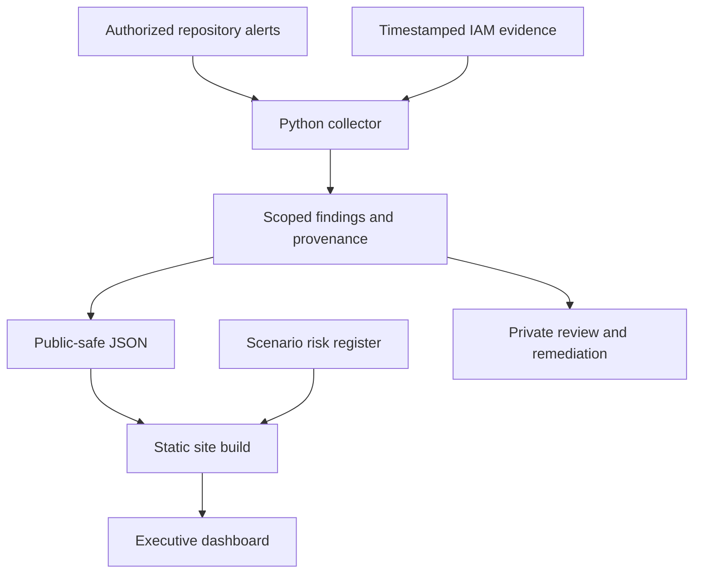
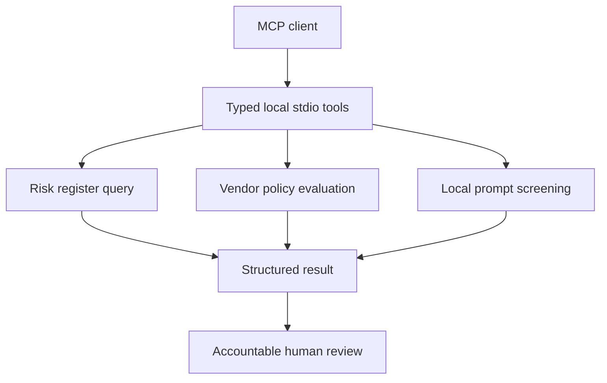

# Architecture · AAO executive edition

## Decision

Keep the dependency-free public frontend and the existing Python policy/evidence engine. The portfolio is a small public dataset plus local interactions. Server rendering, a hosted database, and paid dashboard embeds would add operational work without improving the hiring journey.

The editorial landing page uses an 80rem content width, fluid type and gutters, Source Sans assets already supplied with the project, and a system Georgia display face. The actual raster logo is preserved and framed as a dark monogram plaque. It has not been represented as a newly drawn vector. Silver and neutral surfaces work in both themes. Risk colors have accompanying numeric and text information.

## Data flow





## Contracts

`site/data/portfolio.json` has `schema_version: 1`, source mode and baseline date, a risk list, project list, dataset counts, and historical audit requests. Risk rows carry source ID, statement, category, inherent likelihood/impact, inherent and residual scores, appetite, role, KRI, threshold, treatment, status, and source key controls. Four display categories are mapped without rewriting the original category.

`site/data/ccm.json` has `schema_version: 1`, `mode`, `generated_at`, `source_commit`, and scoped checks. Checks retain `checked_at`, `observed_at`, status, mappings, scope, findings and an evidence hash when available. Observation time is not replaced by fetch time.

Vendor report version 2.0.0 contains inputs, priority score, tier, decision, reasons, unknown fields, evaluated time and the human-review boundary. JavaScript and Python implement the same decision gates. The MCP schema accepts boolean or null intake conditions. Unknown does not mean false or approved.

The score weights are 25 for criticality, 15 for personal data, 20 for missing DPA when personal-data processing is possible, 15 for unresolved subprocessors, 15 for unresolved training use, and 10 for invalid or outdated evidence. The score is an intake priority index, not an actuarial loss estimate. Any blocker or unknown input routes to hold.

## Hosting choices and limits

| Layer | Choice | Reason and constraint |
|---|---|---|
| Primary existing host | Cloudflare Pages | Portable static output, existing project, no required application server. Free plan documentation lists 500 builds/month and a 25MiB per-asset limit. |
| Additional public deployment | Vercel static | Same public files. Hobby use must remain within personal/non-commercial terms and quotas. |
| Portable alternative | GitHub Pages | Real HTML routes and relative assets support repository paths. Header capabilities differ from Cloudflare and Vercel. |
| Interactive BI | Native CSS matrix and DOM register | No external dashboard permission, iframe sizing, third-party cookies, or paid embedding dependency. |
| Collector | GitHub Actions | Six-hour schedule and manual trigger. Credential access and publication must be configured. |
| Local inspection | Docker portal, OPA, optional stdio MCP | Localhost-bound services. No free hosted server is implied. |
| Persistent evidence | Reviewed archive, manifest, optional GitHub Release | Hashes show integrity. Release immutability must be separately enabled and verified. |

The current static deployment requires no paid API, database, font license, or third-party analytics. Free-tier service terms can change. Cloud account resources and real organizational integrations must be assessed separately.

Sources checked for the hosting decision: [Cloudflare Pages limits](https://developers.cloudflare.com/pages/platform/limits/) and [Vercel Hobby](https://vercel.com/docs/plans/hobby).

## Optional platform evaluation

Probo offers a self-hosted compliance platform and agent-oriented interfaces. CISO Assistant covers risk, compliance and multiple governance workflows. Both would add a separately operated application to this portfolio. Neither is needed to demonstrate the shipped risk, policy and evidence tools, so this edition installs neither and claims no hands-on integration with either. The supplied Compose file runs the already implemented portal, OPA and optional MCP service. Review the specific release license and deployment requirements before any later adoption.

References: [Probo platform](https://www.probo.com/), [CISO Assistant source and licensing](https://github.com/intuitem/ciso-assistant-community).

Tableau Public would introduce a separate public-publishing workflow. Power BI authoring availability does not establish free private web embedding. Grafana would add an account, dashboard permissions and another data-serving path. Native charts meet the current public-portfolio requirements, so none of these embeds is a runtime dependency.

## Legal and standards scope

The Rego policy evaluates configured evidence assertions and routes exceptions/applicability to review. It does not verify synthetic media provenance, detect all deepfakes, or provide a complete EU AI Act determination. Source legal reference: [Regulation (EU) 2024/1689](https://eur-lex.europa.eu/eli/reg/2024/1689/oj/eng), whose page links the current consolidated version. Use the applicable current text when configuring a real system.

The bundled OSCAL definitions are validated against the included official schemas, and local control references are checked. A valid document does not establish an effective control or certification. ISO control identifiers are mapping references, not reproduced licensed standard text.

## Security and publication

- Only `site/` enters `dist/`. No baseline archive, credentials or private collector input is copied.
- Client-side inputs are rendered with `textContent`, not HTML interpolation.
- Vendor answers stay in browser memory unless the visitor exports them. No form submission endpoint or analytics is configured.
- MCP uses fixed files and typed local tools. It is not exposed through the public site.
- Cloudflare/Vercel response headers constrain scripts, connections, objects and framing. GitHub Pages lacks equivalent configurable headers.
- Scheduled GitHub collection exports minimal results. Failure stays unknown; stale evidence stays dated.

## File tree

The tree below is generated from the delivered source. Runtime caches, dependencies and build output are excluded.

```text
grc-ai-governance-engine/
.github/workflows/ccm.yml
.github/workflows/pages.yml
.github/workflows/verify.yml
.gitignore
.nvmrc
Dockerfile
README.md
SOURCE-CODE.md
archive/RELEASE-NOTES.md
archive/baseline-manifest.json
data/baseline/ai-governance.json
data/baseline/assurance.json
data/baseline/ccm.json
data/baseline/controls.json
data/baseline/executive-risk.json
data/baseline/privacy.json
data/baseline/procurement.json
data/baseline/shadow-ai.json
data/baseline/transparency.json
data/baseline/vendor-risk.json
docker-compose.yml
docs/ARCHITECTURE.md
docs/CHANGELOG.md
docs/EXECUTION-GUIDE.md
docs/LINKEDIN.md
docs/LOOM-SCRIPTS.md
docs/MASTER-DESIGN-PROMPT.md
docs/MODERNIZATION.md
docs/MOTION-REVIEW.md
docs/VALIDATION.md
engine/__init__.py
engine/decisions.py
engine/ingest.py
engine/mcp_client.py
engine/mcp_server.py
fixtures/ai-system.json
fixtures/alerts.json
fixtures/iam.json
mcp.json
oscal/catalog.json
oscal/component-definition.json
package.json
policies/ai.rego
policies/ai_test.rego
requirements.txt
schemas/mcp-tools.json
schemas/oscal_catalog_schema.json
schemas/oscal_component_schema.json
scripts/archive.py
scripts/browser-check.mjs
scripts/build.mjs
scripts/check.mjs
scripts/install_opa.py
scripts/validate_oscal.py
site/404.html
site/_headers
site/assets/aao-identity.png
site/assets/favicon.svg
site/assets/fonts/LICENSE.md
site/assets/fonts/source-sans-3-regular.woff2
site/assets/fonts/source-sans-3-semibold.woff2
site/assets/site.css
site/assets/site.js
site/assets/theme.js
site/assets/vendor.js
site/data/ccm.json
site/data/portfolio.json
site/data/risks.csv
site/index.html
site/robots.txt
site/samples/ai-governance.md
site/samples/assurance.md
site/samples/vendor-risk.md
site/work/ai-governance/index.html
site/work/assurance/index.html
site/work/ccm/index.html
site/work/controls/index.html
site/work/executive-risk/index.html
site/work/index.html
site/work/privacy/index.html
site/work/procurement/index.html
site/work/shadow-ai/index.html
site/work/transparency/index.html
site/work/vendor-risk/index.html
tests/test_engine.py
tests/vendor.test.mjs
vercel.json
```
