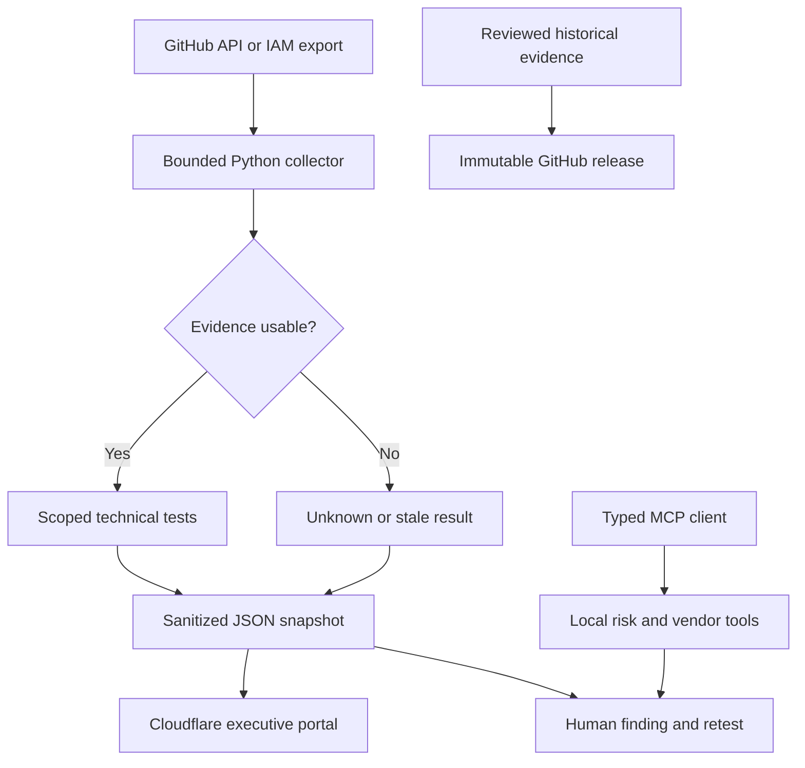

# AAO portfolio modernization and execution guide

Prepared 13 September 2026. The supplied ZIP and project artifacts are the audit baseline. This guide distinguishes implemented code, historical models, optional integrations and unverified operational claims.

## 1. Strategic modernization and clutter elimination

### Audit findings

The two evidence archives contain 58 file entries representing 32 unique byte-identical files. The combined workbook repeats the individual project sheets. The production binder repeats material in project PDFs. Preserve one historical copy of each unique file, plus the manifest of original locations; keep those artifacts off the landing page.

The master workbook contains fifteen risk scenarios, fifteen AI use cases, ten vendor records, fifteen control domains, fifteen transparency scenarios, twelve Shadow AI requirements, twenty-five procurement answers, twelve processor-governance records and fifteen audit requests. These are portfolio models. The new dashboard computes its risk counts from imported records. It does not turn a “Ready” cell into verified operating effectiveness.

The résumé includes client-impact and employment assertions not corroborated by the binder, which explicitly limits the work to operating artifacts and public-source analysis. Remove those assertions from new public copy until independently supported. Do not delete genuine employment evidence if it exists elsewhere.

| Domain | Retire from the primary experience | Replacement and actual implementation | Remaining operating responsibility |
|---|---|---|---|
| 1. Enterprise trust | Binder-first navigation and unqualified public assurance claims | `data/baseline/assurance.json`; concise assurance page; evidence/owner/expiry review protocol | Revalidate each public claim and review disclosure permissions |
| 2. AI governance OS | Static inventory presented as active oversight | `data/baseline/ai-governance.json`, OPA evidence rules, OSCAL controls and component definition | Assign actual owners, evaluations, incident routes and change approvals |
| 3. TPRM | Blanket “approve with controls” from public websites | Strict typed MCP vendor intake; deterministic hold/review recommendation in `engine/decisions.py` | Inspect signed contracts, actual configuration and confidential evidence |
| 4. Control-to-evidence | Manually colored readiness cells | Timestamped IAM root safeguards and dependency-alert tests; explicit mapping and result scope | Broader control population, sample design and human review |
| 5. Executive risk | Static heatmap and claimed percentage risk savings | Interactive native browser heatmap, category filtering, residual/appetite view and CSV | Supply real KRI observations before showing trends or measured outcomes |
| 6. Article 50 | Generic disclosure checklists represented as compliance | Rego separates paragraphs 1–5 and rejects incomplete inputs; legal-review state for scope/exceptions | Legal applicability, transition provisions, independent marking tests |
| 7. Shadow AI/DLP | Written policy represented as deployed traffic enforcement | Local credential/email pattern screening with counts-only MCP output | Endpoint/SWG/CASB telemetry integration is not implemented |
| 8. Questionnaires | Unreviewed copied answers and repeated spreadsheets | Normalized question/evidence/owner records; fixed drafting and approval boundaries | Evidence freshness, answer approval, external disclosure |
| 9. GDPR Article 28 | Generic clauses treated as an executed DPA | Structured requirement register and intake blockers for missing DPA/subprocessor authorization | Review Art. 28(3), authorization under 28(2), downstream duties under 28(4), transfer safeguards and signatures |
| 10. CCM/audit ops | Manual update cycle and unexplained “satisfactory” cells | Six-hour Actions collector; public-safe snapshot; timestamps, unknown/stale/fail states; modeled follow-up clock | Real collection permissions, treatment owners, retests and closure evidence |

Do not discard signed policies, accountable approvals, contract history or audit workpapers merely because they are documents. Machine-readable controls complement them. A workflow can automate technical evidence without automating judgment.

### Hiring-manager rationale

Lead with the runnable system and show one failure path. A hiring team can inspect code, fixtures, tests and limitations in minutes. Ten similar PDFs create more reading without stronger proof. Avoid listing “enterprise-grade” as a self-awarded certification; show narrow permissions, deterministic policy, validation and honest state handling.

## 2. Zero-cost adaptive architecture and deployment map

### Selected architecture

**Cloudflare Pages + GitHub Actions + native browser reporting + local Python/OPA/MCP.** No hosted database is needed. Git-reviewed JSON is the small portfolio's system of record. Browser filters are dynamic; evidence updates are scheduled snapshots. Continuous does not mean millisecond streaming.



| Layer | Selection | Free-tier boundary and reason |
|---|---|---|
| Primary hosting | Existing Cloudflare Pages project | Free plan: 500 builds/month, 20,000 files/site, 25 MiB/asset. This site is well below those asset limits. Four scheduled deployments/day is about 124/month plus code pushes. No domain purchase required. [Cloudflare limits](https://developers.cloudflare.com/pages/platform/limits/) |
| Alternative static host | GitHub Pages | Suitable for a public personal portfolio. Uses repository-relative files and native routes. Do not use it as a commercial SaaS hosting service. [Pages limits](https://docs.github.com/en/pages/getting-started-with-github-pages/github-pages-limits) |
| Alternative static host | Vercel Hobby | Personal, non-commercial use only; quotas can pause features. Do not use Hobby for a client service business unless current terms permit it. [Hobby plan](https://vercel.com/docs/plans/hobby) |
| Reporting | Native HTML/CSS/JavaScript | Zero BI licenses, login walls, cross-origin embeds or vendor query quotas. The 25-cell heatmap does not need a chart framework. |
| Optional BI | Tableau Public | Public, non-confidential data only. It is free to create and share visualizations, but is not a private evidence repository. [Tableau Public](https://www.tableau.com/products/public) |
| BI not selected | Power BI Publish to web | Publishing from My Workspace requires a Power BI license; other workspaces require Pro/PPU. Tenant settings may block publication. Public embedding exposes the report. It is not a universal, account-independent $0 deployment route. [Microsoft requirements](https://learn.microsoft.com/en-us/power-bi/collaborate-share/service-publish-to-web) |
| Optional operations BI | Grafana Cloud Free | Quota/retention-limited service; no reason to create another account for fifteen portfolio rows. Verify current quotas and external-sharing eligibility before adoption. [Grafana pricing](https://grafana.com/pricing/) |
| CI | Standard GitHub-hosted Linux runners in a public repository | Use standard runners, not larger runners or paid add-ons. Keep artifacts for 30 days. Private repository allowances differ. [Actions billing](https://docs.github.com/en/billing/managing-billing-for-your-products/managing-billing-for-github-actions/about-billing-for-github-actions) |
| GRC operations | Local engine; optional CISO Assistant Community | Runs on existing hardware. No free cloud trial, rented VM, paid registry or always-on hosted database is required. Hardware and electricity are existing-user costs, not a promise of zero resources. |

Native CSS Grid, fluid type and responsive reflow are the right fit for this small, evidence-focused site. There is no framework that guarantees identical rendering and speed on every device. The verification matrix is an acceptance gate, not a universal guarantee.

### Optional CISO Assistant deployment

The source recommends stable tags and warns against treating `main` as production. The release discovered during research is `v4.0.2`. Use the upstream setup instead of inventing container environment variables. Its quick-start configuration remains a local evaluation setup and requires additional hardening for network exposure. [Official repository](https://github.com/intuitem/ciso-assistant-community)

```bash
git clone --branch v4.0.2 --depth 1 https://github.com/intuitem/ciso-assistant-community.git
cd ciso-assistant-community
git rev-parse HEAD
./docker-compose.sh
```

Windows: run `./docker-compose.ps1` with Docker Desktop/WSL2. Record the resolved commit and image digests. Follow the upstream login setup, then open `https://localhost:8443/`. Keep it local; do not publish a compliance database to a free public endpoint. On subsequent starts use `docker compose up -d`. Back up data before updates. Follow upstream certificate instructions rather than disabling browser certificate checks.

Probo remains an optional alternative, not part of the delivered runtime. Its requested self-hosting/MCP claims could not be established from an accessible official source in this session. No Probo server, paid LLM integration or fabricated configuration is included. The supplied local MCP engine meets this portfolio's bounded risk-query and intake-evaluation needs without that dependency.

### Immutable historical evidence

GitHub immutable releases lock attached assets and the associated tag after publication, and produce a release attestation. Release titles and notes remain editable. Entire releases can still be deleted; this is not a regulatory retention lock against account owners. Keep a separate backup. [GitHub immutable releases](https://docs.github.com/en/code-security/concepts/supply-chain-security/immutable-releases)

Protocol:

1. Keep the uploaded originals untouched. Use `archive/baseline-manifest.json` to identify duplicate bytes.
2. Select only public-safe historical portfolio artifacts into `private-evidence/reviewed-public-baseline/`. Do not include the résumé, private contracts, credentials, raw cloud logs or personal contacts by default.
3. Record reviewer, purpose, classification, retention period and source collection date in an accompanying Markdown record. Hashes establish byte identity, not truth or who approved a document.
4. Run `scripts/archive.py` to produce a ZIP and SHA-256 sidecar outside the source directory.
5. Enable immutable releases in repository settings **before** publishing. Create a draft release, attach all files, verify the draft contents, then publish once. Never use `--clobber`.
6. Verify the published release's `immutable` property and attestation. If immutability is unavailable or false, label the archive tamper-evident, not immutable.

## 3. Automation, Policy-as-Code and executable artifacts

Every referenced file is included in this repository. `SOURCE-CODE.md` contains the complete text sources as code blocks for review; the runnable files remain authoritative.

### IAM evidence ingestion

`engine/ingest.py:assess_iam` consumes an AWS `get-account-summary` payload with an observation timestamp. It tests **root MFA and root access-key absence only**, mapped as supporting evidence for SOC 2 CC6.1 and ISO 27001 A.5.15/A.8.5. It does not assess all IAM users, effective permissions, access reviews or all logical-access controls. Do not map dependency alerts to CC6.1 merely to make a framework label appear.

With AWS CLI already configured for an existing authorized account and an identity allowed to call `iam:GetAccountSummary`:

```bash
mkdir -p private-evidence
aws iam get-account-summary --output json > private-evidence/iam-summary.json
python - <<'PY'
import json
from pathlib import Path
from datetime import datetime, timezone
p = Path('private-evidence')
record = {
    'mode': 'live',
    'observed_at': datetime.now(timezone.utc).isoformat(),
    'payload': json.loads((p / 'iam-summary.json').read_text())
}
(p / 'iam-envelope.json').write_text(json.dumps(record, indent=2))
PY
python -m engine.ingest --mode live --repo aaowasi/aaowasi369v18 --iam private-evidence/iam-envelope.json
```

No AWS account or billable logging resource is created by this package. The first command uses an existing account; otherwise run the included fixture. Do not stamp an old export with a fresh observation time. For scheduled AWS collection, use GitHub OIDC with repository/branch-specific trust and a read-only `iam:GetAccountSummary` role; creating that cloud trust is an account-specific integration, not silently performed here.

### GitHub collection and errors

`collect_alerts` calls the configured repository's Dependabot endpoint, requests 100 records/page, and stops with unknown if 2,000 records do not establish a complete population. It has 15-second request timeouts, bounded retries and response limits. A 401/403/404 does not mean “zero vulnerabilities”. Findings map to SOC 2 CC7.1 and ISO 27001 A.8.8. The no-open-high/critical test is an example threshold, not a measured remediation SLA.

Create a fine-grained token scoped to the repository with read access to Dependabot alerts and store it as an Actions secret named `GRC_GITHUB_TOKEN`. Avoid personal admin tokens and never paste one into the frontend. The collector retains only aggregate findings, source scope, times and a canonical JSON digest in the public report. Raw records are held in process memory; this collector intentionally does not archive sensitive raw API responses.

### OPA and OSCAL

The tested OPA binary is 1.20.2. `scripts/install_opa.py` verifies its pinned SHA-256 before execution. Tests cover missing data, string-versus-boolean errors, marking gaps, subject notice, exceptions and out-of-scope review. The OSCAL files validate against bundled NIST 1.1.3 schemas. The validator uses Unicode-aware regular expressions because NIST schemas contain `\p{L}` patterns unsupported by Python's standard `re` engine. It does not remove those schema constraints.

```bash
python scripts/install_opa.py
.tools/opa test policies -v
.tools/opa eval --format pretty --data policies --input fixtures/ai-system.json data.aao.ai.result
python scripts/validate_oscal.py
```

The OSCAL catalog is an **original local operational catalog**, not an official NIST AI RMF OSCAL catalog. Its IDs resolve locally from the component definition. Framework mappings are interpretive and limited. ISO/IEC 42001 management-system obligations include human governance beyond these tests; the code does not implement certification.

Article 50 has applied since 2 August 2026 according to current Commission materials. The 2026 guidelines and voluntary code distinguish marking and disclosure obligations. Before making a real legal conclusion, record the system role, launch date, jurisdiction, exceptions and applicable transition provisions. Technical boolean assertions do not prove compliance. [Commission guidelines](https://digital-strategy.ec.europa.eu/en/library/guidelines-transparency-obligations-providers-and-deployers-ai-systems), [transparency code](https://digital-strategy.ec.europa.eu/en/policies/code-practice-ai-generated-content)

C2PA or other provenance evidence can support a marking strategy but is neither universally required by Article 50 nor sufficient by itself. Retain origin disclosures and test marker persistence through realistic transformations. The requested provenance-removal skill is not applied to evidence whose provenance is the subject of this governance system.

### MCP server/client

`engine/mcp_server.py` provides four tools: `query_risks`, `query_control_results`, `evaluate_vendor_security` and `screen_prompt`. The fixed local file paths prevent arbitrary path reads. Inputs have length/range bounds. Vendor intake rejects extra fields and string booleans. All recommendations require human review. The service accepts no arbitrary URL, shell command, credential or procurement approval tool.

```bash
python -m engine.mcp_client
python -m engine.mcp_server
```

The first command initializes an actual MCP session, lists tools and calls the risk query. The second starts stdio transport for a compatible client. Only protocol messages go to stdout; diagnostic logging uses stderr. The MCP client is a transport client, not an LLM model, so no paid inference is required. Read the generated `schemas/mcp-tools.json` for actual tool input schemas.

Threat boundaries: retrieved vendor text is data, not instructions; no dynamic tool installation; no secrets returned to callers; no implicit network egress; no auto-approval. A future remote MCP endpoint needs authenticated authorization, TLS, per-tool scopes, origin handling and request limits. Do not expose this stdio demonstration through an unauthenticated HTTP bridge. [MCP server guidance](https://modelcontextprotocol.io/docs/develop/build-server)

## 4. Public GitHub repository specification

Preferred new repository name: `grc-ai-governance-engine`. The existing website repository is `aaowasi/aaowasi369v18`. Keep the existing repository until the replacement is deployed and verified; archive obsolete version repositories after redirects and dependencies are checked, not by mass deletion.

```text
grc-ai-governance-engine/
  .github/workflows/        # verification, six-hour CCM, optional GitHub Pages
  site/                    # only this directory is copied into dist/
    index.html
    assets/                # original AAO image, CSS, JS, licensed fonts
    data/                  # public model, CSV, sanitized technical snapshot
    work/                  # ten domain pages plus index
    samples/               # preserved legacy sample downloads
  engine/                  # collectors, decisions, MCP server and client
  fixtures/                # explicitly labeled demonstration inputs
  data/baseline/           # imported historical models; not operating evidence
  policies/                # Rego policy and tests
  oscal/                   # local catalog and component definition
  schemas/                 # official NIST schemas and generated MCP schemas
  tests/                   # behavior and failure-mode tests
  scripts/                 # build, link check, schema check, OPA, archive
  archive/                 # provenance manifest; raw bundles excluded
  docs/                    # guide, master prompt, profile copy and verification
  Dockerfile
  docker-compose.yml
  mcp.json
  requirements.txt
  package.json
  vercel.json
  README.md
```

### Separation of public and private records

Never place raw cloud evidence in `site/` or a public Git repository. Git commit history is difficult to retract. The public baseline files are supplied portfolio models and explicitly marked unverified. Real client records belong in a separately controlled private evidence store. A SHA-256 in a public manifest can support integrity checks without publishing the original.

### Repository controls

Require PR review and passing verification for future changes to collectors and policy. Protect `main`; restrict workflow permission changes; use pinned action commit SHAs; enable secret scanning where available for the public repository. Allow updates through reviewed dependency PRs. Pin container image digests for a long-lived operational deployment after testing the image on the target architecture. The Compose file pins release tags, not immutable image digests; report that distinction.

## 5. Executive Loom scripts and interview talking points

Record each script at approximately 120 words/minute with short pauses. A two-minute recording is a target, not a claim that a recording has already been produced. If API credentials are not configured, say “fixture demonstration” and show the local/Actions results accurately.

### Script A: automation and CCM

**0:00–0:25, show the dashboard.** “This is my independent control-monitoring portfolio. I designed it around a simple question: what does the evidence actually support? The dashboard separates the historical risk model from technical collection results. It also shows when the evidence was observed. A new page load does not make an old observation fresh.”

**0:25–0:55, show the workflow and collector.** “The GitHub Actions workflow runs every six hours. The Python collector uses a narrowly scoped token, bounded requests and explicit pagination. It publishes a normalized report. Raw alert details and credentials do not go to the website. If access fails, the result is unknown. It does not become a green check.”

**0:55–1:25, show IAM fixture and tests.** “Here is the root identity test. It checks root MFA and root access keys from a timestamped IAM summary. Those checks support part of logical-access assurance; they do not prove the whole control. The dependency test has a separate vulnerability mapping. I included tests for stale evidence, invalid types and incomplete access.”

**1:25–2:00, show a finding and explain closure.** “A failure becomes a finding that needs an owner, treatment and retest. I preserve the earlier observation rather than editing it into a pass. The production integration still needs real source permissions and accountable control owners. My contribution is the executable evidence path and its failure behavior. I would measure collection coverage, evidence age and time to retest before claiming any audit-readiness savings.”

Talking points: scope is smaller than a framework; retries do not hide missing evidence; automation reduces collection work but does not issue audit opinions; API errors are operational findings, not control passes.

### Script B: executive reporting

**0:00–0:25, show the observatory.** “This board view uses fifteen modeled risks from my original workbook. I replaced the static heatmap with a native interactive view so a reviewer can move from a high-level distribution to the actual scenario without opening another application.”

**0:25–0:55, select a cell and category.** “The axes show inherent likelihood and impact. Selecting a cell filters the decision register. Each record exposes the risk statement, modeled residual score, appetite and owner role. This makes the reasoning inspectable, including where a residual score is still an assumption. I do not treat ordinal score reductions as money saved.”

**0:55–1:25, expand a risk and show audit clock.** “The KRI record includes a definition and escalation threshold. It does not contain a fabricated current reading or trend. The follow-up clock uses the original modeled due dates and explicitly says that closure evidence has not been supplied. In an operational deployment, I would add verified observations, review dates and closure events.”

**1:25–2:00, demonstrate filtering and download.** “The same dataset is downloadable as CSV for Tableau Public if a reviewer wants that format. I selected native reporting for the primary portfolio because it is responsive, requires no BI account and keeps the evidence on the same origin. The executive question is not whether the dashboard looks green. It is which decision is due, who owns it and what evidence would change it.”

For a Tableau recording, first publish the supplied public CSV workbook. Do not narrate Tableau or Power BI functionality over this native dashboard as though an integration exists.

Talking points: distinguish inherent and residual distributions; show denominators; no invented time series; overdue models are not verified organizational SLA breaches; filter drilldown should lead to ownership and evidence.

### Script C: agentic AI governance and MCP

**0:00–0:25, show tool schemas.** “This local MCP server gives an agent four bounded tools: risk queries, control-result queries, vendor-intake evaluation and local prompt screening. It exposes no arbitrary shell command, URL fetch or vendor-approval action.”

**0:25–0:55, run the vendor evaluation.** “Here the input says the vendor processes personal data but lacks a signed processor agreement. The deterministic result is hold. If I supply the missing assertions, the best result is ready for human review. The agent cannot accept commercial or legal risk on the owner's behalf.”

**0:55–1:25, show Rego test output.** “The policy separates selected Article 50 provider and deployer duties and checks governance evidence. Missing fields cannot pass. Exceptions and applicability questions go to legal review. A boolean saying a marker exists is not proof that the marker survives transformation, and passing this policy is not a compliance certification.”

**1:25–2:00, show prompt-screen output.** “The prompt tool returns pattern counts and a block recommendation without storing the prompt. This is a local screening demonstration, not a company-wide shadow-AI sensor or egress gateway. A real deployment would connect approved endpoint or gateway logs, validate false positives and maintain access boundaries. I want the automation to make evidence gaps visible while keeping authority with the accountable reviewer.”

Talking points: MCP transports tools, not reasoning quality; structured schemas do not neutralize prompt injection by themselves; enforcement requires placement in a traffic path; Article 50 marking and visible disclosure are distinct.

## 6. Developer execution protocol and predictive debugging

### Exact execution sequence

**1. Prepare the repository.** Extract the full source ZIP. Work inside its `grc-ai-governance-engine` directory. Install Node.js 22 and Python 3.12 from official sources. Use an existing free GitHub account. The deployment-only ZIP is for drag-and-drop hosting; it does not contain the engine.

```bash
python3 -m venv .venv
. .venv/bin/activate
python -m pip install -r requirements.txt
python -m unittest discover -s tests -v
python scripts/validate_oscal.py
python scripts/install_opa.py
.tools/opa test policies -v
python -m engine.mcp_client
npm run build
npm run check
python3 -m http.server 4173 --directory dist --bind 127.0.0.1
```

The OPA installer is Linux x86_64-specific. On Windows/macOS, use the Compose OPA test command. Do not install an incompatible Linux binary on an ARM Mac. The frontend build needs no `npm install`.

**2. Create the preferred public repository.** With GitHub CLI installed and signed in, these commands create the requested new repository. If it already exists, clone it and copy the new files into a review branch instead of rerunning creation.

```bash
git init -b main
git add .
git commit -m "Build evidence-first GRC and AI governance portfolio"
gh auth status
gh repo create aaowasi/grc-ai-governance-engine --public --source . --remote origin --push
```

Inspect the staged file list before the first commit. `.gitignore` excludes raw evidence, local environments, credentials and build outputs. No phone number or unreviewed résumé is required in the new public repository.

**3. Deploy Cloudflare.** Preserve the existing `aaowasi369v18` project if possible. For Git integration, choose the repository, framework preset None, build command `npm run build`, output directory `dist`, root directory the repository root. Use Node 22. The old `06551a3a` URL is a specific deployment, not a mutable production address; a new deployment gets a new URL. The stable project address is the portfolio's ongoing entry point.

For direct upload to the existing project, with an authorized Cloudflare account:

```bash
npx --yes wrangler@4.131.1 login
npx --yes wrangler@4.131.1 pages project list
npm run build
npx --yes wrangler@4.131.1 pages deploy dist --project-name aaowasi369v18 --branch main
```

Select the Free plan and existing `pages.dev` hostname. Do not enable paid Workers, R2 billing or a purchased domain. Git-integrated and Direct Upload project creation have different setup paths; inspect the existing project's configuration before replacing it. Review the returned deployment URL and actual HTTP result.

**4. Activate scheduled publication.** In GitHub Settings → Secrets and variables → Actions, set `GRC_GITHUB_TOKEN` with repository-scoped Dependabot read access. For Cloudflare publication, set `CLOUDFLARE_API_TOKEN` with Pages Edit scoped to the relevant account and `CLOUDFLARE_ACCOUNT_ID`; set variables `DEPLOY_PROVIDER=cloudflare` and `CF_PAGES_PROJECT=aaowasi369v18`. Run Continuous control monitoring manually once. Check the normalized artifact and deployment logs. The IAM result stays unknown until a real source is configured; that is intentional.

The workflow runs four times/day at minute 17 to avoid the top of the hour. Scheduling can be delayed, and public inactive repository schedules can be disabled. Check freshness on the dashboard rather than promising a scheduler SLA.

**5. Optional GitHub Pages.** Settings → Pages → Source: GitHub Actions. Set `DEPLOY_PROVIDER=github-pages`; run the GitHub Pages workflow. Relative links support `/grc-ai-governance-engine/`. This included workflow publishes committed snapshots on push/manual invocation. It does not automatically consume the CCM artifact; for continuously updated public evidence use the selected Cloudflare path or explicitly extend the Pages workflow to collect before upload.

**6. Optional Vercel.** Import the Git repository; Framework Preset Other; build command `npm run build`; output directory `dist`; no environment variables required for the frontend. Keep the account on Hobby and use it only within its personal non-commercial terms. The included configuration publishes committed data snapshots. Continuous API snapshots use the primary Cloudflare workflow; Vercel's code deployment alone does not ingest a GitHub artifact.

**7. Optional Tableau Public workbook.** Open Tableau Public Desktop, connect to `site/data/risks.csv`, set `likelihood`, `impact`, `inherent` and `residual` as numbers. Put impact on Columns and likelihood on Rows, descending likelihood. Use square marks; count `id` for labels; put inherent score on color and statement/owner/KRI in tooltips. Add category as a filter and add a detail sheet as a filter action. Create desktop/tablet/phone dashboard layouts. Publish only this explicitly modeled public dataset to Tableau Public; inspect it signed out. Use Share → Embed Code and the exact returned view URL. Do not guess a workbook URL.

The native portal is complete without an iframe. If adding an embed, isolate it on a separate page, preserve a direct “Open dashboard” link and a CSV fallback, use `width:100%` and responsive height, and add only the exact Tableau script/frame origins to that page's CSP. Do not weaken the portal-wide policy to `*` or upload private evidence to solve permissions. Automatic external workbook refresh is not included or assumed.

**8. Publish reviewed historical evidence.** These commands require the pre-reviewed directory described in Section 2. They never select raw files automatically.

```bash
python scripts/archive.py private-evidence/reviewed-public-baseline archive/baseline-2026-09-13.zip
git tag -a baseline-2026-09-13 -m "Reviewed historical portfolio baseline"
git push origin baseline-2026-09-13
gh release create baseline-2026-09-13 --draft --verify-tag --title "Historical portfolio baseline · 2026-09-13" --notes-file archive/RELEASE-NOTES.md
gh release upload baseline-2026-09-13 archive/baseline-2026-09-13.zip archive/baseline-2026-09-13.zip.sha256
gh release view baseline-2026-09-13
gh release edit baseline-2026-09-13 --draft=false
gh api repos/aaowasi/grc-ai-governance-engine/releases/tags/baseline-2026-09-13 --jq .immutable
gh release verify baseline-2026-09-13
```

Enable immutable releases before the final publish command. A SHA mismatch or false `immutable` value is a failed integrity gate. Never amend a published baseline; create a new uniquely named release.

**9. Update the profile.** Use `docs/LINKEDIN.md`. Check that the repository and website links actually resolve before adding them to Featured. Do not claim the desired new repository already exists merely because the folder is named that way.

### Universal device verification matrix

| Test group | CSS viewport | Required verification |
|---|---|---|
| Compact phone | 320×568, 360×800 | Header fits; hero wraps; email wraps; no global horizontal scroll; form labels readable |
| iOS/Android phone | 390×844, 430×932 | Touch targets; heatmap selection; browser back/forward; orientation change; long risk details |
| Tablet | 768×1024, 1024×768 | Dashboard reflows; dropdowns remain within bounds; no nested scroll trap |
| Laptop | 1366×768, 1440×900 | Hero action visible; two-column reporting balanced; keyboard focus order |
| Desktop | 1920×1080 | Reading widths bounded; no excessive line length or stretched assets |
| Ultra-wide | 2560×1440 | Centered maximum container; no giant gaps inside data controls |
| Accessibility | 200% zoom; reduced motion; keyboard only | All content and controls reachable; focus visible; no forced animation; disclosure remains visible |
| Failure states | Block JSON; empty filters; no JS; old evidence | Explicit error, no false pass, downloadable fallback, stale state |
| Browser engines | Chromium, Firefox, WebKit | Test actual available engines; list untested engines and physical devices honestly |

For each viewport compare `document.documentElement.scrollWidth` to its client width and inspect a screenshot. Check text at 200% zoom; test controls with Tab, Enter, Space and arrow keys. Test history by navigating Home → Work → a project → Back → Forward, plus a direct deep link in a new tab. On browsers without Navigation API introspection, forward remains a native no-op if no future entry exists.

### Predictive failure analysis

| Symptom | Cause | Prevention / exact response |
|---|---|---|
| Dashboard empty when opening ZIP files | `file://` blocks JSON fetch | Serve `dist` using the included Python command; use the CSV fallback |
| Build cannot find `site/` | Wrong repository root | Set build root to the directory containing `package.json` and `site/` |
| Runtime module missing | Wrong Python or inactive environment | Activate `.venv`, then `python -m pip install -r requirements.txt`; inspect `python --version` |
| OSCAL regex error | Standard Python `re` cannot parse Unicode properties | Use the included `regex`-based validator, not a modified schema |
| Rego syntax error | Mixing pre-v1 syntax with `rego.v1` | Use OPA 1.20.2; execute policy tests before deployment |
| GitHub 403/404 | Missing permission, disabled feature, wrong repository | Inspect token scope and repository settings; preserve unknown state; do not retry indefinitely |
| API population truncated | Collector limit reached | Increase the bound only after estimating memory/API quota; never interpret partial results as complete |
| Data stays old | Build did not publish the new snapshot | Inspect CCM artifact timestamp and deploy step; code-only deployments use committed data |
| CORS error | JSON moved to a different origin | Keep `/data/` with the site; do not add wildcard credentialed CORS |
| CSP blocks refresh | Old `connect-src 'none'` retained | Use included `'self'` policy in both HTML and headers; stricter duplicate policies combine |
| Mobile overflow | Fixed-width child or long token | Use `minmax(0,1fr)`, bounded media and `overflow-wrap`; inspect the culprit, do not hide global overflow |
| Tableau access wall | Unpublished/private workbook or wrong URL | Publish only public model data; copy official embed URL; verify signed out; retain native report |
| Workflow does not run | Not on default branch, schedule inactive, repository variable unset | Merge reviewed workflow; manually dispatch; check DEPLOY_PROVIDER and repository Actions settings |
| Cloudflare deploy fails | Wrong project/account or insufficient token | Verify `pages project list`, account ID and Pages Edit scope; old deployment remains available |
| Docker permission/architecture error | Unsupported image architecture or volume ownership | Use supported image/platform; consult upstream CISO build workflow; do not run everything privileged |
| MCP protocol parse error | Non-protocol stdout or wrong working directory | Use module invocation from repository root; keep logging on stderr; test with `mcp_client.py` |
| “Fresh” false impression | Collection time substituted for observation time | Keep both timestamps; preserve original observation date; evaluate TTL separately |
| Release can be changed | Immutable releases not enabled before publishing | Enable feature before next release; never label the existing ordinary tag immutable |
| Rollback breaks evidence consistency | Mixing data and code from different builds | Deploy one complete `dist` version; keep source commit in report; restore the previous complete deployment |

### Maintenance and zero-downtime updates

Edit modeled risk data through a reviewed PR; preserve IDs and explicitly explain score changes. Do not lower residual scores without evidence of control effectiveness. Add real KRI observations as dated records before drawing trends. Keep demo, historical and live populations separate.

Run tests and build the complete public directory before deployment. Cloudflare serves the previous deployment until the new version is available; use its deployment rollback facility if validation fails. This reduces deployment interruption but is not a guarantee against provider outages. JSON is fetched same-origin with `no-store`; the response headers require revalidation. There is no service worker retaining a stale application shell.

Review collector failures and evidence freshness weekly. Review access scopes, policy exceptions and overdue remediation monthly. Check dependency/security updates monthly; test replacements before changing pins. Review legal sources and AI-system applicability on material changes. Verify archive hashes and restore a sample quarterly. Never overwrite a historical release to “fix” old evidence.

### Research and design-source limits

Official sources were used for the platform and standards decisions. The supplied video links were opened; two yielded titles but no transcript, while the remainder were throttled. They were not treated as watched or as factual support. Godly, 21st.dev and MotionSites were accessible as visual references; no paid template or component was purchased. The existing GitHub source was inspected directly because the supplied Cloudflare deployment URL could not be fetched reliably.
